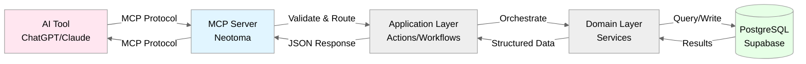

# Neotoma MCP Specification

**Authoritative Vocabulary:** [`docs/vocabulary/canonical_terms.md`](../vocabulary/canonical_terms.md)

## Purpose

This document defines the complete specification for Neotoma's Model Context Protocol (MCP) actions. It provides authoritative schemas, error handling, consistency guarantees, and determinism requirements for all MCP actions that AI agents use to interact with Neotoma's Truth Layer.

## Scope

This document covers:
- Complete catalog of MCP actions (17 MVP actions)
- Request/response schemas for each action
- Error envelopes and error codes
- Consistency guarantees per action
- Determinism requirements
- Versioning and backward compatibility

This document does NOT cover:
- MCP protocol details (see MCP SDK docs)
- Implementation internals (see `src/server.ts`)
- Database schema (see `docs/subsystems/schema.md`)

## 1. MCP Architecture in Neotoma



**Key Points:**
- AI tools never access database directly
- All requests validated at MCP layer
- All responses structured and typed
- All errors use ErrorEnvelope

## 2. Complete MCP Action Catalog

### 2.1 Core [Storing](../vocabulary/canonical_terms.md#storing) Operations

| Action             | Purpose                                    | Consistency | Deterministic          |
| ------------------ | ------------------------------------------ | ----------- | ---------------------- |
| `store`           | **Unified** [storing](../vocabulary/canonical_terms.md#storing) for all [source material](../vocabulary/canonical_terms.md#source-material) (unstructured and structured) | Strong      | Yes (content-hash based) |

**Note:** `store` is the single unified action for all [source material](../vocabulary/canonical_terms.md#source-material). It accepts either:
- Unstructured: `{file_content, mime_type}` for unstructured [source material](../vocabulary/canonical_terms.md#source-material) that needs [interpretation](../vocabulary/canonical_terms.md#interpretation)
- Structured: `{entities: [{entity_type, ...}]}` for pre-structured [source material](../vocabulary/canonical_terms.md#source-material)

### 2.2 File Operations

| Action         | Purpose                              | Consistency | Deterministic            |
| -------------- | ------------------------------------ | ----------- | ------------------------ |
| `retrieve_file_url` | Retrieve signed URL for [source material](../vocabulary/canonical_terms.md#source-material) access       | Strong      | N/A (URL signing)        |

**Note:** File uploads are handled via the unified `store` action (section 2.1). Agents can read files from the local filesystem, base64-encode the content, and use `store` with `file_content` and `mime_type` parameters. The REST endpoint `/upload_file` exists for UI/frontend use but is not part of the MCP protocol.

### 2.3 [Entity](../vocabulary/canonical_terms.md#entity) Operations ([Retrieving](../vocabulary/canonical_terms.md#retrieving))

| Action                    | Purpose                                    | Consistency | Deterministic | MVP Status |
| ------------------------- | ------------------------------------------ | ----------- | ------------- | ---------- |
| `retrieve_entity_snapshot`     | [Retrieve](../vocabulary/canonical_terms.md#retrieving) [entity](../vocabulary/canonical_terms.md#entity) [entity snapshot](../vocabulary/canonical_terms.md#entity-snapshot) with [provenance](../vocabulary/canonical_terms.md#provenance)        | Strong      | Yes           | MVP     |
| `retrieve_entities`       | [Retrieve](../vocabulary/canonical_terms.md#retrieving) [entities](../vocabulary/canonical_terms.md#entity) with filters                | Strong      | Yes           | MVP     |
| `retrieve_entity_by_identifier`| [Retrieve](../vocabulary/canonical_terms.md#retrieving) [entity](../vocabulary/canonical_terms.md#entity) by identifier (name, email)    | Strong      | Yes           | MVP     |
| `retrieve_related_entities`     | [Retrieve](../vocabulary/canonical_terms.md#retrieving) [entities](../vocabulary/canonical_terms.md#entity) via [relationships](../vocabulary/canonical_terms.md#relationship) (n-hop)    | Strong      | Yes           | MVP     |
| `retrieve_graph_neighborhood`  | [Retrieve](../vocabulary/canonical_terms.md#retrieving) complete graph context around node     | Strong      | Yes           | MVP     |
| `list_entity_types`       | List all available [entity types](../vocabulary/canonical_terms.md#entity-type) with schema information, optionally filtered by keyword | Strong      | Yes           | MVP     |
| `merge_entities`          | Merge duplicate [entities](../vocabulary/canonical_terms.md#entity)                   | Strong      | Yes           | MVP     |

### 2.4 [Observation](../vocabulary/canonical_terms.md#observation) and [Relationship](../vocabulary/canonical_terms.md#relationship) Operations ([Retrieving](../vocabulary/canonical_terms.md#retrieving))

| Action                 | Purpose                                    | Consistency | Deterministic | MVP Status |
| ---------------------- | ------------------------------------------ | ----------- | ------------- | ---------- |
| `list_observations`    | [Retrieve](../vocabulary/canonical_terms.md#retrieving) [observations](../vocabulary/canonical_terms.md#observation) for [entity](../vocabulary/canonical_terms.md#entity)              | Strong      | Yes           | MVP     |
| `retrieve_field_provenance` | [Retrieve](../vocabulary/canonical_terms.md#retrieving) field [provenance](../vocabulary/canonical_terms.md#provenance) chain to [source material](../vocabulary/canonical_terms.md#source-material)            | Strong      | Yes           | MVP     |
| `create_relationship`  | Create typed [relationship](../vocabulary/canonical_terms.md#relationship) between [entities](../vocabulary/canonical_terms.md#entity) | Strong      | Yes           | MVP     |
| `list_relationships`   | [Retrieve](../vocabulary/canonical_terms.md#retrieving) [entity](../vocabulary/canonical_terms.md#entity) [relationships](../vocabulary/canonical_terms.md#relationship)                 | Strong      | Yes           | MVP     |
| `get_relationship_snapshot` | [Retrieve](../vocabulary/canonical_terms.md#retrieving) [relationship](../vocabulary/canonical_terms.md#relationship) snapshot with [provenance](../vocabulary/canonical_terms.md#provenance)         | Strong      | Yes           | MVP     |
| `list_timeline_events` | [Retrieve](../vocabulary/canonical_terms.md#retrieving) timeline [events](../vocabulary/canonical_terms.md#event) with filters         | Strong      | Yes           | MVP     |

**Note:** These actions enable AI agents to work with [entities](../vocabulary/canonical_terms.md#entity), [observations](../vocabulary/canonical_terms.md#observation), and [entity snapshots](../vocabulary/canonical_terms.md#entity-snapshot), the core of Neotoma's three-layer truth model. See [`docs/architecture/architectural_decisions.md`](../architecture/architectural_decisions.md) for architectural rationale.

### 2.5 Correction and Re-[interpretation](../vocabulary/canonical_terms.md#interpretation) Operations

| Action          | Purpose                                    | Consistency | Deterministic | MVP Status |
| --------------- | ------------------------------------------ | ----------- | ------------- | ---------- |
| `correct`       | Create high-priority correction [observation](../vocabulary/canonical_terms.md#observation) | Strong      | Yes           | MVP     |
| `reinterpret`   | Re-run AI [interpretation](../vocabulary/canonical_terms.md#interpretation) on existing [source material](../vocabulary/canonical_terms.md#source-material) | Strong      | Yes           | MVP     |

**Note:** `correct` creates priority-1000 [observations](../vocabulary/canonical_terms.md#observation) that override AI [extraction](../vocabulary/canonical_terms.md#extraction). `reinterpret` creates new [observations](../vocabulary/canonical_terms.md#observation) without modifying existing ones.

### 2.6 Using the Unified `store` Action

The unified `store` action handles all [source material](../vocabulary/canonical_terms.md#source-material) types:

**For Unstructured [Source Material](../vocabulary/canonical_terms.md#source-material):**
```typescript
{
  user_id: string;                    // Required: User ID (UUID)
  file_content: string;               // Required: Base64-encoded file content
  mime_type: string;                  // Required: MIME type (e.g., "application/pdf")
  original_filename?: string;         // Optional: Original filename
  interpret?: boolean;                // Optional: Run interpretation (default: true). Set to false to defer interpretation.
  interpretation_config?: { ... };    // Optional: Interpretation configuration
}
```

**IMPORTANT:** Agents MUST NOT attempt to interpret, extract, or infer structured data from unstructured files before storing. Simply provide the raw `file_content` and `mime_type`. The server handles all interpretation automatically.

**When to Use `interpret=false`:**
- Quota management: Store files when approaching interpretation quota limits
- Deferred interpretation: Store now, interpret later with different config (use `reinterpret`)
- Batch processing: Store multiple files first, then interpret in batch
- Testing/debugging: Store files without processing for testing

**Note**: Interpretation is automatically skipped for deduplicated files regardless of the `interpret` setting.

Flow: [Store](../vocabulary/canonical_terms.md#storing) [source material](../vocabulary/canonical_terms.md#source-material) → [Interpretation](../vocabulary/canonical_terms.md#interpretation) (if `interpret=true` and not deduplicated) → Structured [source material](../vocabulary/canonical_terms.md#source-material) → [Entity schema](../vocabulary/canonical_terms.md#entity-schema) processing → [Observations](../vocabulary/canonical_terms.md#observation)

**For Structured [Source Material](../vocabulary/canonical_terms.md#source-material):**
```typescript
{
  user_id: string;                    // Required: User ID (UUID)
  entities: Array<{                   // Required: Array of entity data
    entity_type: string;              // Required: Entity type (e.g., "invoice", "note")
    // ... entity-specific fields (schema fields)
    // ... PLUS ALL additional fields from source data (non-schema fields stored in raw_fragments)
  }>;
  provenance?: { ... };               // Optional: Provenance metadata
}
```
Flow: [Store](../vocabulary/canonical_terms.md#storing) [source material](../vocabulary/canonical_terms.md#source-material) → [Entity schema](../vocabulary/canonical_terms.md#entity-schema) processing → [Observations](../vocabulary/canonical_terms.md#observation) (schema fields) + [raw_fragments](../subsystems/schema.md#210-raw_fragments-table) (unknown fields)

**CRITICAL: Agents MUST include ALL fields from source data**, not just schema fields. Unknown fields are automatically stored in `raw_fragments` for future schema expansion. See section 3.1 for details.

**Decision Logic:**
1. **Raw file content?** → Use `store` with `file_content` and `mime_type`
2. **Structured [source material](../vocabulary/canonical_terms.md#source-material)?** → Use `store` with `entities` array containing `entity_type`

**Important: Entity Type Determination**
Before storing structured [source material](../vocabulary/canonical_terms.md#source-material) with an `entity_type` value set, agents MUST use `list_entity_types` (optionally with a keyword matching the data) to discover available [entity types](../vocabulary/canonical_terms.md#entity-type) and their field schemas. This helps determine the correct `entity_type` for the data and avoids unnecessary [interpretation](../vocabulary/canonical_terms.md#interpretation). Only set `entity_type` directly when:
- The entity type can be determined from existing data in Neotoma
- The entity type is explicitly provided by the user
- The entity type is unambiguous from the data structure itself

This minimizes reliance on [interpretation](../vocabulary/canonical_terms.md#interpretation) and ensures deterministic entity type assignment when possible.

**[Entity Types](../vocabulary/canonical_terms.md#entity-type) Available:**
- `invoice`, `transaction`, `receipt`, `contract`, `note`
- `person`, `company`, `contact`, `task`
- Plus codebase types (v0.2.3+): `feature_unit`, `release`, `agent_decision`, `agent_session`, `validation_result`, `codebase_entity`, `architectural_decision`

### 2.7 Schema Management Operations

| Action | Purpose | Consistency | Deterministic | Status |
| ------ | ------- | ----------- | ------------- | ------ |
| `analyze_schema_candidates` | Analyze raw_fragments to identify fields for schema promotion | Strong | Yes | Available |
| `get_schema_recommendations` | Retrieve stored schema update recommendations | Strong | Yes | Available |
| `update_schema_incremental` | Incrementally update schema by adding fields | Strong | Yes | Available |
| `register_schema` | Register new schema or schema version | Strong | Yes | Available |

**Note:** These actions enable automatic schema evolution based on actual data usage patterns. Fields in `raw_fragments` can be analyzed and promoted to schema fields either automatically (via auto-enhancement) or manually (via recommendations). Schema updates apply immediately to new data without requiring migration (migration is only needed for backfilling historical data).

**Auto-Enhancement Workflow:**
1. Store structured data with unknown fields → fields go to `raw_fragments`
2. System analyzes `raw_fragments` frequency and confidence
3. High-confidence fields (95%+ type consistency, 2+ sources, 3+ occurrences) are automatically promoted to schema
4. New data automatically uses updated schema (no migration needed)
5. Optionally backfill historical data via migration

**Manual Enhancement Workflow:**
1. Call `analyze_schema_candidates` to get recommendations
2. Review recommendations (confidence scores, type consistency, sample values)
3. Call `update_schema_incremental` to add approved fields to schema
4. New data automatically uses updated schema

**User-Specific vs Global Schemas:**
- **Global schemas:** Shared across all users (default)
- **User-specific schemas:** Custom schema extensions for individual users
- Schema resolution: User-specific schema first, then fallback to global
- Reconciliation: User-specific fields can be promoted to global schemas based on usage patterns

### 2.8 MCP Resources

**Overview:** Neotoma MCP server exposes resources for browseable, read-only access to entities, timelines, and source materials. Resources complement actions by enabling discovery and exploration patterns.

**Resource vs. Action:**
- **Resources**: Read-only, browseable data accessible via URIs (for discovery and exploration)
- **Actions**: Function calls for queries and mutations (for operations and complex queries)

**URI Scheme:** All resources use the `neotoma://` URI scheme.

**Available Resources:**

| Resource Type | URI Pattern | Description |
| ------------- | ----------- | ----------- |
| Entity Collections | `neotoma://entities/{entity_type}` | All entities of a specific type (e.g., `neotoma://entities/invoice`) |
| Individual Entity | `neotoma://entity/{entity_id}` | Specific entity with snapshot and provenance |
| Entity Observations | `neotoma://entity/{entity_id}/observations` | All observations for an entity |
| Entity Relationships | `neotoma://entity/{entity_id}/relationships` | All relationships for an entity (inbound and outbound) |
| Timeline (Year) | `neotoma://timeline/{year}` | All timeline events in a specific year (e.g., `neotoma://timeline/2024`) |
| Timeline (Month) | `neotoma://timeline/{year}-{month}` | All timeline events in a specific month (e.g., `neotoma://timeline/2024-01`) |
| Source Material | `neotoma://source/{source_id}` | Specific source material with metadata |
| Source Collection | `neotoma://sources` | All source materials |

**Resource Discovery:**
- Use MCP `list_resources` to discover available resources dynamically
- Resources are generated based on actual data (entity types, timeline years available)
- User context is respected where applicable

**Resource Response Format:**

All resources return JSON with consistent structure:

**Entity Collection:**
```json
{
  "type": "entity_collection",
  "entity_type": "invoice",
  "entities": [...],
  "total": 42,
  "uri": "neotoma://entities/invoice"
}
```

**Individual Entity:**
```json
{
  "type": "entity",
  "entity_id": "ent_abc123",
  "entity_type": "invoice",
  "canonical_name": "Invoice #001",
  "snapshot": {...},
  "provenance": {...},
  "observation_count": 3
}
```

**Timeline:**
```json
{
  "type": "timeline",
  "year": "2024",
  "events": [...],
  "total": 150,
  "uri": "neotoma://timeline/2024"
}
```

**When to Use Resources vs. Actions:**

| Use Case | Recommended Approach |
| -------- | -------------------- |
| Discover available entity types | Resource: `neotoma://` (list resources) |
| Browse all invoices | Resource: `neotoma://entities/invoice` |
| Get specific entity | Resource: `neotoma://entity/{id}` OR Action: `retrieve_entity_snapshot` |
| Query entities with filters | Action: `retrieve_entities` (supports pagination, user filtering) |
| Store new data | Action: `store` (resources are read-only) |
| Create relationships | Action: `create_relationship` (resources are read-only) |
| Correct entity fields | Action: `correct` (resources are read-only) |

**Note:** Resources are read-only complements to actions. For mutations (store, correct, create relationships), use actions. For discovery and simple browsing, resources provide a more intuitive interface.

## 3. Action Specifications

### 3.1 `store` (Unified)

**Purpose:** Unified [storing](../vocabulary/canonical_terms.md#storing) for all [source material](../vocabulary/canonical_terms.md#source-material). Accepts unstructured (files) or structured (JSON with [entity types](../vocabulary/canonical_terms.md#entity-type)). Content-addressed storage with SHA-256 deduplication per user.

**Request Schema (Unstructured - Base64):**
```typescript
{
  user_id: string;                    // Required: User ID (UUID)
  file_content: string;               // Required: Base64-encoded file content
  mime_type: string;                  // Required: MIME type (e.g., "application/pdf", "image/jpeg")
  original_filename?: string;          // Optional: Original filename
  interpret?: boolean;                 // Optional: Run AI interpretation (default: true). Set to false to defer interpretation.
  interpretation_config?: {            // Optional: Interpretation configuration
    provider?: string;
    model_id?: string;
    temperature?: number;
    prompt_hash?: string;
    code_version?: string;
  };
}
```

**Request Schema (Unstructured - File Path):**
```typescript
{
  user_id: string;                    // Required: User ID (UUID)
  file_path: string;                   // Required: Local file path (alternative to file_content)
  mime_type?: string;                  // Optional: MIME type (auto-detected from extension if not provided)
  original_filename?: string;           // Optional: Original filename (defaults to basename of file_path)
  interpret?: boolean;                  // Optional: Run AI interpretation (default: true). Set to false to defer interpretation.
  interpretation_config?: {            // Optional: Interpretation configuration
    provider?: string;
    model_id?: string;
    temperature?: number;
    prompt_hash?: string;
    code_version?: string;
  };
}
```

**IMPORTANT: For Unstructured Files**
Agents MUST NOT attempt to interpret, extract, or infer structured data from unstructured files before storing. Simply provide the raw `file_content` (base64-encoded) and `mime_type`, OR provide `file_path` for local files. The server will automatically:
1. Store the raw file content (content-addressed, deduplicated)
2. Analyze the file (extract text, detect schema type) if `interpret=true` (default)
3. Run interpretation to create observations
4. Process through the entity schema system

Do NOT:
- Read file contents to extract entities or fields
- Attempt to determine entity_type from file content
- Parse or interpret the file before storing
- Convert unstructured files to structured entities before storing

The server handles all interpretation automatically. Agents should only pass the raw file.

**File Path vs. Base64 Content:**
- **Use `file_path`** in local environments (Cursor, Claude Code) where the MCP server has filesystem access to the file
- **Use `file_content`** in web-based environments (claude.ai, chatgpt.com) where files are uploaded to the AI service's servers
- `file_path` is more efficient for large files (no base64 encoding overhead)
- `file_content` works universally across all environments

**When to Use `interpret=false`:**
- **Quota management**: When approaching interpretation quota limits, store files now and interpret later
- **Deferred interpretation**: Store files immediately but interpret later with different configuration (use `reinterpret` action)
- **Batch processing**: Store multiple files first, then interpret in batch for efficiency
- **Testing/debugging**: Store files without processing for testing storage and deduplication

**Note**: Interpretation is automatically skipped for deduplicated files only if observations already exist from that source. If a file is deduplicated but has no observations (e.g., interpretation was never run or failed previously), interpretation will run if `interpret: true` is set. This ensures idempotence: re-storing a file with `interpret: true` will create observations if they don't exist, but won't create duplicates if they do (enforced via canonicalization and hashing).

**Request Schema (Structured):**
```typescript
{
  user_id: string;                    // Required: User ID (UUID)
  entities: Array<{                   // Required: Array of entity data
    entity_type: string;              // Required: Entity type (e.g., "invoice", "note")
    // ... entity-specific fields per entity schema
    // ... PLUS ALL additional fields from source data (see IMPORTANT note below)
  }>;
  source_priority?: number;           // Optional: Source priority (default: 100)
  provenance?: {
    source_refs?: string[];           // Optional: Immediate source IDs
    extracted_at: string;             // Required: ISO 8601 timestamp
    extractor_version: string;        // Required: Version string
    agent_id?: string;                // Optional: Agent identifier
  };
}
```

**IMPORTANT: Include ALL Fields When Storing Structured Entities**

Agents MUST include ALL available fields from the source data when storing structured entities, not just fields that match the entity schema. This ensures:

1. **No Data Loss**: All fields are preserved, even if they don't match the current schema
2. **Schema Evolution**: Unknown fields are automatically stored in `raw_fragments` for future schema expansion
3. **Complete Provenance**: Full source data is preserved for auditing and debugging
4. **Future Compatibility**: Fields can be promoted to schema fields later without re-ingestion

**How It Works:**
- Fields that match the entity schema → Stored in observations (validated fields)
- Fields that don't match the schema → Automatically stored in `raw_fragments` table (unknown fields)
- The system validates fields against the schema and routes unknown fields to `raw_fragments` automatically

**Example:**
```typescript
// Source data has 40 fields, but entity schema only defines 15 fields
// ✅ CORRECT: Include all 40 fields
store({
  user_id: "...",
  entities: [{
    entity_type: "task",
    // Schema fields (15 fields)
    title: "...",
    status: "...",
    // ... other schema fields
    
    // Non-schema fields (25 fields) - MUST include these too!
    task_id: "...",           // → stored in raw_fragments
    domain: "...",             // → stored in raw_fragments
    urgency: "...",            // → stored in raw_fragments
    asana_workspace: "...",    // → stored in raw_fragments
    // ... all other fields from source
  }]
})

// ❌ WRONG: Only including schema fields
store({
  user_id: "...",
  entities: [{
    entity_type: "task",
    title: "...",
    status: "...",
    // Missing 25 fields - DATA LOST!
  }]
})
```

**Response includes `unknown_fields_count`** indicating how many fields were stored in `raw_fragments`. This is expected and desired - it means all data was preserved.

**Note on Entity Type Determination:**
Agents MUST use `list_entity_types` (optionally with a keyword matching the data) to discover available [entity types](../vocabulary/canonical_terms.md#entity-type) and their field schemas before setting `entity_type` directly. This helps determine the correct `entity_type` for the data and avoids unnecessary [interpretation](../vocabulary/canonical_terms.md#interpretation). Only set `entity_type` directly when it can be determined from existing data, is explicitly provided by the user, or is unambiguous from the data structure itself.

**Response Schema:**
```typescript
{
  source_id: string;                   // UUID of created source
  content_hash: string;                // SHA-256 hash of content
  file_size?: number;                  // File size in bytes (if unstructured)
  deduplicated: boolean;               // Whether [source material](../vocabulary/canonical_terms.md#source-material) was already [stored](../vocabulary/canonical_terms.md#storing)
  interpretation?: {                   // Present if interpret=true (unstructured) or always (structured)
    run_id: string;                    // UUID of interpretation
    entities_created: number;          // Number of entities created
    observations_created: number;       // Number of observations created
  } | null;
  // For structured storage:
  entities?: Array<{                   // Entities created from this source (structured storage only)
    entity_id: string;
    entity_type: string;
    observation_id: string;
  }>;
  unknown_fields_count?: number;       // Number of fields stored in raw_fragments (structured storage only)
  related_entities?: Array<Entity>;    // Entities connected to stored entities via relationships (structured storage only)
  related_relationships?: Array<{      // Relationships involving stored entities (structured storage only)
    id: string;
    relationship_type: string;
    source_entity_id: string;
    target_entity_id: string;
    metadata?: Record<string, unknown>;
  }>;
}
```

**Errors:**
| Code | HTTP | Meaning | Retry? |
|------|------|---------|--------|
| `VALIDATION_ERROR` | 400 | Invalid file content, MIME type, or entity schema | No |
| `FILE_NOT_FOUND` | 404 | File not found at specified path (file_path only) | No |
| `FILE_READ_ERROR` | 500 | Cannot read file from filesystem (file_path only) | Yes |
| `QUOTA_EXCEEDED` | 429 | Interpretation quota exceeded | No |
| `FILE_TOO_LARGE` | 400 | File exceeds size limit | No |
| `DB_INSERT_FAILED` | 500 | Database write failed | Yes |

**When to Use:**
- Uploading PDFs, images, or text files that need AI [interpretation](../vocabulary/canonical_terms.md#interpretation)
- [Storing](../vocabulary/canonical_terms.md#storing) structured [entity](../vocabulary/canonical_terms.md#entity) data (invoices, transactions, notes, etc.)
- All [source material](../vocabulary/canonical_terms.md#source-material) [storing](../vocabulary/canonical_terms.md#storing). This is the single unified action.

**Consistency:** Strong ([source material](../vocabulary/canonical_terms.md#source-material) immediately queryable, [observations](../vocabulary/canonical_terms.md#observation) created synchronously)
**Determinism:** Yes (same content → same content_hash → same source_id)

### 3.2 `list_entity_types`

**Purpose:** List all available [entity types](../vocabulary/canonical_terms.md#entity-type) with their [entity schema](../vocabulary/canonical_terms.md#entity-schema) information. Optionally filter by keyword to find [entity types](../vocabulary/canonical_terms.md#entity-type) relevant to specific data. Use this action before storing structured [source material](../vocabulary/canonical_terms.md#source-material) to determine the correct `entity_type`.

**Request Schema:**
```typescript
{
  keyword?: string;  // Optional: Filter entity types by keyword (matches entity type names and field names)
}
```

**Response Schema:**
```typescript
{
  entity_types: Array<{
    entity_type: string;              // Entity type name (e.g., "invoice", "person", "meal")
    schema_version: string;           // Schema version (e.g., "1.0")
    field_names: string[];            // List of field names in this entity schema
    field_summary: Record<string, {    // Field definitions
      type: string;                   // Field type: "string", "number", "date", "boolean", "array", "object"
      required: boolean;              // Whether field is required
    }>;
    similarity_score?: number;        // Similarity score (0-1), present when keyword provided
    match_type?: "keyword" | "vector"; // Match method: "keyword" (exact/contains) or "vector" (semantic)
  }>;
  total: number;                      // Total number of entity types returned
  keyword: string | null;             // Keyword used for filtering (if any)
  search_method?: string;             // Search method used: "all", "keyword_exact", or "vector_semantic"
}
```

**Example Usage:**
```typescript
// List all entity types
list_entity_types({})

// Find entity types related to "meal" or "food" (uses keyword matching first, then vector search)
list_entity_types({ keyword: "meal" })
// Returns: meal (keyword match), recipe (vector match), restaurant (vector match)

// Find entity types related to "payment" (semantic search finds related types)
list_entity_types({ keyword: "payment" })
// Returns: transaction (vector match), invoice (vector match), receipt (vector match)

// Find entity types with "date" fields (keyword matching)
list_entity_types({ keyword: "date" })
// Returns: All entity types with "date" in field names (keyword match)
```

**Search Strategy:**
1. **Keyword Matching** (deterministic, strong consistency): Exact matches and contains matches on entity type names and field names. Returns results immediately if good matches found (score >= 3).
2. **Vector Semantic Search** (bounded eventual consistency): Falls back to semantic similarity search if keyword matching yields poor results. Uses embeddings to find conceptually related entity types (e.g., "food" → "meal", "recipe").
3. **Hybrid Approach**: Combines both methods - fast deterministic results when possible, semantic discovery when needed.

**Errors:**
| Code | HTTP | Meaning | Retry? |
|------|------|---------|--------|
| `DB_QUERY_FAILED` | 500 | Database query failed | Yes |

**When to Use:**
- Before storing structured [source material](../vocabulary/canonical_terms.md#source-material) to discover available [entity types](../vocabulary/canonical_terms.md#entity-type)
- To understand what fields are expected for a specific [entity type](../vocabulary/canonical_terms.md#entity-type)
- To find [entity types](../vocabulary/canonical_terms.md#entity-type) relevant to specific data by keyword matching

**Consistency:** 
- **Keyword matching**: Strong (deterministic, immediate)
- **Vector search**: Bounded eventual (embeddings generated on-demand, max 10s delay)

**Determinism:** 
- **Keyword matching**: Yes (same keyword → same results)
- **Vector search**: Yes (same keyword → same embedding → same similarity scores, but embeddings may have slight variance)

### 3.3 `retrieve_file_url`

**Purpose:** Retrieve signed URL for accessing [stored](../vocabulary/canonical_terms.md#storing) [source material](../vocabulary/canonical_terms.md#source-material).

**Request Schema:**
```typescript
{
  file_path: string;               // Required: Path to [source material](../vocabulary/canonical_terms.md#source-material) in storage
  expires_in?: number;             // Optional: URL expiry seconds (default: 3600)
}
```

**Response Schema:**
```typescript
{
  signed_url: string; // Time-limited access URL
  expires_at: string; // ISO 8601 expiration timestamp
}
```

**Errors:**
| Code | HTTP | Meaning | Retry? |
|------|------|---------|--------|
| `FILE_NOT_FOUND` | 404 | File doesn't exist in storage | No |
| `SIGNING_FAILED` | 500 | URL signing failed | Yes |

**Consistency:** Strong
**Determinism:** No (signed URL contains timestamp)

### 3.4 `retrieve_entity_snapshot`

**Purpose:** Retrieve [entity](../vocabulary/canonical_terms.md#entity) [entity snapshot](../vocabulary/canonical_terms.md#entity-snapshot) with [provenance](../vocabulary/canonical_terms.md#provenance). Returns current truth for [entity](../vocabulary/canonical_terms.md#entity) computed by [reducer](../vocabulary/canonical_terms.md#reducer) from [observations](../vocabulary/canonical_terms.md#observation).

**Three-Layer Model Context:** This action returns the **[Entity Snapshot](../vocabulary/canonical_terms.md#entity-snapshot)** layer, the deterministic output of the [reducer](../vocabulary/canonical_terms.md#reducer) engine that merges multiple **[Observations](../vocabulary/canonical_terms.md#observation)** ([extracted](../vocabulary/canonical_terms.md#extraction) from **[Source Material](../vocabulary/canonical_terms.md#source-material)**) about an **[Entity](../vocabulary/canonical_terms.md#entity)**. The [entity snapshot](../vocabulary/canonical_terms.md#entity-snapshot) represents the current truth, with every field traceable to its source [observation](../vocabulary/canonical_terms.md#observation) and [source material](../vocabulary/canonical_terms.md#source-material).

**Use Cases:**
- Get current state of an [entity](../vocabulary/canonical_terms.md#entity) (company, person, invoice)
- **Historical state (primary):** Get [entity](../vocabulary/canonical_terms.md#entity) state at any point in time by filtering [observations](../vocabulary/canonical_terms.md#observation) up to a timestamp and recomputing [entity snapshot](../vocabulary/canonical_terms.md#entity-snapshot). This enables tracking how [entities](../vocabulary/canonical_terms.md#entity) evolved as new [observations](../vocabulary/canonical_terms.md#observation) arrived.
- Trace which [source material](../vocabulary/canonical_terms.md#source-material) contributed to current truth
- Track how multiple sources were merged over time

**Request Schema:**
```typescript
{
  entity_id: string; // Required: Entity ID (hash-based)
  at?: string; // Optional: ISO 8601 timestamp to get historical snapshot state
}
```

**Response Schema:**
```typescript
{
  entity_id: string;
  entity_type: string;
  schema_version: string;
  snapshot: Record<string, any>; // Current truth
  provenance: Record<string, string>; // Maps field → observation_id
  computed_at: string; // ISO 8601
  observation_count: number;
  last_observation_at: string; // ISO 8601
}
```

**Errors:**
| Code               | HTTP | Meaning                  | Retry? |
| ------------------ | ---- | ------------------------ | ------ |
| `ENTITY_NOT_FOUND` | 404  | Entity ID doesn't exist  | No     |
| `VALIDATION_ERROR` | 400  | Invalid entity_id format | No     |

**Consistency:** Strong
**Determinism:** Yes (same entity_id → same [entity snapshot](../vocabulary/canonical_terms.md#entity-snapshot))

**Related Documents:**
- [`docs/architecture/architectural_decisions.md`](../architecture/architectural_decisions.md): Three-layer truth model
- [`docs/subsystems/observation_architecture.md`](../subsystems/observation_architecture.md): [Observation](../vocabulary/canonical_terms.md#observation) architecture
- [`docs/subsystems/reducer.md`](../subsystems/reducer.md): [Reducer](../vocabulary/canonical_terms.md#reducer) patterns and merge strategies

### 3.5 `list_observations`

**Purpose:** Query [observations](../vocabulary/canonical_terms.md#observation) for [entity](../vocabulary/canonical_terms.md#entity). Returns all [observations](../vocabulary/canonical_terms.md#observation) that contributed to [entity](../vocabulary/canonical_terms.md#entity) [entity snapshot](../vocabulary/canonical_terms.md#entity-snapshot).

**Three-Layer Model Context:** This action returns the **[Observation](../vocabulary/canonical_terms.md#observation)** layer, granular source-specific facts [extracted](../vocabulary/canonical_terms.md#extraction) from **[Source Material](../vocabulary/canonical_terms.md#source-material)** about an **[Entity](../vocabulary/canonical_terms.md#entity)**. Each [observation](../vocabulary/canonical_terms.md#observation) represents what one [source material](../vocabulary/canonical_terms.md#source-material) said about the [entity](../vocabulary/canonical_terms.md#entity) at a specific point in time. The [reducer](../vocabulary/canonical_terms.md#reducer) merges these [observations](../vocabulary/canonical_terms.md#observation) into a [entity snapshot](../vocabulary/canonical_terms.md#entity-snapshot) using merge policies from [entity schema](../vocabulary/canonical_terms.md#entity-schema).

**Request Schema:**
```typescript
{
  entity_id: string; // Required: Entity ID
  limit?: number; // Optional: Max results (default: 100)
  offset?: number; // Optional: Pagination offset (default: 0)
}
```

**Response Schema:**
```typescript
{
  observations: Array<{
    id: string;
    entity_id: string;
    entity_type: string;
    schema_version: string;
    source_id: string;
    observed_at: string; // ISO 8601
    specificity_score: number;
    source_priority: number;
    fields: Record<string, any>;
    created_at: string; // ISO 8601
  }>;
  total: number;
  limit: number;
  offset: number;
}
```

**Errors:**
| Code               | HTTP | Meaning                  | Retry? |
| ------------------ | ---- | ------------------------ | ------ |
| `ENTITY_NOT_FOUND` | 404  | Entity ID doesn't exist  | No     |
| `VALIDATION_ERROR` | 400  | Invalid entity_id format | No     |

**Consistency:** Strong
**Determinism:** Yes (same entity_id → same [observations](../vocabulary/canonical_terms.md#observation), sorted by observed_at DESC)

### 3.6 `retrieve_field_provenance`

**Purpose:** Retrieve provenance chain for a field tracing to [source material](../vocabulary/canonical_terms.md#source-material). Returns full [provenance](../vocabulary/canonical_terms.md#provenance) chain: [entity snapshot](../vocabulary/canonical_terms.md#entity-snapshot) field → [observation](../vocabulary/canonical_terms.md#observation) → [source material](../vocabulary/canonical_terms.md#source-material) → file.

**Three-Layer Model Context:** This action traverses the complete three-layer truth model:
1. **[Entity Snapshot](../vocabulary/canonical_terms.md#entity-snapshot)** field (current truth) →
2. **[Observation](../vocabulary/canonical_terms.md#observation)** (which [observation](../vocabulary/canonical_terms.md#observation) contributed this value) →
3. **[Source Material](../vocabulary/canonical_terms.md#source-material)** (which [source material](../vocabulary/canonical_terms.md#source-material) contained the [observation](../vocabulary/canonical_terms.md#observation)) →
4. **[Source Material](../vocabulary/canonical_terms.md#source-material)** (original [source material](../vocabulary/canonical_terms.md#source-material))

This enables full explainability: for any fact in the system, you can trace it back to the exact [source material](../vocabulary/canonical_terms.md#source-material) and see why it was selected (via specificity_score and source_priority).

**Request Schema:**
```typescript
{
  entity_id: string; // Required: Entity ID
  field: string; // Required: Field name
}
```

**Response Schema:**
```typescript
{
  field: string;
  value: any; // Current field value from snapshot
  source_observation: {
    id: string;
    source_id: string;
    observed_at: string; // ISO 8601
    specificity_score: number;
    source_priority: number;
  };
  source_material: {
    id: string;
    mime_type?: string;
    file_urls?: string[];
    created_at: string; // ISO 8601
  };
  observed_at: string; // ISO 8601
}
```

**Errors:**
| Code               | HTTP | Meaning                    | Retry? |
| ------------------ | ---- | -------------------------- | ------ |
| `ENTITY_NOT_FOUND` | 404  | Entity ID doesn't exist    | No     |
| `FIELD_NOT_FOUND`  | 404  | Field not in snapshot      | No     |
| `VALIDATION_ERROR` | 400  | Invalid entity_id or field | No     |

**Consistency:** Strong
**Determinism:** Yes (same entity_id + field → same [provenance](../vocabulary/canonical_terms.md#provenance))

### 3.7 `retrieve_entities`

**Purpose:** Query [entities](../vocabulary/canonical_terms.md#entity) with filters (type, pagination). Returns [entities](../vocabulary/canonical_terms.md#entity) with their [entity snapshots](../vocabulary/canonical_terms.md#entity-snapshot).

**Request Schema:**
```typescript
{
  entity_type?: string;              // Optional: Filter by entity type (e.g., 'company', 'person')
  user_id?: string;                  // Optional: Filter by user ID (UUID)
  limit?: number;                    // Optional: Max results (default: 100)
  offset?: number;                   // Optional: Pagination offset (default: 0)
  include_snapshots?: boolean;       // Optional: Include entity snapshots (default: true)
  include_merged?: boolean;          // Optional: Include merged entities (default: false)
}
```

**Response Schema:**
```typescript
{
  entities: Array<{
    id: string;
    entity_type: string;
    canonical_name: string;
    snapshot?: Record<string, any>;   // Present if include_snapshots=true
    observation_count: number;
    last_observation_at: string;
  }>;
  total: number;
  excluded_merged: boolean;
}
```

**Errors:**
| Code | HTTP | Meaning | Retry? |
|------|------|---------|--------|
| `VALIDATION_ERROR` | 400 | Invalid query parameters | No |
| `DB_QUERY_FAILED` | 500 | Database query failed | Yes |

**Consistency:** Strong
**Determinism:** Yes (same query + DB state → same results)

### 3.8 `retrieve_entity_by_identifier`

**Purpose:** Retrieve [entity](../vocabulary/canonical_terms.md#entity) by identifier (name, email, tax_id, etc.) across [entity types](../vocabulary/canonical_terms.md#entity-type) or specific type. Identifier is normalized before search.

**Request Schema:**
```typescript
{
  identifier: string;                 // Required: Identifier to search for (name, email, tax_id, etc.)
  entity_type?: string;               // Optional: Limit search to specific entity type
}
```

**Response Schema:**
```typescript
{
  entities: Array<{
    id: string;
    entity_type: string;
    canonical_name: string;
    snapshot?: Record<string, any>;
  }>;
  total: number;
}
```

**Errors:**
| Code | HTTP | Meaning | Retry? |
|------|------|---------|--------|
| `VALIDATION_ERROR` | 400 | Invalid identifier | No |
| `DB_QUERY_FAILED` | 500 | Database query failed | Yes |

**Consistency:** Strong
**Determinism:** Yes (same identifier → same results after normalization)

### 3.9 `retrieve_related_entities`

**Purpose:** Retrieve [entities](../vocabulary/canonical_terms.md#entity) connected to a given [entity](../vocabulary/canonical_terms.md#entity) via [relationships](../vocabulary/canonical_terms.md#relationship). Supports n-hop traversal to find [entities](../vocabulary/canonical_terms.md#entity) multiple [relationship](../vocabulary/canonical_terms.md#relationship) hops away.

**Request Schema:**
```typescript
{
  entity_id: string;                  // Required: Starting entity ID
  relationship_types?: string[];      // Optional: Filter by relationship types
  direction?: 'inbound' | 'outbound' | 'both'; // Optional: Direction (default: 'both')
  max_hops?: number;                  // Optional: Maximum hops (default: 1)
  include_entities?: boolean;         // Optional: Include full entity snapshots (default: true)
}
```

**Response Schema:**
```typescript
{
  entities: Array<{
    id: string;
    entity_type: string;
    canonical_name: string;
    snapshot?: Record<string, any>;
  }>;
  relationships: Array<{
    id: string;
    relationship_type: string;
    source_entity_id: string;
    target_entity_id: string;
  }>;
  total_entities: number;
  total_relationships: number;
  hops_traversed: number;
}
```

**Errors:**
| Code | HTTP | Meaning | Retry? |
|------|------|---------|--------|
| `ENTITY_NOT_FOUND` | 404 | Starting entity doesn't exist | No |
| `VALIDATION_ERROR` | 400 | Invalid entity_id or parameters | No |

**Consistency:** Strong
**Determinism:** Yes (same entity_id + parameters → same results)

### 3.10 `retrieve_graph_neighborhood`

**Purpose:** Retrieve complete graph neighborhood around a node ([entity](../vocabulary/canonical_terms.md#entity) or [source material](../vocabulary/canonical_terms.md#source-material)): related [entities](../vocabulary/canonical_terms.md#entity), [relationships](../vocabulary/canonical_terms.md#relationship), [source material](../vocabulary/canonical_terms.md#source-material), and [events](../vocabulary/canonical_terms.md#event). Provides full context for a given node.

**Request Schema:**
```typescript
{
  node_id: string;                     // Required: Node ID (entity_id or source_id)
  node_type?: 'entity' | 'source';     // Optional: Type of node (default: 'entity')
  include_relationships?: boolean;      // Optional: Include relationships (default: true)
  include_sources?: boolean;           // Optional: Include related [source material](../vocabulary/canonical_terms.md#source-material) (default: true)
  include_events?: boolean;            // Optional: Include timeline events (default: true)
  include_observations?: boolean;      // Optional: Include observations (default: false)
}
```

**Response Schema:**
```typescript
{
  node_id: string;
  node_type: 'entity' | 'source';
  entity?: Entity;                    // Present if node_type='entity'
  entity_snapshot?: Record<string, any>; // Present if node_type='entity'
  source_material?: SourceMaterial;   // Present if node_type='source'
  relationships?: Array<Relationship>;
  related_entities?: Array<Entity>;
  related_sources?: Array<SourceMaterial>;
  timeline_events?: Array<TimelineEvent>;
  observations?: Array<Observation>;
}
```

**Errors:**
| Code | HTTP | Meaning | Retry? |
|------|------|---------|--------|
| `ENTITY_NOT_FOUND` | 404 | Entity doesn't exist | No |
| `SOURCE_NOT_FOUND` | 404 | [Source material](../vocabulary/canonical_terms.md#source-material) doesn't exist | No |
| `VALIDATION_ERROR` | 400 | Invalid node_id or node_type | No |

**Consistency:** Strong
**Determinism:** Yes (same node_id + parameters → same neighborhood)

### 3.11 `list_timeline_events`

**Purpose:** Query timeline [events](../vocabulary/canonical_terms.md#event) with filters (type, date range, [source material](../vocabulary/canonical_terms.md#source-material)). Returns chronological [events](../vocabulary/canonical_terms.md#event).

**Request Schema:**
```typescript
{
  event_type?: string;                 // Optional: Filter by event type (e.g., 'InvoiceIssued')
  after_date?: string;                 // Optional: Filter events after this date (ISO 8601)
  before_date?: string;                // Optional: Filter events before this date (ISO 8601)
  source_id?: string;                  // Optional: Filter by [source material](../vocabulary/canonical_terms.md#source-material) ID
  limit?: number;                      // Optional: Max results (default: 100)
  offset?: number;                     // Optional: Pagination offset (default: 0)
}
```

**Response Schema:**
```typescript
{
  events: Array<{
    id: string;
    event_type: string;
    event_timestamp: string;          // ISO 8601
    source_id: string;
    entity_ids: string[];
    properties: Record<string, any>;
  }>;
  total: number;
}
```

**Errors:**
| Code | HTTP | Meaning | Retry? |
|------|------|---------|--------|
| `VALIDATION_ERROR` | 400 | Invalid query parameters | No |
| `DB_QUERY_FAILED` | 500 | Database query failed | Yes |

**Consistency:** Strong
**Determinism:** Yes (same query + DB state → same [events](../vocabulary/canonical_terms.md#event), sorted by timestamp DESC)

### 3.12 `correct`

**Purpose:** Create high-priority correction [observation](../vocabulary/canonical_terms.md#observation) to override AI-[extracted](../vocabulary/canonical_terms.md#extraction) fields. Corrections always win in [entity snapshot](../vocabulary/canonical_terms.md#entity-snapshot) computation (priority 1000).

**Request Schema:**
```typescript
{
  user_id: string;                     // Required: User ID (UUID)
  entity_id: string;                   // Required: Entity ID to correct
  entity_type: string;                 // Required: Entity type
  field: string;                       // Required: Field name to correct
  value: unknown;                      // Required: Corrected value
}
```

**Response Schema:**
```typescript
{
  observation_id: string;
  entity_id: string;
  field: string;
  value: unknown;
  message: string;
}
```

**Errors:**
| Code | HTTP | Meaning | Retry? |
|------|------|---------|--------|
| `ENTITY_NOT_FOUND` | 404 | Entity doesn't exist or not owned by user | No |
| `VALIDATION_ERROR` | 400 | Invalid field or value | No |
| `DB_INSERT_FAILED` | 500 | Failed to create correction | Yes |

**Consistency:** Strong (correction immediately affects [entity snapshot](../vocabulary/canonical_terms.md#entity-snapshot))
**Determinism:** Yes (same correction → same [observation](../vocabulary/canonical_terms.md#observation))

### 3.13 `reinterpret`

**Purpose:** Re-run AI [interpretation](../vocabulary/canonical_terms.md#interpretation) on existing [source material](../vocabulary/canonical_terms.md#source-material) with new config. Creates new [observations](../vocabulary/canonical_terms.md#observation) without modifying existing ones.

**Request Schema:**
```typescript
{
  source_id: string;                   // Required: Source ID (UUID) to reinterpret
  interpretation_config: {             // Required: Interpretation configuration
    provider?: string;
    model_id?: string;
    temperature?: number;
    prompt_hash?: string;
    code_version?: string;
    feature_flags?: Record<string, boolean>;
  };
}
```

**Response Schema:**
```typescript
{
  run_id: string;                      // UUID of new interpretation
  entities_created: number;
  observations_created: number;
  source_id: string;
}
```

**Errors:**
| Code | HTTP | Meaning | Retry? |
|------|------|---------|--------|
| `SOURCE_NOT_FOUND` | 404 | [Source material](../vocabulary/canonical_terms.md#source-material) doesn't exist | No |
| `QUOTA_EXCEEDED` | 429 | [Interpretation](../vocabulary/canonical_terms.md#interpretation) quota exceeded | No |
| `DB_INSERT_FAILED` | 500 | Failed to create [interpretation](../vocabulary/canonical_terms.md#interpretation) | Yes |

**Consistency:** Strong (new [observations](../vocabulary/canonical_terms.md#observation) immediately queryable)
**Determinism:** Yes (same [source material](../vocabulary/canonical_terms.md#source-material) + config → same [interpretation](../vocabulary/canonical_terms.md#interpretation) result)

### 3.14 `merge_entities`

**Purpose:** Merge duplicate [entities](../vocabulary/canonical_terms.md#entity). Rewrites [observations](../vocabulary/canonical_terms.md#observation) from source [entity](../vocabulary/canonical_terms.md#entity) to target [entity](../vocabulary/canonical_terms.md#entity) and marks source as merged.

**Request Schema:**
```typescript
{
  user_id: string;                     // Required: User ID (UUID)
  from_entity_id: string;              // Required: Source entity ID to merge from
  to_entity_id: string;                // Required: Target entity ID to merge into
  merge_reason?: string;               // Optional: Reason for merge
}
```

**Response Schema:**
```typescript
{
  from_entity_id: string;
  to_entity_id: string;
  observations_moved: number;
  merged_at: string;                   // ISO 8601
  merge_reason?: string;
}
```

**Errors:**
| Code | HTTP | Meaning | Retry? |
|------|------|---------|--------|
| `ENTITY_NOT_FOUND` | 404 | One or both entities don't exist or not owned by user | No |
| `ENTITY_ALREADY_MERGED` | 400 | Source entity is already merged | No |
| `DB_UPDATE_FAILED` | 500 | Failed to merge entities | Yes |

**Consistency:** Strong (merge immediately visible)
**Determinism:** Yes (same merge → same result)

### 3.15 `create_relationship`

**Purpose:** Create typed [relationship](../vocabulary/canonical_terms.md#relationship) between [entities](../vocabulary/canonical_terms.md#entity).

**Request Schema:**
```typescript
{
  relationship_type: 'PART_OF' | 'CORRECTS' | 'REFERS_TO' | 'SETTLES' | 'DUPLICATE_OF' | 'DEPENDS_ON' | 'SUPERSEDES'; // Required
  source_entity_id: string; // Required: Source entity ID
  target_entity_id: string; // Required: Target entity ID
  metadata?: Record<string, any>; // Optional: Relationship-specific metadata
}
```

**Response Schema:**
```typescript
{
  id: string; // UUID
  relationship_type: string;
  source_entity_id: string;
  target_entity_id: string;
  metadata?: Record<string, any>;
  created_at: string; // ISO 8601
}
```

**Errors:**
| Code                        | HTTP | Meaning                               | Retry? |
| --------------------------- | ---- | ------------------------------------- | ------ |
| `ENTITY_NOT_FOUND`          | 404  | Source or target entity doesn't exist | No     |
| `INVALID_RELATIONSHIP_TYPE` | 400  | Invalid relationship type             | No     |
| `CYCLE_DETECTED`            | 400  | Relationship would create cycle       | No     |
| `VALIDATION_ERROR`          | 400  | Invalid entity IDs                    | No     |

**Consistency:** Strong
**Determinism:** Yes (same inputs → same [relationship](../vocabulary/canonical_terms.md#relationship) ID)

**Related Documents:**
- [`docs/subsystems/relationships.md`](../subsystems/relationships.md): [Relationship](../vocabulary/canonical_terms.md#relationship) patterns

### 3.16 `list_relationships`

**Purpose:** Query [entity](../vocabulary/canonical_terms.md#entity) [relationships](../vocabulary/canonical_terms.md#relationship). Returns all [relationships](../vocabulary/canonical_terms.md#relationship) for [entity](../vocabulary/canonical_terms.md#entity) (inbound, outbound, or both).

**Request Schema:**
```typescript
{
  entity_id: string; // Required: Entity ID
  direction?: 'inbound' | 'outbound' | 'both'; // Optional: Default 'both'
  relationship_type?: string; // Optional: Filter by type
  limit?: number; // Optional: Max results (default: 100)
  offset?: number; // Optional: Pagination offset (default: 0)
}
```

**Response Schema:**
```typescript
{
  relationships: Array<{
    id: string;
    relationship_type: string;
    source_entity_id: string;
    target_entity_id: string;
    metadata?: Record<string, any>;
    created_at: string; // ISO 8601
  }>;
  total: number;
  limit: number;
  offset: number;
}
```

**Errors:**
| Code               | HTTP | Meaning                        | Retry? |
| ------------------ | ---- | ------------------------------ | ------ |
| `ENTITY_NOT_FOUND` | 404  | Entity ID doesn't exist        | No     |
| `VALIDATION_ERROR` | 400  | Invalid entity_id or direction | No     |

**Consistency:** Strong
**Determinism:** Yes (same entity_id + filters → same [relationships](../vocabulary/canonical_terms.md#relationship), sorted by created_at DESC)

### 3.17 `get_relationship_snapshot`

**Purpose:** Get the current snapshot of a specific [relationship](../vocabulary/canonical_terms.md#relationship) with [provenance](../vocabulary/canonical_terms.md#provenance) tracking. Returns the merged metadata from all [observations](../vocabulary/canonical_terms.md#observation) about this [relationship](../vocabulary/canonical_terms.md#relationship).

**Request Schema:**
```typescript
{
  relationship_type: 'PART_OF' | 'CORRECTS' | 'REFERS_TO' | 'SETTLES' | 'DUPLICATE_OF' | 'DEPENDS_ON' | 'SUPERSEDES'; // Required
  source_entity_id: string; // Required: Source entity ID
  target_entity_id: string; // Required: Target entity ID
}
```

**Response Schema:**
```typescript
{
  snapshot: {
    relationship_key: string; // Composite key: {type}:{source}:{target}
    relationship_type: string;
    source_entity_id: string;
    target_entity_id: string;
    schema_version: string;
    snapshot: Record<string, any>; // Merged metadata fields
    computed_at: string; // ISO 8601
    observation_count: number; // Number of observations merged
    last_observation_at: string; // ISO 8601
    provenance: Record<string, string>; // metadata_field → observation_id mapping
    user_id: string;
  };
  observations: Array<{
    id: string;
    source_id: string;
    observed_at: string; // ISO 8601
    specificity_score: number;
    source_priority: number;
    metadata: Record<string, any>;
  }>;
}
```

**Errors:**
| Code               | HTTP | Meaning                               | Retry? |
| ------------------ | ---- | ------------------------------------- | ------ |
| `NOT_FOUND`        | 404  | Relationship not found                | No     |
| `ENTITY_NOT_FOUND` | 404  | Source or target entity doesn't exist | No     |
| `VALIDATION_ERROR` | 400  | Invalid relationship type or IDs      | No     |

**Consistency:** Strong (snapshot reflects all committed [observations](../vocabulary/canonical_terms.md#observation))
**Determinism:** Yes (same [observations](../vocabulary/canonical_terms.md#observation) + merge rules → same snapshot)

**When to Use:**
- View current truth for a [relationship](../vocabulary/canonical_terms.md#relationship) with full [provenance](../vocabulary/canonical_terms.md#provenance)
- Understand which sources contributed which metadata fields
- Debug [relationship](../vocabulary/canonical_terms.md#relationship) merging behavior

### 3.18 `analyze_schema_candidates`

**Purpose:** Analyze raw_fragments to identify fields that should be promoted to schema fields. Returns recommendations with confidence scores based on frequency and type consistency.

**Request Schema:**
```typescript
{
  entity_type?: string; // Optional: Entity type to analyze (analyzes all if not provided)
  user_id?: string;     // Optional: User ID for user-specific analysis
  min_frequency?: number; // Optional: Minimum frequency threshold (default: 5)
  min_confidence?: number; // Optional: Minimum confidence score 0-1 (default: 0.8)
}
```

**Response Schema:**
```typescript
{
  recommendations: Array<{
    entity_type: string;
    fields: Array<{
      field_name: string;
      field_type: 'string' | 'number' | 'date' | 'boolean' | 'array' | 'object';
      frequency: number; // Total occurrences
      confidence: number; // 0-1, confidence score
      type_consistency: number; // 0-1, type consistency score
      sample_values: unknown[]; // Sample values (limited to 10)
      naming_pattern_match?: boolean;
      format_consistency?: number;
    }>;
    source: 'raw_fragments';
    confidence_score: number; // Overall confidence for this entity type
    reasoning?: string;
  }>;
  total_entity_types: number;
  total_fields: number;
  min_frequency: number;
  min_confidence: number;
}
```

**Consistency:** Strong (deterministic analysis of committed raw_fragments)
**Determinism:** Yes (same raw_fragments → same recommendations)

**When to Use:**
- Discover fields that should be added to schemas
- Review auto-enhancement candidates before approval
- Understand data usage patterns across entity types

### 3.19 `get_schema_recommendations`

**Purpose:** Get stored schema update recommendations for an entity type from raw_fragments analysis, agent suggestions, or LLM inference.

**Request Schema:**
```typescript
{
  entity_type: string; // Required: Entity type to get recommendations for
  user_id?: string;    // Optional: User ID for user-specific recommendations
  source?: 'raw_fragments' | 'agent' | 'inference' | 'all'; // Optional: Filter by source (default: all)
  status?: 'pending' | 'approved' | 'rejected'; // Optional: Filter by status (default: pending)
}
```

**Response Schema:**
```typescript
{
  recommendations: Array<{
    id: string;
    entity_type: string;
    fields: Array<{
      field_name: string;
      field_type: 'string' | 'number' | 'date' | 'boolean' | 'array' | 'object';
      required?: boolean;
    }>;
    source: 'raw_fragments' | 'agent' | 'inference';
    confidence_score: number;
    reasoning?: string;
    status: 'pending' | 'approved' | 'rejected' | 'applied' | 'auto_applied';
  }>;
  total: number;
  entity_type: string;
}
```

**Consistency:** Strong (reflects all committed recommendations)
**Determinism:** Yes (same recommendations → same result)

**When to Use:**
- Review pending schema update recommendations
- Track approved/rejected recommendations
- Monitor auto-applied schema enhancements

### 3.20 `update_schema_incremental`

**Purpose:** Incrementally update a schema by adding new fields from raw_fragments or agent recommendations. Creates new schema version and activates it immediately, so all new data stored after this call will use the updated schema. Optionally migrates existing raw_fragments to observations for historical data backfill.

**Request Schema:**
```typescript
{
  entity_type: string; // Required: Entity type to update
  fields_to_add: Array<{ // Required: Fields to add to schema
    field_name: string; // Required
    field_type: 'string' | 'number' | 'date' | 'boolean' | 'array' | 'object'; // Required
    required?: boolean; // Optional (default: false)
    reducer_strategy?: 'last_write' | 'highest_priority' | 'most_specific' | 'merge_array'; // Optional
  }>;
  schema_version?: string; // Optional: New schema version (auto-increments if not provided)
  user_specific?: boolean; // Optional: Create user-specific schema variant (default: false)
  user_id?: string; // Required if user_specific=true
  activate?: boolean; // Optional: Activate schema immediately (default: true)
  migrate_existing?: boolean; // Optional: Migrate existing raw_fragments (default: false)
}
```

**Response Schema:**
```typescript
{
  success: true;
  entity_type: string;
  schema_version: string; // New schema version
  fields_added: string[]; // List of field names added
  activated: boolean; // Whether schema was activated
  migrated_existing: boolean; // Whether historical data was migrated
  scope: 'global' | 'user';
}
```

**Errors:**
| Code | HTTP | Meaning | Retry? |
| ---- | ---- | ------- | ------ |
| `VALIDATION_ERROR` | 400 | Invalid field definition | No |
| `SCHEMA_NOT_FOUND` | 404 | No active schema found for entity type | No |
| `USER_ID_REQUIRED` | 400 | user_id required when user_specific=true | No |

**Consistency:** Strong (schema updates are atomic)
**Determinism:** Yes (same fields → same schema version)

**IMPORTANT:** Schema updates apply **immediately** to new data. When you call this action with `activate=true` (default), all subsequent `store` calls will automatically use the updated schema. The `migrate_existing` option is only for backfilling historical data that was stored before the schema update.

**When to Use:**
- Add new fields discovered from raw_fragments analysis
- Extend schemas based on actual data usage
- Create user-specific schema customizations
- Apply approved recommendations

### 3.21 `register_schema`

**Purpose:** Register a new schema or schema version. Supports both global and user-specific schemas.

**Request Schema:**
```typescript
{
  entity_type: string; // Required
  schema_definition: { // Required: Schema definition
    fields: Record<string, {
      type: 'string' | 'number' | 'date' | 'boolean' | 'array' | 'object';
      required?: boolean;
      validator?: string;
      preserveCase?: boolean;
      description?: string;
    }>;
  };
  reducer_config: { // Required: Reducer configuration
    merge_policies: Record<string, {
      strategy: 'last_write' | 'highest_priority' | 'most_specific' | 'merge_array';
      tie_breaker?: 'observed_at' | 'source_priority';
    }>;
  };
  schema_version?: string; // Optional (default: "1.0")
  user_specific?: boolean; // Optional (default: false)
  user_id?: string; // Required if user_specific=true
  activate?: boolean; // Optional: Activate schema immediately (default: false)
}
```

**Response Schema:**
```typescript
{
  success: true;
  entity_type: string;
  schema_version: string;
  activated: boolean;
  scope: 'global' | 'user';
  schema_id: string;
}
```

**Errors:**
| Code | HTTP | Meaning | Retry? |
| ---- | ---- | ------- | ------ |
| `VALIDATION_ERROR` | 400 | Invalid schema definition or reducer config | No |
| `USER_ID_REQUIRED` | 400 | user_id required when user_specific=true | No |
| `SCHEMA_EXISTS` | 409 | Schema version already exists | No |

**Consistency:** Strong (schema registration is atomic)
**Determinism:** Yes (same schema → same result)

**When to Use:**
- Register completely new entity types
- Register new schema versions with breaking changes
- Create user-specific schema variants
- Explicitly control schema versioning

## 4. Error Envelope Standard

All MCP actions return errors using this structure:

```typescript
interface MCPErrorEnvelope {
  error: {
    code: string; // Error code (see section 5)
    message: string; // Human-readable description
    details?: Record<string, any>; // Additional context (no PII)
    trace_id?: string; // Distributed tracing ID
  };
}
```

**Example:**
```json
{
  "error": {
    "code": "FILE_TOO_LARGE",
    "message": "File exceeds 50MB limit",
    "details": {
      "file_size_bytes": 52428800,
      "max_size_bytes": 52428800
    },
    "trace_id": "trace_abc123"
  }
}
```

## 5. Canonical Error Codes

### 5.1 Validation Errors (4xx)

| Code                    | HTTP | Meaning                   |
| ----------------------- | ---- | ------------------------- |
| `VALIDATION_ERROR`      | 400  | Invalid input schema      |
| `ENTITY_NOT_FOUND`      | 404  | Entity ID doesn't exist   |
| `SOURCE_NOT_FOUND`      | 404  | [Source material](../vocabulary/canonical_terms.md#source-material) doesn't exist |
| `FILE_NOT_FOUND`        | 404  | File doesn't exist in storage |
| `FILE_TOO_LARGE`        | 400  | File exceeds size limit   |
| `UNSUPPORTED_FILE_TYPE` | 400  | File type not supported   |

### 5.2 Server Errors (5xx)

| Code                      | HTTP | Meaning                           |
| ------------------------- | ---- | --------------------------------- |
| `DB_INSERT_FAILED`        | 500  | Database insert failed            |
| `DB_UPDATE_FAILED`        | 500  | Database update failed            |
| `DB_DELETE_FAILED`        | 500  | Database delete failed            |
| `DB_QUERY_FAILED`         | 500  | Database query failed             |
| `SIGNING_FAILED`          | 500  | URL signing failed                |
| `ANALYSIS_FAILED`         | 500  | [Interpretation](../vocabulary/canonical_terms.md#interpretation) failed              |

### 5.3 Service Unavailable (503)

| Code                  | HTTP | Meaning                  |
| --------------------- | ---- | ------------------------ |
| `SERVICE_UNAVAILABLE` | 503  | Temporary service outage |

## 6. Consistency Guarantees

### 6.1 Strong Consistency Actions

**Immediate read-after-write:**
- `store` → [source material](../vocabulary/canonical_terms.md#source-material) and [observations](../vocabulary/canonical_terms.md#observation) queryable immediately
- `correct` → correction [observation](../vocabulary/canonical_terms.md#observation) affects [entity snapshot](../vocabulary/canonical_terms.md#entity-snapshot) immediately
- `merge_entities` → merge visible immediately

**Guarantee:** After action returns success, subsequent queries reflect the change.

### 6.2 Bounded Eventual Actions

**No bounded eventual actions in MVP.**

## 7. Determinism Guarantees

### 7.1 Deterministic Actions

**Same input → same output (modulo timestamps/IDs):**
- `store`: Same [source material](../vocabulary/canonical_terms.md#source-material) → same content_hash
- `retrieve_entities`: Same query + DB state → same order

### 7.2 Non-Deterministic Actions (Documented)

**Acceptable nondeterminism:**
- `retrieve_file_url`: Signed URL contains timestamp

**Reason:** URL signing includes timestamp for security.

## 8. Versioning and Backward Compatibility

### 8.1 Action Versioning

**Current Version:** `1.0.0`

**Versioning Strategy:**
- Major version bump: Breaking changes (required param added, response schema changed)
- Minor version bump: Additive changes (optional param added)
- Patch version bump: Bug fixes, error code additions

### 8.2 Backward Compatibility Rules

**MUST:**
- New optional parameters only
- Response schema additive (new fields OK, removing fields forbidden)
- Error codes additive (new codes OK, removing codes forbidden)

**MUST NOT:**
- Remove required parameters
- Change parameter types
- Remove response fields
- Change response field types

## 9. Rate Limiting and Quotas

### 9.1 Rate Limits (MVP)

| Action                  | Limit   | Window   | Notes          |
| ----------------------- | ------- | -------- | -------------- |
| `store`                | 100/min | Per user | [Source material](../vocabulary/canonical_terms.md#source-material) [storing](../vocabulary/canonical_terms.md#storing) |
| `retrieve_entities`     | 300/min | Per user | Query [entities](../vocabulary/canonical_terms.md#entity)  |

**Exceeding Limit:**
```json
{
  "error": {
    "code": "RATE_LIMIT_EXCEEDED",
    "message": "Rate limit exceeded. Retry after 60 seconds.",
    "details": {
      "retry_after_seconds": 60
    }
  }
}
```

## 10. Testing MCP Actions

### 10.1 Unit Tests (Action Logic)

```typescript
describe("MCP Actions", () => {
  test("store validates input", async () => {
    await expect(
      mcpServer.store({ user_id: "", entities: [] })
    ).rejects.toThrow("VALIDATION_ERROR");
  });

  test("retrieve_entities returns deterministic order", async () => {
    // Insert test entities
    await insertTestEntities();
    const result1 = await mcpServer.retrieveEntities({ entity_type: "company" });
    const result2 = await mcpServer.retrieveEntities({ entity_type: "company" });
    expect(result1.entities).toEqual(result2.entities);
  });
});
```

### 10.2 Integration Tests (with Real DB)

```typescript
test("store and retrieve entity", async () => {
  const stored = await mcpClient.call("store", {
    user_id: testUserId,
    entities: [{
      entity_type: "invoice",
      invoice_number: "INV-001",
      amount: 100
    }]
  });

  const retrieved = await mcpClient.call("retrieve_entities", {
    entity_type: "invoice",
  });

  expect(retrieved.entities).toContainEqual(
    expect.objectContaining({ snapshot: expect.objectContaining({ invoice_number: "INV-001" }) })
  );
});
```

### 10.3 E2E Tests (via MCP Client)

```typescript
test("store creates [source material](../vocabulary/canonical_terms.md#source-material) with [interpretation](../vocabulary/canonical_terms.md#interpretation)", async () => {
  // Read file from local filesystem and base64-encode
  const fileContent = fs.readFileSync("fixtures/sample_invoice.pdf");
  const base64Content = fileContent.toString("base64");

  const result = await mcpClient.call("store", {
    user_id: testUserId,
    file_content: base64Content,
    mime_type: "application/pdf",
    original_filename: "sample_invoice.pdf",
  });

  expect(result.source_id).toBeDefined();
  expect(result.interpretation).toBeDefined();
  expect(result.interpretation.entities_created).toBeGreaterThan(0);
});
```

## Detailed Documentation References

For implementation details, see:
- [`src/server.ts`](../../src/server.ts): MCP action implementations
- [`docs/vocabulary/canonical_terms.md`](../vocabulary/canonical_terms.md): Authoritative terminology
- [`docs/subsystems/errors.md`](../subsystems/errors.md): Error codes and envelopes
- [`docs/architecture/consistency.md`](../architecture/consistency.md): Consistency tiers
- [`docs/architecture/determinism.md`](../architecture/determinism.md): Determinism requirements

## Agent Instructions

### When to Load This Document

Load when:
- Implementing new MCP actions
- Modifying existing MCP action signatures
- Understanding MCP contracts for AI tool integration
- Debugging MCP call failures
- Planning MCP-based features

### Required Co-Loaded Documents

- `docs/vocabulary/canonical_terms.md` (authoritative terminology)
- `docs/subsystems/errors.md` (error codes)
- `docs/architecture/consistency.md` (consistency guarantees)
- `docs/architecture/determinism.md` (deterministic requirements)

### Constraints Agents Must Enforce

1. All actions MUST use canonical vocabulary from [`docs/vocabulary/canonical_terms.md`](../vocabulary/canonical_terms.md)
2. All actions MUST validate inputs (Zod schemas)
3. All responses MUST use structured types (no free-form text)
4. All errors MUST use ErrorEnvelope
5. All actions MUST document consistency tier
6. All deterministic actions MUST be testable for determinism
7. Backward compatibility MUST be maintained
8. No PII in error messages or logs
9. **Entity Type Determination:** Before storing structured [source material](../vocabulary/canonical_terms.md#source-material) with an `entity_type` value set, agents MUST use `list_entity_types` (optionally with a keyword matching the data) to discover available [entity types](../vocabulary/canonical_terms.md#entity-type) and their field schemas. This helps determine the correct `entity_type` and avoids unnecessary [interpretation](../vocabulary/canonical_terms.md#interpretation). Only set `entity_type` directly when it can be determined from existing data, is explicitly provided by the user, or is unambiguous from the data structure itself.

### Forbidden Patterns

- Returning unvalidated data
- Bypassing error envelope
- Breaking backward compatibility
- Nondeterministic ranking without documentation
- PII in error details
- Unbounded queries (no limit parameter)
- Setting `entity_type` directly without first using `list_entity_types` to discover available [entity types](../vocabulary/canonical_terms.md#entity-type) and their field schemas

### Validation Checklist

- [ ] All actions documented with complete schemas
- [ ] All error codes enumerated
- [ ] Consistency tier specified per action
- [ ] Determinism documented per action
- [ ] Backward compatibility rules followed
- [ ] Rate limits specified
- [ ] Testing strategy defined
- [ ] No PII in examples or error messages
- [ ] Terminology conforms to [`docs/vocabulary/canonical_terms.md`](../vocabulary/canonical_terms.md)
