# Neotoma MVP Feature Units — Execution Plan
## Scope
This document covers:
- Complete inventory of MVP Feature Units (estimated 25-30)
- Execution order with dependencies
- Priority classification (P0 critical, P1 high, P2 medium)
- Estimated complexity and risk level
- Completion criteria for MVP launch
This document does NOT cover:
- Detailed Feature Unit specs (those go in `docs/feature_units/completed/`)
- Post-MVP features
- Agentic Portfolio or Agentic Wallet features
## MVP Completion Criteria
**MVP is complete when:**
1. ✅ All P0 and P1 Feature Units deployed
2. ✅ Core workflows functional (upload → extraction → timeline → AI query)
3. ✅ Acceptance criteria met (see `docs/specs/METRICS_REQUIREMENTS.md`)
4. ✅ All critical path tests passing (100% coverage)
5. ✅ Onboarding flow complete
6. ✅ MCP server operational with all 8 MVP actions (Plaid actions moved to post-MVP)
7. ✅ Multi-user support (auth + RLS) enables Tier 1 small teams (2–20 people)
8. ✅ Local storage / offline mode functional (local-first architecture)
**Revenue Alignment:** MVP must support Tier 1 ICPs including small teams to enable mid-market ACVs (€3k–€15k/yr or €250–€1,250 MRR). See [`docs/private/strategy_governance/revenue_timeline.md`](../private/strategy_governance/revenue_timeline.md) for revenue objectives.
## Release Strategy
**Internal MCP Release (Pre-MVP):**
An internal, MCP-only release precedes the full MVP. This release includes:
- Core backend services (file analysis, entity resolution, event generation, graph builder, search)
- 6 core MCP actions (store_record, retrieve_records, update_record, delete_record, upload_file, get_file_url)
- Single-user database (no RLS, no auth)
- No UI components
**Purpose:** Validate core capabilities via MCP integration with Cursor and ChatGPT before building UI and multi-user infrastructure.
See [`docs/specs/INTERNAL_MCP_RELEASE.md`](./INTERNAL_MCP_RELEASE.md) for complete specification.
**Full MVP (v1.0.0):**
Adds UI layer, multi-user support (auth + RLS), billing, onboarding, and provider integrations on top of the validated MCP foundation.
## Execution Order and Dependencies
### Phase 0: Foundation (Infrastructure)
**Goal:** Core infrastructure and database schema.
#### FU-000: Database Schema v1.0
- **Priority:** P0 (Critical)
- **Risk:** High (foundational)
- **Complexity:** Medium
- **Dependencies:** None
- **Deliverables:**
  - Database schema with `records`, `record_relationships`, `plaid_items`, `plaid_sync_runs`, `external_connectors`, `external_sync_runs` tables
  - RLS policies
  - Indexes (GIN, B-tree, ivfflat)
  - Migration scripts
- **Tests:** Schema validation, RLS policies, index coverage
- **Status:** ✅ Complete (existing)
#### FU-001: Crypto Infrastructure
- **Priority:** P0
- **Risk:** High (security)
- **Complexity:** High
- **Dependencies:** None
- **Deliverables:**
  - X25519 key generation (encryption)
  - Ed25519 key generation (signatures)
  - Envelope encryption/decryption
  - Request verification
  - Public key registry
- **Tests:** Crypto primitives, key derivation, signature verification
- **Status:** ✅ Complete (existing in `src/crypto/`)
#### FU-002: Configuration Management
- **Priority:** P0
- **Risk:** Medium
- **Complexity:** Low
- **Dependencies:** None
- **Deliverables:**
  - `src/config.ts` — Environment variable loading
  - `src/config/record_types.ts` — Canonical type mappings
  - `src/config/plaid.ts` — Plaid configuration
- **Tests:** Config validation, env var requirements
- **Status:** ✅ Complete (existing)
### Phase 0.5: Observation Architecture (Building on Event-Sourcing Foundation)
**Goal:** Implement four-layer truth model (Document → Entity → Observation → Snapshot) with reducers, schema registry, and relationships.
**Note:** This phase builds on the event-sourcing foundation (FU-050 through FU-054) which provides reducer infrastructure. Observation architecture enhances that foundation with observation-specific patterns.
#### FU-055: Observation Storage Layer
- **Priority:** P0
- **Risk:** Medium
- **Complexity:** Medium
- **Dependencies:** FU-050 (Event-Sourcing Foundation), FU-051 (Repository Abstractions), FU-052 (Reducer Versioning)
- **Deliverables:**
  - Add `observations` table to database schema
  - Add `entity_snapshots` table
  - Add `raw_fragments` table
  - Add indexes and RLS policies
  - Repository interfaces: ObservationRepository, SnapshotRepository
- **Tests:**
  - Repository interface tests
  - CRUD operations
  - Transaction handling
  - RLS policy validation
- **Status:** ⏳ Not Started
- **Related Documents:**
  - [`docs/subsystems/schema.md`](../subsystems/schema.md) — Database schema
  - [`docs/subsystems/observation_architecture.md`](../subsystems/observation_architecture.md) — Observation architecture
#### FU-056: Enhanced Reducer Engine for Observations
- **Priority:** P0
- **Risk:** High
- **Complexity:** High
- **Dependencies:** FU-050 (Event-Sourcing Foundation), FU-052 (Reducer Versioning), FU-055 (Observation Storage)
- **Deliverables:**
  - Extend existing reducer infrastructure for observation merging
  - Implement merge strategies: `last_write`, `highest_priority`, `most_specific`, `merge_array`
  - Add provenance tracking in snapshots
  - Integrate with existing reducer versioning (FU-052)
- **Tests:**
  - Merge strategy tests (all 4 strategies)
  - Determinism tests (same observations → same snapshot)
  - Out-of-order observation arrival
  - Provenance tracking validation
- **Status:** ⏳ Not Started
- **Related Documents:**
  - [`docs/subsystems/reducer.md`](../subsystems/reducer.md) — Reducer patterns
  - [`docs/architecture/determinism.md`](../architecture/determinism.md) — Determinism requirements
#### FU-057: Schema Registry Service
- **Priority:** P0
- **Risk:** Medium
- **Complexity:** Medium
- **Dependencies:** FU-000 (Database Schema), FU-055 (Observation Storage)
- **Deliverables:**
  - `schema_registry` table
  - SchemaRegistry service for config-driven schemas
  - Schema validation
  - Schema versioning and migration support
- **Tests:**
  - Schema registration
  - Schema validation
  - Active schema lookup
  - Version migration
- **Status:** ⏳ Not Started
- **Related Documents:**
  - [`docs/subsystems/schema_registry.md`](../subsystems/schema_registry.md) — Schema registry patterns
#### FU-058: Observation-Aware Ingestion Pipeline
- **Priority:** P0
- **Risk:** High
- **Complexity:** High
- **Dependencies:** FU-055 (Observation Storage), FU-056 (Enhanced Reducer), FU-100 (File Analysis), FU-101 (Entity Resolution)
- **Deliverables:**
  - Integrate observation creation into ingestion pipeline
  - Separate known fields vs raw_fragments
  - Trigger observation reducer after entity resolution
  - Emit state_events for observation creation (integrates with FU-050)
- **Tests:**
  - Observation creation during ingestion
  - Raw fragment storage
  - Reducer invocation
  - State event emission (FU-050 integration)
- **Status:** ⏳ Not Started
- **Related Documents:**
  - [`docs/subsystems/ingestion/ingestion.md`](../subsystems/ingestion/ingestion.md) — Ingestion pipeline
  - [`docs/subsystems/observation_architecture.md`](../subsystems/observation_architecture.md) — Observation architecture
#### FU-059: Relationship Types
- **Priority:** P0
- **Risk:** Low
- **Complexity:** Medium
- **Dependencies:** FU-055 (Observation Storage), FU-103 (Graph Builder)
- **Deliverables:**
  - `relationships` table with typed edges
  - Relationship service
  - First-class relationship types: PART_OF, CORRECTS, REFERS_TO, SETTLES, DUPLICATE_OF
  - Graph traversal queries
- **Tests:**
  - Relationship creation
  - Type validation
  - Graph traversal
  - Cycle detection
- **Status:** ⏳ Not Started
- **Related Documents:**
  - [`docs/subsystems/relationships.md`](../subsystems/relationships.md) — Relationship patterns
#### FU-060: Automated Schema Promotion (Optional P1)
- **Priority:** P1 (Optional)
- **Risk:** Low
- **Complexity:** Medium
- **Dependencies:** FU-057 (Schema Registry), FU-058 (Observation-Aware Ingestion)
- **Deliverables:**
  - Pattern detection from raw_fragments
  - Frequency analytics
  - Schema suggestion generation
  - Manifest-based migration (integrates with FU-052)
- **Tests:**
  - Pattern detection accuracy
  - Frequency thresholds
  - Manifest generation
  - Migration execution
- **Status:** ⏳ Not Started
- **Related Documents:**
  - [`docs/architecture/schema_expansion.md`](../architecture/schema_expansion.md) — Schema expansion patterns
#### FU-061: MCP Actions for Observation Architecture
- **Priority:** P0
- **Risk:** Medium
- **Complexity:** Medium
- **Dependencies:** FU-055 (Observation Storage), FU-056 (Enhanced Reducer), FU-059 (Relationship Types), FU-200 (MCP Server Core)
- **Deliverables:**
  - New MCP actions:
    - `get_entity_snapshot` — Get entity with provenance
    - `list_observations` — Query observations for entity
    - `get_field_provenance` — Trace field to source documents
    - `create_relationship` — Create typed relationship
    - `list_relationships` — Query entity relationships
  - Update existing MCP actions to use snapshots
- **Tests:**
  - MCP action execution
  - Response validation
  - Error handling
  - Integration with existing actions
- **Status:** ⏳ Not Started
- **Related Documents:**
  - [`docs/specs/MCP_SPEC.md`](./MCP_SPEC.md) — MCP specification
### Phase 1: Core Services (Domain Layer)
**Goal:** Deterministic extraction, entity resolution, graph construction.
#### FU-100: File Analysis Service
- **Priority:** P0
- **Risk:** High (core extraction)
- **Complexity:** High
- **Dependencies:** FU-000 (schema)
- **Deliverables:**
  - PDF text extraction (pdf-parse)
  - OCR for images (Tesseract)
  - Schema type detection (rule-based, deterministic regex patterns)
  - Field extraction per schema type (AI interpretation for unstructured files via interpretation service; rule-based for structured data)
  - Content hash for deduplication
  - PDFDocument fallback for unrecognized document types
- **Constraints (per NEOTOMA_MANIFEST.md):**
  - **MUST use interpretation service for unstructured files** (auditable, idempotent via canonicalization + hashing)
  - **MUST use deterministic extraction** (same input → same output)
  - **MUST fallback to PDFDocument** for unrecognized types (not custom types)
  - **MUST be schema-first** (type-driven extraction rules)
- **Tests:**
  - Unit: Schema detection rules, field extraction regex determinism
  - Property: Same file → same type + same fields (100 runs)
  - Integration: Full analysis pipeline via interpretation service (AI interpretation with audit trail)
  - E2E: Upload PDF → verify fields extracted deterministically
- **Acceptance:** >85% schema detection accuracy, >80% field extraction success rate, 100% deterministic (same input → same output)
- **Status:** 🔨 Needs Update (existing implementation uses OpenAI LLM; must be replaced with rule-based extraction)
- **Implementation Notes:**
  - Current `src/services/file_analysis.ts` uses OpenAI for analysis
  - **MUST remove:** `openai.chat.completions.create()` calls
  - **MUST implement:** Rule-based schema detection (regex patterns per schema type)
  - **MUST implement:** Rule-based field extraction (regex parsers per schema)
  - **MUST implement:** PDFDocument fallback (not custom sanitized types)
  - **MUST update:** `normalizeRecordType()` to return `'document'` (PDFDocument equivalent) for unrecognized types, not custom types
  - See `docs/subsystems/ingestion/ingestion.md` section 5 for rule-based detection patterns
#### FU-100.5: Schema Compliance Verification
- **Priority:** P0
- **Risk:** Medium
- **Complexity:** Medium
- **Dependencies:** FU-100 ✅
- **Deliverables:**
  - Automated compliance verification checks
  - Verification checklist execution
  - Compliance report generation
- **Tests:**
  - Schema versioning audit
  - Complete extraction coverage verification
  - Field validation verification
  - Type catalog alignment check
  - Extraction metadata verification
  - Two-tier system enforcement check
  - Immutability enforcement verification
  - Multi-pattern matching verification
  - Determinism extended verification
- **Acceptance:** All 9 verification checklist items pass
- **Status:** 🔨 Pending (executed after FU-100 completion)
- **Implementation Notes:**
  - See `docs/specs/MVP_EXECUTION_PLAN.md` FU-100.5 for complete verification checklist
  - Automated checks via grep patterns and test suites
  - Human review required for compliance approval
#### FU-101: Entity Resolution Service
- **Priority:** P0 (MVP-critical competitive differentiator)
- **Risk:** Medium
- **Complexity:** Medium
- **Dependencies:** FU-100 (extraction)
**Competitive Importance:** Entity resolution across all personal data (documents + agent-created data) is a core differentiator vs. conversation-only provider memory (ChatGPT, Claude, Gemini). Provider memory doesn't unify entities or resolve canonical IDs. This feature validates Neotoma's defensible positioning.
- **Deliverables:**
  - Entity extraction from fields (vendor_name, full_name, etc.)
  - Normalization rules (lowercase, trim, suffix removal)
  - Deterministic entity ID generation (hash-based)
  - Deduplication logic
  - Entity-record edge creation
- **Tests:**
  - Unit: ID generation determinism, normalization rules
  - Property: Same name → same ID (100 runs)
  - Integration: Extract + store + link
- **Acceptance:** 0 duplicate entities, 100% deterministic IDs
- **Status:** 🔨 Partial (entity extraction exists, needs canonical ID generation)
#### FU-102: Event Generation Service
- **Priority:** P0 (MVP-critical competitive differentiator)
- **Risk:** Medium
- **Complexity:** Medium
- **Dependencies:** FU-100 (extraction)
**Competitive Importance:** Timeline generation across all personal data (documents + agent-created data) is a core differentiator vs. conversation-only provider memory (ChatGPT, Claude, Gemini). Provider memory doesn't build chronological timelines across personal data. This feature validates Neotoma's defensible positioning.
- **Deliverables:**
  - Date field detection per schema type
  - Event type mapping (date_issued → InvoiceIssued)
  - Deterministic event ID generation (hash-based)
  - Event-record and event-entity edge creation
  - Timeline ordering (chronological)
- **Tests:**
  - Unit: Event ID determinism, date extraction
  - Integration: Generate events + insert graph
  - E2E: Upload → verify timeline
- **Acceptance:** 100% deterministic event IDs, timeline sorted correctly
- **Status:** 🔨 Partial (event extraction logic TBD)
#### FU-103: Graph Builder Service
- **Priority:** P0
- **Risk:** High (data integrity)
- **Complexity:** Medium
- **Dependencies:** FU-101 (entities), FU-102 (events)
- **Deliverables:**
  - Transactional insert (record + entities + events + edges)
  - Orphan node prevention
  - Cycle detection
  - Edge type validation
- **Tests:**
  - Unit: Transaction rollback on error
  - Integration: Graph integrity constraints
  - Property: No orphans, no cycles
- **Acceptance:** 0 orphan nodes, 100% transactional inserts
- **Status:** 🔨 Partial (basic graph exists, needs integrity enforcement)
#### FU-104: Embedding Service
- **Priority:** P1
- **Risk:** Medium
- **Complexity:** Medium
- **Dependencies:** FU-100 (text extraction)
- **Deliverables:**
  - OpenAI embedding generation (ada-002, 1536-dim)
  - Async embedding queue (bounded eventual)
  - Vector storage in PostgreSQL (pgvector)
  - Embedding update on record changes
- **Tests:**
  - Unit: Embedding generation determinism (same text + model → same vector)
  - Integration: Async queue processing
  - E2E: Upload → verify embedding within 10s
- **Acceptance:** <10s embedding generation (P95)
- **Status:** ✅ Complete (existing in `src/embeddings.ts`)
#### FU-105: Search Service
- **Priority:** P0
- **Risk:** Medium
- **Complexity:** Medium
- **Dependencies:** FU-104 (embeddings)
- **Deliverables:**
  - Structured filters (type, properties, date range)
  - Full-text search (GIN indexes)
  - Deterministic ranking with tiebreakers
  - Pagination
- **Constraints (per NEOTOMA_MANIFEST.md):**
  - **MUST NOT use semantic search** (MVP constraint; structured search only)
  - **MUST use deterministic ranking** (same query + same DB state → same order)
  - **MUST use tiebreakers** (no nondeterministic ordering)
- **Tests:**
  - Unit: Ranking algorithm determinism
  - Property: Same query → same order (100 runs)
  - Integration: Search with fixtures
  - E2E: Search via UI
- **Acceptance:** <500ms P95 latency, 100% deterministic order
- **Status:** 🔨 Partial (basic search exists, needs deterministic ranking)
- **Implementation Notes:**
  - Current implementation may include semantic search
  - **MUST remove:** Vector similarity search from MVP
  - **MUST remove:** Hybrid search (structured + semantic)
  - **Post-MVP:** Semantic search will be added after MVP launch
  - See `docs/subsystems/search/search.md` for structured search patterns
#### FU-106: Chat Transcript to JSON CLI Tool
- **Priority:** P1
- **Risk:** Low
- **Complexity:** Medium
- **Dependencies:** None (standalone CLI, outside Truth Layer)
- **Release:** Internal Release v0.2.0 (pre-MVP)
- **Deliverables:**
  - CLI tool for converting chat transcripts (e.g., ChatGPT exports) to structured JSON files
  - Support for common export formats (JSON, HTML, text)
  - User-correctable field mapping (interactive mode)
  - Deterministic JSON output with schema types from normalized transcript
  - Documentation and usage examples
- **Constraints (per GENERAL_REQUIREMENTS.md):**
  - **MUST be separate from Truth Layer** (non-deterministic interpretation prohibited in ingestion pipeline)
  - **MAY use LLMs or heuristics** (not constrained by Truth Layer determinism requirements)
  - **MUST output well-structured JSON** with schema types that can be ingested deterministically
  - **SHOULD support user correction/review** before final JSON export
- **Tests:**
  - Unit: Transcript parsing for each supported format
  - Integration: Full CLI workflow (transcript → JSON → validate)
  - E2E: CLI → Neotoma ingestion pipeline (JSON record ingestion)
- **Acceptance:** Can convert representative chat exports to JSON with >80% field accuracy
- **Status:** ⏳ Not Started
- **Implementation Notes:**
  - CLI runs independently from Neotoma server (Node.js script in `scripts/` or separate package)
  - Can use OpenAI/Anthropic APIs for interpretation (outside Truth Layer)
  - Output JSON follows standard record format (type, properties, file_urls, summary)
  - Each JSON file contains one record object with schema type and extracted properties
  - See `docs/specs/GENERAL_REQUIREMENTS.md` for motivation and requirements
  - Users run: `npm run chat-to-json -- input.json output_dir/`
### Phase 2: MCP Layer (Application Layer)
**Goal:** AI-safe access to truth via MCP actions.
#### FU-200: MCP Server Core
- **Priority:** P0
- **Risk:** High (AI interface)
- **Complexity:** High
- **Dependencies:** FU-000 (schema)
- **Deliverables:**
  - MCP server initialization
  - Tool registration
  - Request validation (Zod schemas)
  - Error envelope handling
  - WebSocket bridge (optional)
- **Tests:**
  - Unit: Schema validation
  - Integration: MCP protocol compliance
  - E2E: ChatGPT/Claude connection
- **Acceptance:** MCP server starts successfully, validates requests
- **Status:** ✅ Complete (existing in `src/server.ts`)
#### FU-201: MCP Action — store_record
- **Priority:** P0
- **Risk:** Medium
- **Complexity:** Medium (increased due to event-sourcing)
- **Dependencies:** FU-200 (MCP core), FU-050 (Event-Sourcing Foundation), FU-051 (Repository Abstractions)
- **Deliverables:**
  - Input validation (type, properties required)
  - Emit `RecordCreated` event via `EventRepository.appendEvent()`
  - Apply reducer (`reduceRecordCreated`) to compute state
  - Refresh materialized view after event emission
  - Response with created record
  - Error handling
- **Tests:**
  - Unit: Validation logic, event emission, reducer application
  - Integration: Store + retrieve, verify event emitted, verify state matches reducer output
  - E2E: ChatGPT creates record
  - Property: Event emission + reducer application → state consistent (100 runs)
- **Status:** ✅ Complete
#### FU-202: MCP Action — retrieve_records
- **Priority:** P0
- **Risk:** Medium
- **Complexity:** Medium
- **Dependencies:** FU-105 (search), FU-200 (MCP core), FU-051 (Repository Abstractions)
- **Deliverables:**
  - Query parsing (type, properties, search, limit)
  - Retrieve state via `StateRepository.getState()` (repository abstraction)
  - Search service integration
  - Deterministic result ordering
  - Pagination
- **Tests:**
  - Unit: Query parsing, repository usage
  - Integration: Retrieve with filters, verify repository abstraction
  - Property: Deterministic order
- **Status:** ✅ Complete
#### FU-203: MCP Action — update_record
- **Priority:** P0 (required for v0.1.0)
- **Risk:** Low
- **Complexity:** Medium (increased due to event-sourcing)
- **Dependencies:** FU-200 (MCP core), FU-050 (Event-Sourcing Foundation), FU-051 (Repository Abstractions)
- **Deliverables:**
  - Update validation (id required)
  - Emit `RecordUpdated` event via `EventRepository.appendEvent()`
  - Apply reducer (`reduceRecordUpdated`) to compute updated state
  - Refresh materialized view after event emission
  - Property merging
  - Response with updated record
- **Tests:**
  - Unit: Merge logic, event emission, reducer application
  - Integration: Update + retrieve, verify event emitted, verify state matches reducer output
  - Property: Event emission + reducer application → state consistent (100 runs)
- **Status:** ✅ Complete
#### FU-204: MCP Action — delete_record
- **Priority:** P0 (required for v0.1.0)
- **Risk:** Medium (data loss)
- **Complexity:** Medium (increased due to event-sourcing)
- **Dependencies:** FU-200 (MCP core), FU-050 (Event-Sourcing Foundation), FU-051 (Repository Abstractions)
- **Deliverables:**
  - Delete validation
  - Emit `RecordDeleted` event via `EventRepository.appendEvent()`
  - Apply reducer (`reduceRecordDeleted`) to mark record as deleted
  - Refresh materialized view after event emission
  - Cascade delete (edges, files)
  - Response with confirmation
- **Tests:**
  - Unit: Validation, event emission, reducer application
  - Integration: Delete + verify gone, verify event emitted, verify state matches reducer output
  - E2E: Delete via ChatGPT
  - Property: Event emission + reducer application → state consistent (100 runs)
- **Status:** ✅ Complete
#### FU-205: MCP Action — upload_file
- **Priority:** P0
- **Risk:** High (core ingestion)
- **Complexity:** High
- **Dependencies:** FU-100 (file analysis), FU-200 (MCP core), FU-050 (Event-Sourcing Foundation), FU-051 (Repository Abstractions)
- **Deliverables:**
  - File path validation
  - Upload to storage (cloud storage or S3)
  - Trigger file analysis (optional)
  - Create record with extracted fields (uses `store_record` internally, inherits event-sourcing)
  - Use `StateRepository` and `EventRepository` when creating records
  - Response with record + file URL
- **Tests:**
  - Unit: File validation
  - Integration: Upload + analyze + store, verify event emitted for created record
  - E2E: ChatGPT uploads file → sees extraction
- **Acceptance:** >95% upload success rate, <5s P95 latency
- **Status:** ✅ Complete
#### FU-206: MCP Action — get_file_url
- **Priority:** P1
- **Risk:** Low
- **Complexity:** Low
- **Dependencies:** FU-200 (MCP core)
- **Deliverables:**
  - Signed URL generation
  - Expiration handling
- **Tests:**
  - Unit: URL signing
  - Integration: Get URL + verify accessible
- **Status:** ✅ Complete
#### FU-207: MCP Plaid Integration
- **Priority:** Post-MVP (Tier 3+ use case)
- **Risk:** Medium
- **Complexity:** High
- **Dependencies:** FU-200 (MCP core)
- **Deliverables:**
  - `plaid_create_link_token` action
  - `plaid_exchange_public_token` action
  - `plaid_sync` action
  - `plaid_list_items` action
  - Transaction import and normalization
- **Tests:**
  - Unit: Token exchange, transaction mapping
  - Integration: Full Plaid flow (sandbox)
  - E2E: Connect Plaid → sync → see transactions
- **Status:** ✅ Complete (existing, but post-MVP)
- **Rationale:** Plaid (live bank transaction sync) serves Tier 3+ ICPs (Cross-Border Solopreneurs, Agentic Portfolio) better than Tier 1. Tier 1 needs document upload (PDF invoices/receipts/statements), not live account connections.
#### FU-208: MCP Provider Integrations
- **Priority:** P1
- **Risk:** Medium
- **Complexity:** High
- **Dependencies:** FU-200 (MCP core)
- **Deliverables:**
  - `list_provider_catalog` action
  - `sync_provider_imports` action
  - Provider catalog (Gmail only for MVP)
  - OAuth flows per provider
  - Generic connector framework
- **Tests:**
  - Unit: Provider catalog, sync logic
  - Integration: Mock provider sync
  - E2E: Connect provider → sync → see records
- **Status:** ✅ Complete (existing)
- **Note:** X and Instagram integrations are post-MVP. Only Gmail is included in MVP scope as it aligns with Tier 1 ICP needs (document import from email attachments).
### Phase 3: UI Layer (Presentation)
**Goal:** User-facing interface for truth inspection.
#### FU-300: UI Foundation
- **Priority:** P0
- **Risk:** Medium
- **Complexity:** Medium
- **Dependencies:** None (UI independent)
- **Deliverables:**
  - React app scaffold (Vite + TypeScript)
  - UI component library (shadcn/ui)
  - Tailwind configuration
  - Theme system (light/dark)
  - Routing (path-based, no external router)
  - State management
  - **Design system implementation** (see `docs/ui/design_system.md`):
    - Font configuration (Inter for UI, JetBrains Mono for monospace)
    - Typography scale (h1-h4, body, small, monospace with correct sizes/weights/line-heights)
    - Color palette (light/dark mode with semantic colors)
    - Component styles (buttons, inputs, tables, cards, badges matching design system)
    - Spacing scale implementation
    - Border radius values (6px buttons/inputs, 8px cards, 4px badges)
    - Interactive design system preview (`/design-system` route)
- **Tests:**
  - Component: Button, card, dialog, table
  - E2E: App loads successfully
  - E2E: Design system preview accessible at `/design-system`
- **Acceptance:** All components match design system specifications, style guide displays all components correctly
- **Status:** 🔨 Partial (foundation exists, design system implementation in progress)
#### FU-301: Source List View
- **Priority:** P0
- **Risk:** Low
- **Complexity:** Medium
- **Dependencies:** FU-300 (UI foundation), MCP retrieve actions for source
- **Deliverables:**
  - Table view with sortable columns (source, not deprecated records)
  - Type filter dropdown (file types, structured data types)
  - Search input (full-text across source)
  - Pagination (load more)
  - Click row → show source detail
  - Uses `sources` table (NOT deprecated `records` table)
- **UI Pattern:** List (see `docs/ui/patterns/list.md`)
- **Tests:**
  - Component: SourceNodeTable rendering
  - Accessibility: Keyboard nav, ARIA labels
  - E2E: Filter, search, sort, click
  - Database: Queries use `sources` table, NOT `records`
- **Acceptance:** Displays all source, filters work, <2s load time, uses current architecture (no deprecated tables)
- **Status:** 🔨 Partial (existing RecordsTable.tsx needs refactoring to use `sources` table)
- **Migration Note:** Rename from "Records List View" to align with canonical vocabulary; refactor to query `sources` table instead of deprecated `records` table
#### FU-302: Source Detail View
- **Priority:** P0
- **Risk:** Low
- **Complexity:** Medium
- **Dependencies:** FU-300 (UI foundation), MCP retrieve actions for source, interpretations, observations
- **Deliverables:**
  - Slide-out panel or modal
  - Display source metadata (id, content_hash, mime_type, file_name, created_at)
  - Display interpretations (AI interpretation runs with config: model, temperature, prompt_hash)
  - Display observations (extracted facts with provenance)
  - Display linked entities (from observations)
  - Display linked events (timeline events)
  - File preview (if applicable)
  - Uses `sources`, `interpretations`, `observations` tables (NOT deprecated `records`)
  - Actions: Reinterpret, Delete
- **UI Pattern:** Detail (see `docs/ui/patterns/detail.md`)
- **Tests:**
  - Component: SourceNodeDetailsPanel
  - Accessibility: Focus management, ESC to close
  - E2E: Click source → see details with interpretations and observations
  - Database: Queries use `sources`, `interpretations`, `observations` tables, NOT `records`
- **Acceptance:** All source metadata visible, interpretations shown with config, observations shown with provenance, entities/events linked
- **Status:** 🔨 Partial (existing RecordDetailsPanel.tsx needs refactoring to use `sources` + `interpretations` + `observations`)
- **Migration Note:** Rename from "Record Detail View" to align with canonical vocabulary; refactor to show source, interpretations, and observations (four-layer truth model)
#### FU-303: Timeline View
- **Priority:** P0
- **Risk:** Medium
- **Complexity:** Medium
- **Dependencies:** FU-102 (event generation), FU-300 (UI foundation)
- **Deliverables:**
  - Chronological event list (sorted by event_timestamp)
  - Group by date (day/month/year)
  - Click event → navigate to source record
  - Filter by date range
  - Filter by event type
  - Virtualized scrolling (if >100 events)
- **UI Pattern:** Custom timeline pattern
- **Tests:**
  - Component: Timeline rendering, sorting
  - Accessibility: Keyboard nav, time elements
  - E2E: View timeline → click event → see record
- **Acceptance:** Events sorted chronologically, all source links work
- **Status:** ⏳ Not Started
#### FU-304: File Upload UI
- **Priority:** P0
- **Risk:** Medium
- **Complexity:** Medium
- **Dependencies:** FU-205 (upload_file MCP), FU-300 (UI foundation)
- **Deliverables:**
  - Drag-and-drop zone
  - File picker button
  - **Bulk upload support** (multiple files, folder import)
  - **Upload queue management** (track multiple uploads)
  - **Progress tracking** (per-file and overall progress)
  - **Resume on failure** (retry failed uploads)
  - Upload progress indicator
  - Success notification → navigate to source detail
  - Error handling with retry
- **Tests:**
  - Component: Upload zone states (idle, dragging, uploading, error)
  - Component: Bulk upload (10+ files), queue management
  - Accessibility: Keyboard upload, progress ARIA
  - E2E: Upload file → see record
  - E2E: Bulk upload → verify all files processed
- **Acceptance:** >95% upload success (user-initiated), <10s total time per file, bulk upload handles 50+ files
- **Status:** 🔨 Partial (upload exists in ChatPanel, needs dedicated upload UI)
#### FU-305: Dashboard View
- **Priority:** P1
- **Risk:** Low
- **Complexity:** Low
- **Dependencies:** FU-300 (UI foundation), MCP retrieve actions for source, entities, events
- **Deliverables:**
  - Stats widgets (total source, entities by type, events, observations, interpretations)
  - Recent source list (last 5)
  - Entity count by type (companies, people, invoices, etc.)
  - Quick actions (Upload, Search)
  - Uses main objects from `docs/vocabulary/canonical_terms.md` (NOT deprecated records)
- **UI Pattern:** Dashboard (see `docs/ui/patterns/dashboard.md`)
- **Tests:**
  - Component: Dashboard widgets
  - E2E: Dashboard loads, stats accurate, uses correct tables
  - Database: Queries use `sources`, `entities`, `observations` tables, NOT `records`
- **Acceptance:** Dashboard displays in <2s, shows stats for main objects (source, entities, observations, events)
- **Status:** ⏳ Not Started
- **Migration Note:** Dashboard stats should reflect main objects (source, entities, observations, events), not deprecated records
#### FU-306: Settings UI
- **Priority:** P2
- **Risk:** Low
- **Complexity:** Low
- **Dependencies:** FU-300 (UI foundation)
- **Deliverables:**
  - User preferences (locale, timezone)
  - Connected integrations list
  - Theme toggle (light/dark)
  - Account settings
- **UI Pattern:** Settings (see `docs/ui/patterns/settings.md`)
- **Tests:**
  - Component: Settings form
  - E2E: Change locale → verify formatting
- **Status:** 🔨 Partial (FloatingSettingsButton exists, needs full settings)
#### FU-307: Chat/AI Panel
- **Priority:** P0 → **EXCLUDED** (Architectural Decision)
- **Risk:** Medium
- **Complexity:** High
- **Dependencies:** FU-202 (retrieve_records), FU-300 (UI foundation)
- **Deliverables:**
  - ~~Chat interface (user message, AI response)~~ **EXCLUDED**
  - ~~MCP integration (retrieve_records via backend)~~ **EXCLUDED** (MCP integration handled via external agents)
  - ~~Record references in responses~~ **EXCLUDED**
  - ~~File upload from chat~~ **EXCLUDED** (upload UI separated)
  - ~~Message history persistence~~ **EXCLUDED**
- **Architectural Decision:** Neotoma adopts MCP-first conversational architecture. All conversational interactions MUST be externalized to MCP-compatible agents (ChatGPT, Cursor, Claude). Internal chat UI violates architectural decision. See `docs/architecture/conversational_ux_architecture.md` for rationale.
- **Migration Path:**
  - ChatPanel component exists but MUST be deprecated
  - Extract deterministic operations (search, filter) to standalone components
  - Remove conversational state management
  - Create MCP integration documentation for external agents
  - See `docs/releases/in_progress/v1.0.0/architectural_impact_chat_ui.md` for migration details
- **Status:** ❌ **EXCLUDED** (existing `ChatPanel.tsx` to be deprecated)
### Phase 4: Onboarding Flow
**Goal:** First-run experience (signup → first upload → activation).
#### FU-400: Onboarding Welcome Screen
- **Priority:** P0
- **Risk:** Low
- **Complexity:** Low
- **Dependencies:** FU-300 (UI foundation)
- **Deliverables:**
  - Welcome message
  - Value proposition (minimal, direct)
  - Primary CTA: Upload First Document
  - Skip link for returning users
- **Tests:**
  - Component: WelcomeScreen
  - Accessibility: Focus on CTA
  - E2E: New user sees welcome → clicks upload
- **Acceptance:** >60% click-through to upload
- **Status:** ⏳ Not Started
#### FU-401: Onboarding Processing Indicator
- **Priority:** P0
- **Risk:** Low
- **Complexity:** Low
- **Dependencies:** FU-205 (upload_file)
- **Deliverables:**
  - Step-by-step progress (Extracting text ✓, Detecting type ✓, etc.)
  - Loading states per step
  - Timeout handling (max 30s)
- **Tests:**
  - Component: ProcessingIndicator
  - Accessibility: Live region announcements
  - E2E: Upload → see progress → see results
- **Acceptance:** User understands what's happening, no black box
- **Status:** ⏳ Not Started
#### FU-402: Onboarding Extraction Results
- **Priority:** P0
- **Risk:** Low
- **Complexity:** Medium
- **Dependencies:** FU-302 (source detail), FU-401 (processing)
- **Deliverables:**
  - Show extracted fields with labels
  - Highlight entities (visual distinction)
  - Show timeline events
  - CTAs: View Timeline, Upload Another, Ask AI
- **Tests:**
  - Component: ExtractionResults
  - E2E: Upload → see fields → click entity → see detail
- **Acceptance:** >50% view extraction results, >40% proceed to timeline
- **Status:** ⏳ Not Started
#### FU-403: Onboarding State Management
- **Priority:** P0
- **Risk:** Low
- **Complexity:** Low
- **Dependencies:** FU-400, FU-401, FU-402
- **Deliverables:**
  - Onboarding state hook (useOnboardingState)
  - Milestone tracking (first_upload, first_extraction_viewed, etc.)
  - Persistence (localStorage + optional server sync)
  - Resume logic (return to incomplete step)
  - Completion detection
- **Tests:**
  - Unit: State transitions
  - Integration: Persist + resume
  - E2E: Complete onboarding → state marked done
- **Acceptance:** 50% complete onboarding, persistent across sessions
- **Status:** ⏳ Not Started
### Phase 5: Integrations
**Goal:** External data sources (Gmail only for MVP).
#### FU-500: Plaid Link UI
- **Priority:** Post-MVP (Tier 3+ use case)
- **Risk:** Medium
- **Complexity:** Medium
- **Dependencies:** FU-207 (Plaid MCP), FU-300 (UI foundation)
- **Deliverables:**
  - Plaid Link button
  - OAuth flow (popup or redirect)
  - Success callback → store item
  - Initial sync trigger
  - Connected accounts list
- **Tests:**
  - Component: PlaidLinkButton
  - Integration: Full OAuth flow (sandbox)
  - E2E: Connect bank → see accounts → sync → see transactions
- **Acceptance:** Users can connect Plaid accounts, see transactions
- **Status:** 🔨 Partial (Plaid MCP exists, UI TBD)
- **Rationale:** Plaid (live bank transaction sync) serves Tier 3+ ICPs (Cross-Border Solopreneurs, Agentic Portfolio) better than Tier 1. Tier 1 needs document upload (PDF invoices/receipts/statements), not live account connections.
#### FU-501: External Provider Connectors UI
- **Priority:** P1
- **Risk:** Medium
- **Complexity:** High
- **Dependencies:** FU-208 (provider MCP), FU-300 (UI foundation)
- **Deliverables:**
  - Provider catalog display
  - Connect provider button (OAuth per provider)
  - Connected providers list
  - Sync trigger UI
  - Sync status display
- **Tests:**
  - Component: ProviderCatalog, ConnectorList
  - Integration: OAuth flow per provider
  - E2E: Connect Gmail → sync attachments → see records
- **Acceptance:** Users can connect and sync providers
- **Status:** 🔨 Partial (provider catalog exists, UI TBD)
- **Note:** Only Gmail provider UI is required for MVP. X and Instagram connectors are post-MVP.
### Phase 6: Search and Discovery
**Goal:** Find records across multiple dimensions.
#### FU-600: Advanced Search UI
- **Priority:** P1
- **Risk:** Low
- **Complexity:** Medium
- **Dependencies:** FU-105 (search service), FU-301 (source list)
- **Deliverables:**
  - Search input with auto-complete
  - Filter panel (type, date range, properties)
  - Result highlighting
  - Zero results state
- **Constraints (per NEOTOMA_MANIFEST.md):**
  - **MUST NOT include semantic search toggle** (MVP constraint; structured search only)
  - **Post-MVP:** Semantic search mode will be added after MVP launch
- **Tests:**
  - Component: SearchInput, FilterPanel
  - Accessibility: Keyboard shortcuts (/ to focus search)
  - E2E: Search → filter → see results
- **Acceptance:** Search returns results in <500ms, zero results handled gracefully
- **Status:** 🔨 Partial (basic search exists in RecordsTable)
- **Implementation Notes:**
  - Remove any semantic/hybrid search mode toggles from UI
  - Structured filters only (type, properties, date range, full-text keyword)
#### FU-601: Entity Explorer UI
- **Priority:** **P0** (Promoted from P2 — MVP-critical for validating entity resolution differentiator)
- **Risk:** Low
- **Complexity:** Medium
- **Dependencies:** FU-101 (entity resolution), FU-300 (UI foundation)
- **Deliverables:**
  - Entity list view (browse entities by type: company, person, location, invoice, etc.)
  - Entity detail view (shows entity snapshot + observations + provenance)
  - Entity detail shows all linked source (via observations)
  - Entity detail shows all relationships (PART_OF, REFERS_TO, SETTLES, etc.)
  - Entity graph visualization (basic, can defer advanced viz to post-MVP)
  - Filter by entity type
  - Search entities by canonical name
- **UI Pattern:** List + Detail (see `docs/ui/patterns/list.md`, `docs/ui/patterns/detail.md`)
- **Tests:**
  - Component: EntityList, EntityDetail, EntitySnapshot display
  - Accessibility: Keyboard nav, ARIA labels
  - E2E: Browse entities → click entity → see entity snapshot with observations
  - E2E: Entity detail shows provenance (which source contributed which fields)
  - E2E: Entity detail shows relationships to other entities
- **Acceptance:** Users can browse all entities, see entity snapshots with provenance, see relationships, navigate to source
- **Status:** ⏳ Not Started (prototype exists in `EntityExplorerView.tsx`)
- **Promotion Rationale:** 
  - Entity resolution (FU-101) is MVP-critical competitive differentiator
  - Without Entity Explorer, users cannot see the output of entity resolution
  - Entity-centric UX is "Primary UX" per `docs/architecture/architectural_decisions.md` Section 8
  - Validates competitive differentiation (entity resolution across personal data)
### Phase 7: Auth and Multi-User
**Goal:** User authentication and data isolation for team support.
#### FU-700: Authentication Flow
- **Priority:** P0 (Required for MVP — supports Tier 1 founders & small teams)
- **Risk:** High (security)
- **Complexity:** Medium
- **Dependencies:** None
- **Deliverables:**
  - OAuth integration
  - Signup/signin UI
  - Password reset
  - OAuth providers (Google, GitHub)
  - Session management
- **Tests:**
  - Integration: Signup, signin, signout
  - E2E: Full auth flow
  - Security: Token validation, session expiry
- **Acceptance:** Users can signup/signin, sessions secure
- **Status:** 🔨 Partial (OAuth integrated, UI TBD)
#### FU-701: Row-Level Security (RLS)
- **Priority:** P0 (Required for MVP — enables team data isolation)
- **Risk:** High (data isolation)
- **Complexity:** Medium
- **Dependencies:** FU-700 (auth), FU-000 (schema)
- **Deliverables:**
  - Add `user_id` column to `records`
  - RLS policies (users see only their records)
  - Migration to backfill `user_id`
  - Update MCP actions to filter by `auth.uid()`
- **Tests:**
  - Integration: User A cannot see User B's records
  - E2E: Multi-user isolation
- **Acceptance:** 100% user isolation, no data leaks
- **Status:** ⏳ Not Started
#### FU-703: Local Storage / Offline Mode
- **Priority:** P0 (Required for MVP — local-first architecture)
- **Risk:** Medium
- **Complexity:** High
- **Dependencies:** FU-001 (crypto infrastructure)
- **Deliverables:**
  - SQLite WASM with OPFS VFS for persistent local storage
  - Encrypted local datastore (end-to-end encryption)
  - Local file processing and storage
  - Chat message persistence (encrypted localStorage)
  - WebWorker RPC for isolated datastore operations
  - Local-first sync capabilities (optional server sync)
- **Tests:**
  - Integration: Local datastore operations (CRUD)
  - Integration: Encryption/decryption of local data
  - E2E: Offline mode functionality
  - E2E: Data persistence across sessions
- **Acceptance:**
  - Local datastore functional offline
  - Data encrypted at rest
  - Persistence across browser sessions
- **Status:** ✅ Complete (existing in `frontend/src/store/`, `frontend/src/worker/`, `frontend/src/utils/local_files.ts`)
- **Rationale:** Local-first architecture enables offline functionality and data ownership. Users can work offline and sync when online. Aligns with Tier 1 ICP needs for data privacy and offline access.
#### FU-702: Billing and Subscription Management
- **Priority:** P1 (Required for revenue collection — enables M2 milestone: €5k MRR)
- **Risk:** Medium (payment processing, revenue critical)
- **Complexity:** High
- **Dependencies:** FU-700 (auth), FU-701 (RLS)
- **Deliverables:**
  - Stripe integration (subscriptions, invoices, webhooks)
  - Subscription management (create, update, cancel)
  - Billing plans (individual: €250–€1,250/month, team: €500–€2,500/month)
  - Invoice generation and history
  - Usage tracking (records, API calls, storage)
  - Billing UI (subscription management, invoices, usage dashboard)
- **Tests:**
  - Unit: Pricing calculations, currency formatting, plan validation
  - Integration: Stripe subscription creation, webhook handling, invoice generation
  - E2E: User subscribes → sees active subscription → views invoices
- **Acceptance:**
  - > 95% payment success rate
  - Subscription creation works end-to-end
  - Invoice generation functional
  - Revenue tracking accurate (enables M2: €5k MRR)
- **Status:** ⏳ Not Started
- **Rationale:** Required for revenue collection to meet M2 milestone (€5k MRR by Jan 10, 2026). Enables Tier 1 ICPs (individuals and small teams) to pay after experiencing value. See [`docs/feature_units/completed/FU-702/billing_spec.md`](../feature_units/completed/FU-702/billing_spec.md) for full specification.
### Phase 8: Observability and Monitoring
**Goal:** Metrics, logs, traces for production readiness.
#### FU-800: Technical Metrics (Prometheus)
- **Priority:** P1
- **Risk:** Low
- **Complexity:** Medium
- **Dependencies:** All feature units (cross-cutting)
- **Deliverables:**
  - Prometheus client library integration
  - Instrument all MCP actions (counters, histograms)
  - Instrument ingestion pipeline (duration, success rate)
  - Instrument search (latency, result counts)
  - Instrument graph operations (orphan detection, integrity)
  - Metrics endpoint (`/metrics`) for Prometheus scraping
  - Grafana dashboards (real-time operations, graph health)
- **Metrics:** Technical metrics from `docs/specs/METRICS_REQUIREMENTS.md`:
  - `neotoma_record_upload_duration_ms`, `neotoma_search_duration_ms`
  - `neotoma_extraction_errors_total`, `neotoma_mcp_error_rate`
  - `neotoma_graph_orphan_nodes_total`, `neotoma_db_connection_pool_usage`
- **Tests:**
  - Unit: Metric emission
  - Integration: Verify metrics collected by Prometheus
- **Acceptance:** All required technical metrics instrumented
- **Status:** ⏳ Not Started
#### FU-803: Product Analytics (PostHog/Mixpanel)
- **Priority:** P1
- **Risk:** Low
- **Complexity:** Low
- **Dependencies:** FU-700 (auth) for user identification
- **Deliverables:**
  - Product analytics integration (PostHog recommended for open-source, or Mixpanel)
  - Event tracking for user actions:
    - Signup, first upload, first extraction, first entity view, first timeline view
    - Search queries, AI queries, entity clicks
  - Funnel analysis (signup → upload → extraction → entity → timeline)
  - Retention cohort tracking (day 1, week 1, month 1)
  - User segmentation and behavior analysis
  - Product health dashboard (DAU/WAU/MAU, activation rates, retention)
- **Metrics:** Product metrics from `docs/specs/METRICS_REQUIREMENTS.md`:
  - `activation_first_upload_rate`, `activation_first_extraction_rate`
  - `day_1_retention`, `week_1_retention`, `month_1_retention`
  - `daily_active_users`, `weekly_active_users`
- **Tests:**
  - Integration: Verify events tracked correctly
  - E2E: Complete user journey → verify events in analytics platform
- **Acceptance:** All required product metrics tracked
- **Status:** ⏳ Not Started
- **Rationale:** Product analytics (activation, retention, funnels) requires different tooling than technical metrics (latency, errors). PostHog provides open-source alternative to Mixpanel with similar capabilities.
#### FU-801: Logging Infrastructure
- **Priority:** P1
- **Risk:** Low
- **Complexity:** Low
- **Dependencies:** None
- **Deliverables:**
  - Structured logging (Winston or Pino)
  - Log levels (error, warn, info, debug)
  - PII filtering (no properties logged)
  - trace_id injection
- **Tests:**
  - Unit: Log formatting, PII filtering
  - Integration: Logs emitted correctly
- **Acceptance:** All errors logged, no PII leaks
- **Status:** 🔨 Partial (console logging exists, needs structured logging)
#### FU-802: Distributed Tracing
- **Priority:** P2
- **Risk:** Low
- **Complexity:** Medium
- **Dependencies:** FU-801 (logging)
- **Deliverables:**
  - Tracing library (OpenTelemetry or similar)
  - Span creation for critical paths
  - trace_id propagation
  - Trace export (Jaeger or similar)
- **Tests:**
  - Integration: Verify spans created
  - E2E: Upload → verify full trace
- **Acceptance:** All critical paths traced
- **Status:** ⏳ Not Started
### Phase 9: Polish and Hardening
**Goal:** Production-ready stability and UX polish.
#### FU-900: Error Handling UI
- **Priority:** P1
- **Risk:** Low
- **Complexity:** Low
- **Dependencies:** FU-300 (UI foundation)
- **Deliverables:**
  - Error boundary component
  - Toast notifications
  - Error page (404, 500)
  - Retry mechanisms
  - User-friendly error messages
- **Tests:**
  - Component: Error boundary, toast
  - E2E: Trigger error → see message → retry
- **Acceptance:** All errors handled gracefully
- **Status:** 🔨 Partial (toast exists, needs error boundary)
#### FU-901: Loading States
- **Priority:** P1
- **Risk:** Low
- **Complexity:** Low
- **Dependencies:** FU-300 (UI foundation)
- **Deliverables:**
  - Skeleton loaders
  - Spinner components
  - Progress bars
  - Consistent loading UX
- **Tests:**
  - Component: Skeleton, spinner
  - E2E: Loading states visible during actions
- **Acceptance:** No blank screens, loading indicators everywhere
- **Status:** 🔨 Partial (some loading states exist)
#### FU-902: Empty States
- **Priority:** P1
- **Risk:** Low
- **Complexity:** Low
- **Dependencies:** FU-300 (UI foundation)
- **Deliverables:**
  - No records: "Upload your first document"
  - No search results: "No matches found"
  - No entities: "Entities will appear after upload"
  - No events: "Events will appear from dates in documents"
- **Tests:**
  - Component: Empty state variants
  - E2E: New user sees empty states → uploads → empty states gone
- **Acceptance:** All empty states handled
- **Status:** 🔨 Partial (some empty states exist)
#### FU-903: Accessibility Audit and Fixes
- **Priority:** P1
- **Risk:** Low
- **Complexity:** Medium
- **Dependencies:** All UI Feature Units
- **Deliverables:**
  - jest-axe integration
  - Fix all A11y violations
  - Keyboard navigation audit
  - Screen reader testing
  - WCAG AA compliance
- **Tests:**
  - All components: No axe violations
  - E2E: Full keyboard navigation flow
- **Acceptance:** 0 A11y violations, WCAG AA compliant
- **Status:** ⏳ Not Started
#### FU-904: Internationalization Setup
- **Priority:** P2
- **Risk:** Low
- **Complexity:** Medium
- **Dependencies:** All UI Feature Units
- **Deliverables:**
  - i18n library (react-i18next or similar)
  - Extract all UI strings to translation files
  - Locale detection
  - Date/number formatting per locale
  - Language switcher UI
- **Tests:**
  - Unit: Translation coverage
  - E2E: Switch locale → verify UI language, dates formatted
- **Acceptance:** All UI text translatable, locale formatting works
- **Status:** ⏳ Not Started
## Feature Unit Summary Table
| ID       | Name                           | Phase | Priority      | Risk   | Complexity | Status                               | Blocking                       |
| -------- | ------------------------------ | ----- | ------------- | ------ | ---------- | ------------------------------------ | ------------------------------ |
| FU-000   | Database Schema                | 0     | P0            | High   | Medium     | ✅ Complete                          | None                           |
| FU-001   | Crypto Infrastructure          | 0     | P0            | High   | High       | ✅ Complete                          | None                           |
| FU-002   | Configuration                  | 0     | P0            | Medium | Low        | ✅ Complete                          | None                           |
| FU-100   | File Analysis                  | 1     | P0            | High   | High       | 🔨 Needs Update                      | FU-000                         |
| FU-100.5 | Schema Compliance Verification | 1     | P0            | Medium | Medium     | 🔨 Pending                           | FU-100                         |
| FU-101   | Entity Resolution              | 1     | P0            | Medium | Medium     | 🔨 Partial                           | FU-100                         |
| FU-102   | Event Generation               | 1     | P0            | Medium | Medium     | 🔨 Partial                           | FU-100                         |
| FU-103   | Graph Builder                  | 1     | P0            | High   | Medium     | 🔨 Partial                           | FU-101, FU-102                 |
| FU-104   | Embedding Service              | 1     | P1            | Medium | Medium     | ✅ Complete                          | FU-100                         |
| FU-105   | Search Service                 | 1     | P0            | Medium | Medium     | 🔨 Partial                           | FU-104                         |
| FU-200   | MCP Server Core                | 2     | P0            | High   | High       | ✅ Complete                          | FU-000                         |
| FU-201   | store_record                   | 2     | P0            | Medium | Medium     | ✅ Complete                          | FU-200, FU-050, FU-051         |
| FU-202   | retrieve_records               | 2     | P0            | Medium | Medium     | ✅ Complete                          | FU-105, FU-200, FU-051         |
| FU-203   | update_record                  | 2     | P0            | Low    | Medium     | ✅ Complete                          | FU-200, FU-050, FU-051         |
| FU-204   | delete_record                  | 2     | P0            | Medium | Medium     | ✅ Complete                          | FU-200, FU-050, FU-051         |
| FU-205   | upload_file                    | 2     | P0            | High   | High       | ✅ Complete                          | FU-100, FU-200, FU-050, FU-051 |
| FU-206   | get_file_url                   | 2     | P1            | Low    | Low        | ✅ Complete                          | FU-200                         |
| FU-207   | Plaid Integration              | 2     | Post-MVP      | Medium | High       | ✅ Complete                          | FU-200                         |
| FU-208   | Provider Integrations          | 2     | P1            | Medium | High       | ✅ Complete                          | FU-200                         |
| FU-300   | UI Foundation                  | 3     | P0            | Medium | Medium     | 🔨 Partial                           | None                           |
| FU-301   | Source List           | 3     | P0            | Low    | Medium     | 🔨 Partial (needs refactor)          | FU-300, MCP retrieve actions   |
| FU-302   | Source Detail         | 3     | P0            | Low    | Medium     | 🔨 Partial (needs refactor)          | FU-300, MCP retrieve actions   |
| FU-303   | Timeline View                  | 3     | P0            | Medium | Medium     | ⏳ Not Started                       | FU-102, FU-300                 |
| FU-304   | File Upload UI                 | 3     | P0            | Medium | Medium     | 🔨 Partial                           | FU-205, FU-300                 |
| FU-305   | Dashboard                      | 3     | P1            | Low    | Low        | ⏳ Not Started                       | FU-300, MCP retrieve actions   |
| FU-306   | Settings UI                    | 3     | P2            | Low    | Low        | 🔨 Partial                           | FU-300                         |
| FU-307   | Chat/AI Panel                  | 3     | P0 → EXCLUDED | Medium | High       | ❌ EXCLUDED (Architectural Decision) | FU-202, FU-300                 |
| FU-400   | Onboarding Welcome             | 4     | P0            | Low    | Low        | ⏳ Not Started                       | FU-300                         |
| FU-401   | Onboarding Progress            | 4     | P0            | Low    | Low        | ⏳ Not Started                       | FU-205                         |
| FU-402   | Onboarding Results             | 4     | P0            | Low    | Medium     | ⏳ Not Started                       | FU-302                         |
| FU-403   | Onboarding State               | 4     | P0            | Low    | Low        | ⏳ Not Started                       | FU-400-402                     |
| FU-500   | Plaid Link UI                  | 5     | Post-MVP      | Medium | Medium     | 🔨 Partial                           | FU-207, FU-300                 |
| FU-501   | Provider Connectors UI         | 5     | P1            | Medium | High       | 🔨 Partial                           | FU-208, FU-300                 |
| FU-600   | Advanced Search UI             | 6     | P1            | Low    | Medium     | 🔨 Partial                           | FU-105, FU-301                 |
| FU-601   | Entity Explorer                | 6     | **P0** (from P2) | Low    | Medium     | ⏳ Not Started (prototype exists)    | FU-101, FU-300                 |
| FU-700   | Authentication UI              | 7     | P0            | High   | Medium     | 🔨 Partial                           | None                           |
| FU-701   | RLS Implementation             | 7     | P0            | High   | Medium     | ⏳ Not Started                       | FU-700, FU-000                 |
| FU-703   | Local Storage / Offline Mode   | 7     | P0            | Medium | High       | ✅ Complete                          | FU-001                         |
| FU-702   | Billing and Subscription       | 7     | P1            | Medium | High       | ⏳ Not Started                       | FU-700, FU-701                 |
| FU-800   | Technical Metrics (Prometheus) | 8     | P1            | Low    | Medium     | ⏳ Not Started                       | All FUs                        |
| FU-803   | Product Analytics (PostHog)    | 8     | P1            | Low    | Low        | ⏳ Not Started                       | FU-700                         |
| FU-801   | Logging                        | 8     | P1            | Low    | Low        | 🔨 Partial                           | None                           |
| FU-802   | Tracing                        | 8     | P2            | Low    | Medium     | ⏳ Not Started                       | FU-801                         |
| FU-900   | Error Handling UI              | 9     | P1            | Low    | Low        | 🔨 Partial                           | FU-300                         |
| FU-901   | Loading States                 | 9     | P1            | Low    | Low        | 🔨 Partial                           | FU-300                         |
| FU-902   | Empty States                   | 9     | P1            | Low    | Low        | 🔨 Partial                           | FU-300                         |
| FU-903   | A11y Audit                     | 9     | P1            | Low    | Medium     | ⏳ Not Started                       | All UI FUs                     |
| FU-904   | i18n Setup                     | 9     | P2            | Low    | Medium     | ⏳ Not Started                       | All UI FUs                     |
\*All P0 features required for MVP (includes multi-user support for Tier 1 founders & small teams)
## Execution Roadmap
### Minimum Viable MVP (P0 Only, Multi-User Support)
**Complete:**
- ✅ Phases 0-2 (infrastructure, services, MCP) — mostly done
- ✅ Phase 3 core UI (list, detail, chat) — mostly done
**Remaining P0 Work:**
1. **FU-101:** Complete entity resolution with canonical IDs (MVP-critical competitive differentiator)
2. **FU-102:** Complete event generation service (MVP-critical competitive differentiator: timelines)
3. **FU-103:** Harden graph builder (zero orphans enforcement)
4. **FU-105:** Add deterministic ranking to search
5. **FU-303:** Build timeline view UI
6. **FU-304:** Dedicated upload UI with bulk upload support
7. **FU-400-403:** Complete onboarding flow (4 Feature Units)
8. **FU-700:** Authentication UI (OAuth)
9. **FU-701:** Row-Level Security (RLS) for data isolation (MVP-critical for privacy/control positioning)
**Note:** FU-703 (Local Storage / Offline Mode) is already complete.
**Competitive Rationale:** FU-101 (Entity Resolution) and FU-102 (Timelines) are MVP-critical because they validate Neotoma's competitive differentiation. Provider memory (ChatGPT, Claude, Gemini) is conversation-only and doesn't offer entity resolution or timelines across personal data. These features demonstrate Neotoma's structured personal data memory vs. conversation-only provider memory.
**Remaining P1 Work (Revenue Critical):** 10. **FU-702:** Billing and Subscription Management (enables M2: €5k MRR)
**Estimated:** 10-11 P0 Feature Units remaining + 1 P1 Feature Unit (billing) for revenue-enabled MVP
**Note:** FU-703 (Local Storage / Offline Mode) is already complete, bringing total P0 FUs to 11-12 (including complete ones).
**Multi-User Rationale:** Multi-user support (FU-700, FU-701) is required for Tier 1 ICP \"AI-Native Founders & Small Teams (2–20 people)\". These users initially adopt individually, then expand to team usage organically, enabling bottom-up B2B expansion and higher ACVs (€3k–€15k/yr per team). See [`docs/specs/ICP_PRIORITY_TIERS.md`](./ICP_PRIORITY_TIERS.md) and [`docs/private/strategy_governance/revenue_timeline.md`](../private/strategy_governance/revenue_timeline.md).
### Full MVP (P0 + P1)
**Additional P1 Work:** 8. **FU-305:** Dashboard view 9. **FU-501:** Provider connectors UI 10. **FU-600:** Advanced search UI 12. **FU-702:** Billing and Subscription Management (revenue critical) 13. **FU-800:** Technical metrics (Prometheus) instrumentation 14. **FU-803:** Product analytics (PostHog/Mixpanel) integration 14. **FU-801:** Complete structured logging 15. **FU-900-902:** Polish (error handling, loading, empty states) 16. **FU-903:** A11y audit and fixes
**Estimated:** Additional 9-10 Feature Units for full MVP (includes billing)
## Critical Path for MVP Launch
**Execution Order (P0 Only):**

```mermaid
%%{init: {'theme':'neutral'}}%%
graph TD
    FU101[FU-101: Entity Resolution] --> FU103[FU-103: Graph Builder]
    FU102[FU-102: Event Generation] --> FU103
    FU103 --> FU105[FU-105: Deterministic Search]
    FU105 --> FU303[FU-303: Timeline View]
    FU205[FU-205: upload_file MCP<br/>✅ Complete] --> FU304[FU-304: Upload UI]
    FU300[FU-300: UI Foundation<br/>🔨 Partial] --> FU301[FU-301: Source List<br/>🔨 Partial]
    FU300 --> FU302[FU-302: Source Detail<br/>🔨 Partial]
    FU300 --> FU400[FU-400: Welcome Screen]
    FU101[FU-101: Entity Resolution<br/>🔨 Partial] --> FU601[FU-601: Entity Explorer<br/>⏳ Not Started<br/>P0]
    FU300 --> FU601
    FU304 --> FU401[FU-401: Processing Indicator]
    FU401 --> FU402[FU-402: Extraction Results]
    FU302 --> FU402
    FU303 --> FU402
    FU400 --> FU403[FU-403: Onboarding State]
    FU401 --> FU403
    FU402 --> FU403
    FU403 --> FU700[FU-700: Authentication UI]
    FU700 --> FU701[FU-701: RLS Implementation]
    FU701 --> Launch[MVP Launch Ready]
    FU301 --> Launch
    FU302 --> Launch
    FU303 --> Launch
    FU304 --> Launch
    FU601 --> Launch
    style FU101 fill:#fff4e6
    style FU102 fill:#fff4e6
    style FU103 fill:#fff4e6
    style FU105 fill:#fff4e6
    style FU301 fill:#ffe6e6
    style FU302 fill:#ffe6e6
    style FU601 fill:#ffcccc
    style FU301 fill:#ffe6e6
    style FU302 fill:#ffe6e6
    style FU303 fill:#ffe6e6
    style FU601 fill:#ffcccc
    style FU304 fill:#ffe6e6
    style FU400 fill:#ffe6e6
    style FU401 fill:#ffe6e6
    style FU402 fill:#ffe6e6
    style FU403 fill:#ffe6e6
    style Launch fill:#e6ffe6
```

**Critical Path (8 Feature Units):**
1. FU-101: Entity Resolution (2-3 days)
2. FU-102: Event Generation (2-3 days)
3. FU-103: Graph Builder Hardening (1-2 days)
4. FU-105: Deterministic Search (1-2 days)
5. FU-303: Timeline View UI (3-4 days)
6. FU-304: Upload UI (2-3 days)
7. FU-400-402: Onboarding Screens (4-5 days)
8. FU-403: Onboarding State (1-2 days)
**Note:** FU-703 (Local Storage / Offline Mode) is already complete and not on critical path.
**Total Estimated:** 16-24 developer-days for minimal MVP
## Cursor Agent Execution Estimates
### Methodology
Estimates account for:
- **Spec writing:** Following `feature_unit_spec.md` template (1-3 hours per FU)
- **Implementation:** Code changes (2-8 hours per FU depending on complexity)
- **Testing:** Unit + integration + E2E (1-4 hours per FU)
- **Documentation:** Updates to subsystem docs (0.5-1 hour per FU)
- **Review cycles:** Iteration on spec/code (assume 1-2 cycles, 20% overhead)
**Agent efficiency factors:**
- ✅ **Accelerators:** Templates exist, architecture documented, patterns established
- ⚠️ **Slowdowns:** High-risk FUs require careful review, determinism testing is thorough, cross-FU dependencies
### Human (Mark) Participation Model
Your involvement is modeled as **review and decision-making time** per Feature Unit, proportional to its risk and complexity:
- **Low-touch FU (simple UI / low-risk glue):**
  - Examples: basic UI components, empty states, loading states.
  - **Your time:** ~0.25–0.5 hours (15–30 minutes) per FU for spec skim + single-pass code review.
- **Medium-touch FU (non-trivial logic, moderate risk):**
  - Examples: new UI views, search UI, onboarding flow, metrics/logging.
  - **Your time:** ~0.5–1.0 hours per FU for spec review, code review, and 1 iteration.
- **High-touch FU (schema, security, graph, auth, RLS):**
  - Examples: entities/events tables, graph builder, auth/RLS, tracing, i18n.
  - **Your time:** ~1.5–2.5 hours per FU for deep spec design, migration review, and 1–2 code iterations.
This yields approximate **human time per FU**:
- **Low complexity + low risk:** 0.25–0.5h
- **Medium complexity and/or medium risk:** 0.5–1.0h
- **High complexity and/or high risk:** 1.5–2.5h
These ranges are applied to the scenarios below.
### Summary by Scenario
#### Scenario A: Minimal MVP (P0 Only, Multi-User Support)
**Remaining P0 Work:**
- Phase 3: FU-300 (design system completion) → 3-4 hours
- Phase 1: FU-101, FU-102, FU-103, FU-105 → 16-22 hours
- Phase 3: FU-303, FU-304 → 9-11 hours (includes bulk upload)
- Phase 4: FU-400, FU-401, FU-402, FU-403 → 9-13 hours
- Phase 7: FU-700, FU-701 → 9-11 hours (auth + RLS)
**Note:** FU-703 (Local Storage / Offline Mode) is already complete (✅).
**Agent Total:** 46-61 hours  
**Your Time (by touch intensity):**
- Phase 3: 1 low-touch (FU-300 design system) → ~0.25–0.5h
- Phase 1: 2 high-touch (FU-101, FU-102), 2 medium-touch (FU-103, FU-105) → ~4.5–7h
- Phase 3: 2 medium-touch (FU-303, FU-304) → ~1–2h
- Phase 4: 1 medium-touch (FU-402), 3 low-touch (FU-400, FU-401, FU-403) → ~1.5–3h
- Phase 7: 2 high-touch (FU-700, FU-701) → ~3–5h
  **Your Total:** ~10.25–17.5 hours  
  **Calendar:** 5-7 days (8-hour agent workdays with your reviews interleaved)  
  **FUs Complete:** 30/40 (75%)
#### Scenario B: Full MVP (P0 + P1, Multi-User Support) — RECOMMENDED
**Scenario A PLUS:**
- Phase 3: FU-305, FU-306 → 6-8 hours
- Phase 5: FU-501 → 5-6 hours (FU-500 Plaid UI moved to post-MVP)
- Phase 6: FU-600 → 4-5 hours
- Phase 7: FU-702 → 12-16 hours (billing, revenue critical)
- Phase 8: FU-800, FU-801 → 10-13 hours
- Phase 9: FU-900, FU-901, FU-902, FU-903 → 11-15 hours
**Agent Total:** 91-120 hours  
**Your Time (by touch intensity):**
- Scenario A subset: ~10–17h (from above)
- Phase 3 (P1): FU-305, FU-306 → 2 low/medium-touch FUs → ~1–2h
- Phase 5: FU-501 (high) → ~1.5–2h (FU-500 Plaid UI moved to post-MVP)
- Phase 6: FU-600 (medium) → ~0.5–1h
- Phase 7: FU-702 (high) → ~2–3.5h (billing, revenue critical, requires careful review)
- Phase 8: FU-800 (high), FU-801 (medium) → ~2–3.5h
- Phase 9: FU-900, FU-901, FU-902 (low/medium), FU-903 (medium/high) → ~2–4h  
  **Your Total:** ~20–32 hours  
  **Calendar:** 10-13 days  
  **FUs Complete:** 38/40 (95%)
#### Scenario C: Full MVP (P0 + P1, Multi-User) — Same as Scenario B
**Note:** Multi-user support (FU-700, FU-701) is now included in Scenario A and B as P0 requirements. Scenario C is identical to Scenario B.
### Execution Timeline
**Note:** For detailed week-by-week execution plans with Cursor commands and step-by-step workflows, see [`docs/specs/MVP_EXECUTION_PLAN.md`](./MVP_EXECUTION_PLAN.md).
**High-Level Timeline:**
- **Minimal MVP:** 7-9 days (5-7 days implementation + 1-2 days cleanup)
- **Full MVP:** 12-15 days (10-13 days implementation + 1-2 days cleanup)
**Velocity:** 2-3 FUs/day sustained, 8-10 agent-hours/day
**Risk Buffer:** Add 20-30% for unforeseen complexity and review iterations.
## Feature Unit Specifications
Each Feature Unit requires:
- **Spec Document:** Full specification following `docs/feature_units/standards/feature_unit_spec.md`
- **Manifest:** YAML manifest following `docs/feature_units/standards/manifest_template.yaml`
- **Implementation:** Code changes
- **Tests:** Unit + integration + E2E
- **Documentation:** Updates to subsystem docs if patterns change
**Template Location:** `docs/feature_units/standards/`
**Completed Feature Units:** Store in `docs/feature_units/completed/FU-XXX/`
## Risks and Mitigations
**Note:** For tactical risk mitigation processes and step-by-step review workflows, see [`docs/specs/MVP_EXECUTION_PLAN.md`](./MVP_EXECUTION_PLAN.md) section "Risk Mitigation".
### High-Risk Feature Units
| FU     | Risk Category       | Strategic Mitigation                                          |
| ------ | ------------------- | ------------------------------------------------------------- |
| FU-000 | Data loss (schema)  | Test migrations, backups, rollback plan                       |
| FU-001 | Security (crypto)   | Security audit, key management best practices                 |
| FU-100 | Extraction accuracy | Test fixtures, manual validation, schema detection tests      |
| FU-103 | Graph integrity     | Transactional inserts, orphan detection, integrity tests      |
| FU-200 | MCP contracts       | Versioning, backward compatibility tests, contract validation |
| FU-205 | File ingestion      | Deduplication, content hashing, retry logic                   |
| FU-700 | Auth security       | Penetration testing, session management, token validation     |
| FU-701 | RLS isolation       | Multi-user tests, data leak tests                             |
**Strategic Mitigation Approach:**
- All high-risk FUs require tech lead + 2 reviewer approval
- Staging deployment before production
- Real-time monitoring post-launch
- Rollback plan documented
## MVP Launch Checklist
**Note:** For detailed launch readiness checklist with tactical verification steps, see [`docs/specs/MVP_EXECUTION_PLAN.md`](./MVP_EXECUTION_PLAN.md) section "Success Criteria".
**Strategic Checklist:**
**Technical Readiness:**
- [ ] All P0 Feature Units complete (including FU-700, FU-701 for multi-user)
- [ ] All critical path tests passing (100% coverage)
- [ ] Graph integrity verified (0 orphans, 0 cycles)
- [ ] Multi-user isolation verified (RLS policies tested)
- [ ] Bulk upload tested (50+ files)
- [ ] Post-MVP features disabled/flagged (semantic search, Plaid, X, Instagram)
**Product Readiness:**
- [ ] Onboarding flow complete
- [ ] Core workflows functional (upload → extraction → timeline → AI query)
- [ ] Empty states handled
- [ ] Error states handled with retry
**Acceptance Criteria:**
- [ ] > 60% first-upload activation rate
- [ ] > 95% upload success rate
- [ ] <5s P95 upload latency
- [ ] > 80% extraction success rate
- [ ] 0 orphan nodes
- [ ] 0 nondeterminism violations
- [ ] <2% MCP hallucination rate
**See:** `docs/specs/METRICS_REQUIREMENTS.md` for complete criteria
## Post-MVP Roadmap (v1.1+)
**P2 Feature Units (Nice-to-Have):**
- FU-306: Full settings UI
- FU-601: Entity explorer
- FU-802: Distributed tracing
- FU-904: Full i18n
**Future Enhancements:**
- LLM-assisted extraction (with deterministic fallback)
- Semantic search (hybrid)
- Real-time collaboration (async multi-user in MVP)
- Team invitation and workspace management UI
- Mobile app
- Advanced analytics
## Detailed Documentation References
**For strategic planning and tracking:**
- This document (MVP_FEATURE_UNITS.md) — Complete Feature Unit inventory, estimates, dependencies
**For tactical execution in Cursor:**
- [`docs/specs/MVP_EXECUTION_PLAN.md`](./MVP_EXECUTION_PLAN.md) — Step-by-step Cursor command workflows, daily execution patterns
**For creating Feature Unit specs:**
- [`docs/feature_units/standards/feature_unit_spec.md`](../feature_units/standards/feature_unit_spec.md) — Spec template
- [`docs/feature_units/standards/manifest_template.yaml`](../feature_units/standards/manifest_template.yaml) — Manifest format
- [`docs/feature_units/standards/execution_instructions.md`](../feature_units/standards/execution_instructions.md) — Implementation flow
- [`docs/NEOTOMA_MANIFEST.md`](../NEOTOMA_MANIFEST.md) — Architectural constraints
- [`docs/specs/IMPLEMENTATION_OVERWRITE_GUIDE.md`](./IMPLEMENTATION_OVERWRITE_GUIDE.md) — **Required code changes to comply with manifest**
- [`docs/specs/METRICS_REQUIREMENTS.md`](./METRICS_REQUIREMENTS.md) — Success metrics
## Cursor Agent Execution Estimates
### Methodology
Estimates account for:
- **Spec writing:** Following `feature_unit_spec.md` template (1-3 hours per FU)
- **Implementation:** Code changes (2-8 hours per FU depending on complexity)
- **Testing:** Unit + integration + E2E (1-4 hours per FU)
- **Documentation:** Updates to subsystem docs (0.5-1 hour per FU)
- **Review cycles:** Iteration on spec/code (assume 1-2 cycles, 20% overhead)
**Agent efficiency factors:**
- ✅ **Accelerators:** Templates exist, architecture documented, patterns established
- ⚠️ **Slowdowns:** High-risk FUs require careful review, determinism testing is thorough, cross-FU dependencies
### Phase-by-Phase Estimates
#### Phase 0: Foundation (✅ COMPLETE)
**Status:** All infrastructure in place
**Agent Time:** 0 hours (already done)
#### Phase 1: Core Services
**Remaining Work:**
- **FU-101: Entity Resolution** — ⏳ NEW (not yet implemented)
  - Create `entities` table schema
  - Implement `generateEntityId()` (hash-based)
  - Implement `normalizeEntityValue()` with type-specific rules
  - Entity extraction from `properties` fields (vendor_name, full_name, etc.)
  - Entity-record edge insertion (transactional)
  - Migration to add entities table
  - **Agent Estimate:** 6-8 hours (complex: new table + deterministic logic + migration)
- **FU-102: Event Generation** — ⏳ NEW (not yet implemented)
  - Create `events` table schema
  - Implement `generateEventId()` (hash-based)
  - Date field detection per schema type
  - Event type mapping (date_issued → InvoiceIssued)
  - Event-record and event-entity edge insertion
  - Migration to add events table
  - **Agent Estimate:** 5-7 hours (similar to FU-101, slightly simpler)
- **FU-103: Graph Builder Hardening** — 🔨 PARTIAL (basic inserts exist, needs integrity)
  - Wrap all graph inserts in transactions
  - Add orphan node detection query
  - Add cycle detection query
  - Enforce referential integrity
  - Add pre-commit hooks for integrity checks
  - **Agent Estimate:** 3-4 hours (mostly testing and constraint enforcement)
- **FU-105: Deterministic Search** — 🔨 PARTIAL (search exists, needs ranking)
  - Implement deterministic ranking algorithm with tiebreakers
  - Add tests for ranking consistency (100 runs → same order)
  - Document ranking logic
  - **Agent Estimate:** 2-3 hours (algorithm + tests)
**Phase 1 Total:** 16-22 agent-hours
#### Phase 2: MCP Layer (✅ COMPLETE)
**Status:** All 12 actions implemented and tested
**Agent Time:** 0 hours (already done)
#### Phase 3: UI Layer
**Remaining Work:**
- **FU-303: Timeline View** — ⏳ NEW
  - Create TimelineView component
  - Fetch events via MCP or API
  - Chronological sorting UI
  - Date grouping (day/month/year headers)
  - Click event → navigate to record
  - Filter by date range
  - Virtualized scrolling (react-window)
  - **Agent Estimate:** 5-6 hours (new component, moderate complexity)
- **FU-304: Upload UI Enhancement** — 🔨 PARTIAL (upload in ChatPanel, needs dedicated page)
  - Extract upload from ChatPanel into standalone component
  - Create dedicated /upload route
  - Enhanced drag-drop zone
  - **Bulk upload support** (multiple files, folder import)
  - **Upload queue management** (track multiple uploads)
  - **Progress tracking** (per-file and overall)
  - **Resume on failure** (retry failed uploads)
  - **Agent Estimate:** 4-5 hours (refactor + bulk upload features)
- **FU-305: Dashboard** — ⏳ NEW
  - Create Dashboard component
  - Stats widgets (total records/entities/events)
  - Recent records widget
  - Quick actions
  - **Agent Estimate:** 3-4 hours (straightforward aggregation UI)
- **FU-306: Settings UI** — 🔨 PARTIAL (FloatingSettingsButton exists, needs full page)
  - Create Settings page
  - Locale selector
  - Theme toggle
  - Connected integrations list
  - **Agent Estimate:** 3-4 hours (form UI)
**Phase 3 Total:** 17-22 agent-hours (includes FU-300 design system completion)
#### Phase 4: Onboarding Flow
**All NEW:**
- **FU-400: Welcome Screen** — ⏳
  - Create WelcomeScreen component
  - Copy and layout per spec
  - CTA button → upload
  - Skip link for returning users
  - **Agent Estimate:** 2-3 hours (simple static screen)
- **FU-401: Processing Indicator** — ⏳
  - Create ProcessingIndicator component
  - Step-by-step progress (5 steps)
  - Live region for screen readers
  - Timeout handling
  - **Agent Estimate:** 2-3 hours (progress UI + accessibility)
- **FU-402: Extraction Results** — ⏳
  - Create ExtractionResults component
  - Display fields, entities, events
  - Entity highlighting
  - CTAs (View Timeline, Upload Another, Ask AI)
  - **Agent Estimate:** 3-4 hours (layout + data display)
- **FU-403: Onboarding State** — ⏳
  - Create useOnboardingState hook
  - localStorage persistence
  - Milestone tracking
  - Resume logic
  - Completion detection
  - **Agent Estimate:** 2-3 hours (state management)
**Phase 4 Total:** 9-13 agent-hours
#### Phase 5: Integrations (Post-MVP: FU-500 Plaid UI)
**Remaining Work:**
- **FU-500: Plaid Link UI** — 🔨 PARTIAL (POST-MVP, Tier 3+ use case)
  - PlaidLink component (use Plaid SDK)
  - OAuth flow handling
  - Success/error callbacks
  - Connected accounts display
  - **Agent Estimate:** 4-5 hours (third-party SDK integration)
  - **Note:** Moved to post-MVP. Plaid serves Tier 3+ ICPs (Cross-Border Solopreneurs, Agentic Portfolio), not Tier 1 MVP targets.
- **FU-501: Provider Connectors UI** — 🔨 PARTIAL (catalog exists, UI TBD)
  - ProviderCatalog component
  - Connect button per provider
  - OAuth flow routing
  - Sync trigger UI
  - **Agent Estimate:** 5-6 hours (multiple providers, OAuth complexity)
**Phase 5 Total:** 9-11 agent-hours
#### Phase 6: Search and Discovery
**Remaining Work:**
- **FU-600: Advanced Search UI** — 🔨 PARTIAL (basic search exists, needs enhancement)
  - Advanced filter panel (date range, property filters)
  - Search mode toggle (keyword/semantic/both)
  - Auto-complete suggestions
  - Result highlighting
  - **Agent Estimate:** 4-5 hours (enhancement to existing)
- **FU-601: Entity Explorer** — ⏳ NEW (P2, optional for MVP)
  - EntityList component
  - EntityDetail component
  - Graph visualization (optional)
  - **Agent Estimate:** 5-6 hours (new feature area)
**Phase 6 Total (P1 only):** 4-5 agent-hours (excluding P2 FU-601)
#### Phase 7: Auth and Multi-User (Required for MVP)
**Required for Tier 1 founders & small teams (2–20 people):**
- **FU-700: Authentication UI** — 🔨 PARTIAL
  - Signup/signin forms
  - Password reset flow
  - OAuth buttons
  - Session management
  - **Agent Estimate:** 4-5 hours (OAuth integration)
  - **Rationale:** Enables Tier 1 small team ICP; individual adoption → team expansion; supports mid-market ACVs (€3k–€15k/yr)
- **FU-701: RLS Implementation** — ⏳ NEW
  - Add user_id column to records
  - Create RLS policies
  - Migration with backfill
  - Update all queries to filter by user
  - **Agent Estimate:** 5-6 hours (high-risk schema change + testing)
  - **Rationale:** Data isolation required for team support; enables bottom-up B2B expansion
- **FU-702: Billing and Subscription Management** — ⏳ NEW (P1, Revenue Critical)
  - Stripe integration (subscriptions, invoices, webhooks)
  - Subscription management (create, update, cancel)
  - Billing plans (individual: €250–€1,250/month, team: €500–€2,500/month)
  - Invoice generation and history
  - Usage tracking (records, API calls, storage)
  - Billing UI (subscription management, invoices, usage dashboard)
  - **Agent Estimate:** 12-16 hours (high complexity: Stripe integration + UI + usage tracking)
  - **Rationale:** Required for revenue collection to meet M2 milestone (€5k MRR by Jan 10, 2026). Enables Tier 1 ICPs to pay after experiencing value. See [`docs/feature_units/completed/FU-702/billing_spec.md`](../feature_units/completed/FU-702/billing_spec.md) for full specification.
**Phase 7 Total:** 21-27 agent-hours (9-11 for P0 auth/RLS + 12-16 for P1 billing)
**Note:** Multi-user support (FU-700, FU-701) is P0 for MVP because Tier 1 includes "AI-Native Founders & Small Teams" who need team functionality. Billing (FU-702) is P1 but revenue-critical for M2 milestone. See [`docs/specs/ICP_PROFILES.md`](./ICP_PROFILES.md) section 3 for detailed small team ICP profile.
#### Phase 8: Observability
**Remaining Work:**
- **FU-800: Technical Metrics (Prometheus)** — ⏳ NEW (P1)
  - Add Prometheus client library
  - Instrument all MCP actions (8 MVP actions × counters + histograms)
  - Instrument ingestion pipeline (duration, success rate)
  - Instrument search (latency, result counts)
  - Instrument graph operations (orphan detection, integrity)
  - Create /metrics endpoint for Prometheus scraping
  - Set up Grafana dashboards (real-time operations, graph health)
  - **Agent Estimate:** 6-8 hours (cross-cutting, touches many files)
- **FU-803: Product Analytics (PostHog/Mixpanel)** — ⏳ NEW (P1)
  - Integrate PostHog (recommended) or Mixpanel
  - Track user events (signup, upload, extraction, entity view, timeline view, search, AI query)
  - Set up funnel analysis (signup → upload → extraction → entity → timeline)
  - Configure retention cohort tracking (day 1, week 1, month 1)
  - Create product health dashboard (DAU/WAU/MAU, activation rates)
  - **Agent Estimate:** 3-4 hours (event tracking, dashboard setup)
  - **Rationale:** Product analytics (activation, retention, funnels) requires different tooling than technical metrics. PostHog provides open-source alternative to Mixpanel.
- **FU-801: Structured Logging** — 🔨 PARTIAL (console.log exists, needs structure)
  - Add Winston or Pino
  - Convert all console.log to structured logs
  - Add PII filtering
  - Add trace_id injection
  - **Agent Estimate:** 4-5 hours (refactor existing logs)
- **FU-802: Distributed Tracing** — ⏳ NEW (P2, optional)
  - OpenTelemetry setup
  - Span instrumentation
  - Trace propagation
  - **Agent Estimate:** 6-7 hours (new infrastructure)
**Phase 8 Total (P1 only):** 13-17 agent-hours
#### Phase 9: Polish and Hardening
**Remaining Work:**
- **FU-900: Error Handling UI** — 🔨 PARTIAL (toast exists, needs error boundary)
  - React Error Boundary component
  - Enhance error messages
  - Retry mechanisms
  - **Agent Estimate:** 2-3 hours (polish existing)
- **FU-901: Loading States** — 🔨 PARTIAL
  - Skeleton loaders for all views
  - Consistent spinner usage
  - Progress bars
  - **Agent Estimate:** 2-3 hours (UI polish)
- **FU-902: Empty States** — 🔨 PARTIAL
  - Empty state for all views
  - Consistent messaging
  - CTAs in empty states
  - **Agent Estimate:** 2-3 hours (UI polish)
- **FU-903: A11y Audit** — ⏳ NEW (P1)
  - Install jest-axe
  - Run on all components
  - Fix violations
  - Keyboard nav audit
  - **Agent Estimate:** 5-6 hours (testing + fixes across many components)
- **FU-904: i18n Setup** — ⏳ NEW (P2, optional)
  - react-i18next setup
  - Extract all UI strings
  - Translation files (en, es, fr)
  - Locale detection and switching
  - **Agent Estimate:** 6-8 hours (cross-cutting refactor)
**Phase 9 Total (P1 only):** 11-15 agent-hours (excluding P2 FU-904)
### Summary by Scenario
#### Scenario A: Minimal MVP (P0 Only, Single-User)
**Remaining P0 Work:**
- Phase 1: FU-101, FU-102, FU-103, FU-105 → 16-22 hours
- Phase 3: FU-303, FU-304 → 8-10 hours
- Phase 4: FU-400, FU-401, FU-402, FU-403 → 9-13 hours
**Total Estimate:** 33-45 agent-hours
**Calendar Time:** 4-6 days (assuming 8-hour agent workdays with review cycles)
**Deliverables:**
- Entities and events fully implemented
- Timeline view functional
- Upload UI polished
- Onboarding flow complete
- Core workflows end-to-end (upload → extraction → timeline → AI query)
#### Scenario B: Full MVP (P0 + P1, Single-User)
**Scenario A work PLUS:**
- Phase 3: FU-305, FU-306 → 6-8 hours
- Phase 5: FU-501 → 5-6 hours (FU-500 Plaid UI moved to post-MVP)
- Phase 6: FU-600 → 4-5 hours
- Phase 8: FU-800, FU-801 → 10-13 hours
- Phase 9: FU-900, FU-901, FU-902, FU-903 → 11-15 hours
**Additional P1 Work:** 40-52 hours
**Total Estimate:** 73-97 agent-hours
**Calendar Time:** 9-12 days (8-hour agent workdays)
**Deliverables:**
- Everything in Scenario A
- Dashboard and settings UI
- Provider integrations UI (Plaid UI moved to post-MVP)
- Advanced search
- Metrics and structured logging
- Full error/loading/empty state polish
- A11y audit complete
#### Scenario C: Full MVP (P0 + P1, Multi-User) — Same as Scenario B
**Note:** Scenario B already includes multi-user support (FU-700, FU-701) and billing (FU-702). Scenario C is identical to Scenario B.
### Agent Execution Assumptions
**What Agents Excel At (Fast):**
- Boilerplate generation (components, schemas, types)
- Test scaffolding (unit, integration, E2E templates)
- Documentation updates (cross-referencing, consistency)
- Pattern replication (similar to existing components)
- Configuration changes (low-risk)
**What Requires More Agent Time (Slower):**
- **Novel algorithms** (entity ID generation, deterministic ranking) — needs iterative refinement
- **High-risk changes** (schema migrations, graph integrity) — requires multiple review passes
- **Cross-cutting refactors** (i18n, metrics) — touches many files
- **Third-party integrations** (Plaid UI, OAuth flows) — external dependencies
- **Accessibility compliance** (ARIA, keyboard nav) — requires domain knowledge
**Overhead Factors:**
- **Review cycles:** 20-30% overhead for spec approval, code review iterations
- **Testing thoroughness:** Determinism tests (100 runs), property-based tests add time
- **Documentation updates:** Every FU updates multiple docs (manifest, subsystem, context)
### Detailed FU-by-FU Estimates
#### Critical Path (P0, Required for Minimal MVP)
| FU     | Name                         | Complexity | Agent Hours | Notes                                     |
| ------ | ---------------------------- | ---------- | ----------- | ----------------------------------------- |
| FU-101 | Entity Resolution            | High       | 6-8         | New table + deterministic IDs + migration |
| FU-102 | Event Generation             | High       | 5-7         | New table + date extraction + migration   |
| FU-103 | Graph Builder                | Medium     | 3-4         | Transaction wrapping + integrity checks   |
| FU-105 | Deterministic Search         | Medium     | 2-3         | Ranking algorithm + tiebreakers           |
| FU-303 | Timeline View UI             | Medium     | 5-6         | New component + virtualization            |
| FU-304 | Upload UI                    | Medium     | 4-5         | Refactor + bulk upload features           |
| FU-400 | Welcome Screen               | Low        | 2-3         | Static content component                  |
| FU-401 | Processing Indicator         | Low        | 2-3         | Progress UI + accessibility               |
| FU-402 | Extraction Results           | Medium     | 3-4         | Layout + data display                     |
| FU-403 | Onboarding State             | Low        | 2-3         | State hook + persistence                  |
| FU-700 | Authentication UI            | Medium     | 4-5         | OAuth integration                 |
| FU-701 | RLS Implementation           | High       | 5-6         | Schema migration + RLS policies           |
| FU-703 | Local Storage / Offline Mode | High       | 0           | Already complete                          |
| FU-702 | Billing and Subscription     | High       | 12-16       | Stripe integration + UI + usage tracking  |
**Subtotal:** 59-78 hours (43-57 P0 + 12-16 P1 billing)
**Note:** FU-703 (Local Storage / Offline Mode) is already complete (0 hours remaining).
#### P1 Work (Full MVP)
| FU     | Name                           | Complexity | Agent Hours | Notes                                  |
| ------ | ------------------------------ | ---------- | ----------- | -------------------------------------- | -------- |
| FU-305 | Dashboard                      | Low        | 3-4         | Aggregation UI                         |
| FU-306 | Settings UI                    | Low        | 3-4         | Form UI                                |
| FU-500 | Plaid Link UI                  | Medium     | 4-5         | Third-party SDK                        | Post-MVP |
| FU-501 | Provider Connectors UI         | High       | 5-6         | Multiple OAuth flows                   |
| FU-600 | Advanced Search                | Medium     | 4-5         | Filter panel + enhancements            |
| FU-800 | Technical Metrics (Prometheus) | Medium     | 6-8         | Cross-cutting instrumentation          |
| FU-803 | Product Analytics (PostHog)    | Low        | 3-4         | Event tracking + dashboards            |
| FU-801 | Logging                        | Medium     | 4-5         | Refactor to structured                 |
| FU-900 | Error Handling                 | Low        | 2-3         | Error boundary + polish                |
| FU-901 | Loading States                 | Low        | 2-3         | Skeleton loaders                       |
| FU-902 | Empty States                   | Low        | 2-3         | Empty state components                 |
| FU-903 | A11y Audit                     | Medium     | 5-6         | jest-axe + fixes across all components |
**Subtotal:** 40-52 hours
#### P2 / Optional Work
| FU     | Name            | Complexity | Agent Hours | Notes                              |
| ------ | --------------- | ---------- | ----------- | ---------------------------------- |
| FU-601 | Entity Explorer | Medium     | 5-6         | New feature area                   |
| FU-700 | Auth UI         | Medium     | 4-5         | OAuth forms                |
| FU-701 | RLS             | High       | 5-6         | Schema migration + testing         |
| FU-702 | Billing         | High       | 12-16       | Stripe integration + UI            |
| FU-802 | Tracing         | Medium     | 6-7         | OpenTelemetry setup                |
| FU-904 | i18n            | High       | 6-8         | Extract all strings + translations |
**Subtotal:** 38-48 hours
### Execution Velocity Assumptions
**Cursor Agent Productivity:**
- **Fast FUs (Low complexity, no risk):** 2-4 hours
- **Medium FUs (Moderate complexity):** 4-6 hours
- **Complex FUs (High complexity or high risk):** 6-10 hours
**Daily Throughput:**
- **Aggressive:** 3-4 FUs/day (mix of fast + medium, 10-12 agent-hours)
- **Sustainable:** 2-3 FUs/day (8-10 agent-hours with review time)
- **Conservative:** 1-2 FUs/day (complex FUs with thorough testing, 6-8 hours)
**Bottlenecks:**
- **Human review:** High-risk FUs (schema, graph, auth) require tech lead approval
- **Sequential dependencies:** Can't parallelize FU-101 → FU-103 → FU-303
- **Testing thoroughness:** Determinism tests (100 runs) add time
- **Documentation updates:** Every FU triggers doc updates
### Recommended Execution Strategy
**Note:** For detailed tactical execution plans with Cursor commands, step-by-step workflows, and manual vs agent time estimates, see [`docs/specs/MVP_EXECUTION_PLAN.md`](./MVP_EXECUTION_PLAN.md).
**High-Level Summary:**
#### Minimal MVP (P0 Only, Multi-User Support)
**Timeline:** 7-9 days (5-7 days implementation + 1-2 days cleanup)
- **Week 1:** Phase 1 (Core Services) — FU-101, FU-102, FU-103, FU-105
- **Week 2:** Phase 3 + Phase 4 + Phase 7 (UI, Onboarding, Auth/RLS) — FU-303, FU-304, FU-400-403, FU-700, FU-701
- **Cleanup:** Disable post-MVP features (semantic search, Plaid, X, Instagram)
**Total:** 10-17h manual, 43-57h agent, 1-2 days cleanup
#### Full MVP (P0 + P1, Multi-User Support)
**Timeline:** 12-15 days (10-13 days implementation + 1-2 days cleanup)
- **Week 1:** Phase 1 (Core Services)
- **Week 2:** Phase 3 + Phase 4 + Phase 7 (UI, Onboarding, Auth/RLS)
- **Week 3:** Phase 5 + Phase 6 + Phase 7 (Provider Integrations, Search, Billing)
- **Week 4:** Phase 8 + Phase 9 (Observability, Polish)
- **Cleanup:** Disable post-MVP features
**Total:** 19-30.5h manual, 74-99h agent, 1-2 days cleanup
**Key Differences from Previous Plan:**
- ✅ Includes Phase 7 (Auth/RLS) — required for multi-user support
- ✅ Includes cleanup phase — disable post-MVP features before launch
- ✅ More detailed with Cursor commands and step-by-step workflows (see MVP_EXECUTION_PLAN.md)
### Total Effort Summary
| Scenario                     | Agent Hours | Calendar Days | FUs Complete | MVP Ready?                           |
| ---------------------------- | ----------- | ------------- | ------------ | ------------------------------------ |
| **Minimal (P0 only)**        | 43-57       | 5-7 days      | 30/40 (75%)  | ✅ Yes (core workflows + multi-user) |
| **Full (P0+P1, multi-user)** | 79-104      | 10-13 days    | 38/40 (95%)  | ✅ Yes (polished + multi-user)       |
| **Complete (P0+P1+P2)**      | 108-140     | 14-18 days    | 40/40 (100%) | ✅ Yes (all features)                |
**Recommended Path:** Scenario B (Full MVP, multi-user) — 10-13 days, 79-104 agent-hours
### Risk Buffer
**Add 20-30% for:**
- Unforeseen complexity in entity/event extraction
- Graph integrity edge cases
- Determinism test failures requiring fixes
- Human review feedback iterations
- Integration testing issues
- Cross-browser/device testing
**Adjusted Estimates:**
- **Minimal MVP:** 40-60 agent-hours (5-8 days)
- **Full MVP (P0+P1):** 88-125 agent-hours (11-16 days)
### Parallelization Opportunities
**Note:** For detailed parallelization strategy with tactical execution guidance, see [`docs/specs/MVP_EXECUTION_PLAN.md`](./MVP_EXECUTION_PLAN.md) section "Parallelization Strategy".
**Strategic Overview:**
- Phase 4 (onboarding) + Phase 5 (integrations) — independent
- Phase 6 (search UI) + Phase 8 (observability) — independent
- Phase 9 FUs — mostly independent polish work
**Critical Dependencies (Cannot Parallelize):**
- FU-101 → FU-103 (entity resolution must complete before graph builder)
- FU-102 → FU-303 (events must exist before timeline UI)
- FU-103 → FU-105 (graph must be stable before search ranking)
- FU-700 → FU-701 (auth must exist before RLS)
- FU-701 → FU-702 (RLS must exist before billing)
**With 2 Cursor agents in parallel:** Could reduce calendar time by 25-35%.
## Agent Instructions
### When to Load This Document
Load when:
- Planning MVP implementation
- Sequencing Feature Unit work
- Understanding MVP scope and boundaries
- Assessing completion progress
- Prioritizing remaining work
- Reviewing Feature Unit inventory and estimates
### Required Co-Loaded Documents
- `docs/NEOTOMA_MANIFEST.md` (architectural constraints)
- `docs/specs/MVP_OVERVIEW.md` (product context)
- `docs/specs/METRICS_REQUIREMENTS.md` (success criteria)
- `docs/feature_units/standards/feature_unit_spec.md` (how to write specs)
**For tactical execution:** Also load `docs/specs/MVP_EXECUTION_PLAN.md` for Cursor command workflows, step-by-step guidance, daily execution patterns, and tactical risk mitigation processes.
### Strategic Constraints Agents Must Enforce
1. All P0 Feature Units MUST be completed before MVP launch
2. Feature Units MUST follow execution order (respect dependencies)
3. All Feature Units MUST have specs before implementation
4. All Feature Units MUST include tests
5. High-risk Feature Units MUST have rollback plans
6. Graph integrity MUST be maintained (0 orphans)
7. Determinism MUST be verified for all data operations
### Strategic Forbidden Patterns
- Starting downstream FU without completing dependencies
- Implementing without spec
- Skipping tests
- Violating Truth Layer boundaries in any FU
- Introducing nondeterminism
- Breaking backward compatibility
**Note:** For tactical constraints, Cursor command usage patterns, and daily execution workflows, see [`docs/specs/MVP_EXECUTION_PLAN.md`](./MVP_EXECUTION_PLAN.md) section "Agent Instructions".
### Validation Checklist
- [ ] All P0 Feature Units identified
- [ ] Execution order respects dependencies
- [ ] Each FU has priority, risk, complexity assessed
- [ ] Critical path identified
- [ ] Completion criteria defined
- [ ] Acceptance criteria aligned with METRICS_REQUIREMENTS.md
- [ ] High-risk FUs have mitigation plans
