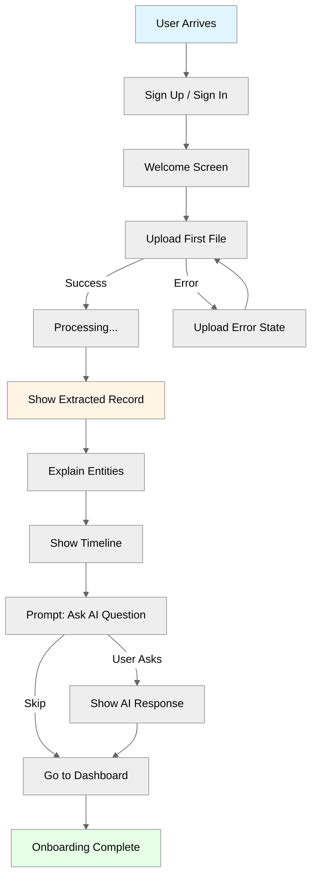

# Neotoma Onboarding Specification
*(First-Run Experience and Activation Flow)*

---

## Purpose

This document defines the **user onboarding experience** for Neotoma MVP. It specifies the first-run flow that introduces users to Neotoma's core value proposition: transforming fragmented documents into structured, AI-ready memory.

**Activation Goal:** User experiences the "A-ha moment" — "Neotoma understands my life" — within 5 minutes.

---

## Scope

This document covers:
- First-run experience flow (signup → first upload → first extraction)
- Activation milestones and success criteria
- Screen-by-screen flow with wireframes (text descriptions)
- Messaging and tone
- Error and fail states
- Accessibility and internationalization requirements

This document does NOT cover:
- Implementation details (see UI pattern docs)
- Long-term user education (help docs, tooltips)
- Advanced features (multi-user, integrations setup)

---

## 1. Onboarding Philosophy

### 1.1 Core Principles

**Minimal Over Magical:**
- Show, don't tell (user uploads → sees extraction → understands)
- No marketing language, no hype
- Direct, technical communication

**Truth Before Experience:**
- Accurate extraction > polished UI
- Real value > perceived value

**Explicit Over Implicit:**
- User controls every step
- No automatic actions

---

## 2. Onboarding Flow Overview



---

## 3. Screen-by-Screen Flow

### Screen 1: Welcome (First-Time Users Only)

**Purpose:** Set expectations, prime user for upload action.

**Content:**
```
Neotoma
Your structured AI memory

Transform fragmented documents into AI-ready truth.

[Upload Your First Document]

What Neotoma does:
• Extracts structured fields from PDFs and images
• Identifies entities (people, companies, locations)
• Builds a timeline from dates in your documents
• Makes your data AI-queryable via MCP

What Neotoma doesn't do:
• No automatic scanning
• No email body reading
• No guessing or inferring
```

**Accessibility:**
- Heading: `<h1>Neotoma</h1>`
- Primary CTA: `<button autofocus>Upload Your First Document</button>`
- List: `<ul>` with semantic markup

**Internationalization:**
- All text translatable (keys: `onboarding.welcome.title`, `onboarding.welcome.subtitle`, etc.)
- "Upload" button localized

**Interaction:**
- Click "Upload" → File picker
- Skip link: "I've used Neotoma before" → Dashboard (for returning users)

---

### Screen 2: Upload

**Purpose:** User uploads first file (invoice, receipt, contract, travel doc).

**Content:**
```
Upload Your First Document

Drag and drop a file or click to browse.

Supported: PDF, JPG, PNG (max 50MB)

Suggested documents:
• Invoice or receipt
• Passport or ID card
• Flight itinerary
• Contract or agreement

[Drag and Drop Area]

or

[Browse Files]

[Cancel]
```

**States:**

**Idle:**
- Dashed border, neutral background
- "Drag and drop..." message

**Dragging Over:**
- Blue border, highlighted background
- "Drop to upload"

**Uploading:**
- Progress bar: "Uploading... 45%"
- File name displayed
- Disable other actions

**Error:**
- Red border, error message
- "Upload failed: File too large. Please upload a file under 50MB."
- [Retry] button

**Accessibility:**
- File input: `<input type="file" accept=".pdf,.jpg,.jpeg,.png" />`
- Drop zone: `role="button" aria-label="Upload file"`
- Progress: `<progress value={45} max={100} aria-label="Upload progress" />`
- Error: `<div role="alert">Error message</div>`

---

### Screen 3: Processing

**Purpose:** Show user that extraction is happening (avoid black box).

**Content:**
```
Processing document...

• Extracting text ✓
• Detecting document type ✓
• Extracting fields...
• Identifying entities...
• Building timeline...

This may take up to 10 seconds.
```

**States:**
- Each step gets checkmark when complete
- Current step has spinner animation
- Overall progress indicator: "Step 3 of 5"

**Accessibility:**
- Live region: `<div aria-live="polite" aria-atomic="true">Extracting fields...</div>`
- Progress: Show current step number

**Duration:**
- Min display time: 1s (avoid flash if fast)
- Max expected: 10s (timeout at 30s with error)

---

### Screen 4: Extraction Results (First A-ha Moment)

**Purpose:** User sees structured fields extracted from their document.

**Content:**
```
Document Processed: FinancialRecord

Extracted Fields:
• Invoice Number: INV-2024-001
• Amount: $1,500.00 USD
• Vendor: Acme Corp
• Date Issued: January 15, 2024
• Date Due: February 15, 2024

Entities Identified:
• Acme Corp (company)

Timeline Events:
• Invoice Issued: January 15, 2024
• Invoice Due: February 15, 2024

[View Timeline] [Upload Another] [Ask AI Question]
```

**States:**

**Success:**
- Show all extracted fields
- Highlight entities (different color/style)
- Show events chronologically

**Partial Extraction:**
- Show extracted fields
- Message: "Some fields couldn't be extracted. This is normal for unstructured documents."

**No Extraction:**
- Show: "Document Type: PDFDocument"
- Message: "No structured fields found. Try uploading an invoice, receipt, or ID document."
- [Upload Another] button

**Accessibility:**
- Sections: `<section aria-labelledby="extracted-fields">` 
- Field list: `<dl>` (description list)
- Entities: `<ul>` with `aria-label="Identified entities"`
- Events: `<ol>` (ordered by date)

**Internationalization:**
- Field labels translatable
- Dates formatted per user locale (display only, stored as ISO 8601)
- Currency formatted per locale

---

### Screen 5: Timeline View (Second A-ha Moment)

**Purpose:** User sees their documents on a chronological timeline.

**Content:**
```
Timeline

January 2024
├─ Jan 15: Invoice Issued (INV-2024-001)
└─ Feb 15: Invoice Due (INV-2024-001)

[Filter by Date Range] [Filter by Type]

Your documents are now part of a searchable timeline.

[Ask AI About This] [Upload More Documents] [Go to Dashboard]
```

**Interaction:**
- Click event → navigate to source record
- Hover event → show tooltip with source field
- Scroll to load more events (virtualized list if >100 events)

**Accessibility:**
- Timeline: `<ol>` with `role="list"`
- Events: `<li>` with `<time datetime="2024-01-15T00:00:00Z">January 15</time>`
- Keyboard nav: Arrow keys to navigate events

---

### Screen 6: AI Question Prompt (Optional)

**Purpose:** Demonstrate MCP integration and AI-queryable memory.

**Content:**
```
Try Asking AI About Your Documents

Neotoma exposes your structured memory to AI tools via MCP.

Example questions:
• "Summarize this invoice"
• "When is this invoice due?"
• "What companies are in my documents?"

[Ask a Question]

or

[Skip to Dashboard]
```

**If User Asks:**
- Show chat interface
- AI response MUST reference record_id
- AI response MUST cite source (e.g., "According to record abc123...")

**If User Skips:**
- Navigate to dashboard
- Mark onboarding as complete

---

### Screen 7: Dashboard (Onboarding Complete)

**Purpose:** User lands on main app interface.

**Content:**
```
Dashboard

Recent Records
• [Most recent uploads, max 5]

Quick Stats
• 3 records
• 2 entities
• 4 timeline events

[Upload] [Search] [Timeline] [Settings]
```

**Onboarding Complete Indicators:**
- No "first-time" prompts
- Full navigation visible
- All features unlocked

---

## 4. Activation Milestones

### 4.1 Milestone Definitions

| Milestone | Definition | Metric | Target |
|-----------|------------|--------|--------|
| **Signed Up** | User created account | `users_signed_up_total` | N/A |
| **First Upload** | User uploaded ≥1 file | `activation_first_upload_rate` | >60% |
| **First Extraction** | User saw ≥1 extracted field | `activation_first_extraction_rate` | >50% |
| **First Entity View** | User saw ≥1 entity | `activation_first_entity_rate` | >40% |
| **First Timeline View** | User viewed timeline | `activation_first_timeline_view_rate` | >40% |
| **First AI Query** | User asked AI question | `activation_first_ai_query_rate` | >20% |
| **Activated** | Completed first upload + extraction + timeline OR AI query | `activation_rate` | >50% |

---

### 4.2 Activation Funnel

```mermaid
%%{init: {'theme':'neutral'}}%%
funnel
    section Signup
        100 users sign up: 100
    section Upload
        60 upload file: 60
    section Extraction
        50 see extraction: 50
    section Timeline
        40 view timeline: 40
    section AI Query
        20 ask AI: 20
    section Activated
        45 activated: 45
```

**Target:** 50% activation rate (users reaching "Activated" state).

---

## 5. Messaging and Tone

### 5.1 Voice and Style

**Tone:**
- Minimal, direct, technical
- No marketing hype, no exclamation points
- Explain what's happening, don't embellish

**Examples:**

**✅ Good:**
- "Extracting text from PDF..."
- "3 fields extracted"
- "Neotoma structures your documents for AI access"

**❌ Bad:**
- "Wow! Your document is being magically transformed!"
- "Sit back while we work our AI magic!"
- "Amazing! We found 3 fields!"

---

### 5.2 Error Messaging

**Pattern:** Explain what happened, what to do next.

**Examples:**

**Upload Error:**
```
Upload failed: File exceeds 50MB limit.

Please upload a file smaller than 50MB, or split large documents.

[Try Again] [Contact Support]
```

**Extraction Error:**
```
Could not extract text from this file.

This file may be corrupted or in an unsupported format.

[Upload a Different File] [Contact Support]
```

**OCR Error:**
```
Text extraction failed.

Image quality may be too low for OCR. Try a clearer scan.

[Try Again] [Upload Different File]
```

---

## 6. Fail States and Recovery

### 6.1 Upload Failures

**Causes:**
- File too large (>50MB)
- Unsupported file type
- Network error

**Recovery:**
- Show clear error message
- Provide [Retry] button
- Link to supported formats doc

---

### 6.2 Extraction Failures

**Causes:**
- OCR failed (poor image quality)
- PDF corrupted or encrypted
- No recognizable schema

**Recovery:**
- Show "PDFDocument" fallback type
- Explain: "No structured fields found"
- Suggest: "Try uploading an invoice, receipt, or ID document"
- Allow: Continue to view raw text or upload another

---

### 6.3 Empty States

**No Records Yet:**
```
No documents uploaded yet.

Upload your first invoice, receipt, passport, or contract to get started.

[Upload Document]
```

**No Entities:**
```
No entities identified yet.

Entities are automatically extracted from uploaded documents.
Try uploading documents with company names or people.
```

**No Timeline Events:**
```
No timeline events yet.

Events are generated from dates in your documents.
Try uploading documents with dates (invoices, itineraries, contracts).
```

---

## 7. Success Criteria

### 7.1 Completion Criteria

User has completed onboarding when:
1. ✅ Uploaded ≥1 file
2. ✅ Viewed extracted fields
3. ✅ Viewed timeline OR asked AI question

**Measurement:**
- Track onboarding state per user: `not_started`, `in_progress`, `completed`
- Mark as `completed` when criteria met
- Show onboarding prompts only if `not_started` or `in_progress`

---

### 7.2 Time-to-Complete

| Metric | Required | Target |
|--------|----------|--------|
| Median time to complete onboarding | <10 minutes | <5 minutes |
| % completing within 5 minutes | >30% | >50% |
| % completing within 10 minutes | >50% | >70% |

---

## 8. Accessibility Requirements

### 8.1 Keyboard Navigation

**Upload Screen:**
- Tab order: Welcome text → Upload button → Browse button → Cancel
- Enter/Space on Upload button → file picker
- Esc closes file picker

**Processing Screen:**
- No interaction (read-only)
- Screen reader announces progress updates

**Extraction Results:**
- Tab order: Fields → Entities → Events → Actions
- Enter on entity → navigate to entity detail
- Enter on event → navigate to source record

---

### 8.2 Screen Reader Support

**Announcements:**
- Upload start: "Uploading document..."
- Processing: "Extracting text... Step 1 of 5"
- Extraction complete: "Document processed. 5 fields extracted."
- Error: "Upload failed. File too large."

**ARIA:**
- Upload zone: `aria-label="Upload file"`
- Progress: `aria-live="polite" aria-atomic="true"`
- Errors: `role="alert"`
- Success: `role="status"`

---

### 8.3 Focus Management

**Upload → Processing:**
- Focus stays on upload zone (disabled during upload)

**Processing → Results:**
- Focus moves to heading "Document Processed"

**Results → Timeline:**
- Focus moves to timeline heading

---

## 9. Internationalization Requirements

### 9.1 Translatable Strings

**UI Text (Translatable):**
- `onboarding.welcome.title`: "Neotoma"
- `onboarding.welcome.subtitle`: "Your structured AI memory"
- `onboarding.upload.button`: "Upload Your First Document"
- `onboarding.upload.supported`: "Supported: PDF, JPG, PNG (max 50MB)"
- `onboarding.processing.title`: "Processing document..."
- `onboarding.extracted.title`: "Document Processed"
- `onboarding.timeline.title`: "Timeline"
- `onboarding.ai_prompt.title`: "Try Asking AI"

**Content (NOT Translatable):**
- Extracted field values (preserve original language)
- Entity names (preserve original)
- Document raw text

---

### 9.2 Locale Formatting

**Dates:**
- Display: User locale (e.g., "January 15, 2024" for en-US, "15 janvier 2024" for fr-FR)
- Storage: ISO 8601 ("2024-01-15T00:00:00Z")

**Currency:**
- Display: User locale (e.g., "$1,500.00" for en-US, "1 500,00 €" for fr-FR)
- Storage: Decimal + currency code (1500.00, "USD")

---

## 10. Error Scenarios

### 10.1 Network Errors

**Scenario:** Upload fails due to network timeout.

**Message:**
```
Upload failed: Network error.

Please check your connection and try again.

[Retry]
```

**Recovery:** Retry with exponential backoff (1s, 2s, 4s).

---

### 10.2 Server Errors

**Scenario:** Server returns 500 Internal Error.

**Message:**
```
Upload failed: Server error.

Please try again. If the problem persists, contact support.

[Retry] [Contact Support]
```

---

### 10.3 Validation Errors

**Scenario:** User attempts to upload unsupported file type.

**Message:**
```
Unsupported file type: .docx

Neotoma currently supports PDF, JPG, and PNG files only.

[Upload Different File]
```

---

## 11. State Persistence

### 11.1 Onboarding State

**Stored in:**
- User preferences table or localStorage

**States:**
```typescript
type OnboardingState = {
  status: 'not_started' | 'in_progress' | 'completed';
  milestones: {
    first_upload: boolean;
    first_extraction_viewed: boolean;
    first_timeline_viewed: boolean;
    first_ai_query: boolean;
  };
  completed_at?: string; // ISO 8601
};
```

---

### 11.2 Resume Behavior

**If User Returns Before Completing:**
- Resume at last incomplete milestone
- E.g., uploaded but haven't viewed timeline → show timeline prompt

**If User Skips:**
- Mark milestone as skipped (not completed)
- Don't show prompt again

---

## 12. Success Metrics (from METRICS_REQUIREMENTS.md)

### 12.1 Activation Success

| Metric | Target |
|--------|--------|
| % users completing onboarding | >50% |
| Median time to complete | <5 minutes |
| % reaching first upload | >60% |
| % viewing extraction results | >50% |
| % viewing timeline | >40% |

---

### 12.2 Drop-off Points (Monitor)

**Critical Drop-Offs to Monitor:**
- Signup → Upload (target: <40% drop-off)
- Upload → View Results (target: <20% drop-off)
- Results → Timeline (target: <30% drop-off)

**Intervention:**
- If drop-off >target, improve messaging or reduce friction

---

## 13. Testing Requirements

### 13.1 E2E Tests

```typescript
test('complete onboarding flow', async ({ page }) => {
  // Sign up
  await page.goto('/signup');
  await page.fill('input[name="email"]', 'test@example.com');
  await page.fill('input[name="password"]', 'password123');
  await page.click('button:has-text("Sign Up")');
  
  // Welcome screen
  await page.waitForSelector('h1:has-text("Neotoma")');
  await page.click('button:has-text("Upload Your First Document")');
  
  // Upload
  await page.setInputFiles('input[type="file"]', 'fixtures/sample_invoice.pdf');
  
  // Processing
  await page.waitForSelector('text=Processing document...');
  
  // Extraction results
  await page.waitForSelector('text=Document Processed');
  expect(await page.textContent('text=Invoice Number')).toContain('INV-001');
  
  // Timeline
  await page.click('button:has-text("View Timeline")');
  await page.waitForSelector('text=Timeline');
  
  // Verify onboarding complete
  const state = await page.evaluate(() => localStorage.getItem('onboarding_state'));
  expect(JSON.parse(state).status).toBe('completed');
});
```

---

### 13.2 Accessibility Tests

```typescript
test('onboarding is keyboard accessible', async ({ page }) => {
  await page.goto('/onboarding');
  
  // Tab to upload button
  await page.keyboard.press('Tab');
  expect(await page.evaluate(() => document.activeElement?.tagName)).toBe('BUTTON');
  
  // Enter activates upload
  await page.keyboard.press('Enter');
  // File picker should open
});

test('onboarding has no a11y violations', async ({ page }) => {
  await page.goto('/onboarding');
  const results = await injectAxe(page);
  expect(results).toHaveNoViolations();
});
```

---

## 14. Implementation Checklist

### 14.1 Components to Build

- [ ] `WelcomeScreen.tsx` — Welcome message + upload CTA
- [ ] `UploadZone.tsx` — Drag-and-drop file upload
- [ ] `ProcessingIndicator.tsx` — Step-by-step progress
- [ ] `ExtractionResults.tsx` — Display fields, entities, events
- [ ] `TimelineIntro.tsx` — Timeline view with onboarding context
- [ ] `AIQueryPrompt.tsx` — Prompt to try AI question
- [ ] `OnboardingProgress.tsx` — Track milestones (background component)

---

### 14.2 State Management

- [ ] Onboarding state hook: `useOnboardingState()`
- [ ] Milestone tracking: `markMilestone(milestone)`
- [ ] Persistence: localStorage + server sync
- [ ] Resume logic: `getNextOnboardingStep()`

---

### 14.3 Routing

- [ ] `/welcome` — Welcome screen (first-time only)
- [ ] `/upload` — Upload file
- [ ] `/onboarding/processing/:recordId` — Processing screen
- [ ] `/onboarding/results/:recordId` — Extraction results
- [ ] `/onboarding/timeline` — Timeline intro
- [ ] Redirect to dashboard if onboarding complete

---

## Detailed Documentation References

For implementation details, see:
- [`docs/ui/patterns/wizard.md`](../ui/patterns/wizard.md) — Multi-step pattern
- [`docs/subsystems/accessibility.md`](../subsystems/accessibility.md) — A11y requirements
- [`docs/subsystems/i18n.md`](../subsystems/i18n.md) — i18n requirements
- [`docs/specs/METRICS_REQUIREMENTS.md`](./METRICS_REQUIREMENTS.md) — Activation metrics
- [`docs/NEOTOMA_MANIFEST.md`](../NEOTOMA_MANIFEST.md) — Section 9: Key workflows

---

## Agent Instructions

### When to Load This Document
Load when:
- Implementing onboarding UI flow
- Planning first-run user experience
- Measuring activation metrics
- Designing welcome/tutorial screens

### Required Co-Loaded Documents
- `docs/NEOTOMA_MANIFEST.md` (product principles, workflows)
- `docs/ui/patterns/wizard.md` (multi-step pattern)
- `docs/subsystems/accessibility.md` (A11y requirements)
- `docs/subsystems/i18n.md` (localization)
- `docs/specs/METRICS_REQUIREMENTS.md` (activation metrics)

### Constraints Agents Must Enforce
1. Onboarding MUST be minimal (no excessive steps)
2. Messaging MUST be direct and technical (no hype)
3. User MUST control every action (no automatic progression)
4. First extraction MUST be visible within 10s
5. All screens MUST be keyboard accessible
6. All text MUST be translatable
7. Error messages MUST be actionable
8. Onboarding completion MUST be persisted

### Forbidden Patterns
- Marketing language or hype
- Automatic progression without user action
- Skipping error handling
- Non-keyboard-accessible steps
- Hardcoded strings (not translatable)
- Missing empty/error states

### Validation Checklist
- [ ] Activation flow completes in <5 minutes (target)
- [ ] All screens keyboard accessible
- [ ] All text translatable
- [ ] Error states handled
- [ ] Success metrics defined
- [ ] E2E test covers full flow
- [ ] Accessibility tested (jest-axe)
- [ ] State persisted across sessions


