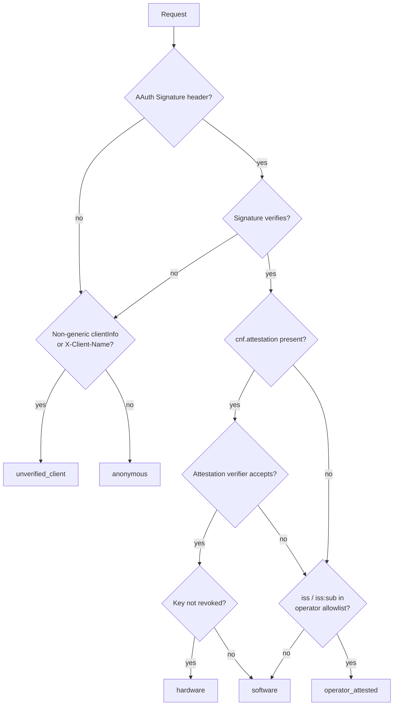

# AAuth

## Purpose

Defines **AAuth** — Neotoma's mechanism for cryptographically verifiable
*agent identity* on every write. AAuth lives alongside (not in place of)
Neotoma's human user authentication: where `user_id` answers "whose data
is this?", AAuth answers "which agent wrote it?". The pair is stamped
onto every observation, relationship, source, interpretation, and
timeline event.

This document is the canonical hub for the AAuth wire format, signature
verification middleware, and trust-tier derivation. It is the upstream
spec for the verifier in `src/middleware/aauth_verify.ts`, the agent-
identity resolution in `src/crypto/agent_identity.ts`, and the
attribution policy seam in `src/services/attribution_policy.ts`.

## Scope

Covers:

- The AAuth wire format (RFC 9421 HTTP Message Signatures + the
  `aa-agent+jwt` agent token).
- Signature verification rules (which fields are covered, how the
  authority is resolved, replay protection).
- The trust-tier contract and the derivation cascade across AAuth,
  attestation, operator allowlists, and the `clientInfo` / HTTP
  fallback channels.
- Per-request precedence between AAuth, `clientInfo`, HTTP fallback
  headers, and OAuth connection ids.
- Operator policy knobs (`NEOTOMA_ATTRIBUTION_POLICY`,
  `NEOTOMA_MIN_ATTRIBUTION_TIER`, `NEOTOMA_ATTRIBUTION_POLICY_JSON`).
- The diagnostic surface on `GET /session` and the
  `attribution_decision` structured log.

Does NOT cover (linked specs do):

- Cryptographic attestation envelopes and per-format verifiers — see
  [`docs/subsystems/aauth_attestation.md`](./aauth_attestation.md).
- CLI-side keypair generation, hardware backends, and attestation
  minting — see
  [`docs/subsystems/aauth_cli_attestation.md`](./aauth_cli_attestation.md).
- End-to-end integration walkthrough for new agents — see
  [`docs/subsystems/agent_attribution_integration.md`](./agent_attribution_integration.md).
- Per-agent capability scoping (`(op, entity_type)` allow-lists) — see
  [`docs/subsystems/agent_capabilities.md`](./agent_capabilities.md).
- Human-user authentication (`getAuthenticatedUserId`, OAuth, key-gated
  Bearer) — see [`docs/subsystems/auth.md`](./auth.md).

## What AAuth is (and is not)

AAuth is **agent authentication**, not human authorization. Concretely:

- A writing agent owns a stable keypair (software or hardware-backed)
  and a JWT (`typ: "aa-agent+jwt"`) carrying `iss` (issuer / fleet),
  `sub` (agent identity within the issuer), and a `cnf.jwk`
  confirmation key.
- The agent signs each HTTP request with that key per RFC 9421.
- Neotoma verifies the signature, derives a `trust_tier`, and stamps
  `(agent_thumbprint, agent_sub, agent_iss, trust_tier, ...)` onto the
  resulting durable rows.
- Bearer tokens, OAuth, and MCP `connection_id` continue to resolve
  the human `user_id`. AAuth never bypasses user-scope resolution.

If AAuth is absent, Neotoma falls back to MCP `clientInfo` or
`X-Client-Name` / `X-Client-Version` HTTP headers as a self-reported
attribution channel. Self-reported channels never reach the
`hardware`, `operator_attested`, or `software` tiers — the highest
they earn is `unverified_client`.

## Wire format

AAuth identifies a writing agent over **two channels**, in precedence
order:

1. **AAuth (signed request).** The request carries:

   - `Signature` — the signature bytes (RFC 9421).
   - `Signature-Input` — the signature parameters. MUST cover, at
     minimum:
     - `@authority`
     - `@method`
     - `@target-uri`
     - `content-digest` (when the request has a body)
     - the `signature-key` header itself
   - `Signature-Key` — the agent's JWK plus an `aa-agent+jwt` agent
     token. The JWT carries:
     - `typ: "aa-agent+jwt"`
     - `iss`, `sub`, `iat`
     - `cnf.jwk` (confirmation key)
     - optionally `cnf.attestation` (see
       [`aauth_attestation.md`](./aauth_attestation.md))

   Neotoma verifies against the canonical `authority` configured via
   `NEOTOMA_AAUTH_AUTHORITY` (defaults to the local dev host). The
   `authority` value MUST match the server's canonical host — using
   the `Host` header is explicitly unsafe and is rejected.

2. **MCP `clientInfo` fallback.** On `initialize` the MCP transport
   self-reports `{ name, version }`. Generic names (`mcp`, `client`,
   `mcp-client`, `unknown`, `anonymous`, …) are dropped through
   `normaliseClientNameWithReason` and treated as if `clientInfo` were
   absent. Non-MCP HTTP callers can pass the same information via the
   `X-Client-Name` and `X-Client-Version` headers.

A successful AAuth verification populates `agent_thumbprint`
(RFC 7638), `agent_sub`, `agent_iss`, `agent_algorithm`, and
`agent_public_key`. A populated `clientInfo` populates `client_name`
and `client_version`. Both halves are persisted; the cascade below
chooses the *trust tier*.

## Verification rules

Performed by `src/middleware/aauth_verify.ts`:

1. Parse `Signature-Input` and reject if any required component is
   missing.
2. Resolve `@authority` against `NEOTOMA_AAUTH_AUTHORITY`. Mismatch
   fails with `authority_mismatch`.
3. Recompute `content-digest` (when the request has a body) and
   compare to the header. Mismatch fails with `digest_mismatch`.
4. Parse the `Signature-Key` header into JWK + JWT. Reject if `typ`
   is not `aa-agent+jwt` or the JWT is malformed.
5. Verify the JWT signature against the embedded JWK. The JWT MUST
   bind `cnf.jwk` to the same key used to sign the request.
6. Check `iat` against the configured AAuth clock-skew window
   (`NEOTOMA_AUTH_AGENT_TOKEN_MAX_AGE_S`, default 300 s).
7. Verify the request signature against the JWK. Failure produces
   `signature_invalid`.
8. If `cnf.attestation` is present, dispatch to the attestation
   verifier (see
   [`aauth_attestation.md`](./aauth_attestation.md)) and capture the
   per-format `attestation_outcome`.

Verifier failures **never** reject the request when the underlying
signature is valid; they only prevent tier promotion. The
`attribution.decision` block on `GET /session` records the failure
reason so operators can debug from the Inspector.

## Trust tiers

A single enum is stamped onto every durable row. Tier resolution lives
in `src/crypto/agent_identity.ts` — services and clients MUST read the
already-resolved `AgentIdentity.trust_tier` from the per-request
context and never re-derive it.

| Tier                | When                                                                                                                                       |
| ------------------- | ------------------------------------------------------------------------------------------------------------------------------------------ |
| `hardware`          | AAuth verified AND the JWT carries a `cnf.attestation` the verifier accepts AND (v0.12.0+) the bound key is not revoked.                   |
| `operator_attested` | AAuth verified AND `iss` (or `iss:sub`) is in `NEOTOMA_OPERATOR_ATTESTED_ISSUERS` / `NEOTOMA_OPERATOR_ATTESTED_SUBS`.                     |
| `software`          | AAuth verified, but no attestation envelope (or attestation failed and operator allowlist did not match), regardless of signing algorithm. |
| `unverified_client` | No AAuth, but `clientInfo.name` (or `X-Client-Name`) survived normalisation.                                                              |
| `anonymous`         | Nothing distinctive — generic or absent `clientInfo`, no AAuth, no fallback header.                                                        |

### Verification cascade



## Per-request precedence

For each request Neotoma walks these inputs in order; the first
populated field at each layer wins:

```
AAuth (verified signature + JWT) → agent_thumbprint, agent_sub, agent_iss,
                                   agent_algorithm, agent_public_key
        │
        ▼
clientInfo.name + version        → client_name, client_version
        │
        ▼
X-Client-Name + X-Client-Version → client_name, client_version
        │
        ▼
OAuth connection id              → connection_id
        │
        ▼
(nothing)                        → anonymous
```

Bearer tokens resolve only `user_id`; they do not mint an attribution
tier above `anonymous` on their own.

## Operator policy

The server publishes the active policy on `GET /session` under
`policy`:

| Field              | Controlled by                                                            | Default |
| ------------------ | ------------------------------------------------------------------------ | ------- |
| `anonymous_writes` | `NEOTOMA_ATTRIBUTION_POLICY=allow\|warn\|reject`                         | `allow` |
| `min_tier`         | `NEOTOMA_MIN_ATTRIBUTION_TIER=hardware\|software\|unverified_client`     | unset   |
| `per_path`         | `NEOTOMA_ATTRIBUTION_POLICY_JSON={"observations":"reject", …}`           | unset   |

Behaviour:

- `reject` returns `HTTP 403 ATTRIBUTION_REQUIRED` with `min_tier` and
  `current_tier` in the error envelope.
- `warn` stamps an `X-Neotoma-Attribution-Warning` response header and
  emits an `attribution_decision` log line, but completes the write.
- `allow` is silent.
- `min_tier` and `per_path` compose: a per-path `reject` always wins
  over the global `allow`.

Per-agent fine-grained capability scoping (`(op, entity_type)` allow-
lists) is layered on top — see
[`agent_capabilities.md`](./agent_capabilities.md).

## Diagnostic surface

Every AAuth verification emits a structured log event
`attribution_decision` with at least:

- `signature_present` — was a `Signature` header on the request?
- `signature_verified` — did the cryptographic check pass?
- `signature_error_code` — (when applicable) why verification failed
  (`authority_mismatch`, `digest_mismatch`, `signature_invalid`,
  `agent_token_expired`, `unsupported_algorithm`, …).
- `attestation_outcome` — (when present) result of the per-format
  verifier (`verified`, `format_unsupported`, `key_binding_failed`,
  `challenge_mismatch`, `chain_invalid`, …).
- `revocation_outcome` — (v0.12.0+) `not_checked`, `live`, `revoked`,
  or `error_skipped`.
- `resolved_tier` — final tier as stamped onto the request context.

The same fields are exposed on `GET /session` under
`attribution.decision` so client preflight tooling can surface them
without scraping logs.

## Preflight (mandatory for new integrators)

Before enabling writes, an integrator MUST call `GET /session` (or
the `get_session_identity` MCP tool, or `neotoma auth session` over
the CLI) and confirm:

- `attribution.decision.signature_verified === true` (when AAuth is
  intended).
- `attribution.tier` is `hardware`, `operator_attested`, or
  `software` for signed clients, or at least `unverified_client` when
  intentionally relying on `clientInfo` only.
- `eligible_for_trusted_writes === true`.

Generic `clientInfo.name` values are normalised to `anonymous` and
WILL fail the preflight under any non-`allow` policy.

## Transport parity

The same identity contract is threaded through every transport:

- HTTP `/mcp` (MCP-over-HTTP).
- Direct REST routes (`/store`, `/observations/create`,
  `/create_relationship`, `/correct`, `/session`, …).
- MCP stdio.
- CLI-over-MCP and CLI-over-HTTP.

Per-transport notes live in
[`agent_attribution_integration.md`](./agent_attribution_integration.md).

## Where to go next

- Wire format walkthrough and integrator checklist:
  [`agent_attribution_integration.md`](./agent_attribution_integration.md).
- Hardware attestation (Apple SE, WebAuthn-packed, TPM 2.0):
  [`aauth_attestation.md`](./aauth_attestation.md).
- CLI keygen, hardware backends, attestation minting:
  [`aauth_cli_attestation.md`](./aauth_cli_attestation.md).
- Per-agent capability scoping:
  [`agent_capabilities.md`](./agent_capabilities.md).
- Human-user authentication (`user_id` resolution, OAuth, Bearer):
  [`auth.md`](./auth.md).
