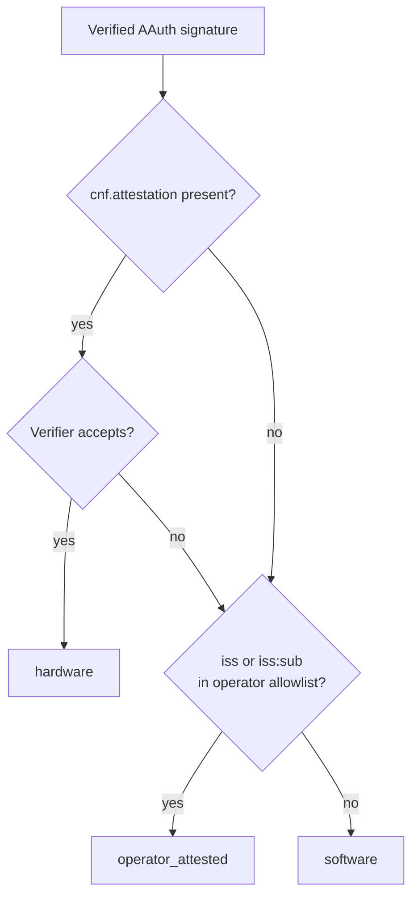

# AAuth attestation

## Purpose

Defines how Neotoma cryptographically verifies that an AAuth-signing key is
bound to a hardware root of trust before promoting a request to the
`hardware` attribution tier. Specifies the JSON-native `cnf.attestation`
claim envelope carried inside the `aa-agent+jwt` agent token, the
verification cascade applied by the middleware, and the operator
configuration knobs that select which attestation roots are trusted.

This document is the upstream spec for the verifier implementation in
`src/services/aauth_attestation_verifier.ts` and its format-specific
backends.

## Scope

Covers:

- The `cnf.attestation` claim shape (format discriminator, statement bytes,
  challenge derivation, key-binding rule).
- Supported attestation formats and their per-format verification rules.
- Tier resolution cascade: how attestation outcomes interact with the
  operator allowlist (`operator_attested`) and the default `software` tier.
- Trust configuration env vars and where the bundled Apple Attestation
  Root lives in the repository.
- Diagnostic output surfaced through the `decision` block on
  `get_session_identity` and the Inspector.

Does NOT cover:

- HTTP message signature verification itself (see
  `docs/subsystems/aauth.md`).
- CLI-side attestation generation (see
  `docs/subsystems/aauth_cli_attestation.md`).
- Full envelope drill-down inside the Inspector — the Settings page
  exposes the resolved tier, the attestation outcome (verified / format
  / failure reason), and the operator-allowlist source via the
  "Current Session Attestation" card; row-level provenance still only
  shows the tier badge. Per-row attestation drill-down is a follow-up.

## Verification cascade

Server-side tier resolution after the AAuth signature is verified:

1. If the JWT carries `cnf.attestation` AND the verifier returns
   `{ verified: true }`, resolve to `hardware`.
2. Else, if the verified `iss` (or `iss:sub` composite) is present in the
   operator allowlist (`NEOTOMA_OPERATOR_ATTESTED_ISSUERS` /
   `NEOTOMA_OPERATOR_ATTESTED_SUBS`), resolve to `operator_attested`.
3. Else, resolve to `software`.

Verifier failures (chain invalid, key not bound, format unsupported) MUST
fall through rather than rejecting the request — the underlying signature
is still valid, the client just does not earn the higher tier. The
`decision.attestation` diagnostic block records the verifier reason so
operators can debug failed promotions through the Inspector.



## `cnf.attestation` claim envelope

JSON-native (no CBOR). Lives inside the `cnf` claim of the
`aa-agent+jwt` agent token alongside the existing `cnf.jwk` confirmation
key. Discriminator-routed so the same envelope shape carries every
supported format.

```json
{
  "cnf": {
    "jwk": { "kty": "EC", "crv": "P-256", "x": "...", "y": "..." },
    "attestation": {
      "format": "apple-secure-enclave",
      "statement": {
        "attestation_chain": ["<base64url DER>", "<base64url DER>"],
        "signature": "<base64url over SHA-256(challenge || jkt)>"
      },
      "challenge": "<base64url SHA-256(jwt.iss || jwt.sub || jwt.iat)>"
    }
  }
}
```

### Field rules

- `cnf.attestation.format` (string, required) — discriminator. One of
  `apple-secure-enclave`, `webauthn-packed`, `tpm2`. Unknown values fail
  verification with `unsupported_format`.
- `cnf.attestation.statement` (object, required) — opaque to the
  envelope; the per-format verifier defines the inner shape.
- `cnf.attestation.challenge` (base64url string, required) — server
  recomputes from the JWT claims (`SHA-256(iss || sub || iat)`). Must
  match what the verifier expects to find inside the per-format
  statement (Apple SE: signed digest input; WebAuthn-packed:
  `clientDataHash` over the challenge; TPM2: `extraData` of the quote).
  Mismatch fails with `challenge_mismatch`.

### Key-binding rule

The credential public key extracted from `statement` MUST cryptographically
match `cnf.jwk` by RFC 7638 thumbprint. Without this binding an attacker
who replayed a leaked attestation could ride a different signing key past
the verifier. Mismatch fails with `key_binding_failed`.

The verifier's responsibility ordering inside a single format dispatch:

1. Parse statement, extract the credential public key.
2. Compute its RFC 7638 thumbprint and compare to the JWT's `cnf.jwk`
   thumbprint. Mismatch → `key_binding_failed`.
3. Recompute challenge from JWT claims and compare to the value embedded
   in the statement. Mismatch → `challenge_mismatch`.
4. Verify the format-specific cryptographic chain / quote.

This ordering ensures cheap rejections happen first and the structured
reason codes are stable for tests and Inspector output.

## Supported formats

After v0.12.0 every attestation format is fully verified end-to-end and
participates in revocation under the policy described in
[Revocation](#revocation-fu-7). There are no remaining stub formats:

| Format                  | Verifier ships in | CLI sources              | Trust roots                                      | Revocation channel                            |
|-------------------------|-------------------|--------------------------|--------------------------------------------------|-----------------------------------------------|
| `apple-secure-enclave`  | v0.8.0            | `aauth-mac-se` (darwin)  | `config/aauth/apple_attestation_root.pem`        | Apple anonymous-attestation revocation endpoint |
| `webauthn-packed`       | v0.9.0            | `aauth-yubikey` (cross-platform; v0.10.x) | AAGUID allowlist + operator CA bundle | OCSP via leaf AIA, CRL fallback via leaf CDP |
| `tpm2`                  | v0.9.0            | `aauth-tpm2` (linux; v0.10.0), `aauth-win-tbs` (win32; v0.10.0) | `config/aauth/tpm_attestation_roots/` | OCSP via AIK leaf AIA, CRL fallback via AIK leaf CDP |

The format-specific sections below document the internals; the table is
the canonical "what is supported" answer.

### `apple-secure-enclave` (verified + revocation)

Implemented by `src/services/aauth_attestation_apple_se.ts`.

Statement fields:

- `attestation_chain` — base64url-encoded DER X.509 certificates, leaf
  first, terminating at an Apple-rooted intermediate. The trust anchor
  (Apple Attestation Root) lives at
  `config/aauth/apple_attestation_root.pem` and is always merged with
  any operator-configured CAs.
- `signature` — base64url-encoded ECDSA-P256 signature over
  `SHA-256(challenge || jkt)` where `jkt` is the RFC 7638 thumbprint of
  the credential public key.

Verification steps (after the shared key-binding and challenge checks):

1. Decode the chain. Reject if the leaf does not declare an EC P-256
   public key.
2. Walk the chain with `node:crypto.X509Certificate#verify(issuerKey)`.
   Reject (`chain_invalid`) on any signature failure or if the chain
   terminates at a CA not present in the merged trust set.
3. Verify the leaf's ECDSA signature over `SHA-256(challenge || jkt)`.
   Reject (`signature_invalid`) on mismatch.

Apple OCSP / revocation checks were initially out of scope for v0.8.0.
Starting in v0.11.0 the shared revocation service (see
[Revocation](#revocation-fu-7)) consults Apple's anonymous-attestation
revocation endpoint after chain validation succeeds; the result rides on
`decision.attestation.revocation` and (in `enforce` mode) demotes
`hardware` outcomes to `software` with reason=`revoked` when Apple lists
the leaf serial.

### `webauthn-packed` (verified + revocation)

Implemented in
`src/services/aauth_attestation_webauthn_packed.ts`. Statement layout
mirrors the W3C WebAuthn §8.2 `packed` attestation statement.

Statement shape:

```json
{
  "alg": -7,
  "sig": "<base64url DER signature>",
  "x5c": ["<base64url leaf>", "<base64url intermediates...>"]
}
```

Verifier flow:

1. Parse and validate the statement. Reject `malformed` on missing
   fields, `unsupported_format` for ECDAA-only attestations (no `x5c`),
   and `unsupported_format` for COSE algorithms outside the
   v0.9.0 admission set.
2. Resolve the COSE `alg` to a Node.js
   crypto signature primitive. Supported values:
   - `-7` (ES256, ECDSA P-256 + SHA-256)
   - `-35` (ES384, ECDSA P-384 + SHA-384)
   - `-36` (ES512, ECDSA P-521 + SHA-512)
   - `-8` (EdDSA, Ed25519)
   - `-257` (RS256, RSASSA-PKCS1-v1_5 + SHA-256)
   - `-258` (RS384, RSASSA-PKCS1-v1_5 + SHA-384)
   - `-259` (RS512, RSASSA-PKCS1-v1_5 + SHA-512)
   - `-37` (PS256, RSASSA-PSS + SHA-256)
3. Walk the leaf → intermediates chain against the merged trust roots
   from `aauth_attestation_trust_config.ts`. Untrusted chains return
   `chain_invalid`.
4. Extract the FIDO `id-fido-gen-ce-aaguid` extension
   (`1.3.6.1.4.1.45724.1.1.4`) from the leaf using a hand-written DER
   parser. When the operator allowlist
   (`NEOTOMA_AAUTH_AAGUID_TRUST_LIST_PATH`) is non-empty, the parsed
   AAGUID MUST match an entry; mismatches return `aaguid_not_trusted`.
   When the allowlist is empty the AAGUID is logged but not gated, so
   operators can ramp gradually.
5. Bind the leaf's public key to the JWT-bound `cnf.jwk` via RFC 7638
   thumbprint comparison. Mismatches return `key_binding_failed`.
6. Verify the statement signature over the bound challenge using the
   resolved primitive. Mismatches return `signature_invalid`.

Successful runs return `verified: true` with `aaguid` and
`key_model` populated, plus the human-readable trust chain summary.

### `tpm2` (verified + revocation)

Verifies WebAuthn `tpm` attestation statements (TPM 2.0 quotes + AIK
chains). Implementation lives in `src/services/aauth_attestation_tpm2.ts`
and uses the in-repo big-endian length-prefixed parser at
`src/services/aauth_tpm_structures.ts` (no external TPM library
dependency, so the parsing surface remains auditable in TypeScript).

Statement layout (JSON-native, base64url byte fields):

```json
{
  "ver": "2.0",
  "alg": -7,
  "x5c": ["…AIK leaf…", "…intermediates…", "…root…"],
  "sig": "…raw AIK signature over certInfo bytes…",
  "certInfo": "…raw TPMS_ATTEST bytes…",
  "pubArea": "…raw TPMT_PUBLIC bytes describing the bound key…"
}
```

Pipeline:

1. Parse the statement (`ver`, `alg`, `x5c`, `sig`, `certInfo`,
   `pubArea`). Missing or non-string fields → `malformed`.
   Unsupported `ver` (anything other than `"2.0"`) →
   `unsupported_format`.
2. Resolve the COSE alg (`alg`) to a Node `crypto` digest +
   primitive. Unsupported algs return `signature_invalid` rather than
   throwing so the cascade keeps moving.
3. Decode the `x5c` chain into `X509Certificate` objects. Decode
   failures or missing certs → `chain_invalid`.
4. Parse `pubArea` as a `TPMT_PUBLIC` blob and lift it into a Node
   `KeyObject` (RSA `(n, e)` and ECC P-256/P-384/P-521 supported).
   Truncated or unsupported key types → `malformed`.
5. RFC 7638 thumbprint of the lifted public key MUST equal
   `ctx.boundJkt` (the JWT-bound `cnf.jwk`). Mismatches return
   `key_binding_failed`.
6. Walk the AIK chain against the merged trust set. Roots come from
   `config/aauth/tpm_attestation_roots/` (bundled vendor CAs) plus
   any operator-supplied PEMs from
   `NEOTOMA_AAUTH_ATTESTATION_CA_PATH`. Untrusted chains return
   `chain_invalid`.
7. Verify `sig` over the **raw** `certInfo` bytes using the AIK
   leaf's public key. Mismatches return `signature_invalid`.
8. Parse `certInfo` as a `TPMS_ATTEST` blob. The 4-byte magic MUST be
   `TPM_GENERATED_VALUE` (`0xff544347`) and the 2-byte type MUST be
   either `TPM_ST_ATTEST_QUOTE` (`0x8018`) or
   `TPM_ST_ATTEST_CERTIFY` (`0x8017`); other shapes → `malformed`.
9. `extraData` of the `TPMS_ATTEST` MUST equal
   `SHA-256(challenge || jkt)` (the same digest that the AAuth
   middleware uses for every other format). Mismatches return
   `challenge_mismatch`.
10. For `TPM_ST_ATTEST_CERTIFY` payloads only, the certified
    `attested.name` MUST equal `nameAlg || digest(pubArea)` using
    the `nameAlg` declared inside `pubArea`. Mismatches return
    `pubarea_mismatch` — this catches CLI sources that quote a
    different key than the one they signed.

Successful runs return `verified: true`. Operators see the resolved
tier as `hardware` plus the verifier-format diagnostic on the
`/session` decision block.

## Revocation (FU-7)

Implemented in `src/services/aauth_attestation_revocation.ts`. After every
successful chain validation the per-format verifier consults the shared
revocation service and folds the result back into the
`AttestationOutcome` via `applyRevocationPolicy()`. The service is the
only place that knows about Apple's revocation endpoint, OCSP, and CRL
fallback — per-format verifiers stay focused on chain semantics and the
TPM2/WebAuthn-specific quote/AAGUID checks above.

### Channels

| Format | Primary channel | Fallback | Notes |
|---|---|---|---|
| `apple-secure-enclave` | Apple anonymous-attestation revocation endpoint (`https://data.appattest.apple.com/v1/revoked-list`, override via `NEOTOMA_AAUTH_APPLE_REVOCATION_URL`) | none | POST `{ "serial_numbers": [...] }`; returns `{ "revoked": [...] }`. Hits the cache keyed by `SHA-256(leaf DER)`. |
| `webauthn-packed` | OCSP via the leaf's Authority Information Access (AIA) | CRL via the leaf's CRL Distribution Point (CDP) when no AIA OCSP responder is present | Standard X.509 path used by YubiKey / external authenticators. |
| `tpm2` | OCSP via the AIK leaf's AIA | CRL via the AIK leaf's CDP | Vendor AIK chains (Infineon / STMicro / Intel / AMD / Microsoft) consistently advertise OCSP responders. |

Lookups are short-circuited when `NEOTOMA_AAUTH_REVOCATION_MODE` is
`disabled` (the default for v0.10.x) — the verifier never opens a network
socket and the diagnostic stays absent. In `log_only` (default for
v0.11.0) and `enforce` (default for v0.12.0) the service runs and the
`AttestationRevocationDiagnostic` rides on the outcome regardless of
verification result.

### Policy

`applyRevocationPolicy()` is the single chokepoint for translating a
`RevocationOutcome` into a (possibly demoted) `AttestationOutcome`:

- `disabled` — the diagnostic is omitted. The outcome is forwarded as-is.
- `log_only` — the diagnostic is attached (`checked: true`,
  `mode: "log_only"`, `demoted: false`) but never demotes the tier. This
  is the operator-audit window before the v0.12.0 flip.
- `enforce` — a `revoked` status (and `unknown` when
  `NEOTOMA_AAUTH_REVOCATION_FAIL_OPEN=0`) demotes a previously-verified
  outcome to `{ verified: false, reason: "revoked", revocation: { ...,
  demoted: true } }`. The cascade then falls through to the operator
  allowlist or `software` tier exactly as it does for any other
  `verified: false` reason — there is no special path for revocation.

### Caching

In-memory LRU cache keyed by `SHA-256(leaf DER fingerprint || channel)`.
TTL is configurable via `NEOTOMA_AAUTH_REVOCATION_CACHE_TTL_SECONDS`
(default `3600`). Cache hits surface as `source: "cache"` so operators
can tell a fresh lookup from a re-run. The cache is process-local and
intentionally not persisted — process restarts re-validate every chain
through the upstream channel before re-populating.

### Decision diagnostics extension

`AttestationOutcome` carries a new optional field:

```ts
interface AttestationRevocationDiagnostic {
  checked: boolean;             // false when mode === "disabled"
  status?: "good" | "revoked" | "unknown";
  source?: "disabled" | "cache" | "apple" | "ocsp" | "crl" | "no_endpoint" | "error";
  detail?: string;              // free-form responder/network detail
  mode?: "disabled" | "log_only" | "enforce";
  demoted?: boolean;            // true iff enforce mode demoted hardware → software
}
```

The middleware mirrors this onto
`AttributionDecisionDiagnostics.attestation.revocation`, and the
`/session` builder mirrors it onto
`SessionAttributionDecision.attestation.revocation` so the Inspector and
operator dashboards can render the status without re-running the check.

### Migration plan

| Release | `NEOTOMA_AAUTH_REVOCATION_MODE` default | Behaviour |
|---|---|---|
| v0.10.x | `disabled` | No network calls, no diagnostic. Pre-FU-7 behaviour. |
| v0.11.0 | `log_only` | Network calls run; diagnostic surfaces; tiers unchanged. Operators audit results before the flip. |
| v0.12.0 | `enforce` | Network calls run; revoked / fail-closed-unknown demote `hardware` to `software`. Operators who need to fall back can pin `NEOTOMA_AAUTH_REVOCATION_MODE=log_only`. |

The flip is gated on the v0.11.0 audit window producing zero false
positives across the bundled Apple / TPM2 vendor chains. See
`docs/feature_units/in_progress/FU-2026-Q4-aauth-attestation-revocation/FU-2026-Q4-aauth-attestation-revocation_spec.md`
for the operational checklist.

## Trust configuration

Loaded by `src/services/aauth_attestation_trust_config.ts`. Always
includes the bundled Apple Attestation Root; operator inputs are
additive.

| Env var | Shape | Effect |
|---|---|---|
| `NEOTOMA_AAUTH_ATTESTATION_CA_PATH` | Absolute path to a PEM file or a directory of PEM files. | Adds operator-managed CAs to the merged trust set used for chain validation. |
| `config/aauth/tpm_attestation_roots/` | In-repo directory of bundled TPM 2.0 AIK root CAs (`.pem` / `.crt`, recursive). | Always merged into the trust set for the `tpm2` verifier. Vendor sub-directories (Infineon, STMicro, Intel, AMD, Microsoft) document provenance per `README.md`. Operators can supplement via `NEOTOMA_AAUTH_ATTESTATION_CA_PATH`. |
| `NEOTOMA_AAUTH_AAGUID_TRUST_LIST_PATH` | Absolute path to a JSON file containing an array of WebAuthn AAGUIDs (RFC 4122 lower-case hyphenated). | Restricts which authenticator AAGUIDs the `webauthn-packed` verifier admits. Empty/missing file = no AAGUID gating (logging-only ramp). |
| `NEOTOMA_OPERATOR_ATTESTED_ISSUERS` | CSV of `iss` values. | Promotes verified AAuth signatures whose `iss` matches to `operator_attested`. |
| `NEOTOMA_OPERATOR_ATTESTED_SUBS` | CSV of `iss:sub` composite values. | Same as above but pinned to a specific `(iss, sub)` pair. |

The trust loader is fail-open: missing or unreadable operator inputs log
a single warning and continue with the bundled root. This matches the
"verifier failure falls through" semantics — operators never lock
themselves out of plain-signed writes by misconfiguring trust.

## Bundled trust anchor

`config/aauth/apple_attestation_root.pem` ships in-repo. The first lines
of the file MUST be a comment referencing the Apple documentation page
the cert was sourced from and the SHA-256 fingerprint, so operators can
audit the bundled material at a glance.

## Diagnostics surface

The verifier returns a structured outcome:

```ts
type AttestationOutcome =
  | { verified: true; format: AttestationFormat; revocation?: AttestationRevocationDiagnostic }
  | { verified: false; format: AttestationFormat | "unknown"; reason: AttestationFailureReason; revocation?: AttestationRevocationDiagnostic };

type AttestationFailureReason =
  | "not_present"
  | "unsupported_format"
  | "key_binding_failed"
  | "challenge_mismatch"
  | "chain_invalid"
  | "signature_invalid"
  | "aaguid_not_trusted"
  | "pubarea_mismatch"
  | "not_implemented"
  | "malformed"
  | "revoked";
```

The middleware mirrors this onto
`AttributionDecisionDiagnostics.attestation` so operators can see exactly
why a promotion failed without log-spelunking. `not_present` means the
JWT did not carry `cnf.attestation` at all (the cascade then evaluates
the operator allowlist). `revoked` is populated by the FU-7 revocation
service in `enforce` mode (see [Revocation](#revocation-fu-7)).
`AttributionDecisionDiagnostics.attestation.revocation` carries the
underlying status (`good` / `revoked` / `unknown`), the channel
(`apple` / `ocsp` / `crl` / `cache`), the operational mode, and a
`demoted` flag indicating whether the policy actually demoted the tier.

## Related documents

- `docs/subsystems/aauth.md` — HTTP message signature verification.
- `docs/subsystems/aauth_cli_attestation.md` — CLI-side attestation
  generation for macOS Secure Enclave.
- `docs/subsystems/agent_attribution_integration.md` — Tier table and
  Inspector surfaces.
- `docs/feature_units/in_progress/FU-2026-04-aauth-hardware-attestation/FU-2026-04-aauth-hardware-attestation_spec.md`
  — Feature unit umbrella.
- `docs/feature_units/in_progress/FU-2026-Q3-aauth-inspector-attestation-viz/FU-2026-Q3-aauth-inspector-attestation-viz_spec.md`
  — Inspector envelope drill-down + tier-icon fix follow-up.
- `docs/feature_units/in_progress/FU-2026-Q3-aauth-webauthn-packed-verifier/FU-2026-Q3-aauth-webauthn-packed-verifier_spec.md`
  — WebAuthn `packed` server-side verifier.
- `docs/feature_units/in_progress/FU-2026-Q4-aauth-attestation-revocation/FU-2026-Q4-aauth-attestation-revocation_spec.md`
  — Attestation revocation service (Apple endpoint + OCSP/CRL).
