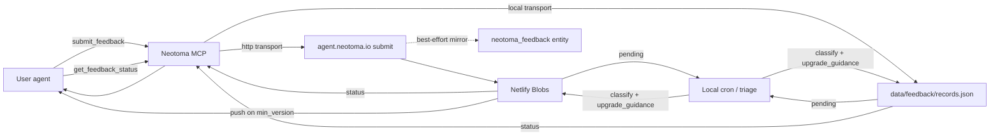

# Agent Feedback Pipeline

End-to-end intake, triage, and resolution loop for feedback submitted by user agents. Hosted component lives at `agent.neotoma.io` (Netlify Functions + Blobs); the MCP server exposes the submit and status tools; a local cron on the maintainer's laptop handles triage and writes status updates back.

## Why it exists

Users and their agents hit friction with Neotoma. Without a durable, machine-ingestible intake path, friction reports end up as Slack DMs, ad-hoc markdown files, and half-remembered issues. This pipeline gives agents a first-class way to file feedback, poll for resolution, and act on fixes autonomously once they ship.

## Surfaces

| Surface | Where | Who uses it |
|--------|------|------------|
| `submit_feedback` MCP tool | `src/services/feedback/*`, `src/server.ts` | user agents |
| `get_feedback_status` MCP tool | same | user agents |
| `POST /feedback/submit` | `services/agent-site/netlify/functions/submit.ts` | MCP → HTTP transport |
| `GET /feedback/status` | `services/agent-site/netlify/functions/status.ts` | MCP → HTTP transport |
| `GET /feedback/pending` (admin) | `services/agent-site/netlify/functions/pending.ts` | local cron |
| `POST /feedback/{id}/status` (admin) | `services/agent-site/netlify/functions/update_status.ts` | local cron |
| `GET /feedback/by_commit/{sha}` (admin) | `services/agent-site/netlify/functions/by_commit.ts` | release ritual |
| `neotoma triage` | `src/cli/triage.ts` | maintainer |
| Ingest cron | `scripts/cron/ingest_agent_incidents.ts` | launchd |
| `process_feedback` skill | `.cursor/skills/process-feedback/`, `.claude/skills/process_feedback/` | maintainer triage |

## Data model

`StoredFeedback` (see `services/agent-site/netlify/lib/types.ts`) lives in Netlify Blobs under the `feedback` store when the HTTP transport is active, and in a local JSON file (`data/feedback/records.json` by default) when the local transport is active. Structural parity between the two is enforced by `tests/integration/feedback_pipeline_local_vs_http.test.ts`.

Key fields:

- `status` — `submitted | triaged | planned | in_progress | resolved | duplicate | wontfix | wait_for_next_release | removed`
- `classification` — label assigned by the cron classifier (e.g. `cli_bug`, `duplicate_of_shipped_work`)
- `resolution_links` — GitHub issue URLs, PR URLs, commit SHAs, `duplicate_of_feedback_id`, `related_entity_ids`, `notes_markdown`, `verifications`
- `upgrade_guidance` — install commands, verification steps, new surfaces, `action_required` enum (see type definition)
- `verification_request` — present on `get_feedback_status` response when a fix resolved in this version is eligible for verification
- `next_check_suggested_at` — polling hint with exponential backoff on non-terminal statuses
- `status_push` — optional webhook config, fired when `min_version_including_fix` transitions from null to assigned
- `mirrored_to_neotoma` — true iff the record has been forwarded into a native Neotoma `neotoma_feedback` entity. See [`feedback_neotoma_forwarder.md`](./feedback_neotoma_forwarder.md) for the Netlify → Neotoma transport (Cloudflare Named Tunnel + Access).
- `neotoma_entity_id` — stable `entity_id` returned by Neotoma on first successful forward; used by later admin patches so status updates land as observations on the same entity instead of creating duplicates.
- `mirror_attempts` / `mirror_last_error` — bookkeeping for the retry worker; Blobs remain the intake of record until the mirror cleanly drains.

## Transport selection

Environment controls — see [.env.example](../../.env.example):

- `NEOTOMA_FEEDBACK_TRANSPORT=local|http` — explicit override
- `AGENT_SITE_BASE_URL` — when set and no explicit transport, auto-selects `http`
- `AGENT_SITE_BEARER` — submit auth (public bearer)
- `AGENT_SITE_ADMIN_BEARER` — admin auth (cron, triage)
- `NEOTOMA_FEEDBACK_AUTO_SUBMIT=0` — kill switch; MCP `submit_feedback` throws
- `NEOTOMA_FEEDBACK_STORE_PATH` — override local JSON store path

Default is `local` when `AGENT_SITE_BASE_URL` is unset, which makes development ergonomic: run `neotoma triage` locally without any hosted service.

## Flow

Blobs remain the intake of record for submit/status reads. See
[`feedback_neotoma_forwarder.md`](./feedback_neotoma_forwarder.md) for the
Cloudflare Named Tunnel + Access transport that pushes every record into
a native `neotoma_feedback` entity (Option B / best-effort).

## PII handling

Agents MUST redact or alter PII in `title`, `body`, and `metadata.environment.error_message` before submitting. Placeholders follow `<LABEL:hash>` (hash-stable across retries). The server runs an additional redaction scan as a backstop — see `services/agent-site/netlify/lib/redaction.ts` and the mirror at `src/services/feedback/redaction.ts`. `submit_feedback` returns a `redaction_preview` so the submitting agent can audit what the scanner did.

## Release ritual

After every release tag:

1. Update `docs/subsystems/feedback_upgrade_guidance_map.json` with new keyword/surface → upgrade_guidance entries.
2. For any merged PR body carrying `closes feedback:{feedback_id}`, run `neotoma triage --resolve {id} --commit-sha <sha> --pr-url <url>` so submitters get status + upgrade_guidance.
3. Inspect `neotoma triage --health` to confirm classification accuracy is above the 70% floor.

## Auto-PR phases

Current phase lives in `docs/subsystems/feedback_auto_pr_config.json`. Phase 1 MVP is issue-only: the cron classifies, issues get drafted by the `process_feedback` skill, no auto-PR drafting. Phase 2 unlocks draft-only PRs on a narrow allowlist once classifier/maintainer agreement passes 90% over the last 20 triaged items. Phase 3 broadens scope after 80% auto-PR acceptance over the last 20 drafts. Kill switch: `NEOTOMA_FEEDBACK_AUTO_PR_ENABLED=0`.

## Auth

`get_feedback_status` authenticates with the returned `access_token` alone — no other Neotoma MCP bearer is required. This keeps the polling loop cheap for agents that only care about their own submissions and prevents leakage of the MCP session token when logging intermediate tool output. Access tokens are hash-indexed on the server; the raw token is only ever known to the submitter and the issuing backend at the moment of submission.

## Deferred items (post-MVP)

These deferrals are documented here so future planners do not need to re-derive them.

- **Batch array submissions**: `submit_feedback` accepts a single item today. Simon deferred batch submissions; the pipeline handles multiple items sequentially in the interim. Revisit once submitter volume justifies the API surface.
- **`schema_coverage_report` kind**: schema-coverage diagnostics can ride inside `metadata` as a free-form block under the existing `report` kind until a dedicated kind is justified.
- **Rollback trigger logic**: the schema already exposes `action_required=rollback` and `rollback_commands`. Automated triggering (how the server decides to recommend a rollback) is deferred — today it is purely populated by the triage skill / cron for known regressions. Post-MVP, wire a heuristic off regression detection + verification_failed aggregation.
- **v0.5.0 store response shape migration note**: pre-0.5.0 clients reading the flat `attributes` wrapper must upgrade to read `entities[].entity_snapshot_after`. Flagged as `breaking_change: true` in the upgrade_guidance map.
- **Release ritual — npm publish lag**: after `gh release create`, inspect `npm view neotoma version` before marking the pipeline resolution complete; v0.5.0 surfaced a brief window where the GitHub release existed but npm had not yet accepted the publish. The `create_release` / `release` skills now include this check.

## Test surface

- `tests/integration/feedback_pipeline_local_vs_http.test.ts` — structural parity between local and HTTP transports
- `tests/integration/feedback_pipeline_smoke.test.ts` — submit → cron → status end-to-end
- `tests/integration/feedback_replay_simon_apr21.test.ts` — Apr 21 fixtures resolve against the guidance map
