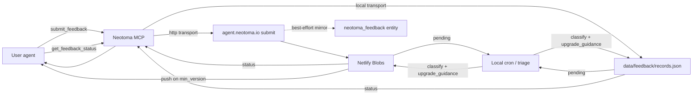

# Agent Feedback Pipeline

End-to-end intake, triage, and resolution loop for feedback submitted by user agents. Hosted component lives at `agent.neotoma.io` (Netlify Functions + Blobs); the MCP server exposes the submit and status tools; a local cron on the maintainer's laptop handles triage and writes status updates back.

## Why it exists

Users and their agents hit friction with Neotoma. Without a durable, machine-ingestible intake path, friction reports end up as Slack DMs, ad-hoc markdown files, and half-remembered issues. This pipeline gives agents a first-class way to file feedback, poll for resolution, and act on fixes autonomously once they ship.

## Surfaces

| Surface | Where | Who uses it |
|--------|------|------------|
| `submit_feedback` MCP tool | `src/services/feedback/*`, `src/server.ts` | user agents |
| `get_feedback_status` MCP tool | same | user agents |
| `POST /feedback/submit` | `services/agent-site/netlify/functions/submit.ts` | MCP → HTTP transport |
| `GET /feedback/status` | `services/agent-site/netlify/functions/status.ts` | MCP → HTTP transport |
| `GET /feedback/pending` (admin) | `services/agent-site/netlify/functions/pending.ts` | local cron |
| `POST /feedback/{id}/status` (admin) | `services/agent-site/netlify/functions/update_status.ts` | local cron |
| `GET /feedback/by_commit/{sha}` (admin) | `services/agent-site/netlify/functions/by_commit.ts` | release ritual |
| `/admin/feedback/*` proxy | `src/services/feedback/admin_proxy.ts` (mounted from `src/actions.ts`) | Inspector → hosted (agent.neotoma.io) or local JSON store, per `NEOTOMA_FEEDBACK_ADMIN_MODE` |
| `mirrorLocalFeedbackToEntity` | `src/services/feedback/mirror_local_to_entity.ts` | Second entity writer (alongside the hosted forwarder); fires from `LocalFeedbackTransport.submit`, the ingest cron's `processLocalStore`, `neotoma triage`, and the local-mode admin proxy so every JSON mutation lands as an observation on the `neotoma_feedback` entity |
| `neotoma triage` | `src/cli/triage.ts` | maintainer |
| Ingest cron | `scripts/cron/ingest_agent_incidents.ts` | launchd |
| `process_feedback` skill | `.cursor/skills/process-feedback/`, `.claude/skills/process_feedback/` | maintainer triage |

## Data model

`StoredFeedback` (see `services/agent-site/netlify/lib/types.ts`) lives in Netlify Blobs under the `feedback` store when the HTTP transport is active, and in a local JSON file (`data/feedback/records.json` by default) when the local transport is active. Structural parity between the two is enforced by `tests/integration/feedback_pipeline_local_vs_http.test.ts`.

Key fields:

- `status` — `submitted | triaged | planned | in_progress | resolved | duplicate | wontfix | wait_for_next_release | removed`
- `classification` — label assigned by the cron classifier (e.g. `cli_bug`, `duplicate_of_shipped_work`)
- `resolution_links` — GitHub issue URLs, PR URLs, commit SHAs, `duplicate_of_feedback_id`, `related_entity_ids`, `notes_markdown`, `verifications`
- `upgrade_guidance` — install commands, verification steps, new surfaces, `action_required` enum (see type definition)
- `verification_request` — present on `get_feedback_status` response when a fix resolved in this version is eligible for verification
- `next_check_suggested_at` — polling hint with exponential backoff on non-terminal statuses
- `status_push` — optional webhook config, fired when `min_version_including_fix` transitions from null to assigned
- `mirrored_to_neotoma` — true iff the record has been forwarded into a native Neotoma `neotoma_feedback` entity. See [`feedback_neotoma_forwarder.md`](./feedback_neotoma_forwarder.md) for the Netlify → Neotoma transport (Cloudflare Named Tunnel + Access).
- `neotoma_entity_id` — stable `entity_id` returned by Neotoma on first successful forward; used by later admin patches so status updates land as observations on the same entity instead of creating duplicates.
- `mirror_attempts` / `mirror_last_error` — bookkeeping for the retry worker; Blobs remain the intake of record until the mirror cleanly drains.

## Transport selection

Environment controls — see [.env.example](../../.env.example):

- `NEOTOMA_FEEDBACK_TRANSPORT=local|http` — explicit override
- `AGENT_SITE_BASE_URL` — when set and no explicit transport, auto-selects `http`
- `AGENT_SITE_BEARER` — submit auth (public bearer)
- `AGENT_SITE_ADMIN_BEARER` — admin auth (cron, triage)
- `NEOTOMA_FEEDBACK_AUTO_SUBMIT=0` — kill switch; MCP `submit_feedback` throws
- `NEOTOMA_FEEDBACK_STORE_PATH` — override local JSON store path

Default is `local` when `AGENT_SITE_BASE_URL` is unset, which makes development ergonomic: run `neotoma triage` locally without any hosted service.

## Flow

Blobs remain the intake of record for submit/status reads. See
[`feedback_neotoma_forwarder.md`](./feedback_neotoma_forwarder.md) for the
Cloudflare Named Tunnel + Access transport that pushes every record into
a native `neotoma_feedback` entity (Option B / best-effort).

## Signal sources

The pipeline aggregates a few different signal types. The agent's own `submit_feedback` calls remain the primary intake; alongside that, every harness hook package (cursor-hooks, opencode-plugin, claude-agent-sdk-adapter, claude-code-plugin, codex-hooks) reimplements the same small failure-signal accumulator inline so friction surfaces even when the agent never reasons about feedback explicitly:

- **Tool detection.** `isNeotomaRelevantTool()` (TS) / `is_neotoma_relevant_tool()` (Python) flags MCP tools against the Neotoma server, the `neotoma` CLI, and direct HTTP calls into Neotoma endpoints. Non-Neotoma failures are NOT captured by this layer — that scope keeps the signal actionable.
- **PII scrub.** `scrubErrorMessage()` / `scrub_error_message()` masks emails, secrets (`sk_*`, `pk_*`, `ghp_*`, `ghs_*`, `ntk_*`, `aa_*`), UUIDs, phone numbers, and the user's home directory before any value is persisted. The scan is defence-in-depth — agents calling `submit_feedback` are still expected to apply the full PII redaction contract.
- **Error classification.** `classifyErrorMessage()` / `classify_error_message()` collapses raw error text into a coarse `ERR_*`, network code (`ECONNREFUSED`, `ENOTFOUND`, `ETIMEDOUT`, …), `HTTP_<status>`, `fetch_failed`, `timeout`, or `generic_error` class so the per-`(tool, error_class)` counter is meaningful.
- **Local persistence.** Each harness writes `tool_invocation_failure` entities into Neotoma (with `tool_name`, `error_class`, `error_message_redacted`, `invocation_shape`, `turn_key`, `hit_count_session`) and maintains a per-session counter file under `NEOTOMA_HOOK_STATE_DIR` (`failures-<session>.json`). Counters TTL out after 24 h.
- **One-shot hint surfacing.** Harnesses with a prompt-injection channel (cursor-hooks `postToolUse`/`afterToolUse`, claude-code `UserPromptSubmit`, claude-agent-sdk-adapter `UserPromptSubmit`) surface a single `Neotoma hook note: …` line via `additional_context` once `NEOTOMA_HOOK_FEEDBACK_HINT_THRESHOLD` (default 2) is hit, recommending that the agent file `submit_feedback` (kind `incident`) if the failure is blocking. The hint is gated by `NEOTOMA_HOOK_FEEDBACK_HINT` and is one-shot per `(tool_name, error_class)` per session. opencode-plugin and codex-hooks are storage-only — they capture the signal but cannot inject context into the agent prompt.
- **No auto-submit.** Hooks NEVER call `submit_feedback` directly. The agent retains full control over what reaches the pipeline; hooks only ensure the signal exists for the agent (or a triage operator) to act on.

## PII handling

Agents MUST redact or alter PII in `title`, `body`, and `metadata.environment.error_message` before submitting. Placeholders follow `<LABEL:hash>` (hash-stable across retries). The server runs an additional redaction scan as a backstop — see `services/agent-site/netlify/lib/redaction.ts` and the mirror at `src/services/feedback/redaction.ts`. `submit_feedback` returns a `redaction_preview` so the submitting agent can audit what the scanner did.

## Release ritual

After every release tag:

1. Update `docs/subsystems/feedback_upgrade_guidance_map.json` with new keyword/surface → upgrade_guidance entries.
2. For any merged PR body carrying `closes feedback:{feedback_id}`, run `neotoma triage --resolve {id} --commit-sha <sha> --pr-url <url>` so submitters get status + upgrade_guidance.
3. Inspect `neotoma triage --health` to confirm classification accuracy is above the 70% floor.

## Auto-PR phases

Current phase lives in `docs/subsystems/feedback_auto_pr_config.json`. Phase 1 MVP is issue-only: the cron classifies, issues get drafted by the `process_feedback` skill, no auto-PR drafting. Phase 2 unlocks draft-only PRs on a narrow allowlist once classifier/maintainer agreement passes 90% over the last 20 triaged items. Phase 3 broadens scope after 80% auto-PR acceptance over the last 20 drafts. Kill switch: `NEOTOMA_FEEDBACK_AUTO_PR_ENABLED=0`.

## Auth

`get_feedback_status` authenticates with the returned `access_token` alone — no other Neotoma MCP bearer is required. This keeps the polling loop cheap for agents that only care about their own submissions and prevents leakage of the MCP session token when logging intermediate tool output. Access tokens are hash-indexed on the server; the raw token is only ever known to the submitter and the issuing backend at the moment of submission.

## Deferred items (post-MVP)

These deferrals are documented here so future planners do not need to re-derive them.

- **Batch array submissions**: `submit_feedback` accepts a single item today. Simon deferred batch submissions; the pipeline handles multiple items sequentially in the interim. Revisit once submitter volume justifies the API surface.
- **`schema_coverage_report` kind**: schema-coverage diagnostics can ride inside `metadata` as a free-form block under the existing `report` kind until a dedicated kind is justified.
- **Rollback trigger logic**: the schema already exposes `action_required=rollback` and `rollback_commands`. Automated triggering (how the server decides to recommend a rollback) is deferred — today it is purely populated by the triage skill / cron for known regressions. Post-MVP, wire a heuristic off regression detection + verification_failed aggregation.
- **v0.5.0 store response shape migration note**: pre-0.5.0 clients reading the flat `attributes` wrapper must upgrade to read `entities[].entity_snapshot_after`. Flagged as `breaking_change: true` in the upgrade_guidance map.
- **Release ritual — npm publish lag**: after `gh release create`, inspect `npm view neotoma version` before marking the pipeline resolution complete; v0.5.0 surfaced a brief window where the GitHub release existed but npm had not yet accepted the publish. The `create_release` / `release` skills now include this check.

## Local pipeline mode

When no hosted config is present (`AGENT_SITE_BASE_URL` / `AGENT_SITE_ADMIN_BEARER` unset), Neotoma runs the full pipeline locally:

1. `submit_feedback` → `LocalFeedbackTransport.submit` writes the JSON
   record, then calls `mirrorLocalFeedbackToEntity` to project the same
   record onto a `neotoma_feedback` entity under the submitter's
   `user_id`. The mirror key is `neotoma_feedback-<feedback_id>`, stable
   across every subsequent triage hop.
2. The ingest cron's `processLocalStore` runs the classifier against the
   JSON store, re-upserts the classified record, and fires
   `mirrorLocalFeedbackToEntity` so the `classification` and any
   `upgrade_guidance` land on the same entity as additional observations.
3. `neotoma triage --set-status` and `--resolve` hit the JSON store and
   mirror again.
4. The Inspector's `POST /admin/feedback/:id/status` (local-mode branch)
   performs the same JSON + mirror two-step, so scratch-note publishes
   surface immediately on the Inspector's `/feedback` view.

Every write is best-effort with respect to the mirror: a mirror failure
is logged and swallowed, and the JSON store remains source-of-record.
Switching from local to hosted mode does not backfill — existing local
entities stay in the local Neotoma DB and do not propagate upward.

### Inspector admin proxy

The `/admin/feedback/*` routes run in one of three tri-state modes,
resolved per request from `NEOTOMA_FEEDBACK_ADMIN_MODE` (explicit) or the
`AGENT_SITE_BASE_URL` + `AGENT_SITE_ADMIN_BEARER` pair (inferred):

- **`hosted`** — requests forward to `agent.neotoma.io` using the shared
  admin bearer.
- **`local`** — requests are served from the on-disk
  `LocalFeedbackStore`. Reads come from the JSON records, writes update
  the JSON and then call `mirrorLocalFeedbackToEntity` so the
  `neotoma_feedback` entity graph stays in sync. This is the default for
  fresh installs.
- **`disabled`** — `NEOTOMA_FEEDBACK_ADMIN_MODE=disabled` forces every
  admin route to return `501 admin_proxy_unconfigured`; the Inspector
  renders read-only.

All admin routes are gated by the AAuth tier resolver: only `hardware` /
`software` / `operator_attested` sessions pass `enforceTier`.

## Test surface

- `tests/integration/feedback_pipeline_local_vs_http.test.ts` — structural parity between local and HTTP transports
- `tests/integration/feedback_pipeline_smoke.test.ts` — submit → cron → status end-to-end
- `tests/integration/feedback_replay_simon_apr21.test.ts` — Apr 21 fixtures resolve against the guidance map
- `tests/unit/feedback_local_mirror.test.ts` — `localRecordToStoredFeedback` adapter + `mirrorLocalFeedbackToEntity` idempotency and user-scoping
- `tests/integration/feedback_local_pipeline.test.ts` — submit → admin triage → mirror end-to-end
- `tests/integration/feedback_admin_proxy.test.ts` — tri-state mode resolver + tier gate
