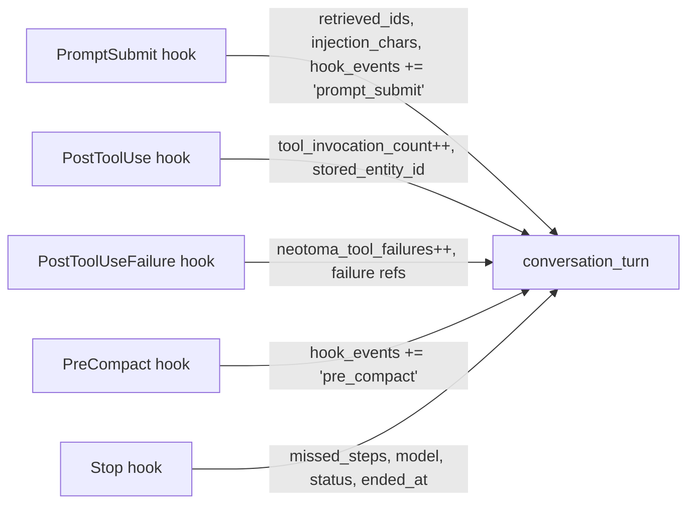

# Subsystem: conversation_turn

Per-turn telemetry entity that captures hook lifecycle events, tool invocations, entity store/retrieve counts, missed steps, and compliance status for a single conversational turn across all harnesses.

## Entity model

- **Entity type**: `conversation_turn`
- **Aliases**: `turn_compliance`, `turn_activity` (both resolve to `conversation_turn` for backward compatibility)
- **Identity**: composite `[session_id, turn_id]` with `name_collision_policy: "reject"`
- **Canonical name**: `{session_id}:{turn_id}` (the `turn_key`)

### Key fields

| Field | Type | Source |
|-------|------|--------|
| `session_id` | string | All hooks (from session/conversation ID) |
| `turn_id` | string | All hooks (from message/turn ID) |
| `turn_key` | string | Derived: `{session_id}:{turn_id}` |
| `harness` | string | All hooks (`cursor`, `opencode`, `claude-code`, `codex-cli`, `claude-agent-sdk`) |
| `hook_events` | string[] | Accumulated per-hook: `before_submit_prompt`, `after_tool_use`, `stop`, etc. |
| `model` | string | Stop hook |
| `status` | string | Stop hook (`completed`, `backfilled_by_hook`) |
| `missed_steps` | string[] | Stop hook (e.g. `["user_phase_store_structured"]`) |
| `tool_invocation_count` | number | PostToolUse hook (incremented per tool call) |
| `store_structured_calls` | number | PostToolUse hook (incremented per store call) |
| `retrieve_calls` | number | PromptSubmit hook |
| `neotoma_tool_failures` | number | PostToolUseFailure hook |
| `injected_context_chars` | number | PromptSubmit hook |
| `retrieved_entity_ids` | string[] | PromptSubmit hook |
| `stored_entity_ids` | string[] | PostToolUse hook |
| `failure_hint_shown` | boolean | PromptSubmit hook |
| `safety_net_used` | boolean | Stop hook |
| `started_at` | date | PromptSubmit hook |
| `ended_at` | date | Stop hook |

## Lifecycle: which hook contributes which fields

Each hook emits an observation with only the fields it knows. The server reducer merges all contributions onto a single entity via the composite identity rule `[session_id, turn_id]`. The idempotency key is `conversation-{sessionId}-{turnId}-turn`.

## Shared helpers

- **TypeScript**: `recordConversationTurn()` in `@neotoma/client` (`packages/client/src/helpers.ts`). Also available as a local copy in `packages/cursor-hooks/hooks/_common.ts`.
- **Python**: `record_conversation_turn()` in `packages/claude-code-plugin/hooks/_common.py` and `packages/codex-hooks/hooks/_common.py`.

## Backend API

- `GET /turns` — Paginated index of `conversation_turn` entities. Filterable by `harness`, `status`, `activity_after`, `activity_before`.
- `GET /turns/:turn_key` — Detail view for a single turn, including related stored/retrieved entities.

Implemented in `src/services/conversation_turn.ts` and routed in `src/actions.ts`.

## Inspector UI

- **Sidebar**: "Turns" entry (Repeat icon) in the first navigation group.
- **Index page**: `/turns` — filterable, sortable table of conversation turns.
- **Detail page**: `/turns/:turnKey` — hook-event timeline, counters, related entities, attribution card.
- **Entity detail**: `TurnProvenanceCard` shown on any entity with a `turn_key`, linking to the turn detail page.
- **Conversations**: `HookActivityChip` per message showing compact hook activity summary, linking to turn detail.

## Migration / backward compatibility

- `turn_compliance` and `turn_activity` are registered aliases of `conversation_turn`. Historical rows stored under either type continue to resolve and appear in `/turns`.
- Hook helpers accept the old idempotency suffixes (`-compliance`, `-activity`) and route to `-turn` going forward; all three keys point at the same composite identity, so the reducer merges them.
- No data backfill required; old rows remain queryable under the aliases.

## Sister entities

These entities also received registered schemas to stop them falling through to heuristic identity:

- `tool_invocation`: `[turn_key, tool_name, invoked_at]`
- `tool_invocation_failure`: `[turn_key, tool_name, error_class, observed_at]`
- `context_event`: `[turn_key, event, observed_at]`
