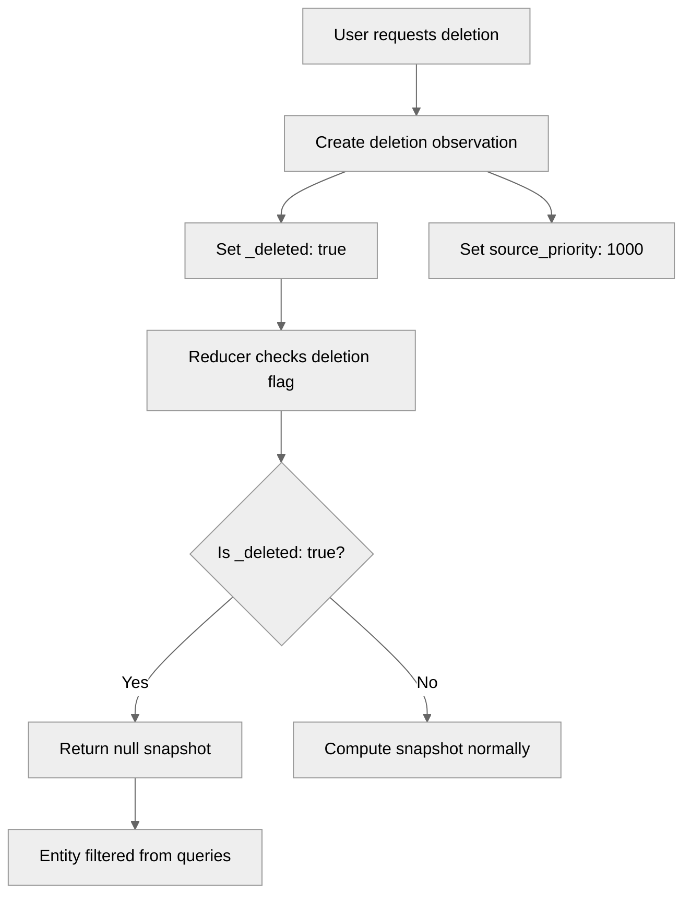
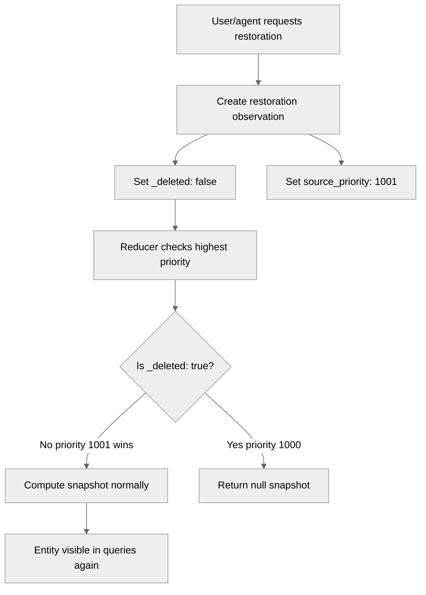
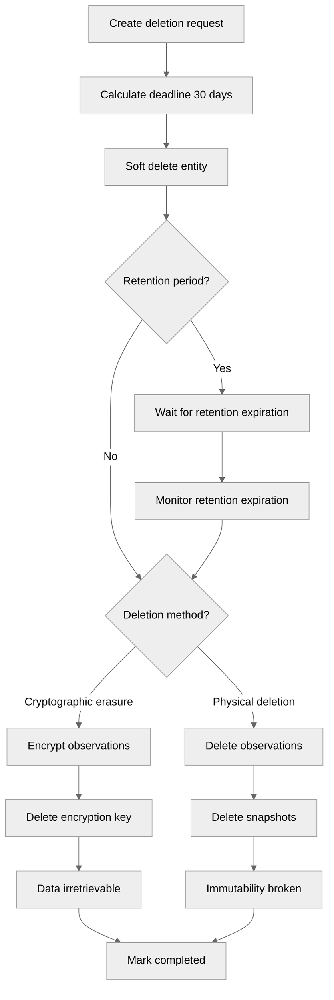
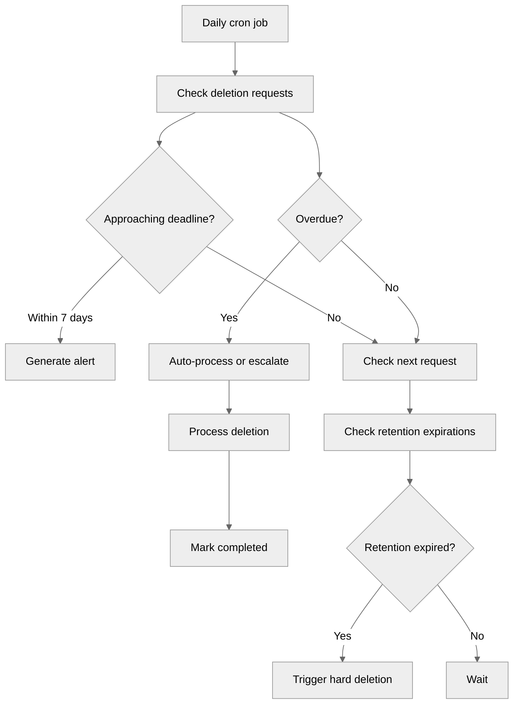

# Deletion Subsystem

_(Subsystem Documentation: GDPR Compliance with Immutability)_

---

## Purpose

The deletion subsystem implements GDPR Article 17 (Right to Erasure) compliance while maintaining Neotoma's immutability guarantees through a two-tier deletion approach:

1. **Soft Deletion (Immutable)**: Deletion observations that mark data as deleted
2. **Hard Deletion (GDPR-Compliant)**: Cryptographic erasure or physical deletion for irretrievable data removal

---

## Scope

This document covers:

- Soft deletion via deletion observations
- Hard deletion via cryptographic erasure and physical deletion
- Deletion request tracking and deadline monitoring
- GDPR compliance requirements and timelines
- Integration with observation-snapshot architecture

This document does NOT cover:

- Backup deletion procedures (see `docs/operations/backup_management.md`)
- Data retention policies (see `docs/legal/data_retention.md`)
- User account deletion (separate from data deletion)

---

## Architecture Overview

### Two-Tier Deletion Approach

**Tier 1: Soft Deletion (Immutable)**

- Creates deletion observation with `_deleted: true` field
- Highest priority (1000) to override other observations
- Maintains full audit trail and immutability
- Reducers exclude deleted entities from snapshots
- Queries filter deleted items by default

**Tier 2: Hard Deletion (GDPR-Compliant)**

- **Cryptographic Erasure**: Encrypt data with user-specific key, then delete key (data becomes irretrievable)
- **Physical Deletion**: Delete observations and snapshots after legal retention periods expire (breaks immutability)

### GDPR Requirements

**When Hard Deletion is Required:**

GDPR Article 17 requires data to be "erased" and "irretrievable" when:

1. Data no longer necessary for original purpose
2. Consent withdrawn (no other legal basis)
3. User objects to processing (no overriding legitimate grounds)
4. Unlawful processing
5. Legal obligation requires erasure

**Timeline Requirements:**

- **Standard**: 30 days from request
- **Extended**: Up to 90 days for complex requests (must notify user within first month)
- **Immediate**: Soft deletion should happen within hours
- **Backup deletion**: Within 30-day backup retention period

---

## Data Models

### Deletion Observation Schema

Deletion observations use the existing `observations` table:

```typescript
{
  id: string; // Deterministic hash based on entity_id + deletion timestamp
  entity_id: string;
  entity_type: string;
  schema_version: "1.0";
  source_id: null; // No source for deletion observations
  observed_at: string; // Deletion timestamp
  source_priority: 1000; // Highest priority
  fields: {
    _deleted: true;
    deleted_at: string;
    deleted_by: string;
    deletion_reason?: string;
  };
  user_id: string;
}
```

### Deletion Request Schema

Deletion requests are tracked in the `deletion_requests` table:

```typescript
{
  id: string;
  user_id: string;
  entity_id?: string; // If deleting specific entity
  relationship_id?: string; // If deleting specific relationship
  deletion_type: "entity" | "relationship" | "user_data_complete";
  status: "pending" | "in_progress" | "completed" | "rejected" | "extended";
  
  // Timestamps
  requested_at: string;
  soft_deleted_at?: string;
  hard_deleted_at?: string;
  completed_at?: string;
  deadline: string; // GDPR deadline (30 days default)
  backup_deletion_deadline?: string;
  
  // Request details
  reason?: string;
  legal_basis?: "user_request" | "consent_withdrawal" | "unlawful_processing" | "legal_obligation" | "user_objection";
  requester_email?: string;
  requester_verified: boolean;
  
  // Deletion method
  deletion_method?: "soft_only" | "cryptographic_erasure" | "physical_deletion";
  encryption_key_deleted_at?: string;
  
  // Retention period (for legal obligations)
  retention_period_days?: number;
  retention_reason?: string;
  
  // Extension tracking
  extension_granted: boolean;
  extension_reason?: string;
  extension_granted_at?: string;
  original_deadline?: string;
}
```

---

## Deletion Flows

### Flow 1: Entity Soft Deletion



### Re-storing a Deleted Entity

If an agent (or user) stores or updates an entity that was previously soft-deleted:

1. **Store succeeds**: A new observation is written with normal `source_priority` (e.g. 100 for store, 0 for interpretation).
2. **Deletion still wins**: The deletion observation has `source_priority: 1000`. Snapshot and queries sort by priority then time; the deletion observation remains the highest-priority observation, so the entity is still treated as deleted.
3. **Effect**: The new data is stored immutably (audit trail intact), but the entity does not reappear in default queries, and `getEntityById` returns null. There is no automatic "revive" from a later store.

**To restore the entity**, use the explicit restore action (see Flow 1b below).

### Flow 1b: Entity Restoration



**Restoration observation schema:**

```typescript
{
  entity_id: "ent_123",
  source_priority: 1001,  // Higher than deletion (1000)
  fields: {
    _deleted: false,
    restored_at: "2026-02-11T...",
    restored_by: "user_xyz",
    restoration_reason?: "User requested reinstatement"
  }
}
```

**MCP actions:**
- `restore_entity({ entity_id, entity_type, reason?, user_id? })`
- `restore_relationship({ relationship_type, source_entity_id, target_entity_id, reason?, user_id? })`

### Flow 2: GDPR Hard Deletion Workflow



### Flow 3: Deadline Monitoring



---

## API Reference

### Soft Deletion

```typescript
// Soft delete entity
import { softDeleteEntity } from "./services/deletion.js";

await softDeleteEntity(
  entityId: string,
  entityType: string,
  userId: string,
  reason?: string,
  timestamp?: string
);

// Soft delete relationship
import { softDeleteRelationship } from "./services/deletion.js";

await softDeleteRelationship(
  relationshipId: string,
  sourceEntityId: string,
  targetEntityId: string,
  relationshipType: string,
  userId: string,
  reason?: string,
  timestamp?: string
);

// Check if entity is deleted
import { isEntityDeleted } from "./services/deletion.js";

const deleted = await isEntityDeleted(entityId, userId);
```

### Hard Deletion (GDPR)

```typescript
// Create deletion request
import { createDeletionRequest } from "./services/gdpr_deletion.js";

await createDeletionRequest(
  userId: string,
  deletionType: "entity" | "relationship" | "user_data_complete",
  entityId?: string,
  relationshipId?: string,
  legalBasis?: "user_request" | "consent_withdrawal" | ...,
  retentionPeriodDays?: number,
  retentionReason?: string
);

// Process deletion request
import { processDeletionRequest } from "./services/gdpr_deletion.js";

await processDeletionRequest(deletionRequestId: string);

// Cryptographic erasure
import { cryptographicErasure } from "./services/gdpr_deletion.js";

await cryptographicErasure(userId: string, entityId?: string);

// Physical deletion
import { physicalDeletion } from "./services/gdpr_deletion.js";

await physicalDeletion(userId: string, entityId?: string);
```

### Deadline Monitoring

```typescript
// Check deletion deadlines
import { checkDeletionDeadlines } from "./services/deletion_monitor.js";

const alerts = await checkDeletionDeadlines(alertThresholdDays?: number);

// Process overdue requests
import { processOverdueRequests } from "./services/deletion_monitor.js";

const results = await processOverdueRequests(autoProcess?: boolean);

// Daily cron job
import { dailyCronJob } from "./services/deletion_monitor.js";

const report = await dailyCronJob(autoProcessOverdue?: boolean);
```

---

## Integration with Reducers and Queries

### Observation Reducer

The observation reducer checks for deletion observations and returns `null` if the highest priority observation has `_deleted: true`:

```typescript
// src/reducers/observation_reducer.ts

async computeSnapshot(
  entityId: string,
  observations: Observation[]
): Promise<EntitySnapshot | null> {
  // Sort observations first
  const sortedObservations = this.sortObservations(observations);

  // Check if entity is deleted (highest priority observation with _deleted: true)
  const highestPriorityObs = [...sortedObservations].sort((a, b) => {
    if (b.source_priority !== a.source_priority) {
      return b.source_priority - a.source_priority;
    }
    return new Date(b.observed_at).getTime() - new Date(a.observed_at).getTime();
  })[0];

  if (highestPriorityObs.fields._deleted === true) {
    return null; // Entity is deleted
  }

  // Continue with snapshot computation...
}
```

### Entity Queries

Entity queries filter deleted entities by default:

```typescript
// src/services/entity_queries.ts

async queryEntities(
  options: {
    includeDeleted?: boolean; // Default false
    // ...
  }
): Promise<EntityWithProvenance[]> {
  // Fetch entities...

  if (!includeDeleted) {
    // Check for deletion observations
    // Filter out entities with highest priority _deleted: true
  }

  return filteredEntities;
}
```

---

## GDPR Compliance Summary

**What GDPR Requires:**

- Data must be "erased" (removed from active processing)
- Data must be "irretrievable" (cannot be recovered)

**How This Subsystem Satisfies GDPR:**

- ✅ Soft deletion immediately removes data from active use
- ✅ Cryptographic erasure makes data irretrievable (GDPR-compliant)
- ✅ Maintains immutability (observations remain, just encrypted)
- ✅ Full audit trail maintained
- ✅ Timeline compliance (30 days standard, 90 days extended)
- ✅ Legal obligations respected (retention periods)

**Recommended Implementation:**

- **Default**: Soft deletion + Cryptographic erasure (immediate)
- **Legal obligations**: Soft delete now, cryptographic erasure after retention period

---

## Testing Requirements

### Unit Tests

- Deletion observation creation with various scenarios
- Reducer exclusion of deleted entities
- Query filtering for deleted items
- Relationship deletion
- Deadline monitoring logic

### Integration Tests

- Complete soft deletion workflow
- Cryptographic erasure workflow
- Legal obligation retention period handling
- Deadline monitoring and alerts
- Extension handling (up to 90 days)

---

## Agent Instructions

### When to Load This Document

Load this document when:

- Implementing deletion features
- Handling GDPR deletion requests
- Modifying observation reducer or entity queries
- Working with deletion monitoring
- Reviewing GDPR compliance

### Required Co-Loaded Documents

- `docs/foundation/philosophy.md` — Immutability principles
- `docs/subsystems/observation_architecture.md` — Observation model
- `docs/legal/compliance.md` — GDPR compliance procedures

### Constraints Agents Must Enforce

1. **Soft deletion MUST use deletion observations** (no database deletions)
2. **Deletion observations MUST have source_priority: 1000** (highest priority)
3. **Reducers MUST return null for deleted entities** (not empty snapshot)
4. **Queries MUST filter deleted items by default** (require explicit includeDeleted flag)
5. **GDPR deadlines MUST be tracked** (30 days standard, 90 days extended)
6. **Cryptographic erasure MUST delete encryption key** (makes data irretrievable)
7. **Physical deletion MUST only be used after retention periods** (last resort)

### Forbidden Patterns

- Deleting observations directly (use soft deletion)
- Modifying `_deleted` field after creation (immutability)
- Skipping deletion observation check in reducers
- Returning deleted entities from queries without explicit flag
- Extending deadlines beyond 90 days (GDPR limit)
- Using physical deletion without retention period justification

### Validation Checklist

- [ ] Soft deletion creates deletion observation with `_deleted: true`
- [ ] Deletion observation has `source_priority: 1000`
- [ ] Reducer returns null for deleted entities
- [ ] Queries filter deleted items by default
- [ ] Deletion requests tracked with GDPR deadlines
- [ ] Deadline monitoring implemented (daily cron)
- [ ] Cryptographic erasure deletes encryption key
- [ ] Physical deletion only after retention period expires
- [ ] Full audit trail maintained
- [ ] GDPR compliance requirements met

---

## References

- **Original Proposal**: `docs/proposals/gdpr-compliance-with-immutability.md`
- **Legal Compliance**: `docs/legal/compliance.md`
- **Observation Architecture**: `docs/subsystems/observation_architecture.md`
- **Immutability Philosophy**: `docs/foundation/philosophy.md`
- **GDPR Article 17**: https://gdpr-info.eu/art-17-gdpr/
