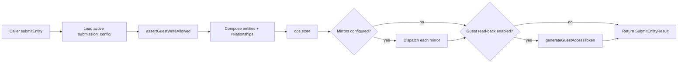

# Entity Submission

Operator-configured pipeline for accepting external (often guest-authenticated) entity submissions and routing them through the standard Neotoma store path, with optional conversation threading, guest read-back tokens, and outbound mirrors to GitHub or arbitrary webhooks.

## Scope

This document covers:

- The `submission_config` entity that operators seed to enable a target entity type.
- `submitEntity` flow (validation, idempotency, conversation threading, guest tokens).
- Mirror dispatch to GitHub Issues and generic webhooks.
- Inbound webhook ingest from external mirrors.
- Defaults seeding for fresh installs.

It does NOT cover:

- The MCP-canonical `store` action (see [`docs/specs/MCP_SPEC.md`](../specs/MCP_SPEC.md)).
- The legacy GitHub-first issue submission path (see [`issues.md`](issues.md), which still owns issue-specific flows).
- Guest access policy itself (see [`guest_access_policy.md`](guest_access_policy.md), [`auth.md`](auth.md)).

## Purpose

A handful of Neotoma deployments need to accept entities from sources that are not full agent harnesses — typically:

- Embedded "submit feedback" widgets on a marketing site.
- GitHub webhook mirroring of public issues into a Neotoma `issue` row.
- Inbound bridges from third-party tools (Linear, custom in-house systems).

Hardcoding those flows per integration would scatter validation, threading, and access-policy logic across the codebase. The submission service centralizes them behind a single config-driven entry point so each new external source becomes a `submission_config` row, not a new code path.

## Invariants

1. **Operator-seeded only.** A submission accepts an entity type only if there is an active `submission_config` row whose `target_entity_type` matches. No implicit allow-list.
2. **Access-policy-gated.** Every submission asserts `assertGuestWriteAllowed` against the guest identity in the request context. The set of types checked includes `target_entity_type` plus, when threading is enabled, `conversation` and `conversation_message`.
3. **Idempotency by content hash.** `idempotencyForSubmit(entity_type, fields)` produces a stable key (`entity-submit-<type>-<sha256-40>`) so identical replays do not duplicate observations.
4. **Routes through `store`.** The pipeline never bypasses observation creation — it composes `StoreInput.entities` and calls the same `store` operation as agents.
5. **Mirrors are best-effort.** Mirror dispatch happens after the store commits. Failures are surfaced via guidance fields on the response, not as transactional rollbacks.
6. **Guest read-back tokens are scoped.** When the submission generates a `guest_access_token`, it covers only the entities created by this submission and is bound to the guest identity that submitted them.

## Components

- `submission_service.ts` — `submitEntity({ userId, entity_type, fields, initial_message? })` is the single entry point. Composes the entity batch, optionally appends a `conversation` + first `conversation_message`, calls `ops.store`, dispatches mirrors, mints a guest token when configured.
- `types.ts` — `SubmitEntityParams`, `SubmitEntityResult`, `SubmissionConfigRecord`, `ExternalMirrorConfigEntry`. `SUBMISSION_CONFIG_ENTITY_TYPE = "submission_config"`.
- `submission_config_loader.ts` — reads active `submission_config` snapshots and returns the first record matching a given `target_entity_type` (cached per-process; refreshed on substrate events for the entity type).
- `seed_schema.ts` — registers the global `submission_config` schema (canonical_name_field: `config_key`).
- `seed_submission_defaults.ts` — first-run seeder that installs default `submission_config` rows for `issue` (and any future canonical types) so a fresh install can accept feedback without operator intervention.
- `ingest/`:
  - `webhook_ingest.ts` — Express handler for inbound `POST /submissions/webhook/:provider` payloads from external mirrors.
  - `github_handler.ts` — provider-specific normalization for GitHub issue / comment payloads, delegating to `submitEntity`.
- `mirrors/`:
  - `mirror_interface.ts` — `Mirror` shape (provider id, `dispatch(entity, config)`).
  - `github_mirror.ts` — pushes the new entity into a configured GitHub repo via the issues service.
  - `webhook_mirror.ts` — generic outbound POST to `config.url` with optional HMAC signing.

## Lifecycle

## Submission config shape

`submission_config` snapshot fields (see `seed_schema.ts` for the authoritative list):

- `config_key` (canonical name) — operator-defined slug per (provider × target type).
- `target_entity_type` — the entity type this config governs.
- `access_policy` — `AccessPolicyMode` from `services/access_policy.ts`; controls guest write eligibility.
- `active` — disable without deleting.
- `enable_conversation_threading` — when true, the submission also creates a `conversation` + first `conversation_message` linked via `PART_OF`.
- `enable_guest_read_back` — when true, the response includes a `guest_access_token` scoped to the new entities.
- `external_mirrors` — array of `{ provider: "github" | "linear" | "custom_webhook", config: {...} }` entries dispatched after store.

## Conversation threading

When enabled, `submitEntity`:

1. Appends a `conversation` entity (`thread_kind: "human_agent"`, `title` derived from `fields.title` / `fields.name` / fallback).
2. Appends a `conversation_message` (`role: "user"`, `sender_kind: "user"`, `content` from `initial_message` or `fields.body` / `fields.content`).
3. Creates `PART_OF` from message → conversation and `REFERS_TO` from message → primary entity, both as in-batch index relationships.

The result includes `conversation_id` so callers (or the mirror) can render a thread URL.

## Mirror dispatch

After `ops.store` commits, each `external_mirrors[]` entry dispatches in declaration order:

- `provider: "github"` — `github_mirror.dispatch` calls into `services/issues/submitIssue`-equivalent helpers (`syncIssuesFromGitHub` is the inverse path). Failures surface as `github_mirror_guidance` on the response.
- `provider: "linear"` — placeholder; current implementation is a no-op stub awaiting the Linear adapter.
- `provider: "custom_webhook"` — `webhook_mirror.postEntityToWebhookMirror` performs an HMAC-signed POST to `config.url` with the entity payload.

Mirror errors are logged but never block the response. Operators can re-trigger a mirror by issuing a `correct` that touches the entity (which re-emits a substrate event consumed by the mirror dispatcher), or manually via the inbound webhook ingest endpoint.

## Inbound webhook ingest

`ingest/webhook_ingest.ts` registers `POST /submissions/webhook/:provider`. The provider key dispatches:

- `github` → `github_handler.handleGithubInboundIssue` / `handleGithubInboundComment`. Both validate the HMAC header, normalize the payload to `SubmitEntityParams`, then call `submitEntity` under a `runWithExternalActor` wrapper that records the originating GitHub user as the external actor. See [`agent_attribution_integration.md`](agent_attribution_integration.md).
- Other providers can be added by registering a new handler module.

The ingest path enforces:

- HMAC signature verification using the per-mirror secret stored in `submission_config.external_mirrors[*].config.shared_secret`.
- Idempotency through the same `idempotencyForSubmit` hash so re-delivery from GitHub does not duplicate the entity.
- Provider-specific dedupe — for GitHub issues, the upstream `issue.number` is folded into the canonical fields so subsequent comments thread into the same Neotoma `conversation`.

## Operations

- `neotoma entities list --type submission_config` to audit configured submissions.
- `neotoma entities search "<config_key>" --entity-type submission_config` to inspect a specific config.
- Disable a submission: `neotoma edit <entity_id>` (or `correct`) to set `active = false`.
- Reset to defaults: `seedSubmissionDefaults` runs at server boot when no `submission_config` rows exist; manual re-seed via `npx tsx scripts/seed_sandbox.ts` or an equivalent operator script.

## Testing

- Unit: `src/services/entity_submission/__tests__/` (when present); `tests/services/sync_webhook_outbound.test.ts` exercises the mirror dispatch path.
- Integration: `tests/integration/cross_instance_issues.test.ts` covers the GitHub mirror loop end-to-end.
- Contract: `tests/contract/openclaw_plugin.test.ts` and the legacy-payload corpus exercise the inbound webhook handlers.

## Related

- [`issues.md`](issues.md) — the canonical issue subsystem; `entity_submission` defers to `issues/issue_operations.ts` for issue-specific flows.
- [`guest_access_policy.md`](guest_access_policy.md) — the policy model that gates guest writes.
- [`agent_attribution_integration.md`](agent_attribution_integration.md) — external-actor attribution applied to inbound submissions.
- [`subscriptions.md`](subscriptions.md) — substrate events that trigger downstream mirror re-dispatch.
- [`docs/plans/observer_wire_feedback_channel.md`](../plans/observer_wire_feedback_channel.md) — design history of the submission pipeline.
