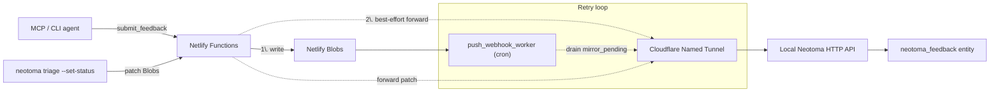
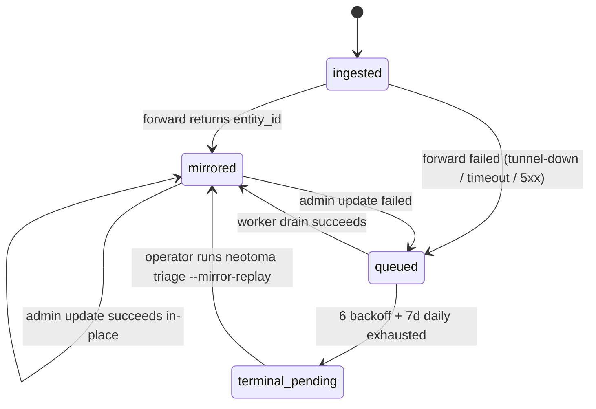

# Feedback Neotoma Forwarder

The forwarder turns every `StoredFeedback` record persisted by the
`agent.neotoma.io` Netlify service into a native Neotoma
`neotoma_feedback` entity, using a stable Cloudflare Named Tunnel as the
transport. Related: [`docs/subsystems/agent_feedback_pipeline.md`](./agent_feedback_pipeline.md)
for the broader pipeline; [`services/agent-site/README.md`](../../services/agent-site/README.md)
for the Cloudflare Access setup.

## One of two entity writers

The hosted forwarder is **one of two paths** that produce
`neotoma_feedback` observations. The other is
`mirrorLocalFeedbackToEntity`
(`src/services/feedback/mirror_local_to_entity.ts`), used when Neotoma is
running in self-contained local mode (no hosted pipeline configured).
Both writers use the same `storedFeedbackToEntity` projection
(`src/services/feedback/neotoma_payload.ts`) and the same
`neotoma_feedback-<feedback_id>` idempotency key, so a record that later
migrates between modes converges on a single entity rather than
duplicating. See [Local pipeline mode](./agent_feedback_pipeline.md#local-pipeline-mode)
for the non-Netlify flow. Nothing in this doc applies to the local
writer; everything below describes the hosted Netlify → Cloudflare Tunnel
→ Neotoma path.

## Goals

1. Make `neotoma_feedback` the **eventual source of truth** for triage,
   search, Inspector views, and cross-entity relationships.
2. Keep the intake path **always-available** — a submit must never fail
   just because the tunnel is offline.
3. Leave room to collapse to a **pure pass-through** (Option A) once
   tunnel reliability is proven.

## Architecture (Option B, current)



Blobs remain the **intake of record** for status reads — the Netlify
status route never blocks on Neotoma. The entity is a durable mirror.

## Forwarder state machine



## Data model

The forwarder projects `StoredFeedback` onto a `neotoma_feedback` entity.
Canonical fields (from `src/services/feedback/seed_schema.ts`):

- **Identity**: `feedback_id`, `access_token_hash`, `submitter_id`
- **Content**: `title`, `body`, `kind`, `redaction_applied`,
  `redaction_backstop_hits`
- **Environment** (flattened from `metadata.environment`):
  `neotoma_version`, `client_name`, `client_version`, `os`, `os_version`,
  `node_version`, `tool_name`, `invocation_shape`, `error_type`,
  `error_message`, `error_class`, `hit_count`, `consent_mode_at_submit`
- **Lifecycle**: `status`, `status_updated_at`, `submitted_at`,
  `last_activity_at`, `next_check_suggested_at`
- **Triage**: `classification`, `triage_notes`
- **Resolution**: `github_issue_urls[]`, `pull_request_urls[]`,
  `commit_shas[]`, `duplicate_of_feedback_id`, `notes_markdown`,
  `verifications[]`
- **Upgrade**: full `upgrade_guidance` object
- **Verification**: `verification_count_by_outcome`,
  `resolution_confidence`, `first_verification_at`,
  `last_verification_at`
- **Regression**: `regression_candidate`, `regression_detected_at`,
  `regression_count`, `superseded_by_version`
- **Pipeline**: `prefer_human_draft`
- **Provenance**: `data_source` (e.g. `agent-site netlify submit 2026-04-22`),
  `source_file` (null for HTTP-origin items),
  `original_submission_payload` snapshot

Relationships stamped on first-write (when data is present):

- `REFERS_TO` from `neotoma_feedback` → any `related_entity_ids`

## Retry policy

The mirror queue (`mirror_pending` Blob) is drained by
`push_webhook_worker` on the standard `*/5 * * * *` cadence.

Backoff schedule per attempt:

| Attempt | Next try after |
| ------- | -------------- |
| 1       | 1m             |
| 2       | 5m             |
| 3       | 30m            |
| 4       | 2h             |
| 5       | 12h            |
| 6       | 24h            |
| 7+      | daily (up to 7d total) |

After the 7d daily window, the task remains in the queue at a 24h
cadence so an operator can clear it manually via:

```bash
neotoma triage --mirror-replay <feedback_id>
```

The record's `mirror_last_error` field records the last failure reason
(`timeout`, `network`, `http_503`, `bad_response`, `misconfigured`,
`disabled`).

## Flag matrix

| `NEOTOMA_FEEDBACK_FORWARD_MODE` | Inline forward at submit? | On failure       | Use case |
| ------------------------------- | ------------------------- | ---------------- | -------- |
| `off`                           | no                        | no-op            | Regression or staging tier without a tunnel |
| `best_effort` (default)         | yes (2s timeout)          | enqueue, return 200 | Production Option B |
| `required`                      | yes (2s timeout)          | return 502        | Staging soak-test; NOT for prod |

Additional knobs:

- `NEOTOMA_FEEDBACK_FORWARD_TIMEOUT_MS` — per-request timeout (default
  `2000`). Larger values slow submit responses; smaller risks `timeout`
  reason codes.
- `AGENT_SITE_NEOTOMA_AGENT_LABEL` — self-reported agent label stamped
  onto every forward via `X-Agent-Label`. Neotoma cross-checks it
  against the AAuth `sub` when the label is listed in
  `NEOTOMA_STRICT_AAUTH_SUBS` on the server.

## Authentication (AAuth-signed requests)

Every forward carries two independent auth layers:

1. **Cloudflare Access service token** at the edge — `CF-Access-Client-Id`
   / `CF-Access-Client-Secret`. Gates the tunneled hostname so anonymous
   public callers never reach Neotoma even if they learn the URL.
2. **AAuth (RFC 9421) signature** at the application layer — produced by
   [`services/agent-site/netlify/lib/aauth_signer.ts`](../../services/agent-site/netlify/lib/aauth_signer.ts)
   using a private JWK held only in Netlify env
   (`AGENT_SITE_AAUTH_PRIVATE_JWK`). The signer also mints an
   `aa-agent+jwt` agent token carrying the `sub` / `iss` / `jkt` claims.
   Neotoma fetches the public JWK from
   `https://agent.neotoma.io/.well-known/jwks.json` (served by
   [`jwks.ts`](../../services/agent-site/netlify/functions/jwks.ts)) to
   verify the signature.

Neotoma's [`src/middleware/aauth_verify.ts`](../../src/middleware/aauth_verify.ts)
resolves each verified request to an `AgentIdentity` and runs it through
the capability registry
([`docs/subsystems/agent_capabilities.md`](./agent_capabilities.md)). The
default committed registry scopes `agent-site@neotoma.io` to the
`neotoma_feedback` entity type only — out-of-scope writes (e.g. a
compromised forwarder trying to touch unrelated entities) return 403
`capability_denied` even though the edge and signature checks passed.

The legacy `NEOTOMA_TUNNEL_BEARER` has been retired. The forwarder no
longer attaches an `Authorization: Bearer` header; AAuth + capability
scoping replaces it end-to-end. If you are upgrading from an earlier
deploy, unset `NEOTOMA_TUNNEL_BEARER` on both Netlify and the local
Neotoma server after rotating the Cloudflare Access service token and
publishing the JWKS.

## Backfill procedure

One-shot script to mirror any records that predate the forwarder or
that never cleared `mirror_pending`:

```bash
npm run feedback:mirror-backfill
```

The script walks every record in Blobs, filters to
`mirrored_to_neotoma !== true`, and forwards them through the same
`forwardToNeotoma()` helper. Idempotency keys (`neotoma_feedback-<id>`)
ensure repeated runs don't create duplicate observations.

## Schema seeding

On first deploy, run:

```bash
npm run feedback:seed-schema
```

This registers (or incrementally extends) the **global**
`neotoma_feedback` schema. Safe to re-run after adding fields; the
registry skips existing fields and only appends missing ones.

## Option A migration path

Option A collapses the Blobs intake in favor of writing directly to
Neotoma from Netlify.

1. Observe `mirror_attempts` histogram and queue depth for at least one
   billing period.
2. If tunnel uptime >= 99.5% over that window and the `mirror_pending`
   high-watermark stays under 10 items, promote `NEOTOMA_FEEDBACK_FORWARD_MODE`
   to `required` for a staging tier.
3. Flip production to `required`, re-run `feedback:mirror-backfill` to
   catch any racers, then retire the Blobs `feedback:*` keys.
4. Update the submit/status routes to query Neotoma directly; keep the
   Blobs token redirect key for per-incident access tokens (that's a
   public-surface auth primitive, not pipeline state).

Security note for both options: Netlify → Neotoma calls are signed with
AAuth (RFC 9421 HTTP Message Signatures; see the "Authentication"
section above) and gated by Cloudflare Access service-token headers at
the edge. Per-agent capability scoping is enforced by
[`src/services/agent_capabilities.ts`](../../src/services/agent_capabilities.ts);
see [`docs/subsystems/agent_capabilities.md`](./agent_capabilities.md)
for the registry format and operator runbook.
