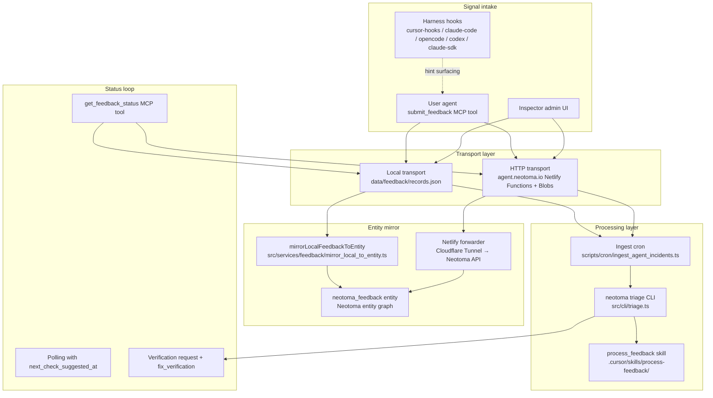

# Feedback System Architecture

Comprehensive reference for the Neotoma agent feedback system. Covers every component from signal capture through triage, resolution, verification, and the entity graph mirror.

## System overview

The feedback system is a closed-loop pipeline that lets user agents report friction, poll for resolution, and self-upgrade when fixes ship. It operates in two transport modes (local and hosted) with structural parity between them, and mirrors every record into the Neotoma entity graph as a `neotoma_feedback` entity.



## Components

### MCP tools

Two tools exposed via `src/server.ts`:

| Tool | Purpose | Auth |
|------|---------|------|
| `submit_feedback` | File a feedback item (incident, report, primitive_ask, doc_gap, contract_discrepancy, fix_verification) | MCP session; consent gated by reporting mode |
| `get_feedback_status` | Poll status by `access_token` | Access token only (no MCP bearer required) |

Both tools delegate to the `FeedbackTransport` interface (`src/services/feedback/types.ts`), which resolves to either `LocalFeedbackTransport` or `HttpFeedbackTransport` based on environment configuration.

### Transport layer

```
src/services/feedback/types.ts         — FeedbackTransport interface, type unions, transport resolution
src/services/feedback/local_store.ts   — LocalFeedbackStore (file-backed JSON)
```

**Resolution logic** (`resolveTransportKind`):

1. `NEOTOMA_FEEDBACK_TRANSPORT=local|http` — explicit override
2. `AGENT_SITE_BASE_URL` set — auto-selects `http`
3. Default — `local`

**Local transport**: Reads/writes `data/feedback/records.json` (configurable via `NEOTOMA_FEEDBACK_STORE_PATH`). The store shape is `{ records: Record<id, LocalFeedbackRecord>, token_index: Record<sha256_hash, id> }`. Writes use atomic rename (`tmp` → target) to prevent corruption.

**HTTP transport**: Forwards to `agent.neotoma.io` Netlify Functions using `AGENT_SITE_BEARER` for submit and `AGENT_SITE_ADMIN_BEARER` for admin operations. Blobs remain the intake-of-record; the Neotoma entity mirror is best-effort.

### Netlify Functions (hosted path)

```
services/agent-site/netlify/functions/
  submit.ts            — POST /feedback/submit
  status.ts            — GET  /feedback/status
  pending.ts           — GET  /feedback/pending (admin)
  update_status.ts     — POST /feedback/{id}/status (admin)
  by_commit.ts         — GET  /feedback/by_commit/{sha} (admin)
  push_webhook_worker.ts — Cron: drain mirror_pending queue
  mirror_replay.ts     — Manual replay for stuck mirrors
  jwks.ts              — /.well-known/jwks.json for AAuth verification
```

### Feedback data model

`LocalFeedbackRecord` (`src/services/feedback/local_store.ts`) and `StoredFeedback` (`src/services/feedback/neotoma_payload.ts`) are structurally parallel. Key fields:

**Identity and content:**
- `id` — `fbk_<base36_timestamp>_<random_hex>` format
- `submitter_id` — user ID of the submitting agent
- `kind` — `incident | report | primitive_ask | doc_gap | contract_discrepancy | fix_verification`
- `title`, `body` — redacted text (PII scrubbed)
- `access_token_hash` — SHA-256 of the single-purpose status token
- `metadata` — free-form; `metadata.environment` contains structured environment data

**Lifecycle:**
- `status` — `submitted → triaged → planned → in_progress → resolved | duplicate | wontfix | wait_for_next_release | removed`
- `status_updated_at`, `submitted_at`, `last_activity_at`
- `next_check_suggested_at` — polling hint with exponential backoff
- `consecutive_same_status_polls` — backoff counter

**Triage:**
- `classification` — operator-confirmed label (e.g. `cli_bug`, `report`, `primitive_ask`, `doc_gap`, `contract_discrepancy`, `duplicate_of_shipped_work`)
- `classifier_classification` — auto-classification before operator review
- `triage_notes` — free-form operator notes

**Resolution:**
- `resolution_links` — `{ github_issue_urls[], pull_request_urls[], commit_shas[], duplicate_of_feedback_id, related_entity_ids[], notes_markdown, verifications[] }`
- `upgrade_guidance` — full `UpgradeGuidance` block (see type definition below)

**Verification:**
- `verification_outcome` — `verified_working | verified_working_with_caveat | unable_to_verify | verification_failed`
- `verification_count_by_outcome` — aggregated counts per outcome
- `resolution_confidence` — `attested | single_attestation | unattested | contested`
- `parent_feedback_id` — links fix_verification to original feedback
- `regression_candidate`, `regression_detected_at`, `regression_count`, `superseded_by_version`

**Pipeline control:**
- `prefer_human_draft` — skips auto-PR drafting
- `redaction_applied`, `redaction_backstop_hits` — PII redaction state
- `status_push` — optional webhook config

### Type system

```
src/services/feedback/types.ts
```

```
FeedbackKind       = "incident" | "report" | "primitive_ask" | "doc_gap" | "contract_discrepancy" | "fix_verification"
FeedbackStatus     = "submitted" | "triaged" | "planned" | "in_progress" | "resolved" | "duplicate" | "wontfix" | "wait_for_next_release" | "removed"
ActionRequired     = "upgrade_and_retry" | "upgrade_and_use_new_surface" | "no_action" | "wait_for_next_release" | "behavior_change_only" | "rollback" | "await_regression_fix"
VerificationOutcome = "verified_working" | "verified_working_with_caveat" | "unable_to_verify" | "verification_failed"
ResolutionConfidence = "attested" | "single_attestation" | "unattested" | "contested"
FeedbackReportingMode = "proactive" | "consent" | "off"
TransportKind      = "local" | "http"
```

The `UpgradeGuidance` interface carries install commands, verification steps, new surfaces, migration notes, and an `action_required` enum that tells the agent exactly what to do.

### Reporting mode and consent

```
src/services/feedback/activation.ts
```

Stored at `~/.config/neotoma/config.json` under `feedback.reporting_mode`. Three modes:

| Mode | Behavior |
|------|----------|
| `proactive` (default) | Agent submits automatically without per-event consent |
| `consent` | Agent prompts for consent on every submission |
| `off` | Auto-submission disabled; explicit user requests still work |

Session-scope kill switch: `NEOTOMA_FEEDBACK_AUTO_SUBMIT=0` overrides the stored mode.

### PII redaction

```
src/services/feedback/redaction.ts                    — MCP-side scanner
services/agent-site/netlify/lib/redaction.ts          — server-side scanner (structural copy)
```

Defence-in-depth: agents are expected to redact PII before submitting, but the server runs a backstop scan. Patterns detected:

- Email addresses
- Phone numbers (7-15 digits)
- API tokens and secrets (`sk-*`, `ghp_*`, `gho_*`, `AKIA*`, `Bearer *`)
- UUIDs
- Home directory paths (`/Users/*`, `/home/*`, `C:\Users\*`)

Placeholders follow `<LABEL:hash>` format with a per-submission salt for hash stability across retries. The submit response includes a `redaction_preview` so the agent can audit what the scanner did.

### Polling and backoff

```
src/services/feedback/next_check.ts
```

`deriveNextCheckAt` computes the next suggested poll time:

| Status | Interval |
|--------|----------|
| `submitted` | 1 hour |
| `triaged` | 4 hours |
| Other non-terminal | Exponential: `min(24h, 1h × 2^consecutive_polls)` |
| Terminal (`resolved`, `duplicate`, `wontfix`, `removed`) | `null` (no further polling) |

### Verification requests

```
src/services/feedback/verification_request.ts
```

When a feedback item reaches `resolved` with `upgrade_guidance.min_version_including_fix` set, `buildVerificationRequest` generates a `VerificationRequest` block:

- `verify_by` — 7 days after resolution
- `verification_steps` — from `upgrade_guidance.verification_steps` or generated defaults
- `report_via: "submit_feedback"`, `report_kind: "fix_verification"`
- `deadline_behavior: "silence_treated_as_unable_to_verify"`

The reporting agent receives this on its next `get_feedback_status` poll and submits a `fix_verification` kind feedback with the outcome.

### Upgrade guidance map

```
src/services/feedback/upgrade_guidance_map.ts
docs/subsystems/feedback_upgrade_guidance_map.json
```

A keyword/surface-name → `UpgradeGuidance` mapping maintained as part of the release ritual. The ingest cron matches a feedback's title/body against entries to determine whether the fix has already shipped. Updated after every release tag.

### Ingest cron (classifier)

```
scripts/cron/ingest_agent_incidents.ts
```

Runs every 15 minutes via launchd. For each pending feedback item:

1. **Classifies** using a deterministic `KIND_TO_CLASSIFICATION` map (`incident→cli_bug`, `report→report`, etc.)
2. **Checks the guidance map** — if the feedback describes a behavior already shipped, marks it `resolved` with full `upgrade_guidance`
3. **Otherwise** moves to `triaged` with classification and partial `resolution_links`
4. **Mirrors** every write to the Neotoma entity graph via `mirrorLocalFeedbackToEntity`

Supports `--dry-run` for decision preview without writes.

### CLI triage

```
src/cli/triage.ts
```

Maintainer-facing CLI for feedback lifecycle management:

- `neotoma triage --list-pending` — list pending/triaged items
- `neotoma triage --set-status <status> --feedback-id <id>` — change status with optional `--classification`, `--triage-notes`
- `neotoma triage --resolve <id> --commit-sha <sha> --pr-url <url>` — mark resolved with artifacts
- `neotoma triage --health` — pipeline health check (classification rate, classifier/operator agreement, backlog)
- `neotoma triage --mirror-replay <id>` — force-replay a stuck mirror

### Entity graph mirror

Two writers produce `neotoma_feedback` observations:

| Writer | Transport | When |
|--------|-----------|------|
| `mirrorLocalFeedbackToEntity` (`src/services/feedback/mirror_local_to_entity.ts`) | Local: calls `storeStructuredForApi` directly | On every local JSON write (submit, cron classify, triage, admin proxy) |
| Netlify forwarder (`services/agent-site/netlify/functions/submit.ts` + `push_webhook_worker.ts`) | HTTP: Cloudflare Named Tunnel → Neotoma API | On hosted submit and admin updates |

Both use:
- **Same projection** — `storedFeedbackToEntity` from `src/services/feedback/neotoma_payload.ts`
- **Same idempotency key** — `neotoma_feedback-<feedback_id>` so cross-mode migration converges on one entity
- **User scoping** — writes under `record.submitter_id` for per-user isolation

The mirror is best-effort: failures are logged and swallowed; the JSON store (local) or Blobs (hosted) remain source-of-record.

#### Neotoma payload projection

```
src/services/feedback/neotoma_payload.ts
```

`storedFeedbackToEntity` projects a `StoredFeedback` onto a `neotoma_feedback` entity with:

- Identity: `feedback_id`, `access_token_hash`, `submitter_id`
- Content: `title`, `body`, `kind`, `redaction_applied`
- Environment (flattened from `metadata.environment`): `neotoma_version`, `client_name`, `os`, `tool_name`, `error_type`, `error_message`, `error_class`, etc.
- Lifecycle: `status`, `status_updated_at`, `submitted_at`
- Triage: `classification`, `triage_notes`
- Resolution: `github_issue_urls[]`, `pull_request_urls[]`, `commit_shas[]`
- Verification: `verification_count_by_outcome`, `resolution_confidence`, regression fields
- Provenance: `data_source`, `source_file`, `original_submission_payload`
- Relationships: `REFERS_TO` from feedback entity → any `related_entity_ids`

### Schema seeding

```
src/services/feedback/seed_schema.ts
```

Registers or incrementally extends the global `neotoma_feedback` schema on server start. Idempotent: existing fields are skipped; missing fields are added via `updateSchemaIncremental`. The schema is global scope (not per-user) because feedback records are produced by an ambient pipeline agent.

Canonical name derivation: `{feedback_id} {truncated_title}`.

Temporal fields generate timeline events: `feedback_submitted`, `feedback_status_changed`, `feedback_activity`.

Reducer: `last_write` for most fields; `merge_array` for `github_issue_urls`, `pull_request_urls`, `commit_shas`, `verifications`.

### Inspector admin proxy

```
src/services/feedback/admin_proxy.ts
src/services/feedback/admin_session.ts
```

The `/admin/feedback/*` routes provide the Inspector with a secure window into the feedback pipeline. Three modes resolved per request:

| Mode | Resolution | Behavior |
|------|-----------|----------|
| `hosted` | `NEOTOMA_FEEDBACK_ADMIN_MODE=hosted` or `AGENT_SITE_BASE_URL` + `AGENT_SITE_ADMIN_BEARER` both set | Forwards to agent.neotoma.io, injecting admin bearer server-side |
| `local` | Default when no hosted config | Reads/writes `LocalFeedbackStore`; mirrors writes to entity graph |
| `disabled` | `NEOTOMA_FEEDBACK_ADMIN_MODE=disabled` | Returns 501 on all admin routes |

**Routes:**

| Route | Method | Purpose |
|-------|--------|---------|
| `/admin/feedback/preflight` | GET | Mode, allowed tiers, current tier, session state |
| `/admin/feedback/auth/challenge` | POST | Create admin unlock challenge |
| `/admin/feedback/auth/redeem` | POST | Redeem challenge with AAuth identity |
| `/admin/feedback/auth/session` | GET | Poll for redeemed session; sets cookie |
| `/admin/feedback/auth/logout` | POST | Revoke session and clear cookie |
| `/admin/feedback/pending` | GET | List pending/triaged items |
| `/admin/feedback/by_commit/:sha` | GET | Find feedback linked to a commit |
| `/admin/feedback/:id/status` | POST | Update status, classification, resolution links |

**Auth model:**

Admin routes require one of:
1. Direct AAuth request with `hardware`, `software`, or `operator_attested` tier
2. Short-lived local admin session minted through the unlock bridge

The unlock bridge keeps hosted admin secrets and reusable AAuth private keys out of browser code:

1. Browser calls `POST /admin/feedback/auth/challenge`
2. User runs `neotoma inspector admin unlock --challenge <challenge>` in CLI (or `unlock` without `--challenge` to mint one)
3. CLI redeems the challenge at `POST /admin/feedback/auth/redeem` using AAuth signing and prints a URL to the Inspector **`/feedback/admin-unlock?challenge=…`** confirmation page (override base with `NEOTOMA_INSPECTOR_BASE_URL` / `--inspector-base` when the SPA is not served under the API origin)
4. That page calls `GET /admin/feedback/auth/session?challenge=<challenge>` until the httpOnly cookie is set (legacy: same `GET` or `?feedback_unlock_challenge=` on `/feedback`)
5. Cookie is httpOnly, sameSite=lax, scoped to the session TTL (default 30 min)

### Harness hook signal sources

Each agent harness package reimplements a small failure-signal accumulator:

| Harness | Platform | Hint injection |
|---------|----------|----------------|
| `cursor-hooks` | Cursor | Yes — `postToolUse` in `hooks.json` via `after_tool_use.js` |
| `claude-code-plugin` | Claude Code | Yes — `UserPromptSubmit` |
| `claude-agent-sdk-adapter` | Claude Agent SDK | Yes — `UserPromptSubmit` |
| `opencode-plugin` | OpenCode | No — storage only |
| `codex-hooks` | Codex | No — storage only |

Signal pipeline per harness:

1. **Tool detection** — `isNeotomaRelevantTool()` flags MCP tools against the Neotoma server, CLI, and HTTP endpoints. Non-Neotoma failures are excluded.
2. **PII scrub** — `scrubErrorMessage()` masks emails, secrets, UUIDs, phone numbers, home paths.
3. **Error classification** — `classifyErrorMessage()` collapses raw error text into `ERR_*`, network codes, `HTTP_<status>`, `fetch_failed`, `timeout`, or `generic_error`.
4. **Local persistence** — Writes `tool_invocation_failure` entities into Neotoma with per-`(tool, error_class)` counters. Maintains session counter file under `NEOTOMA_HOOK_STATE_DIR`.
5. **Hint surfacing** — One-shot `Neotoma hook note: …` line via `additional_context` once `NEOTOMA_HOOK_FEEDBACK_HINT_THRESHOLD` (default 2) hits, recommending `submit_feedback` (kind `incident`). One-shot per `(tool_name, error_class)` per session.

Hooks NEVER call `submit_feedback` directly. The agent retains full control.

### Hosted forwarder (Netlify → Neotoma)

```
docs/subsystems/feedback_neotoma_forwarder.md
```

Uses Cloudflare Named Tunnel + Access as the transport. Authentication is dual-layer:

1. **Cloudflare Access service token** — edge gate via `CF-Access-Client-Id` / `CF-Access-Client-Secret`
2. **AAuth (RFC 9421) signature** — application-layer, signed with a private JWK held in Netlify env, verified via `/.well-known/jwks.json`

Per-agent capability scoping restricts the forwarder to `neotoma_feedback` entity type only.

**Forward modes** (`NEOTOMA_FEEDBACK_FORWARD_MODE`):

| Mode | Inline forward? | On failure | Use case |
|------|----------------|------------|----------|
| `off` | No | No-op | Staging without tunnel |
| `best_effort` (default) | Yes (2s timeout) | Enqueue, return 200 | Production |
| `required` | Yes (2s timeout) | Return 502 | Staging soak-test |

**Retry policy**: Exponential backoff from 1m to 24h over 6 attempts, then daily for up to 7 days total. Operator can force-replay via `neotoma triage --mirror-replay`.

### Auto-PR phased rollout

```
docs/subsystems/feedback_auto_pr_config.json
```

| Phase | Name | Auto-PR | Gate |
|-------|------|---------|------|
| 1 (current) | `issue_only` | No | None |
| 2 | `draft_only_narrow` | Draft-only on narrow allowlist (`typo_fix`, `docstring_fix`, `one_line_null_guard`) | 10+ resolved, 90%+ classifier agreement |
| 3 | `broadened_scope` | Draft-only on broader allowlist | 80%+ acceptance rate over last 20 drafts |

Kill switch: `NEOTOMA_FEEDBACK_AUTO_PR_ENABLED=0`. Never auto-merges in any phase. Accuracy floor: if classifier/operator agreement drops below 0.7 for two consecutive weekly reports, auto-degrade to phase 1.

## Environment variables

| Variable | Purpose | Default |
|----------|---------|---------|
| `NEOTOMA_FEEDBACK_TRANSPORT` | Force `local` or `http` transport | Auto-detect from `AGENT_SITE_BASE_URL` |
| `AGENT_SITE_BASE_URL` | Hosted pipeline base URL | Unset (local mode) |
| `AGENT_SITE_BEARER` | Submit auth token (public bearer) | — |
| `AGENT_SITE_ADMIN_BEARER` | Admin auth token (cron, triage, proxy) | — |
| `NEOTOMA_FEEDBACK_AUTO_SUBMIT` | Kill switch (`0` disables) | Enabled |
| `NEOTOMA_FEEDBACK_STORE_PATH` | Override local JSON store path | `$NEOTOMA_DATA_DIR/feedback/records.json` |
| `NEOTOMA_FEEDBACK_ADMIN_MODE` | Force admin proxy mode (`hosted`, `local`, `disabled`) | Auto-detect |
| `NEOTOMA_FEEDBACK_FORWARD_MODE` | Hosted forwarder mode (`off`, `best_effort`, `required`) | `best_effort` |
| `NEOTOMA_FEEDBACK_FORWARD_TIMEOUT_MS` | Per-request forward timeout | `2000` |
| `NEOTOMA_FEEDBACK_AUTO_PR_ENABLED` | Auto-PR kill switch | `0` |
| `NEOTOMA_FEEDBACK_ADMIN_CHALLENGE_TTL_MS` | Admin unlock challenge TTL | `300000` (5 min) |
| `NEOTOMA_FEEDBACK_ADMIN_SESSION_TTL_MS` | Admin session TTL | `1800000` (30 min) |
| `NEOTOMA_HOOK_FEEDBACK_HINT_THRESHOLD` | Harness hint surfacing threshold | `2` |
| `NEOTOMA_HOOK_FEEDBACK_HINT` | Enable/disable harness hint surfacing | Enabled |
| `NEOTOMA_HOOK_STATE_DIR` | Harness session counter directory | Platform-specific |
| `NEOTOMA_UPGRADE_GUIDANCE_MAP_PATH` | Override guidance map path | `docs/subsystems/feedback_upgrade_guidance_map.json` |

## File index

### Core service

| File | Purpose |
|------|---------|
| `src/services/feedback/types.ts` | Type unions, interfaces, transport resolution |
| `src/services/feedback/local_store.ts` | File-backed JSON store |
| `src/services/feedback/activation.ts` | Reporting mode persistence |
| `src/services/feedback/redaction.ts` | MCP-side PII redaction scanner |
| `src/services/feedback/next_check.ts` | Polling backoff derivation |
| `src/services/feedback/verification_request.ts` | Verification request builder |
| `src/services/feedback/upgrade_guidance_map.ts` | Guidance map loader and matcher |
| `src/services/feedback/neotoma_payload.ts` | StoredFeedback → neotoma_feedback entity projection |
| `src/services/feedback/mirror_local_to_entity.ts` | Local record → entity graph mirror |
| `src/services/feedback/seed_schema.ts` | Global neotoma_feedback schema seeder |
| `src/services/feedback/admin_proxy.ts` | Inspector admin proxy routes |
| `src/services/feedback/admin_session.ts` | Admin challenge/session management |

### Hosted service (Netlify)

| File | Purpose |
|------|---------|
| `services/agent-site/netlify/functions/submit.ts` | POST /feedback/submit |
| `services/agent-site/netlify/functions/status.ts` | GET /feedback/status |
| `services/agent-site/netlify/functions/pending.ts` | GET /feedback/pending (admin) |
| `services/agent-site/netlify/functions/update_status.ts` | POST /feedback/{id}/status (admin) |
| `services/agent-site/netlify/functions/by_commit.ts` | GET /feedback/by_commit/{sha} (admin) |
| `services/agent-site/netlify/functions/push_webhook_worker.ts` | Mirror queue drain cron |
| `services/agent-site/netlify/functions/mirror_replay.ts` | Manual mirror replay |
| `services/agent-site/netlify/functions/jwks.ts` | AAuth JWKS endpoint |

### CLI and automation

| File | Purpose |
|------|---------|
| `src/cli/triage.ts` | `neotoma triage` CLI command |
| `scripts/cron/ingest_agent_incidents.ts` | Ingest cron (classifier + guidance resolver) |

### Documentation and configuration

| File | Purpose |
|------|---------|
| `docs/subsystems/agent_feedback_pipeline.md` | Pipeline overview (intake, flow, signal sources) |
| `docs/subsystems/feedback_neotoma_forwarder.md` | Hosted forwarder architecture |
| `docs/subsystems/feedback_upgrade_guidance_map.json` | Keyword/surface → upgrade guidance entries |
| `docs/subsystems/feedback_auto_pr_config.json` | Phased auto-PR rollout config |
| `.cursor/skills/process-feedback/SKILL.md` | Maintainer triage skill |

### Tests

| File | Covers |
|------|--------|
| `tests/integration/feedback_pipeline_local_vs_http.test.ts` | Structural parity between transports |
| `tests/integration/feedback_pipeline_smoke.test.ts` | Submit → cron → status end-to-end |
| `tests/integration/feedback_replay_simon_apr21.test.ts` | Fixture replay against guidance map |
| `tests/unit/feedback_local_mirror.test.ts` | Mirror adapter + idempotency + user scoping |
| `tests/integration/feedback_local_pipeline.test.ts` | Submit → admin triage → mirror end-to-end |
| `tests/integration/feedback_admin_proxy.test.ts` | Tri-state mode resolver, unlock bridge, tier/session gate |

## Lifecycle flow

### Submit

1. Agent calls `submit_feedback` with kind, title, body, metadata
2. Reporting mode checked (`activation.ts`); `NEOTOMA_FEEDBACK_AUTO_SUBMIT` kill switch consulted
3. Server-side PII redaction scan runs as backstop
4. Transport writes record (local JSON or Netlify Blobs)
5. Mirror fires (local: `mirrorLocalFeedbackToEntity`; hosted: best-effort forward via tunnel)
6. Response returns `feedback_id`, `access_token`, `next_check_suggested_at`, `redaction_preview`

### Classify

1. Ingest cron pulls pending items from local store or hosted admin endpoint
2. Deterministic `KIND_TO_CLASSIFICATION` mapping applied
3. Guidance map checked — if match found and submitter on older version, auto-resolves with `upgrade_guidance`
4. Otherwise moves to `triaged`
5. Mirror fires to update entity graph

### Triage

1. Maintainer reviews via `neotoma triage --list-pending` or Inspector admin UI
2. Confirms/overrides classification
3. Links to GitHub issues, PRs, commits
4. Sets status (`planned`, `in_progress`, `resolved`, `duplicate`, `wontfix`)
5. Mirror fires on every status update

### Resolution and verification

1. Resolved item gets `upgrade_guidance` attached (via guidance map or manual)
2. `buildVerificationRequest` generates a verification block
3. Agent polls `get_feedback_status`, receives `verification_request`
4. Agent submits `fix_verification` kind feedback with outcome
5. Verification counts accumulate; `resolution_confidence` updates
6. Regression detection triggers if `verification_failed` after `resolved`

### Release ritual

1. Update `feedback_upgrade_guidance_map.json` with entries for fixes in the release
2. For merged PRs carrying `closes feedback:{feedback_id}`, resolve via `neotoma triage --resolve`
3. Run `neotoma triage --health` to confirm classification accuracy above 70% floor

## Security model

- **Access tokens**: Hash-indexed on server; raw token known only to submitter and issuing backend at submission time. Used for `get_feedback_status` without requiring MCP session token.
- **Admin proxy**: Gated by AAuth tiers (`hardware`, `software`, `operator_attested`) or short-lived local admin session. User bearers and generic `clientInfo` do not grant admin access.
- **Hosted forwarder**: Dual-layer auth (Cloudflare Access service token + AAuth RFC 9421 signature). Capability-scoped to `neotoma_feedback` entity type only.
- **PII**: Defence-in-depth with agent-side and server-side redaction. Placeholders are hash-stable per submission salt.
- **Access token retention**: `access_token` values are never persisted in logs, prose, commit messages, or agent instructions. Stored only in the `neotoma_feedback` entity as `access_token_hash`.
