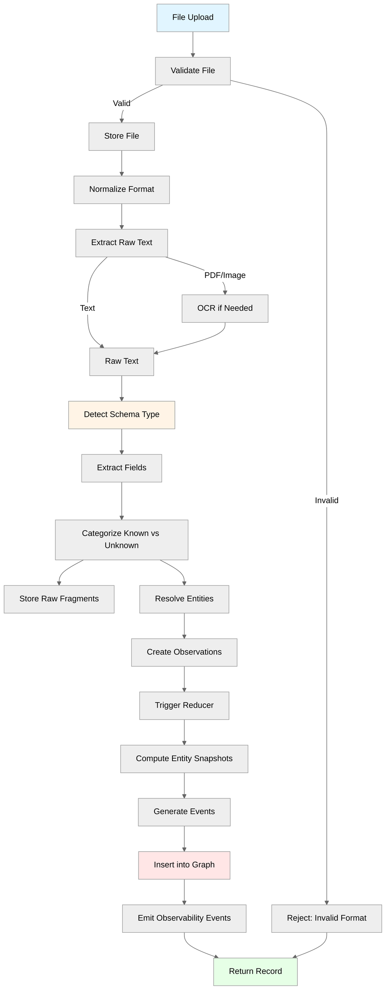

# Neotoma Ingestion Pipeline — File Processing and Truth Extraction

_(Deterministic Ingestion from Source to Memory Graph)_

---

## Purpose

This document defines the **canonical ingestion pipeline** that transforms user-provided inputs into structured truth. Neotoma supports two primary ingestion paths: **file uploads** (PDFs, images, text files) and **agent interactions** (contextual data provided via MCP `store_record` action). This document specifies:

- End-to-end ingestion flow (upload/agent interaction → extraction → graph)
- Deterministic extraction rules
- Schema detection and assignment
- Entity resolution and event generation
- Error handling and retry logic
- Testing requirements

Ingestion is the **primary entry point** for truth into Neotoma. The dual ingestion model—file uploads and agent interactions—enables incremental memory growth as users scale their agent usage, with contextual data from conversations persisting alongside extracted document data.

---

## Scope

This document covers:

- File upload and normalization
- Agent interaction ingestion via MCP `store_record` action
- OCR and text extraction (file uploads only)
- Schema detection
- Field extraction (rule-based, deterministic)
- Entity resolution
- Event generation
- Graph insertion

**Ingestion Paths:**

1. **File Upload:** Users explicitly upload PDFs, images, or text files through the UI or `upload_file` MCP action. Files undergo OCR, schema detection, and rule-based field extraction.

2. **Agent Interactions:** Users provide contextual data during conversations with ChatGPT, Claude, Cursor, or other MCP-compatible agents. Agents store this data via the `store_record` MCP action, enabling incremental memory growth that maintains accuracy and comprehensiveness as agent usage scales. This path bypasses file processing and directly creates records with user-provided properties.

Both paths feed into the same four-layer truth model (Document → Entity → Observation → Snapshot), ensuring unified memory regardless of ingestion source.

This document does NOT cover:

- UI implementation (see `docs/ui/`)
- Database schema (see `docs/subsystems/schema.md`)
- Search indexing (see `docs/subsystems/search/search.md`)
- MCP action specifications (see `docs/specs/MCP_SPEC.md`)

---

## 1. Ingestion Pipeline Overview



---

## 2. Step 1: File Upload and Validation

### 2.1 Supported File Types

**MVP:**

- PDF (`.pdf`)
- Images (`.jpg`, `.jpeg`, `.png`)
- Text (`.txt`)
- CSV/Spreadsheet (`.csv`, `.xlsx`) — row-level record creation

**Future:**

- Office docs (`.docx`)
- Email (`.eml`, `.msg`)
- HTML/Web content

**Special Case: Chat Transcripts**

Chat transcripts (e.g., logs exported from LLM apps like ChatGPT) require **non-deterministic interpretation** that violates the Truth Layer's determinism constraints. Per `docs/specs/GENERAL_REQUIREMENTS.md`:

- MVP provides a **separate CLI tool** (outside the ingestion pipeline) that can:
  - Non-deterministically convert raw chat exports into well-structured JSON files (one record per JSON object with explicit schema types and properties)
  - Feed the resulting JSON files into the standard deterministic ingestion path
- Neotoma's Truth Layer ingestion pipeline never performs non-deterministic interpretation of chat content
- See `docs/specs/MVP_FEATURE_UNITS.md` for chat-to-JSON CLI feature unit details

### 2.2 Validation Rules

```typescript
function validateFile(file: File): ValidationResult {
  // Check file size (max 50MB)
  if (file.size > 50 * 1024 * 1024) {
    return { valid: false, error: "FILE_TOO_LARGE" };
  }

  // Check MIME type
  const allowedTypes = [
    "application/pdf",
    "image/jpeg",
    "image/png",
    "text/plain",
  ];
  if (!allowedTypes.includes(file.type)) {
    return { valid: false, error: "UNSUPPORTED_FILE_TYPE" };
  }

  return { valid: true };
}
```

---

## 3. Step 2: File Storage and Normalization

### 3.1 File Storage

**Pattern:** Generate deterministic filename, store to S3 or local filesystem.

```typescript
function storeFile(file: File, userId: string): string {
  const fileHash = hashFile(file); // SHA-256
  const filename = `${userId}/${fileHash}.${file.extension}`;

  // Upload to storage
  await storage.upload(filename, file.buffer);

  return `https://storage.example.com/${filename}`;
}
```

**Determinism:** Same file content → same hash → same filename (deduplication).

---

### 3.2 Format Normalization

**Goal:** Convert all inputs to a common format for text extraction.

```typescript
function normalizeFile(file: File): Buffer {
  if (file.type === "application/pdf") {
    return file.buffer; // Already PDF
  }

  if (file.type.startsWith("image/")) {
    // Convert image to PDF page (preserves quality for OCR)
    return convertImageToPDF(file.buffer);
  }

  if (file.type === "text/plain") {
    return file.buffer; // Already text
  }

  throw new Error("UNSUPPORTED_FILE_TYPE");
}
```

---

## 4. Step 3: Text Extraction

### 4.1 PDF Text Extraction

```typescript
import pdfParse from "pdf-parse";

async function extractTextFromPDF(buffer: Buffer): Promise<string> {
  const data = await pdfParse(buffer);
  return data.text;
}
```

**Determinism:** Same PDF → same extracted text (pdf-parse is deterministic).

---

### 4.2 OCR for Images and Scanned PDFs

**When to use OCR:**

- Image files (`.jpg`, `.png`)
- PDFs with no extractable text

**OCR Provider (MVP):** Tesseract.js (local, deterministic)

```typescript
import Tesseract from "tesseract.js";

async function performOCR(imageBuffer: Buffer): Promise<string> {
  const {
    data: { text },
  } = await Tesseract.recognize(imageBuffer, "eng", {
    logger: () => {}, // Suppress logs
  });

  return text;
}
```

**Determinism:** Tesseract is deterministic for same image + same version.

**Critical MVP Constraints (per `docs/specs/GENERAL_REQUIREMENTS.md`):**

- **No randomness:** Given the same input image/PDF, OCR output text MUST be identical across runs
- **No model drift:** OCR models/versions are pinned; updates require explicit testing and version bump
- **Explicit failure handling:** OCR failures or low-confidence regions MUST be surfaced explicitly in metadata without fabricating or inferring missing content

**Implementation Requirements:**

- Pin Tesseract.js version in `package.json`
- Include OCR confidence scores in extraction metadata
- For low-confidence regions (confidence < 70%), mark as `ocr_low_confidence: true` in metadata rather than dropping text

---

## 5. Step 4: Schema Detection

### 5.1 MVP Extraction Approach: Rule-Based Only

**Critical MVP Constraint:** Neotoma MVP uses **only** rule-based extraction (regex, parsing). No LLM extraction per `docs/NEOTOMA_MANIFEST.md` determinism requirements.

**Post-MVP:** LLM-assisted extraction may be added with deterministic fallback for ambiguous cases.

### 5.2 Schema Detection Rules (Multi-Pattern Matching)

**Pattern:** Apply **multi-pattern matching** — a document must match **2 or more patterns** for a given type to be classified as that type.

**Fallback:** If no type matches 2+ patterns, classify as `document` (generic fallback).

**Rationale:** Multi-pattern matching increases detection precision and reduces false positives.

```typescript
// Multi-pattern detection for each application type
const SCHEMA_DETECTION_PATTERNS = {
  invoice: [
    /invoice\s*#?\s*:?\s*([A-Z0-9-]+)/i,
    /bill\s*to:/i,
    /amount\s*due:/i,
    /invoice\s*date/i,
    /payment\s*terms/i,
  ],
  receipt: [
    /receipt/i,
    /thank\s*you\s*for\s*your\s*purchase/i,
    /items?\s*purchased/i,
    /total\s*amount/i,
    /payment\s*method/i,
  ],
  transaction: [
    /transaction/i,
    /debit|credit/i,
    /account\s*number/i,
    /balance/i,
    /posted\s*date/i,
  ],
  statement: [
    /statement/i,
    /account\s*summary/i,
    /period\s*from|statement\s*period/i,
    /beginning\s*balance/i,
    /ending\s*balance/i,
  ],
  contract: [
    /agreement|contract/i,
    /parties|between/i,
    /effective\s*date/i,
    /terms\s*and\s*conditions/i,
    /signature/i,
  ],
  travel_document: [
    /itinerary|booking|reservation/i,
    /departure|arrival/i,
    /flight|train|hotel/i,
    /confirmation\s*number/i,
    /passenger|guest/i,
  ],
  identity_document: [
    /passport|driver.*license|national.*id/i,
    /document\s*number/i,
    /date\s*of\s*issue|issued/i,
    /expiry|expires/i,
    /nationality|country\s*of\s*issue/i,
  ],
  message: [/from:/i, /to:/i, /subject:/i, /sent:/i, /reply|forward/i],
};

function detectSchemaType(rawText: string): string {
  const matchCounts: Record<string, number> = {};

  // Count pattern matches for each type
  for (const [type, patterns] of Object.entries(SCHEMA_DETECTION_PATTERNS)) {
    matchCounts[type] = patterns.filter((pattern) =>
      pattern.test(rawText)
    ).length;
  }

  // Find types with 2+ matches
  const candidates = Object.entries(matchCounts)
    .filter(([_, count]) => count >= 2)
    .sort(([_, countA], [__, countB]) => countB - countA);

  // Return type with most matches, or fallback to 'document'
  if (candidates.length > 0) {
    return candidates[0][0];
  }

  return "document"; // Generic fallback
}
```

**Example: Invoice Detection**

```typescript
// Raw text from invoice PDF
const rawText = `
INVOICE #INV-2024-001
Bill To: Customer Corp
Amount Due: $1,500.00
Invoice Date: 2024-01-15
Payment Terms: Net 30
`;

// Pattern matches:
// ✅ /invoice\s*#?\s*:?\s*([A-Z0-9-]+)/i → Matches "INVOICE #INV-2024-001"
// ✅ /bill\s*to:/i → Matches "Bill To:"
// ✅ /amount\s*due:/i → Matches "Amount Due:"
// ✅ /invoice\s*date/i → Matches "Invoice Date:"
// ✅ /payment\s*terms/i → Matches "Payment Terms:"

// Result: 5 matches → type = 'invoice' ✅
```

**Example: Generic Document Fallback**

```typescript
// Raw text from generic document
const rawText = `
This is a research paper about machine learning techniques.
The paper discusses various approaches to neural networks.
`;

// No type matches 2+ patterns
// Result: type = 'document' (fallback) ✅
```

**Determinism:** Same text → same schema type (rule-based, deterministic pattern matching).

**Tier 1 ICP Alignment:** Schema detection supports AI-Native Operators (research, contracts, travel), Knowledge Workers (legal docs, research papers, client communications), and Founders (company docs, product docs, investor materials).

**Complete Patterns:** See [`docs/subsystems/record_types.md`](../record_types.md) section 7 for all detection patterns.

---

### 5.3 Schema Registry

**Location:** `src/config/record_types.ts`

**Two-Tier System:**

- **Application types** (this list): Used in code, database (`records.type`), MCP actions
- **Schema families** (`Financial`, `Productivity`, etc.): Used for documentation only

**Tier 1 ICP-aligned application types:**

```typescript
export const RECORD_TYPES = {
  // Finance
  INVOICE: 'invoice',
  RECEIPT: 'receipt',
  TRANSACTION: 'transaction',
  STATEMENT: 'statement',
  ACCOUNT: 'account',

  // Productivity
  NOTE: 'note',
  DOCUMENT: 'document',  // Generic fallback
  MESSAGE: 'message',
  TASK: 'task',
  PROJECT: 'project',
  EVENT: 'event',

  // Knowledge
  "contact",
  "dataset",

  // Legal/Compliance
  "contract",

  // Travel
  "travel_document",

  // Identity
  "identity_document",
];

// Fallback for unrecognized types
const FALLBACK_TYPE = "document";
```

**Schema-to-Fields Mapping:**

```typescript
export const SCHEMA_FIELDS = {
  invoice: ["invoice_number", "amount_due", "due_date", "vendor", "status"],
  receipt: [
    "receipt_number",
    "amount_total",
    "date",
    "merchant_name",
    "currency",
  ],
  contract: [
    "contract_number",
    "parties",
    "effective_date",
    "expiration_date",
    "status",
  ],
  document: ["title", "summary", "source", "tags", "link"],
  note: ["title", "content", "tags", "source", "summary"],
  message: ["thread_id", "sender", "recipient", "subject", "body", "sent_at"],
  travel_document: [
    "booking_reference",
    "departure_datetime",
    "arrival_datetime",
    "airline",
  ],
  identity_document: [
    "full_name",
    "document_number",
    "date_expiry",
    "nationality",
  ],
};
```

---

## 6. Step 5: Field Extraction

### 6.1 Rule-Based Extraction

**Pattern:** Use regex or parsing logic to extract fields deterministically.

```typescript
function extractFieldsForInvoice(rawText: string): any {
  return {
    schema_version: "1.0",
    invoice_number: extractInvoiceNumber(rawText),
    amount_due: extractAmount(rawText),
    currency: extractCurrency(rawText) || "USD",
    due_date: extractDate(rawText, "due|payable"),
    vendor: extractVendorName(rawText),
    status: extractPaymentStatus(rawText),
  };
}

function extractFieldsForContract(rawText: string): any {
  return {
    schema_version: "1.0",
    contract_number: extractContractNumber(rawText),
    parties: extractParties(rawText),
    effective_date: extractDate(rawText, "effective|commence"),
    expiration_date: extractDate(rawText, "expir|terminat"),
    status: extractContractStatus(rawText),
  };
}

function extractFieldsForDocument(rawText: string): any {
  return {
    schema_version: "1.0",
    title: extractTitle(rawText),
    summary: extractFirstSentence(rawText),
    source: "upload",
  };
}

function extractInvoiceNumber(text: string): string | null {
  const match = text.match(/invoice\s*#?\s*:?\s*([A-Z0-9-]+)/i);
  return match ? match[1] : null;
}

function extractAmount(text: string): number | null {
  const match = text.match(/total|amount\s*:?\s*\$?([0-9,]+\.?\d{0,2})/i);
  return match ? parseFloat(match[1].replace(",", "")) : null;
}
```

**Determinism:** Same text + same rules → same extracted fields.

**Implementation Note:** All extractors MUST use regex/parsing only. No LLM calls permitted in MVP.

---

### 6.2 Schema-Specific Extractors

Each schema type has a dedicated extractor function:

```typescript
const EXTRACTORS = {
  invoice: extractFieldsForInvoice,
  receipt: extractFieldsForReceipt,
  contract: extractFieldsForContract,
  travel_document: extractFieldsForTravelDocument,
  identity_document: extractFieldsForIdentityDocument,
  message: extractFieldsForMessage,
  note: extractFieldsForNote,
  document: extractFieldsForDocument,
};

function extractFields(rawText: string, schemaType: string): any {
  const extractor = EXTRACTORS[schemaType];
  if (!extractor) {
    // Fallback to generic document extraction
    return extractFieldsForDocument(rawText);
  }

  return extractor(rawText);
}
```

---

## 7. Step 6: Entity Resolution and Observation Creation

**Four-Layer Truth Model Context:** This section implements the middle layers of Neotoma's four-layer truth model (Document → Entity → Observation → Snapshot). After field extraction from documents, we:

1. **Resolve Entities** — Identify canonical entities (people, companies, locations)
2. **Create Observations** — Store granular, source-specific facts about entities
3. **Trigger Reducers** — Compute entity snapshots from observations using merge policies from schema registry
4. **Link to Graph** — Connect documents, entities, observations, and snapshots

See [`docs/architecture/architectural_decisions.md`](../../architecture/architectural_decisions.md) for the complete four-layer model rationale and [`docs/subsystems/observation_architecture.md`](../observation_architecture.md) for detailed observation patterns.

---

### 7.1 Entity Extraction

**Entities:** People, companies, locations mentioned in extracted fields.

```typescript
function extractEntities(properties: any, schemaType: string): Entity[] {
  const entities: Entity[] = [];

  // Use application types (invoice, receipt) not schema families (FinancialRecord)
  if (schemaType === "invoice" || schemaType === "receipt") {
    if (properties.vendor_name) {
      entities.push({
        entity_type: "company",
        raw_value: properties.vendor_name,
      });
    }
  }

  if (schemaType === "identity_document") {
    if (properties.full_name) {
      entities.push({
        entity_type: "person",
        raw_value: properties.full_name,
      });
    }
  }

  return entities;
}
```

---

### 7.2 Entity ID Generation (Deterministic)

```typescript
import { createHash } from "crypto";

function generateEntityId(entityType: string, canonicalName: string): string {
  const normalized = normalizeEntityValue(entityType, canonicalName);
  const hash = createHash("sha256")
    .update(`${entityType}:${normalized}`)
    .digest("hex");

  return `ent_${hash.substring(0, 24)}`;
}

function normalizeEntityValue(entityType: string, raw: string): string {
  let normalized = raw.trim().toLowerCase();

  if (entityType === "company") {
    normalized = normalized.replace(
      /\s+(inc|llc|ltd|corp|corporation)\.?$/i,
      ""
    );
  }

  return normalized;
}
```

**Determinism:** Same name → same ID (globally).

---

## 7.5 Observation Creation

**Overview:** After entity resolution, create observations — granular, source-specific facts extracted from documents. Observations are the intermediate layer between documents and entity snapshots in the four-layer truth model.

**Process:**

1. **Load Schema from Registry:** Fetch active schema version and field definitions from schema registry
2. **Categorize Fields:** Separate known fields (match schema) from unknown fields
3. **Store Raw Fragments:** Unknown fields stored in `raw_fragments` table with typed envelopes
4. **Create Observations:** For each entity identified:
   - Create observation with entity_id, entity_type, fields
   - Set specificity_score based on field confidence
   - Set source_priority based on document source
   - Reference schema_version for deterministic replay
   - Link to source_record_id
5. **Trigger Reducer:** Call reducer engine to compute entity snapshot using merge policies from schema registry
6. **Store Snapshot:** Reducer produces entity snapshot with provenance tracking

**Schema Registry Integration:** Observations reference the schema version from schema registry, enabling deterministic replay if schemas evolve. Reducers use merge policies configured in schema registry to resolve conflicts between multiple observations.

**Example:**

```typescript
async function createObservations(
  recordId: string,
  entities: Entity[],
  extractedFields: any,
  schemaType: string,
  schemaVersion: string
): Promise<void> {
  // Categorize known vs unknown fields
  const schema = await schemaRegistry.loadActiveSchema(schemaType);
  const { knownFields, unknownFields } = categorizeFields(
    extractedFields,
    schema
  );

  // Store raw fragments for unknown fields
  for (const [key, value] of Object.entries(unknownFields)) {
    await rawFragmentRepo.create({
      record_id: recordId,
      fragment_key: key,
      fragment_value: value,
      fragment_envelope: { type: typeof value, confidence: "medium" },
    });
  }

  // Create observations for each entity
  for (const entity of entities) {
    const observation = await observationRepo.create({
      entity_id: entity.id,
      entity_type: entity.type,
      schema_version: schemaVersion,
      source_record_id: recordId,
      observed_at: new Date(),
      specificity_score: calculateSpecificity(entity, knownFields),
      source_priority: calculatePriority(recordId),
      fields: extractEntityFields(knownFields, entity),
    });

    // Trigger reducer to compute snapshot
    await reducerEngine.computeSnapshot(entity.id);
  }
}
```

**Related Documents:**

- [`docs/architecture/architectural_decisions.md`](../../architecture/architectural_decisions.md) — Four-layer truth model
- [`docs/subsystems/observation_architecture.md`](../observation_architecture.md) — Complete observation architecture
- [`docs/subsystems/reducer.md`](../reducer.md) — Reducer merge strategies
- [`docs/subsystems/schema_registry.md`](../schema_registry.md) — Schema registry patterns and merge policies

---

## 8. Step 7: Event Generation

### 8.1 Event Extraction

**Events:** Timeline events derived from date fields.

```typescript
function generateEvents(
  recordId: string,
  properties: any,
  schemaType: string
): Event[] {
  const events: Event[] = [];
  const dateFields = getDateFields(schemaType);

  for (const fieldName of dateFields.sort()) {
    const dateValue = properties[fieldName];
    if (!dateValue) continue;

    const eventType = mapFieldToEventType(fieldName, schemaType);
    const eventId = generateEventId(recordId, fieldName, dateValue);

    events.push({
      id: eventId,
      event_type: eventType,
      event_timestamp: dateValue,
      source_record_id: recordId,
      source_field: fieldName,
    });
  }

  return events;
}

function mapFieldToEventType(fieldName: string, schemaType: string): string {
  // Use application types (invoice, travel_document) not schema families
  if (schemaType === "invoice") {
    if (fieldName === "date_issued") return "InvoiceIssued";
    if (fieldName === "date_due") return "InvoiceDue";
  }

  if (schemaType === "travel_document") {
    if (fieldName === "departure_datetime") return "FlightDeparture";
    if (fieldName === "arrival_datetime") return "FlightArrival";
  }

  return "GenericEvent";
}
```

---

## 9. Step 8: Graph Insertion

### 9.1 Transactional Insert

```typescript
async function insertRecordAndGraph(
  record: Record,
  entities: Entity[],
  events: Event[]
): Promise<string> {
  return await db.transaction(async (tx) => {
    // Insert record
    const recordId = await tx.insert("records", record);

    // Insert entities (if not exist)
    for (const entity of entities) {
      await tx.upsert("entities", entity);
      await tx.insert("record_entity_edges", {
        record_id: recordId,
        entity_id: entity.id,
      });
    }

    // Insert events
    for (const event of events) {
      await tx.insert("events", event);
      await tx.insert("record_event_edges", {
        record_id: recordId,
        event_id: event.id,
      });
    }

    return recordId;
  });
}
```

**Determinism:** Same inputs → same graph structure.

---

## 10. Error Handling

### 10.1 Error Types

| Error Code              | Meaning                 | Retry? |
| ----------------------- | ----------------------- | ------ |
| `FILE_TOO_LARGE`        | File exceeds size limit | No     |
| `UNSUPPORTED_FILE_TYPE` | File type not supported | No     |
| `OCR_FAILED`            | OCR processing failed   | Yes    |
| `EXTRACTION_FAILED`     | Field extraction failed | No     |
| `DB_INSERT_FAILED`      | Database write failed   | Yes    |

### 10.2 Retry Logic

```typescript
async function ingestFileWithRetry(file: File): Promise<Record> {
  const maxRetries = 3;
  let attempt = 0;

  while (attempt < maxRetries) {
    try {
      return await ingestFile(file);
    } catch (error) {
      if (isTransientError(error) && attempt < maxRetries - 1) {
        attempt++;
        await sleep(1000 * attempt); // Exponential backoff
      } else {
        throw error;
      }
    }
  }
}
```

---

## Agent Instructions

### When to Load This Document

Load `docs/subsystems/ingestion/ingestion.md` when:

- Implementing file upload or ingestion logic
- Adding new schema types or field extractors
- Modifying entity resolution or event generation
- Debugging ingestion errors
- Working with OCR or text extraction

### Required Co-Loaded Documents

- `docs/NEOTOMA_MANIFEST.md` (determinism, immutability)
- `docs/architecture/determinism.md` (deterministic extraction)
- `docs/subsystems/schema.md` (schema structure)
- `docs/subsystems/ingestion/state_machines.md` (ingestion states)

### Constraints Agents Must Enforce

1. **Extraction MUST be deterministic** (rule-based, no LLM)
2. **Entity IDs MUST be hash-based**
3. **Event IDs MUST be hash-based**
4. **All ingestion MUST be transactional**
5. **Same file → same record_id** (via content hash)
6. **All errors MUST use ErrorEnvelope**

### Forbidden Patterns

- LLM-based extraction (MVP)
- Nondeterministic entity IDs
- Non-transactional graph inserts
- Skipping error handling
- Mutable extraction rules

### Validation Checklist

- [ ] Extraction is rule-based and deterministic
- [ ] Entity IDs are hash-based
- [ ] Event IDs are hash-based
- [ ] Graph insertion is transactional
- [ ] Error handling covers all failure modes
- [ ] Tests cover all schema types
