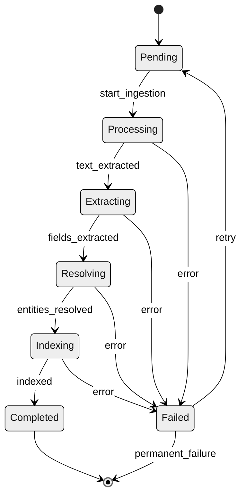

# Neotoma Ingestion State Machine
*(Canonical States, Transitions, and UI Mapping)*

---

## Purpose

Defines the state machine for ingestion processes, including all states, transitions, error handling, and UI representation.

---

## Ingestion State Machine



## States

| State | Description | Terminal | UI Display |
|-------|-------------|----------|------------|
| `Pending` | Queued for processing | No | "Queued..." |
| `Processing` | Text extraction in progress | No | "Processing..." |
| `Extracting` | Field extraction | No | "Extracting..." |
| `Resolving` | Entity resolution | No | "Resolving..." |
| `Indexing` | Search index update | No | "Indexing..." |
| `Completed` | Successfully ingested | Yes | "Complete" |
| `Failed` | Error occurred | Yes* | "Failed" + error message |

*Failed state can transition to Pending on retry

## Testing

```typescript
test('ingestion state transitions', async () => {
  const record = await createRecord({status: 'pending'});
  expect(record.status).toBe('pending');
  
  await startIngestion(record.id);
  expect(await getStatus(record.id)).toBe('processing');
  
  // ... complete pipeline ...
  expect(await getStatus(record.id)).toBe('completed');
});
```

---

## Agent Instructions

Load when implementing ingestion status tracking or UI status displays.

Required co-loaded: `docs/subsystems/ingestion/ingestion.md`, `docs/architecture/consistency.md`


