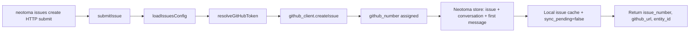
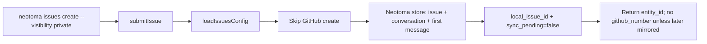
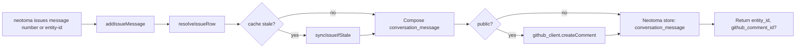

# Issues

The Issues subsystem is the operator-canonical pipeline for collaborative bug, doc, and feature tracking, backed by Neotoma `issue` entities (and their `conversation` threads) plus an optional GitHub Issues mirror for discoverability. It replaces the deprecated custom feedback pipeline (see [`agent_feedback_pipeline.md`](agent_feedback_pipeline.md) for migration and historical context).

## Scope

This document covers:

- The `issue` entity schema and its companion `conversation` / `conversation_message` rows.
- The dual-write flow (Neotoma + optional GitHub) implemented in `src/services/issues/`.
- GitHub thread keying and attribution backfill.
- Transports and parity expectations for issues (`neotoma issues …`, MCP issue tools, HTTP routes where present); see [Transports (CLI, MCP, HTTP)](#transports-cli-mcp-http).

It does NOT cover:

- The legacy custom feedback pipeline (deprecated; see [`agent_feedback_pipeline.md`](agent_feedback_pipeline.md)).
- Generic external-entity submission for non-issue types (see [`entity_submission.md`](entity_submission.md)).
- The Inspector `/issues` UI.

## Purpose

Operators of Neotoma instances need a single, conversational issue tracker that:

- Stores every issue and reply as immutable Neotoma observations (preserving provenance, attribution, and replay).
- Optionally mirrors public issues into a GitHub repo so contributors and agents can collaborate using familiar tooling.
- Avoids storing PATs in config — authentication uses the local `gh` CLI, a configured machine agent identity (`github_auth: "bot"` in config — see [Authentication](#authentication)), or an explicit env-supplied token.
- Treats Neotoma as the canonical store and GitHub as a mirror, so loss of GitHub access never loses issue history.

## Invariants

1. **Neotoma is canonical.** Every issue row exists in Neotoma first; GitHub numbers are written back as a `github_number` field. Local-only issues (`visibility: "private"`) never touch GitHub.
2. **Public issues round-trip.** Public submissions push to GitHub before storing locally so the canonical row carries `github_number`/`github_url` from creation.
3. **Threads are conversations.** Every issue has a paired `conversation`; the issue body is `conversation_message:<turn_key>`. Comments append messages with deterministic `turn_key` derived from the GitHub comment id (or local id for private issues).
4. **No PAT in config.** `gh_auth.resolveGitHubToken` resolves credentials in this order: env (`NEOTOMA_GH_TOKEN`), `gh auth token` shell-out, configured bot. Tokens are cached in-memory only.
5. **Attribution preserved.** GitHub authors are recorded as `external_actor` rows via `external_actor_builder.ts`. Reporter environment fields (`reporter_git_sha`, `reporter_git_ref`, etc.) are stored on the **`issue`** snapshot at creation (see [Schema](#schema)); per-message provenance uses `conversation_message` attribution and GitHub comment metadata when mirrored.
6. **Sync staleness bounded.** `syncIssueIfStale` skips a roundtrip when the cached `last_synced_at` is fresher than `IssuesConfig.sync_staleness_ms` (default 300000 ms / 5 min).

## Schema

Defined in `seed_schema.ts`. **Identity / deduplication:** `seedIssueSchema` sets `canonical_name_fields` to **`["github_number", "repo"]` (composite)** plus **`title`** so the reducer merges public GitHub-backed issues into one row per **repo + issue number** (and disambiguates title-only collisions). **`github_url`** is stored for humans and links but is not the canonical_name key in the seeded schema — it tracks the same logical issue as `github_number` + `repo`. For **private** issues (no GitHub number), identity uses a derived **`local_issue_id`** (see `localIssueId()` in `github_thread_keys.ts`) so local-only threads still have a deterministic key.

Key fields:

- `title`, `body`, `status` (`open`/`closed`), `labels[]`.
- `github_number`, `github_url`, `repo` — populated for public issues.
- `visibility` — `public` | `private`.
- `author` — GitHub login or operator's `author_alias`.
- `created_at`, `closed_at`, `last_synced_at`.
- `sync_pending` — true between local store and successful GitHub roundtrip.
- Reporter provenance (issue snapshot): `reporter_git_sha`, `reporter_git_ref`, `reporter_channel`, `reporter_app_version`, `reporter_ci_run_id`, `reporter_patch_source_id`.

**Reporter provenance: issue vs messages (v0.12+).** Reporter env is now captured at **two** layers:

1. **Issue snapshot** — populated at submit time. Fields: `reporter_git_sha`, `reporter_git_ref`, `reporter_channel`, `reporter_app_version`, `reporter_ci_run_id`, `reporter_patch_source_id`. **Required**: `submit_issue` rejects submissions that omit both `reporter_git_sha` and `reporter_app_version` with `error_code: ERR_REPORTER_ENVIRONMENT_REQUIRED`. The rejection envelope returns `details.acceptable_field_groups: [["reporter_git_sha"], ["reporter_app_version"]]` so callers can retry with the right alternative. See `tests/contract/legacy_payloads/v0.12.x/issues_submit_without_reporter_env` for the contract fixture.
2. **`conversation_message`** — optional but **soft-required on public threads**. Schema v1.3 adds `reporter_git_sha`, `reporter_git_ref`, `reporter_channel`, `reporter_app_version` on the message row. `add_issue_message` accepts the same fields; on public threads, missing both `reporter_git_sha` and `reporter_app_version` emits a server-side warning (the message still persists). Agents (and the `process-issues` skill) MUST populate these on every message they author so each debugging step records the build it was authored against.

When a follow-up validates from a different checkout, prefer populating the message-level reporter env over `correct`-ing the issue snapshot. `correct` on the issue is still appropriate when the originating environment changes (e.g. the reporter switched to a newer release).

The companion `conversation` uses `thread_kind: "multi_party"` (operators, reporters, and agents may all participate; see `submitIssue` / `syncIssuesFromGitHub` / `neotoma_client` writers) and `title` mirroring the issue title; `conversation_message` rows hold issue body and comments.

## Components

- `index.ts` — public re-exports.
- `seed_schema.ts` — `ISSUE_ENTITY_TYPE`, `seedIssueSchema`, `ISSUE_FIELD_SPECS`. Idempotent boot-time registration.
- `config.ts` — `loadIssuesConfig`, `updateIssuesConfig`, `isIssuesConfigured`, `IssuesConfig` (`github_auth`, `repo`, `reporting_mode`, `sync_staleness_ms`, `target_url`, `author_alias`).
- `gh_auth.ts` — token resolution and cache; `verifyGhAuth` shells out to `gh auth status`.
- `github_client.ts` — thin wrappers over `gh api repos/...` for issues and comments (list, get, create, comment, close).
- `github_issue_thread.ts` — derives the `conversation_id` for a public issue (`githubIssueThreadConversationId`) and for a private issue (`localIssueThreadConversationId`).
- `github_thread_keys.ts` — derives `turn_key` for issue body, GitHub comments, and local-only comments. Stable across replays.
- `external_actor_builder.ts` — converts GitHub issue / comment authors into `external_actor` payloads consumed by `request_context.ts`.
- `attribution_backfill.ts` — operator script entry point that walks existing `issue` / `conversation_message` rows and populates `external_actor` rows for legacy data that pre-dates attribution.
- `inspector_bulk.ts` — bulk reads used by the Inspector list / detail pages.
- `neotoma_client.ts` — outbound HTTP client for cross-instance issue submission (`target_url`); see [`peer_sync.md`](peer_sync.md) for the broader peer surface.
- `sync_issues_from_github.ts` — `syncIssuesFromGitHub` (GitHub → Neotoma, full or `since`-bounded), `syncIssueIfStale` (single-issue cache check), `isSyncStale`. Lives under `src/services/issues/` alongside peer / cross-instance sync docs (`docs/subsystems/peer_sync.md`) but is GitHub mirror-specific.
- `issue_operations.ts` — high-level orchestrators: `submitIssue`, `addIssueMessage`, `getIssueStatus`, `resolveIssueRow`. These are what MCP, HTTP (`src/actions.ts`), and the CLI (via the API client) call.

## Submission flow (public)

For private submissions, the GitHub push is skipped entirely and `local_issue_id` provides the canonical identity.

## Submission flow (private)

## Comment flow

`turn_key` derivation lives in `github_thread_keys.ts`:

- `githubIssueBodyTurnKey(issue_number)` for the issue body.
- `githubIssueCommentTurnKey(issue_number, comment_id)` for GitHub comments.
- `localIssueBodyTurnKey(local_issue_id)` and `localIssueCommentTurnKey(local_issue_id, monotonic_index)` for private issues.

These keys are stable so `syncIssuesFromGitHub` can replay GitHub state without minting duplicate `conversation_message` rows.

**Why `repo` appears in `localIssueCommentTurnKey(repo, issueId, …)`:** private threads use a prefix `local:{repo}:{issueId}` (see `localIssueThreadPrefix` in `github_thread_keys.ts`). Including **`IssuesConfig.repo`** keeps turn keys namespaced when the same Neotoma user runs multiple issue configs or when `local_issue_id` strings could otherwise collide across repos. It is not peer-sync “instance sync” — it is only a deterministic string prefix for conversation message identity.

## Mirror ingest (sync)

Neotoma can **pull** state from the configured **issue mirror** (today: GitHub Issues via `github_client`) into local `issue` / `conversation` / `conversation_message` rows. This is mirror ingest, not peer sync; see [`peer_sync.md`](peer_sync.md) for cross-instance replication.

Service entrypoint: `syncIssuesFromGitHub({ since?, state?, labels? })`:

1. List remote issues matching the filter (mirror API).
2. For each issue, list remote comments.
3. For each issue + comments, derive a deterministic `IssueEntity` payload and the corresponding `conversation_message` rows.
4. Store via `ops.store` with idempotency keys derived from the remote ids so re-runs are safe.
5. Update `last_synced_at` and clear `sync_pending` when the mirror roundtrip succeeds.

`syncIssueIfStale({ entity_id })` performs the same flow scoped to a single issue and is invoked transparently by `getIssueStatus` / `addIssueMessage` whenever the cache is older than `sync_staleness_ms`.

**MCP vs CLI vs HTTP:** `sync_issues` (MCP), `POST /issues/sync`, and `neotoma issues sync` all call `syncIssuesFromGitHub` in `src/services/issues/sync_issues_from_github.ts` via the HTTP handlers in `src/actions.ts` (CLI uses the typed API client).

## Mirror credentials

When `visibility: "public"` or when read/append paths touch the mirror, Neotoma needs credentials for the **configured mirror** (today: GitHub). Private Neotoma-only issues (`visibility: "private"`) do not use this stack for create.

`gh_auth.resolveGitHubToken` order:

1. `NEOTOMA_GH_TOKEN` env var (CI / bot deployments).
2. `gh auth token` shell-out (developer machines using the GitHub CLI).
3. Configured machine agent — `IssuesConfig.github_auth = "bot"` (literal enum) plus a server-side credential resolver registered out-of-band.
4. Otherwise, throw — public issue actions that require the mirror cannot proceed.

`isGhInstalled`, `isGhAuthenticated`, `verifyGhAuth` are exposed for `neotoma doctor` so operators can diagnose mirror setup quickly.

## Transports (CLI, MCP, HTTP)

Repo change guardrails expect MCP, CLI, and HTTP surfaces to stay traceably aligned where an operation exists on more than one transport ([`docs/architecture/change_guardrails_rules.mdc`](../architecture/change_guardrails_rules.mdc), `src/shared/contract_mappings.ts`).

### MCP

Canonical programmatic surface for full issue lifecycle (see [`docs/specs/MCP_SPEC.md`](../specs/MCP_SPEC.md)):

- `submit_issue({ title, body, labels?, visibility?, reporter_git_sha?, ... })`.
- `add_issue_message({ entity_id, body, guest_access_token? })` — optional `guest_access_token` when the local row mirrors a remote operator issue and the token is not stored on the issue snapshot.
- `get_issue_status({ entity_id, skip_sync?, guest_access_token? })` — optional `guest_access_token` for the same read-through case.
- `sync_issues({ since?, state?, labels? })`.
- `bulk_close_issues({ entity_ids: string[], reason?: string })` — closes multiple `issue` entities in one call, mirrors `POST /issues/bulk_close`, and is what the Inspector bulk-close action drives.
- `bulk_remove_issues({ entity_ids: string[], reason?: string })` — soft-deletes multiple `issue` entities (via `deleteEntity` observations), mirrors `POST /issues/bulk_remove`. Use this for triage clean-up; restoration goes through `restore_entity`, not a bulk-restore tool.

### CLI

Operator and agent backup (see `openapi.yaml` operationIds `issuesSubmit`, `issuesAddMessage`, `issuesGetStatus`, `issuesSync`):

- `neotoma issues create --title <t> --body <b> [--visibility public|private] [--labels csv]` — calls `POST /issues/submit` → `submitIssue`.
- `neotoma issues message [number] --body <b>` (GitHub issue number) or `neotoma issues message --entity-id <id> --body <b>` — calls `POST /issues/add_message` → `addIssueMessage`.
- `neotoma issues status --entity-id <id> [--skip-sync] [--guest-access-token <t>]` — calls `POST /issues/status` → `getIssueStatus`.
- `neotoma issues list [--state open|closed|all] [--labels csv] [--since <iso>]` — GitHub list only (no MCP twin).
- `neotoma issues sync [--since <iso>] [--state ...] [--labels csv]` — calls `POST /issues/sync` → `syncIssuesFromGitHub`.
- `neotoma issues config [--repo <slug>] [--mode proactive|consent|off] [--sync-staleness-ms <n>]`.
- `neotoma issues auth` — runs `verifyGhAuth` and reports the resolved auth method.

### HTTP

First-class HTTP routes (see `openapi.yaml` / `contract_mappings.ts`); each `/issues/*` route is also registered under `/api/issues/*` for same-origin proxies:

- `POST /issues/submit` — `submitIssue` (MCP `submit_issue` parity).
- `POST /issues/status` — `getIssueStatus` (MCP `get_issue_status` parity).
- `POST /issues/sync` — `syncIssuesFromGitHub` (MCP `sync_issues` parity).
- `POST /issues/add_message` — `addIssueMessage` (MCP `add_issue_message` parity).
- `POST /issues/bulk_close` — `bulkCloseIssues` (MCP `bulk_close_issues` parity). Accepts `{ entity_ids: string[], reason?: string }`.
- `POST /issues/bulk_remove` — `bulkRemoveIssues` (MCP `bulk_remove_issues` parity). Soft-delete via `deleteEntity` observations; restoration goes through `restore_entity`.

## Operations

- Reporting modes (`IssuesConfig.reporting_mode`, overridable with `NEOTOMA_ISSUES_REPORTING_MODE`): **`consent` (default)** — obtain explicit user approval before each `submit_issue` unless the user or operator has switched to another mode; `proactive` — agents may file without asking; `off` — only file when the user explicitly requests it. Persisted via `neotoma issues config --mode …`.
- Default `target_url`: `https://neotoma.markmhendrickson.com` when neither env nor stored config overrides it.
- Backfill attribution on legacy issues: `npx tsx -e "import('./src/services/issues/attribution_backfill.ts').then(m => m.runAttributionBackfill())"` (or wire into the operator's runbook).

## Testing

- Unit: `src/services/issues/issue_operations.test.ts`, `src/services/issues/neotoma_client.test.ts`.
- Integration: `tests/integration/cross_instance_issues.test.ts` exercises the dual-write + cross-instance forwarding.
- Coverage guard: `tests/cli/cli_command_coverage_guard.test.ts` ensures every `neotoma issues …` subcommand is registered.

## Related

- [`agent_feedback_pipeline.md`](agent_feedback_pipeline.md) — migration table for legacy feedback rows.
- [`feedback_neotoma_forwarder.md`](feedback_neotoma_forwarder.md) — forwarding bridge that routes legacy submissions into the new pipeline.
- [`entity_submission.md`](entity_submission.md) — the generalized submission service that issues predates and that now defers issue-specific flows back here.
- [`agent_attribution_integration.md`](agent_attribution_integration.md) — external actor attribution model.
- [`docs/plans/observer_wire_feedback_channel.md`](../plans/observer_wire_feedback_channel.md) — design history.
