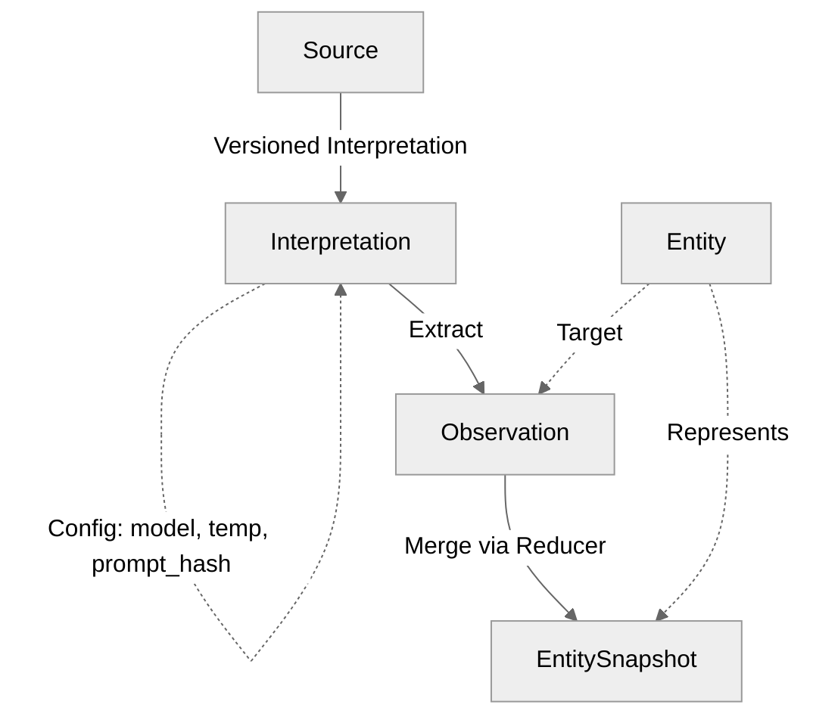

# Neotoma Observation Architecture — Three-Layer Truth Model

**Authoritative Vocabulary:** [`docs/vocabulary/canonical_terms.md`](../vocabulary/canonical_terms.md)

## Scope

This document covers:
- Three-layer truth model overview
- Observation lifecycle
- Snapshot computation flow
- Provenance tracking
- Integration with existing event-sourcing foundation
This document does NOT cover:
- Reducer implementation details (see `docs/subsystems/reducer.md`)
- Schema registry patterns (see `docs/subsystems/schema_registry.md`)
- Relationship patterns (see `docs/subsystems/relationships.md`)
## 1. Three-Layer Truth Model
### 1.1 Model Overview
Neotoma implements a three-layer truth model:
```
Source → Interpretation (with config) → Observation → EntitySnapshot
```
**Layers:**
1. **[Source](../vocabulary/canonical_terms.md#source)** — content-addressed raw storage (files, external URLs, structured JSON)
2. **[Interpretation](../vocabulary/canonical_terms.md#interpretation)** — versioned interpretation attempt with config logging (provider, model, temperature, prompt_hash)
3. **[Observation](../vocabulary/canonical_terms.md#observation)** — granular, source-specific facts [extracted](../vocabulary/canonical_terms.md#extraction) via [interpretation](../vocabulary/canonical_terms.md#interpretation)
4. **[Snapshot](../vocabulary/canonical_terms.md#snapshot)** — deterministic [reducer](../vocabulary/canonical_terms.md#reducer) output representing current truth
**Key Principle:** Each [observation](../vocabulary/canonical_terms.md#observation) links to both its `source_id` (what raw content) and `interpretation_id` (how it was [extracted](../vocabulary/canonical_terms.md#extraction)), enabling full [provenance](../vocabulary/canonical_terms.md#provenance) and auditability without claiming replay determinism.
**Model Diagram:**

### 1.2 Key Benefits
- **Decouples ingestion order from truth:** Observations can arrive in any order
- **Enables multi-source merging:** Multiple sources contribute observations about same entity
- **Provides full provenance:** Every snapshot field traces to source AND interpretation config
- **Supports deterministic merging:** Reducers compute snapshots deterministically
- **Enables reinterpretation:** Same source can be reinterpreted with new models; observations immutable
- **Auditability without replay determinism:** Interpretation config logged; outputs may vary
See [`docs/architecture/architectural_decisions.md`](../architecture/architectural_decisions.md) for complete architectural rationale and [`docs/subsystems/sources.md`](./sources.md) for source and interpretation details.
## 2. Observation Lifecycle
### 2.1 Observation Creation
Observations are created during ingestion:
1. **Extract Fields:** Use schema-specific extraction rules
2. **Categorize Fields:** Separate known (match schema) vs unknown (raw_fragments)
3. **Resolve Entities:** Identify entities mentioned in extracted fields (user-scoped)
4. **Create Observations:** For each entity, create observation with:
   - `entity_id` — target entity
   - `entity_type` — entity type
   - `schema_version` — schema version used
   - `source_id` — [source](../vocabulary/canonical_terms.md#source) that produced this [observation](../vocabulary/canonical_terms.md#observation)
   - `interpretation_id` — [interpretation](../vocabulary/canonical_terms.md#interpretation) that created this
   - `observed_at` — observation timestamp
   - `specificity_score` — how specific this observation is
   - `source_priority` — priority of source
   - `fields` — granular facts
   - `user_id` — user who owns this observation
**Source Priority Levels:**
| Source | Priority | Use Case |
|--------|----------|----------|
| AI [interpretation](../vocabulary/canonical_terms.md#interpretation) | 0 | Automated [extraction](../vocabulary/canonical_terms.md#extraction) |
| Unified `ingest` (structured) | 100 | Agent-provided facts |
| `correct()` | 1000 | User corrections (always wins) |
**Example:**
```typescript
const observation = {
  entity_id: "ent_acme_corp",
  entity_type: "company",
  schema_version: "1.0",
  source_id: "src_abc123",
  interpretation_id: "run_xyz",
  observed_at: new Date("2024-01-15"),
  specificity_score: 0.9,
  source_priority: 0,                // AI interpretation
  fields: {
    name: "Acme Corp",
    address: "123 Main St",
    tax_id: "12-3456789",
  },
  user_id: "user_123",
};
```
### 2.2 Correction Observations
User corrections are modeled as high-priority observations:
```typescript
const correctionObservation = {
  entity_id: "ent_acme_corp",
  entity_type: "company",
  schema_version: "1.0",
  source_id: null,                   // No source for corrections
  interpretation_id: null,       // No interpretation
  observed_at: new Date(),
  specificity_score: 1.0,            // Maximum specificity
  source_priority: 1000,             // Corrections always win
  fields: {
    name: "Acme Corporation",        // Corrected value
  },
  user_id: "user_123",
};
```
**Key property:** Corrections persist across reinterpretation. Even if a source is reinterpreted with a new model, the correction observation remains and continues to override AI-extracted values.
### 2.2 Observation Storage
Observations are stored in `observations` table:
- Immutable once created
- Multiple observations can exist for same entity
- Indexed by `entity_id` and `observed_at`
- Linked to [source](../vocabulary/canonical_terms.md#source) via `source_material_id`
See [`docs/subsystems/schema.md`](./schema.md) for database schema details.
### 2.3 Observation Querying
**Find Observations for Entity:**
```typescript
async function getObservations(entityId: string): Promise<Observation[]> {
  return await observationRepo.findByEntity(entityId);
}
```
**Find Observations by [Source](../vocabulary/canonical_terms.md#source):**
```typescript
async function getObservationsBySource(
  sourceId: string
): Promise<Observation[]> {
  return await observationRepo.findBySource(sourceId);
}
```
## 3. Entity Snapshot Computation Flow
### 3.1 Reducer Execution
Snapshots are computed by reducers:
1. **Load Observations:** Fetch all observations for entity
2. **Load Schema:** Get schema definition and merge policies
3. **Sort Observations:** Sort by `observed_at DESC` (deterministic)
4. **Apply Merge Policies:** For each field, apply merge strategy
5. **Store Snapshot:** Save snapshot with provenance
**Flow Diagram:**

### 3.2 Merge Strategies
Reducers support multiple merge strategies:
- **Last Write Wins:** Most recent observation wins
- **Highest Priority:** Highest `source_priority` wins
- **Most Specific:** Highest `specificity_score` wins
- **Merge Array:** Combine all values into array
See [`docs/subsystems/reducer.md`](./reducer.md) for complete merge strategy details.
### 3.3 Entity Snapshot Storage
Snapshots are stored in `entity_snapshots` table:
- Computed deterministically from observations
- Include provenance mapping (field → observation_id)
- Cached and recomputed on new observations
- Indexed by `entity_id` (primary key)
## 4. [Provenance](../vocabulary/canonical_terms.md#provenance) Tracking
### 4.1 [Provenance](../vocabulary/canonical_terms.md#provenance) Chain
Every [entity snapshot](../vocabulary/canonical_terms.md#entity-snapshot) field traces through the full chain:
```
Snapshot Field → Observation → Interpretation (with config) → Source
```
**Example:**
```
snapshot.vendor_name = "Acme Corp"
  → observation_123
    → interpretation_456 (gpt-4o-mini, temp=0, prompt_v3)
      → source_789 (invoice.pdf, SHA-256: abc123...)
```
**Key Fields:**
- `observation.source_id` — links to [source](../vocabulary/canonical_terms.md#source)
- `observation.interpretation_id` — links to [interpretation](../vocabulary/canonical_terms.md#interpretation)
- `interpretation.interpretation_config` — model, temperature, prompt_hash, code_version
This enables questions like:
- "What raw content produced this observation?" → `source_id`
- "How was this observation extracted?" → `interpretation_id` → `interpretation_config`
- "Can I replay this extraction?" → No (AI is non-deterministic), but config is logged for audit
### 4.2 Provenance Query
**Get Field Provenance:**
```typescript
async function getFieldProvenance(
  entityId: string,
  field: string
): Promise<ProvenanceChain> {
  const snapshot = await snapshotRepo.findById(entityId);
  const observationId = snapshot.provenance[field];
  const observation = await observationRepo.findById(observationId);
  
  // Get interpretation (if AI-derived)
  const interpretation = observation.interpretation_id
    ? await interpretationRepo.findById(observation.interpretation_id)
    : null;
  
  // Get source
  const source = await sourceRepo.findById(observation.source_id);
  return {
    field,
    value: snapshot.snapshot[field],
    observation,
    interpretation,  // Includes config: model, temperature, prompt_hash
    source,             // Includes content_hash, storage_url
  };
}
```
### 4.3 Timeline View (Primary Historical Inspection)
Provenance enables timeline view—the primary way to understand entity evolution:
- Shows how entity properties changed over time as new observations arrived
- Tracks corrections and updates across multiple documents
- Shows source priority and specificity
- Enables "why did this value change?" queries
- **Historical entity state is more important than record historical state** — entities are the primary unit of truth that agents query and reason about
## 5. Integration with Event-Sourcing
### 5.1 Event-Sourcing Foundation
Neotoma's event-sourcing foundation (FU-050) provides:
- `state_events` table (append-only log)
- Reducer infrastructure (apply events → compute state)
- Historical replay capability
- Event emission patterns
### 5.2 Observation Integration
Observations integrate with event-sourcing:
- **Observation Creation:** Emits `ObservationCreated` event
- **Snapshot Computation:** Emits `SnapshotComputed` event
- **Historical Replay (Primary):** Observations can be replayed to recompute entity snapshots at any point in time—this is the primary historical inspection capability since entities evolve over time as new observations arrive
**Event Emission:**
```typescript
async function createObservation(observation: Observation): Promise<void> {
  await observationRepo.create(observation);
  // Emit event (integrates with FU-050)
  await eventRepo.emit({
    event_type: "ObservationCreated",
    aggregate_id: observation.entity_id,
    aggregate_type: "Entity",
    payload: observation,
    timestamp: new Date(),
  });
  // Trigger reducer
  await reducerEngine.computeSnapshot(observation.entity_id);
}
```
### 5.3 Repository Abstractions
Observations use repository abstractions (FU-051):
- `ObservationRepository` — observation storage
- `SnapshotRepository` — snapshot storage
- Domain logic isolated from storage
## 6. Multi-Source Entity Resolution
### 6.1 Multiple Sources
Observations enable multi-source entity resolution:
- Multiple documents can contribute observations about same entity
- Reducers merge observations deterministically
- Provenance tracks which source contributed each field
**Example:**
```
Entity: Acme Corp
Observation 1 (from invoice.pdf):
  - name: "Acme Corp"
  - address: "123 Main St"
  - tax_id: "12-3456789"
Observation 2 (from contract.pdf):
  - name: "Acme Corporation"
  - address: "123 Main Street"
  - contact_email: "info@acme.com"
Snapshot (merged):
  - name: "Acme Corp" (from observation 1, highest priority)
  - address: "123 Main St" (from observation 1, last write)
  - tax_id: "12-3456789" (from observation 1)
  - contact_email: "info@acme.com" (from observation 2)
```
### 6.2 Conflict Resolution
Reducers resolve conflicts via merge policies:
- **Priority-based:** Higher `source_priority` wins
- **Specificity-based:** Higher `specificity_score` wins
- **Time-based:** Most recent observation wins
- **Array merge:** Combine all values
## 7. Raw Fragments and Schema Discovery
### 7.1 Unknown Fields
Unknown fields (don't match schema) stored in `raw_fragments`:
- Typed envelopes (type metadata)
- Frequency tracking
- Enables schema discovery
### 7.2 Automated Schema Promotion
Raw fragments enable automated schema promotion:
1. **Pattern Detection:** Analyze raw_fragments for patterns
2. **Frequency Analysis:** Identify high-frequency unknown fields
3. **Schema Suggestions:** Propose schema updates
4. **Migration:** Deterministic migration to new schema
See [`docs/architecture/schema_expansion.md`](../architecture/schema_expansion.md) for promotion pipeline details.
## 8. Entity Merge and Observation Rewriting
### 8.1 Merge Mechanism
When duplicate entities are merged, observations are rewritten:
```typescript
async function mergeEntities(
  fromEntityId: string,
  toEntityId: string,
  userId: string
): Promise<void> {
  // 1. Validate same-user ownership
  // 2. Rewrite observations: UPDATE entity_id = toEntityId WHERE entity_id = fromEntityId
  // 3. Mark from_entity as merged: merged_to_entity_id = toEntityId
  // 4. Delete snapshot for from_entity
  // 5. Recompute snapshot for to_entity
}
```
### 8.2 Observation Redirect
If an observation is created targeting a merged entity, it should redirect to the target:
```typescript
async function createObservation(entityId: string, userId: string, fields: any) {
  // Check if entity is merged
  const entity = await getEntity(entityId, userId);
  
  // Redirect if merged
  const targetEntityId = entity.merged_to_entity_id || entityId;
  
  await observationRepo.create({
    entity_id: targetEntityId,  // Redirected
    user_id: userId,
    fields,
    // ...
  });
}
```
### 8.3 Merged Entity Exclusion
Default queries should exclude merged entities:
```typescript
async function queryEntities(userId: string, filters: any) {
  return await db
    .from('entities')
    .select('*')
    .eq('user_id', userId)
    .is('merged_to_entity_id', null)  // Exclude merged
    .match(filters);
}
```
See [`docs/subsystems/entity_merge.md`](./entity_merge.md) for complete merge semantics.
## Agent Instructions
### When to Load This Document
Load `docs/subsystems/observation_architecture.md` when:
- Understanding the four-layer truth model
- Implementing observation creation
- Working with snapshots and provenance
- Debugging multi-source entity resolution
- Integrating with event-sourcing foundation
### Constraints Agents Must Enforce
1. **Observations MUST be immutable** (once created, never modified)
2. **Snapshots MUST be computed by reducers** (not directly updated)
3. **Provenance MUST be tracked** (every field traces to observation)
4. **Schema version MUST be referenced** (for deterministic replay)
### Forbidden Patterns
- ❌ Modifying observations after creation
- ❌ Direct snapshot updates (must use reducers)
- ❌ Missing provenance tracking
- ❌ Schema version mismatches
### Validation Checklist
- [ ] [Observations](../vocabulary/canonical_terms.md#observation) are immutable (no updates after creation)
- [ ] [Snapshots](../vocabulary/canonical_terms.md#snapshot) computed via [reducers](../vocabulary/canonical_terms.md#reducer) only
- [ ] [Provenance](../vocabulary/canonical_terms.md#provenance) tracked for all [entity snapshot](../vocabulary/canonical_terms.md#entity-snapshot) fields
- [ ] [Entity schema](../vocabulary/canonical_terms.md#entity-schema) version referenced in [observations](../vocabulary/canonical_terms.md#observation)
- [ ] Three-layer model ([Source](../vocabulary/canonical_terms.md#source) → [Entity](../vocabulary/canonical_terms.md#entity) → [Observation](../vocabulary/canonical_terms.md#observation) → [Snapshot](../vocabulary/canonical_terms.md#snapshot)) respected
- [ ] [Reducer](../vocabulary/canonical_terms.md#reducer) determinism maintained
- [ ] Integration with schema registry verified
- [ ] Tests verify [observation](../vocabulary/canonical_terms.md#observation) immutability and [entity snapshot](../vocabulary/canonical_terms.md#entity-snapshot) computation
