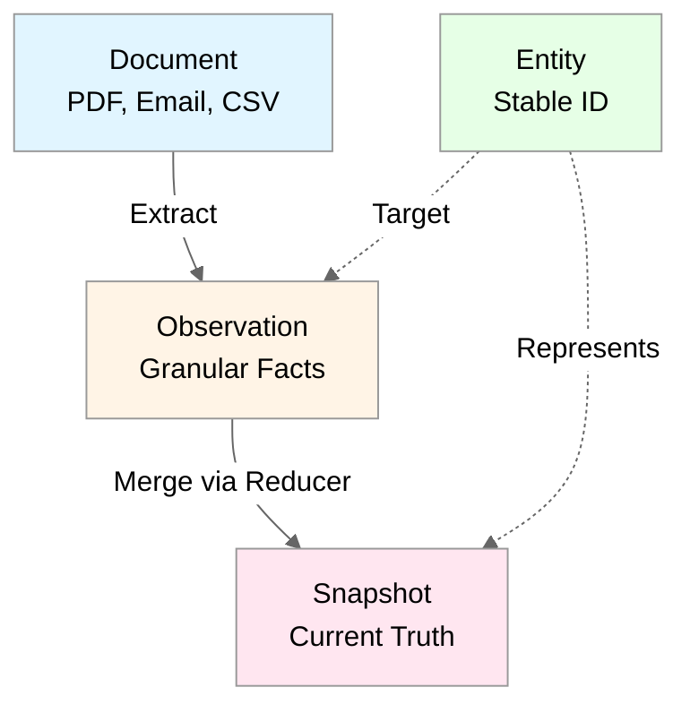

# Neotoma Observation Architecture — Four-Layer Truth Model

_(Complete Overview of Observation Layer)_

---

## Purpose

This document provides a complete overview of Neotoma's observation architecture — the four-layer truth model that enables deterministic, explainable, multi-source entity resolution.

---

## Scope

This document covers:

- Four-layer truth model overview
- Observation lifecycle
- Snapshot computation flow
- Provenance tracking
- Integration with existing event-sourcing foundation

This document does NOT cover:

- Reducer implementation details (see `docs/subsystems/reducer.md`)
- Schema registry patterns (see `docs/subsystems/schema_registry.md`)
- Relationship patterns (see `docs/subsystems/relationships.md`)

---

## 1. Four-Layer Truth Model

### 1.1 Model Overview

Neotoma implements a four-layer truth model:

```
Document → Entity → Observation → Snapshot
```

**Layers:**

1. **Document** — the file itself (PDF, email, CSV, image)
2. **Entity** — the logical thing in the world with a stable ID
3. **Observation** — granular, source-specific facts extracted from documents
4. **Snapshot** — deterministic reducer output representing current truth

**Model Diagram:**



### 1.2 Key Benefits

- **Decouples ingestion order from truth:** Observations can arrive in any order
- **Enables multi-source merging:** Multiple sources contribute observations about same entity
- **Provides full provenance:** Every snapshot field traces to specific observations and documents
- **Supports deterministic merging:** Reducers compute snapshots deterministically

See [`docs/architecture/architectural_decisions.md`](../architecture/architectural_decisions.md) for complete architectural rationale.

---

## 2. Observation Lifecycle

### 2.1 Observation Creation

Observations are created during ingestion:

1. **Extract Fields:** Use schema-specific extraction rules
2. **Categorize Fields:** Separate known (match schema) vs unknown (raw_fragments)
3. **Resolve Entities:** Identify entities mentioned in extracted fields
4. **Create Observations:** For each entity, create observation with:
   - `entity_id` — target entity
   - `entity_type` — entity type
   - `schema_version` — schema version used
   - `source_record_id` — source document
   - `observed_at` — observation timestamp
   - `specificity_score` — how specific this observation is
   - `source_priority` — priority of source
   - `fields` — granular facts

**Example:**

```typescript
const observation = {
  entity_id: "ent_acme_corp",
  entity_type: "company",
  schema_version: "1.0",
  source_record_id: "rec_invoice_123",
  observed_at: new Date("2024-01-15"),
  specificity_score: 0.9,
  source_priority: 10,
  fields: {
    name: "Acme Corp",
    address: "123 Main St",
    tax_id: "12-3456789",
  },
};
```

### 2.2 Observation Storage

Observations are stored in `observations` table:

- Immutable once created
- Multiple observations can exist for same entity
- Indexed by `entity_id` and `observed_at`
- Linked to source document via `source_record_id`

See [`docs/subsystems/schema.md`](./schema.md) for database schema details.

### 2.3 Observation Querying

**Find Observations for Entity:**

```typescript
async function getObservations(entityId: string): Promise<Observation[]> {
  return await observationRepo.findByEntity(entityId);
}
```

**Find Observations by Source:**

```typescript
async function getObservationsBySource(
  recordId: string
): Promise<Observation[]> {
  return await observationRepo.findByRecord(recordId);
}
```

---

## 3. Snapshot Computation Flow

### 3.1 Reducer Execution

Snapshots are computed by reducers:

1. **Load Observations:** Fetch all observations for entity
2. **Load Schema:** Get schema definition and merge policies
3. **Sort Observations:** Sort by `observed_at DESC` (deterministic)
4. **Apply Merge Policies:** For each field, apply merge strategy
5. **Store Snapshot:** Save snapshot with provenance

**Flow Diagram:**


### 3.2 Merge Strategies

Reducers support multiple merge strategies:

- **Last Write Wins:** Most recent observation wins
- **Highest Priority:** Highest `source_priority` wins
- **Most Specific:** Highest `specificity_score` wins
- **Merge Array:** Combine all values into array

See [`docs/subsystems/reducer.md`](./reducer.md) for complete merge strategy details.

### 3.3 Snapshot Storage

Snapshots are stored in `entity_snapshots` table:

- Computed deterministically from observations
- Include provenance mapping (field → observation_id)
- Cached and recomputed on new observations
- Indexed by `entity_id` (primary key)

---

## 4. Provenance Tracking

### 4.1 Provenance Chain

Every snapshot field traces to source:

```
Snapshot Field → Observation → Document → File
```

**Example:**

```
snapshot.vendor_name = "Acme Corp"
  → observation_123 (from invoice.pdf)
    → record_456 (invoice document)
      → file_789 (invoice.pdf)
```

### 4.2 Provenance Query

**Get Field Provenance:**

```typescript
async function getFieldProvenance(
  entityId: string,
  field: string
): Promise<ProvenanceChain> {
  const snapshot = await snapshotRepo.findById(entityId);
  const observationId = snapshot.provenance[field];
  const observation = await observationRepo.findById(observationId);
  const record = await recordRepo.findById(observation.source_record_id);

  return {
    field,
    value: snapshot.snapshot[field],
    observation,
    record,
    file: record.file_urls[0],
  };
}
```

### 4.3 Timeline View

Provenance enables timeline view:

- Shows how entity properties changed over time
- Tracks corrections and updates
- Shows source priority and specificity
- Enables "why did this value change?" queries

---

## 5. Integration with Event-Sourcing

### 5.1 Event-Sourcing Foundation

Neotoma's event-sourcing foundation (FU-050) provides:

- `state_events` table (append-only log)
- Reducer infrastructure (apply events → compute state)
- Historical replay capability
- Event emission patterns

### 5.2 Observation Integration

Observations integrate with event-sourcing:

- **Observation Creation:** Emits `ObservationCreated` event
- **Snapshot Computation:** Emits `SnapshotComputed` event
- **Historical Replay:** Observations can be replayed to recompute snapshots

**Event Emission:**

```typescript
async function createObservation(observation: Observation): Promise<void> {
  await observationRepo.create(observation);

  // Emit event (integrates with FU-050)
  await eventRepo.emit({
    event_type: "ObservationCreated",
    aggregate_id: observation.entity_id,
    aggregate_type: "Entity",
    payload: observation,
    timestamp: new Date(),
  });

  // Trigger reducer
  await reducerEngine.computeSnapshot(observation.entity_id);
}
```

### 5.3 Repository Abstractions

Observations use repository abstractions (FU-051):

- `ObservationRepository` — observation storage
- `SnapshotRepository` — snapshot storage
- Domain logic isolated from storage

---

## 6. Multi-Source Entity Resolution

### 6.1 Multiple Sources

Observations enable multi-source entity resolution:

- Multiple documents can contribute observations about same entity
- Reducers merge observations deterministically
- Provenance tracks which source contributed each field

**Example:**

```
Entity: Acme Corp

Observation 1 (from invoice.pdf):
  - name: "Acme Corp"
  - address: "123 Main St"
  - tax_id: "12-3456789"

Observation 2 (from contract.pdf):
  - name: "Acme Corporation"
  - address: "123 Main Street"
  - contact_email: "info@acme.com"

Snapshot (merged):
  - name: "Acme Corp" (from observation 1, highest priority)
  - address: "123 Main St" (from observation 1, last write)
  - tax_id: "12-3456789" (from observation 1)
  - contact_email: "info@acme.com" (from observation 2)
```

### 6.2 Conflict Resolution

Reducers resolve conflicts via merge policies:

- **Priority-based:** Higher `source_priority` wins
- **Specificity-based:** Higher `specificity_score` wins
- **Time-based:** Most recent observation wins
- **Array merge:** Combine all values

---

## 7. Raw Fragments and Schema Discovery

### 7.1 Unknown Fields

Unknown fields (don't match schema) stored in `raw_fragments`:

- Typed envelopes (type metadata)
- Frequency tracking
- Enables schema discovery

### 7.2 Automated Schema Promotion

Raw fragments enable automated schema promotion:

1. **Pattern Detection:** Analyze raw_fragments for patterns
2. **Frequency Analysis:** Identify high-frequency unknown fields
3. **Schema Suggestions:** Propose schema updates
4. **Migration:** Deterministic migration to new schema

See [`docs/architecture/schema_expansion.md`](../architecture/schema_expansion.md) for promotion pipeline details.

---

## Related Documents

- [`docs/architecture/architectural_decisions.md`](../architecture/architectural_decisions.md) — Core architectural decisions
- [`docs/subsystems/reducer.md`](./reducer.md) — Reducer implementation patterns
- [`docs/subsystems/schema_registry.md`](./schema_registry.md) — Schema registry patterns
- [`docs/subsystems/relationships.md`](./relationships.md) — Relationship patterns
- [`docs/subsystems/schema.md`](./schema.md) — Database schema
- [`docs/subsystems/ingestion/ingestion.md`](./ingestion/ingestion.md) — Ingestion pipeline

---

## Agent Instructions

### When to Load This Document

Load `docs/subsystems/observation_architecture.md` when:

- Understanding the four-layer truth model
- Implementing observation creation
- Working with snapshots and provenance
- Debugging multi-source entity resolution
- Integrating with event-sourcing foundation

### Constraints Agents Must Enforce

1. **Observations MUST be immutable** (once created, never modified)
2. **Snapshots MUST be computed by reducers** (not directly updated)
3. **Provenance MUST be tracked** (every field traces to observation)
4. **Schema version MUST be referenced** (for deterministic replay)

### Forbidden Patterns

- ❌ Modifying observations after creation
- ❌ Direct snapshot updates (must use reducers)
- ❌ Missing provenance tracking
- ❌ Schema version mismatches

### Validation Checklist

- [ ] Observations are immutable (no updates after creation)
- [ ] Snapshots computed via reducers only
- [ ] Provenance tracked for all snapshot fields
- [ ] Schema version referenced in observations
- [ ] Four-layer model (Document → Entity → Observation → Snapshot) respected
- [ ] Reducer determinism maintained
- [ ] Integration with schema registry verified
- [ ] Tests verify observation immutability and snapshot computation
