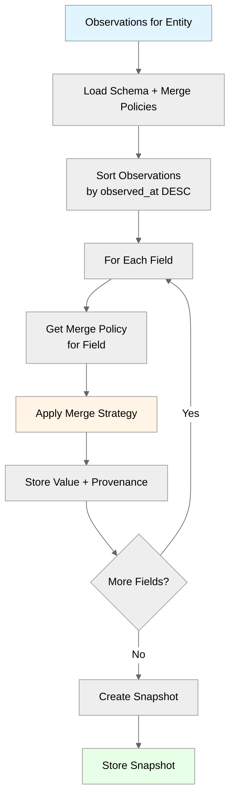

# Neotoma Reducer Engine — Deterministic Snapshot Computation

_(Reducer Patterns and Merge Strategies)_

---

## Purpose

This document defines the **reducer engine** that computes entity snapshots from observations. Reducers are deterministic merge engines that combine multiple observations about the same entity into a single canonical snapshot.

---

## Scope

This document covers:

- Reducer architecture and patterns
- Merge strategies (last_write, highest_priority, most_specific, merge_array)
- Determinism requirements
- Provenance tracking
- Testing patterns

This document does NOT cover:

- Observation creation (see `docs/subsystems/observation_architecture.md`)
- Schema registry (see `docs/subsystems/schema_registry.md`)
- Database schema (see `docs/subsystems/schema.md`)

---

## 1. Reducer Overview

### 1.1 What is a Reducer?

A **reducer** is a pure function that computes an entity snapshot from multiple observations:

```
Reducer(observations[], merge_policies) → EntitySnapshot
```

**Key Properties:**

- **Deterministic:** Same observations + same merge rules → same snapshot
- **Pure:** No side effects, no external dependencies
- **Idempotent:** Can be run multiple times with same result
- **Provenance-aware:** Tracks which observation contributed each field

### 1.2 Four-Layer Model Context

Reducers operate in the four-layer truth model:

```
Document → Observation → [Reducer] → Snapshot → Entity
```

- **Document:** Source file (PDF, email, CSV)
- **Observation:** Granular facts extracted from document
- **Reducer:** Computes snapshot from observations
- **Snapshot:** Current truth for entity
- **Entity:** Logical thing in the world

See [`docs/architecture/architectural_decisions.md`](../architecture/architectural_decisions.md) for complete architectural rationale.

---

## 2. Reducer Architecture

### 2.1 Reducer Execution Flow



### 2.2 Reducer Interface

```typescript
interface Reducer {
  computeSnapshot(entityId: string): Promise<EntitySnapshot>;
}

interface EntitySnapshot {
  entity_id: string;
  entity_type: string;
  schema_version: string;
  snapshot: Record<string, any>;
  provenance: Record<string, string>; // field → observation_id
  computed_at: Date;
  observation_count: number;
  last_observation_at: Date;
}
```

---

## 3. Merge Strategies

### 3.1 Last Write Wins

**Strategy:** Most recent observation wins.

**Use When:** Field values change over time, latest is most accurate.

**Example:**

```typescript
function lastWriteWins(
  field: string,
  observations: Observation[]
): { value: any; source_observation_id: string } {
  // Observations already sorted by observed_at DESC
  const latest = observations[0];
  return {
    value: latest.fields[field],
    source_observation_id: latest.id
  };
}
```

**Use Cases:**

- `amount_due` in invoices (latest invoice amount)
- `balance` in bank accounts (current balance)
- `status` in contracts (current status)

### 3.2 Highest Priority

**Strategy:** Observation with highest `source_priority` wins.

**Use When:** Some sources are more trusted than others.

**Example:**

```typescript
function highestPriority(
  field: string,
  observations: Observation[]
): { value: any; source_observation_id: string } {
  const sorted = observations.sort((a, b) => 
    b.source_priority - a.source_priority || 
    b.observed_at.getTime() - a.observed_at.getTime()
  );
  return {
    value: sorted[0].fields[field],
    source_observation_id: sorted[0].id
  };
}
```

**Use Cases:**

- `vendor_name` in invoices (official documents > receipts)
- `merchant_name` in receipts (bank statements > receipts)
- `counterparty` in transactions (official records > notes)

### 3.3 Most Specific

**Strategy:** Observation with highest `specificity_score` wins.

**Use When:** More specific observations are more accurate.

**Example:**

```typescript
function mostSpecific(
  field: string,
  observations: Observation[]
): { value: any; source_observation_id: string } {
  const sorted = observations.sort((a, b) => 
    b.specificity_score - a.specificity_score ||
    b.observed_at.getTime() - a.observed_at.getTime()
  );
  return {
    value: sorted[0].fields[field],
    source_observation_id: sorted[0].id
  };
}
```

**Use Cases:**

- `counterparty` in transactions (explicit name > inferred)
- `location` in events (specific address > city name)
- `entity_name` in contacts (full name > nickname)

### 3.4 Merge Array

**Strategy:** Combine all values into array, deduplicate.

**Use When:** Multiple values are all valid.

**Example:**

```typescript
function mergeArrays(
  field: string,
  observations: Observation[]
): { value: any[]; source_observation_id: string } {
  const values = new Set();
  const observationIds = [];
  
  for (const obs of observations) {
    const value = obs.fields[field];
    if (value !== undefined && value !== null) {
      values.add(value);
      observationIds.push(obs.id);
    }
  }
  
  return {
    value: Array.from(values),
    source_observation_id: observationIds.join(',') // Multiple sources
  };
}
```

**Use Cases:**

- `aliases` for entities (all known names)
- `tags` for records (all tags from all sources)
- `categories` for transactions (all applicable categories)

---

## 4. Merge Policy Configuration

### 4.1 Schema Registry Configuration

Merge policies are configured per field in the schema registry:

```typescript
interface MergePolicy {
  strategy: 'last_write' | 'highest_priority' | 'most_specific' | 'merge_array';
  tie_breaker?: 'observed_at' | 'source_priority';
}
```

**Example Schema Registry Entry:**

```json
{
  "entity_type": "invoice",
  "schema_version": "1.0",
  "schema_definition": {
    "vendor_name": { "type": "string" },
    "amount_due": { "type": "number" },
    "status": { "type": "string" }
  },
  "reducer_config": {
    "merge_policies": {
      "vendor_name": { "strategy": "highest_priority" },
      "amount_due": { "strategy": "last_write" },
      "status": { "strategy": "last_write" }
    }
  }
}
```

### 4.2 Default Merge Policy

If no merge policy specified for a field, default to `last_write`.

---

## 5. Determinism Requirements

### 5.1 Deterministic Execution

Reducers MUST be deterministic:

- Same observations → same snapshot
- Same merge policies → same result
- Order-independent (observations sorted deterministically)

**Test Pattern:**

```typescript
test('reducer is deterministic', async () => {
  const observations = [obs1, obs2, obs3];
  const snapshot1 = await reducer.computeSnapshot(entityId);
  
  // Recompute with same observations
  const snapshot2 = await reducer.computeSnapshot(entityId);
  
  expect(snapshot1.snapshot).toEqual(snapshot2.snapshot);
  expect(snapshot1.provenance).toEqual(snapshot2.provenance);
});
```

### 5.2 Observation Ordering

Observations are sorted deterministically:

1. Primary: `observed_at DESC` (most recent first)
2. Secondary: `id ASC` (stable tie-breaker)

**Sorting Function:**

```typescript
function sortObservations(observations: Observation[]): Observation[] {
  return observations.sort((a, b) => {
    const timeDiff = b.observed_at.getTime() - a.observed_at.getTime();
    if (timeDiff !== 0) return timeDiff;
    return a.id.localeCompare(b.id);
  });
}
```

---

## 6. Provenance Tracking

### 6.1 Provenance Structure

Snapshots include provenance mapping:

```typescript
interface Provenance {
  [field: string]: string; // field → observation_id
}
```

**Example:**

```json
{
  "entity_id": "ent_abc123",
  "snapshot": {
    "vendor_name": "Acme Corp",
    "amount_due": 1500.00,
    "status": "unpaid"
  },
  "provenance": {
    "vendor_name": "obs_xyz789",
    "amount_due": "obs_xyz789",
    "status": "obs_abc456"
  }
}
```

### 6.2 Provenance Chain

Full provenance chain:

```
Snapshot Field → Observation → Document → File
```

**Query Pattern:**

```typescript
async function getFieldProvenance(
  entityId: string,
  field: string
): Promise<ProvenanceChain> {
  const snapshot = await snapshotRepo.findById(entityId);
  const observationId = snapshot.provenance[field];
  const observation = await observationRepo.findById(observationId);
  const record = await recordRepo.findById(observation.source_record_id);
  
  return {
    field,
    value: snapshot.snapshot[field],
    observation,
    record,
    file: record.file_urls[0]
  };
}
```

---

## 7. Testing Patterns

### 7.1 Unit Tests

**Test Determinism:**

```typescript
describe('Reducer determinism', () => {
  it('same observations produce same snapshot', async () => {
    const observations = createTestObservations();
    const snapshot1 = await reducer.computeSnapshot(entityId);
    const snapshot2 = await reducer.computeSnapshot(entityId);
    
    expect(snapshot1).toEqual(snapshot2);
  });
});
```

**Test Merge Strategies:**

```typescript
describe('Merge strategies', () => {
  it('last_write selects most recent observation', async () => {
    const observations = [
      { id: 'obs1', observed_at: new Date('2024-01-01'), fields: { name: 'Old' } },
      { id: 'obs2', observed_at: new Date('2024-01-02'), fields: { name: 'New' } }
    ];
    
    const result = reducer.mergeField('name', observations, { strategy: 'last_write' });
    expect(result.value).toBe('New');
    expect(result.source_observation_id).toBe('obs2');
  });
});
```

### 7.2 Integration Tests

**Test End-to-End Flow:**

```typescript
describe('Observation → Snapshot flow', () => {
  it('creates snapshot from observations', async () => {
    const record = await uploadFile(invoiceFile);
    const observations = await observationRepo.findByEntity(entityId);
    const snapshot = await reducer.computeSnapshot(entityId);
    
    expect(snapshot.observation_count).toBe(observations.length);
    expect(snapshot.provenance).toBeDefined();
  });
});
```

---

## 8. Performance Considerations

### 8.1 Snapshot Caching

Snapshots are cached and recomputed only when:

- New observations arrive
- Schema version changes
- Merge policies updated

**Cache Invalidation:**

```typescript
async function invalidateSnapshot(entityId: string): Promise<void> {
  await snapshotCache.delete(entityId);
  await reducer.computeSnapshot(entityId); // Recompute
}
```

### 8.2 Batch Processing

For bulk snapshot recomputation:

```typescript
async function recomputeSnapshots(entityIds: string[]): Promise<void> {
  await Promise.all(
    entityIds.map(id => reducer.computeSnapshot(id))
  );
}
```

---

## Related Documents

- [`docs/architecture/architectural_decisions.md`](../architecture/architectural_decisions.md) — Core architectural decisions
- [`docs/subsystems/observation_architecture.md`](./observation_architecture.md) — Observation layer architecture
- [`docs/subsystems/schema_registry.md`](./schema_registry.md) — Schema registry patterns
- [`docs/architecture/determinism.md`](../architecture/determinism.md) — Determinism requirements

---

## Agent Instructions

### When to Load This Document

Load `docs/subsystems/reducer.md` when:

- Implementing reducer logic
- Configuring merge policies
- Testing snapshot computation
- Debugging provenance issues
- Understanding four-layer truth model

### Constraints Agents Must Enforce

1. **Reducers MUST be deterministic** (same observations → same snapshot)
2. **Merge policies MUST be configured** in schema registry
3. **Provenance MUST be tracked** for all snapshot fields
4. **Observations MUST be sorted** deterministically before merging

### Forbidden Patterns

- ❌ Non-deterministic reducers (randomness, timestamps)
- ❌ Missing provenance tracking
- ❌ Ad-hoc merge logic (must use configured policies)
- ❌ Side effects in reducers (must be pure functions)

### Validation Checklist

- [ ] Reducer is deterministic (same observations → same snapshot)
- [ ] Merge policies configured in schema registry
- [ ] Provenance tracked for all snapshot fields
- [ ] Observations sorted deterministically (observed_at DESC, then id ASC)
- [ ] Reducer is pure function (no side effects)
- [ ] Tests verify determinism (same input → same output)
- [ ] Integration with schema registry verified
- [ ] Four-layer model respected

