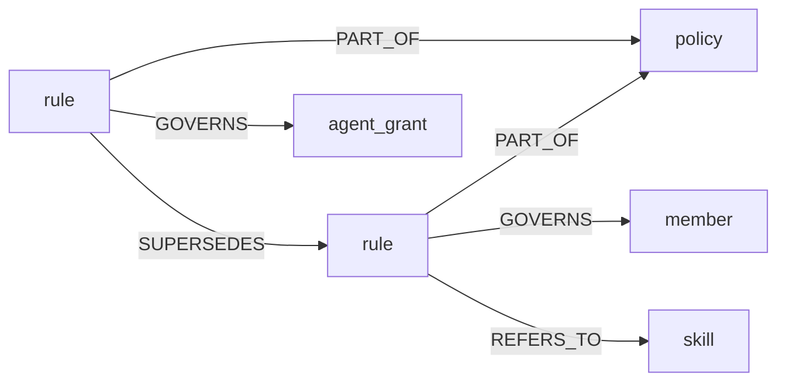
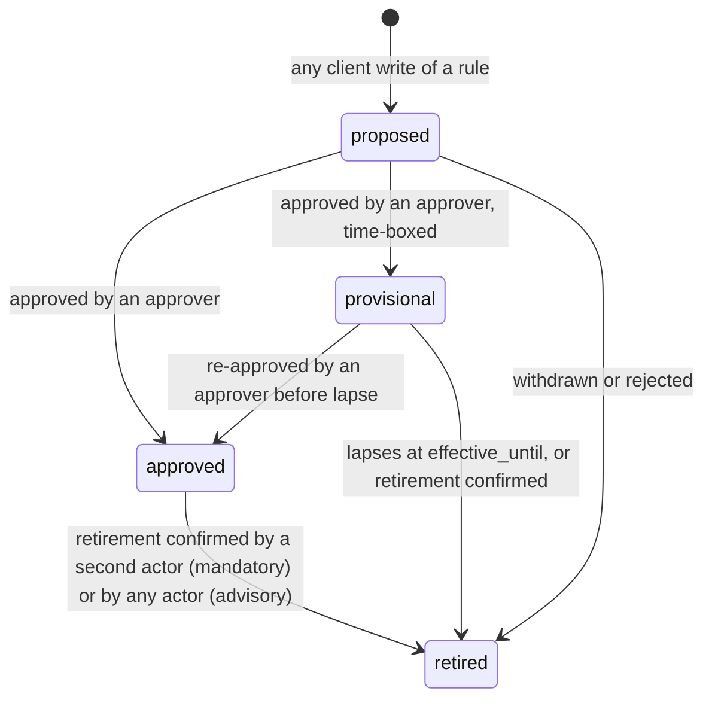

# Rules and Policies
## Scope
This document specifies the design of the core `rule` and `policy` entity types, the edges that scope and connect them, the server-side renderer that turns them into session text, the delivery contract for each supported harness, the verification and fail-closed behavior, the governance guard that keeps approval meaningful, and the migration from the legacy `standing_rule`, `agent_policy` and `instance_policy` shapes.

This document covers:
- The `rule` and `policy` schemas, the `member` scoping target, and the edges `PART_OF`, `GOVERNS`, `REFERS_TO` and `SUPERSEDES`
- Rule kinds (`mandatory`, `advisory`) and the closed predicate vocabulary
- Instance, member and agent scope, for delivery and for reads
- Proposal and approval of rules, supersession semantics, and the operator channel
- The governance guard: one choke point for every path that changes a governance record
- The rules renderer: budgets, ordering, the index plus fetch-by-id pattern, the content digest
- Per-harness delivery and the hook contract
- Delivery verification and fail-closed behavior
- Skill delivery alignment
- Migration and the transition window
- Security and privacy considerations
- The slice sequence that implements the design

This document does NOT cover:
- Implementation code. No code ships with this document. Each slice in [Slice sequence](#slice-sequence) is a separate issue with its own acceptance criteria.
- The general carrier matrix for how an instance reaches clients (tracked in #2494). This document specifies only what rules need from each carrier.
- Write attribution internals (see #2534 and #2537) and AAuth admission (see `docs/subsystems/agent_capabilities.md`).
- Personal preferences that belong to one person's own instance rather than to a shared graph.

Status: **design**. Decisions 1 to 4 were ruled by the operator on 2026-09-30. Decisions 5, 7 and 8 were accepted by default. Decision 6 awaits confirmation. Decisions 9 to 17 are design choices settled in review, not operator rulings. See [Decisions](#decisions) and [Open decisions](#open-decisions). Nothing described here as new is built. Section [Current state](#current-state-as-of-v0250) states what exists on `main` at v0.25.0.

## At a glance
- **Types.** One `rule` per record with its own kind (`mandatory` or `advisory`), a grouping-only `policy`, and a minimal `member` entity that only scopes rules.
- **Scope is an edge.** No `GOVERNS` edge means the whole instance. A member or agent edge narrows delivery and reads, and can only tighten.
- **One renderer.** Every delivery surface is produced by one server-side renderer, and one content digest identifies the mandatory set a client received.
- **Three delivery levels.** L0 notice, L1 hook refusal, L2 server write gate. Each harness uses the highest it supports.
- **One guard.** Every path that changes a rule, policy, member or scope edge, and every legacy rule type during the transition window, passes one governance choke point, so `approved` means approved. The operator channel that repairs and approves when members cannot ships with it in N1.
- **Slice order.** The minimal governance guard ships in N1, before anything that delivers or enforces rules ([Slice sequence](#slice-sequence)).

## Purpose
Rules are the durable instructions an instance holds for the agents that use it. Three failures motivate this design.

1. **Rules live in several shapes with different mechanics.** `standing_rule` rows are injected at session start. Instance-wide data requirements live inline as prose and flags inside one `instance_policy` record with one container-wide enforcement switch. Downstream deployments store further rules under other type names (for example `agent_policy`) that the package does not read. A rule's bindingness (must the agent comply, or is it guidance) is not recorded per rule.
2. **Delivery is not verified.** A rule can be stored, looked up, and rendered while no model ever sees it. Issue #2187 (rules ride only a Neotoma-private field that clients drop), #2368 (a policy did not reach a connected session), #2429 (an identity gate skipped the lookup silently) and #2449 (a rule named on no handshake surface) are four instances. Each passed every server-side check.
3. **Scope is all or nothing.** On a shared graph every rule reaches every member's sessions. A member cannot hold rules for their own work, and a rule's approver cannot be required to differ from its author (#2535).

The design gives each rule its own record and kind, groups rules by edge, scopes rules by edge, evaluates machine-checkable requirements per rule, renders every delivery surface from one server-side renderer, and defines what a client must do to prove it received the mandatory set. Because rule text is placed in model context, write access to an in-force rule is the ability to instruct every session in its scope. Approval integrity is therefore the primary security control, and the governance guard exists to make it hold on every mutation path.

## Invariants
1. **One rule per record.** A record carries one rule and one `rule_kind`. A record never carries a list or prose block of several rules.
2. **Kind is per rule.** There is no container-wide enforcement switch. A `policy` never changes a member rule's kind.
3. **No precedence between rules.** Replacement is `SUPERSEDES`, and a superseder replaces a rule only while it is itself in force and only for principals it also governs ([Supersession semantics](#supersession-semantics)). Machine-checkable rules compose by conjunction, so a narrower scope can only tighten. No rule overrides, demotes or outranks another.
4. **Scope is an edge.** No `GOVERNS` edge means the whole instance. A rule whose scope edge cannot be resolved binds nobody and is never widened to the instance.
5. **Fail closed on the safety-bearing field.** A missing or unknown `rule_kind` reads as `mandatory`. An unreadable rule set is reported as unknown, never as empty. A mandatory rule is never dropped because of a type-name or field-name mismatch. A write with no verified attribution is unverified, never an operator write ([Rules of the flow](#rules-of-the-flow), rule 5).
6. **Proposed does not bind.** A `proposed` rule is never enforced, its kind has no effect, and neither its title nor its text is placed in another session's instructions.
7. **One renderer.** Every delivery surface (MCP instructions, hook output, generated files, tool responses) is produced by the server-side renderer. Clients do not compose rule text.
8. **A rule reaches only the sessions it governs and the readers allowed to read it.** Delivery scope is derived from the authenticated principal on the server, never from a client-supplied parameter. Member and agent scoped rules are also withheld from generic graph reads ([Read confidentiality](#read-confidentiality)).
9. **Determinism.** The same approved rule content, principal scope and profile produce byte-identical output and the same digest, regardless of observation ids, re-imports or cosmetic corrections ([Digest](#digest)).
10. **Provenance.** Authorship and approval are recorded by the server from authenticated attribution, not by client-supplied fields, and no client write can set an in-force status by itself.
11. **One guard.** Every path that creates, changes, deletes, restores, merges, splits or re-relates a governance record passes one server-side choke point ([Governance guard](#governance-guard)). During the transition window the legacy rule-bearing types are governance records for this purpose ([Legacy rule types under the guard](#legacy-rule-types-under-the-guard)). A mutating path that skips it is a defect.
12. **No lockout.** No rule or predicate gates writes to governance types. The receipt gate does not exempt a member's writes to governance types, because a member can always satisfy it by calling `get_rules`, but it always exempts the operator channel. An operator channel that works when the rule system is unreadable or malformed always exists ([Operator channel and break-glass](#operator-channel-and-break-glass)).

## Definitions
- **Rule**: one atomic normative instruction held as one `rule` record. Its `rule_kind` is `mandatory` or `advisory`.
- **Mandatory rule**: a rule an agent must follow. A mandatory rule that carries a predicate is also enforced by the server at write time.
- **Advisory rule**: a rule an agent should follow. Violations are reported but not refused.
- **Policy**: a named grouping of rule records, expressed by `PART_OF` edges from rules to a `policy` record. A policy has no precedence power and no enforcement mode.
- **Predicate**: an optional, server-evaluable condition on a rule, drawn from a closed vocabulary ([Predicate model](#predicate-model)).
- **Scope**: whom a rule governs: the whole instance (no edge), one member (`GOVERNS` a `member`), or one agent (`GOVERNS` an agent identity).
- **Member**: an authenticated person on a shared graph, represented by a `member` entity that carries no personal data ([Member entity](#member-entity)).
- **Principal**: the identity a request resolves to on the server: an attributed member, an agent identity, both, or unattributed. Never client supplied.
- **Attributed write, unattributed write**: a write is attributed when it carries a server-verified attribution id (`provenance.authenticated_actor_id`, #2534). Otherwise it is unattributed.
- **Actor**: the holder of one attribution id, or the reserved `operator_channel` actor. An unattributed write is not an actor. Two unattributed writes are not two actors.
- **Author**: the actor whose write first created a `rule` record.
- **Approver**: an attributed member who is not the author of the record being approved, or the `operator_channel` actor.
- **Single-member instance**: an instance with at most one `member` record whose status is `active` and no admitted human credential that lacks a minted `member` record. Member records are minted at credential admission, not at first attributed write, so a second person who has been admitted but has not yet written reads as a second member, and the instance is multi-member. Derived from the graph and the admission records, not a setting. The **owner** is that one member. The word owner has no meaning on any other instance, and never applies to an agent identity.
- **Instance operator and operator channel**: the instance operator is whoever controls the operator channel. The operator channel is the server configuration, the local CLI on the instance host, and, on a hosted instance, the admin route verified by an instance admin credential that no member credential can substitute for. It is never a graph write, never an MCP tool, and never inferred from a missing attribution id. Slice N1 delivers it ([Operator channel and break-glass](#operator-channel-and-break-glass)).
- **Break-glass**: a temporary, logged operator-channel setting that suspends the receipt gate, the predicate check, or both. It never suspends the governance guard.
- **Governance types**: `rule`, `policy`, `member` and `agent_grant`. During the transition window, the legacy rule-bearing types (`standing_rule`, `instance_policy` and configured legacy type names) are governance types for every rule in this document, including the guard and the predicate exemption, until the window closes ([Legacy rule types under the guard](#legacy-rule-types-under-the-guard)).
- **Governance guard**: the server-side choke point every mutating path passes ([Governance guard](#governance-guard)).
- **In force**: status `approved` or `provisional`, inside the effective window, not shadowed by an effective superseder, and in scope for the principal.
- **Shadowed**: a rule that has an effective superseder ([Supersession semantics](#supersession-semantics)).
- **Renderer**: the server component that turns the rules in scope for a principal into text for a delivery profile.
- **Profile**: a named delivery surface with a character budget and format (for example `mcp-instructions`, `session-start-hook`).
- **Digest**: a short hash over the content of the mandatory rules in force for a principal ([Digest](#digest)). One definition exists. It identifies exactly which mandatory content a client received.
- **Receipt**: the server's record that a render with a given digest was served to a principal. Its **receipt state** is `rendered` when the server served it and `placed` when the client confirmed placing it in context.
- **Delivery levels**: L0 (notice only), L1 (hook refusal of side-effecting tool calls until delivery is confirmed) and L2 (server write gate). Defined in full in [Levels](#levels).
- **Preamble tier**: mandatory rules whose `applies_when` is `always`. They are rendered first and in full.
- **Canary**: a synthetic mandatory rule with a random nonce, used to test that a real session receives and follows delivered rules.
- **Conformance test**: the per-harness test that runs the canary and the negative controls ([Conformance testing](#conformance-testing)).

## Current state (as of v0.25.0)
Verified against `origin/main` at the v0.25.0 release merge on 2026-09-30.

### How rules are stored today
| Shape | Where it lives | Notes |
|---|---|---|
| `standing_rule` | Core schema in `src/services/schema_definitions.ts`. Fields `title`, `rule_text`, `scope`, `priority`, `enabled`. Identity is `title` with `name_collision_policy: merge`. | The design note `docs/developer/rule_neotoma_sync.md` (2026-06, proposed) describes a wider field set (`instruction`, `content`, `rule`, `domain`, `status`, `summary`) on some instances. |
| `instance_policy` | Core schema in the same file, read by `src/services/instance_policy.ts`. Fields `purpose`, `in_scope_entity_types`, `out_of_scope_entity_types`, `sensitivity_rules[]` (prose), `require_lawful_basis`, `require_provenance`, `max_sensitivity_class`, `enforcement` (`advisory` or `enforced`). | One record per instance. Inline prose rules share one enforcement mode. |
| Other rule-bearing types | Not declared by the package. Deployments store instruction-bearing rows under their own type names, for example `agent_policy`. | The package does not read them. An open change (#2366, with #2054) would inject them. |
| Rule files | Repository files under agent-instruction directories. | `docs/developer/rule_neotoma_sync.md` proposes mirroring them from `standing_rule` and states that no new `rule` type should be created. This design supersedes that position ([Relationship to existing work](#relationship-to-existing-work)). |

### How rules are delivered today
| Surface | Carries | Where it lives |
|---|---|---|
| `serverInfo._neotoma.standing_rules` in the `initialize` result | Structured list of enabled `standing_rule` rows for the resolved user, plus a `standing_rules_unavailable` flag when the lookup failed | `buildAuthenticatedInitializeResponse` in `src/server.ts`, reading `getActiveStandingRulesResult` in `src/services/standing_rules.ts` |
| `instructions` in the `initialize` result | Base MCP instructions, then the instance policy section, then an instance-skills section | `composeClientInstructions` in `src/mcp_instruction_doc.ts`, `renderInstancePolicyInstructions` in `src/services/instance_policy.ts` |
| `describe_instance_policy` MCP tool and REST route | The instance policy in its structured legacy shape | `src/services/instance_policy.ts` |
| `server/discover` (MCP 2026-07-28 stateless path) | Base instructions and instance policy section only. No per-user data by design (#2508). | `buildDiscoverResult` in `src/server.ts` |
| Write-time enforcement | `evaluateStorePolicy` and `assertStorePolicyAllows` run before writes on the structured store, `correct`, and MCP structured store paths when `enforcement` is `enforced`. An unreadable policy refuses the write (`ERR_STORE_POLICY_UNAVAILABLE`). | `src/services/instance_policy.ts`; raw file storage is a documented gap |
| First-party harness packages | `claude-code-plugin`, `codex-hooks`, `cursor-hooks`, `opencode-plugin` and `claude-agent-sdk-adapter` capture conversations and inject retrieval context. None references standing rules or the instance policy. | `packages/*` |

Findings that shape the design:
- Standing rules are not rendered into the `instructions` prose on `main`. An open change (#2531) renders them there. Clients that ignore `serverInfo._neotoma` receive no rules (#2187).
- The identity gate on the initialize-time lookup was fixed in v0.23.1 (#2438). Delivery is still unverified end to end (#2453).
- The instance policy applies to every write on the instance regardless of the writing member. There is no member or agent scope for rules.
- No first-party hook package delivers rules. Delivery to harnesses that can run hooks currently depends on downstream tooling.
- `GOVERNS` is not a built-in relationship type. `PART_OF`, `REFERS_TO` and `SUPERSEDES` are.
- The protected-type guard (`assertCanWriteProtected`, protected types today `{agent_grant}`) is invoked from the structured store entry points, observation insertion and correction. Soft delete, restore, merge, split and relationship create, delete and restore are separate service paths (`softDeleteEntity`, `batchSoftDeleteEntities`, `restoreEntity`, `mergeEntities`, `splitEntity`, `createRelationship`, `softDeleteRelationship`, `restoreRelationship`) that do not call it.
- The attribution id lives only in the `member_attribution_ids` table, not in the graph. Creating a `member` entity is therefore a new graph write made by the attribution resolver.
- Any principal that can write a `standing_rule` row today changes what sessions receive, and any principal that can write the `instance_policy` record changes what is enforced, with no second actor. Only the design's own guard closes this ([Legacy rule types under the guard](#legacy-rule-types-under-the-guard)).
- Guest responses are redacted by removing the `authenticated_actor_id` provenance key at send time (`src/services/attribution_redaction.ts`). No other key is redacted.
- The instance-policy evaluator, given an unregistered type, still applies the entity-type lists but skips the person-data and sensitivity checks, because an unclassified type has made no claim to gate on. A schema lookup failure is a different case that the design treats separately ([Predicate model](#predicate-model)).
- Reads on a shared graph are scoped to the graph owner, not to the member. No per-member read filter on entity, observation or relationship reads was found in the tree, and the design treats one as absent. Slice N5 confirms this before building the filter.

## Data model

### Entity types


### `rule` (`category: agent_runtime`)
| Field | Type | Required | Meaning |
|---|---|---|---|
| `rule_key` | string | yes | Stable slug, unique on the instance. Identity field. Pattern `^[a-z0-9][a-z0-9-]{2,79}$`. `name_collision_policy: reject`, so a write can never merge into another rule's record. |
| `title` | string | yes | The one line an index renders. At most 160 characters. |
| `rule_text` | string | yes, unless `predicate` is set | The imperative text a reader applies. At most 2,000 characters. Decided: this is the field name, and the resolver accepts the legacy names `instruction`, `content` and `rule`. When a predicate is set and `rule_text` is empty, the renderer generates the sentence from the predicate. |
| `rule_kind` | enum `mandatory` \| `advisory` | yes on write | A missing or unknown stored value reads as `mandatory`. |
| `status` | enum `proposed` \| `approved` \| `provisional` \| `retired` | yes | `proposed` binds nothing. `approved` and `provisional` are in force. A client write can only leave a rule `proposed` ([Rules of the flow](#rules-of-the-flow), rule 2). `provisional` is an approved, time-boxed status: it requires `effective_until` no later than `provisional_max_days` after approval (server configuration, starting value 30) and reads as `retired` after it. `retired` is terminal: a retired rule is revived only by a new proposal. |
| `applies_when` | string | no, default `always` | The condition under which the rule matters. At most 200 characters. `always` places a mandatory rule in the preamble tier. Any other value is free text used for the index line. |
| `domain` | string | no | The subject the rule is about. At most 80 characters. Never an agent or member identifier. |
| `rationale` | string | no | Why the rule exists. At most 2,000 characters. Rendered only on fetch by id. |
| `priority` | number | no, default 0 | Ordering within a tier. Higher renders first. Ties break by `rule_key` ascending. |
| `effective_from`, `effective_until` | date | no | Window in which the rule is in force. Outside the window it reads as `retired`. |
| `predicate` | object | no | A server-evaluable condition ([Predicate model](#predicate-model)). |
| `schema_version` | string | no | Schema version. |

The caps are starting values. Every text field the renderer emits has a cap, so a single long rule cannot consume a profile's budget.

Server-stamped fields. Clients cannot write these. The server derives them from authenticated attribution (`provenance.authenticated_actor_id`, see #2534):
| Field | Meaning |
|---|---|
| `authored_by_actor` | Attribution id of the actor who first wrote the record. |
| `approved_by_actor`, `approved_at` | Attribution id (or the `operator_channel` actor) and time of the approving actor. |
| `approval_path` | How the approval was admitted: `two_actor`, `single_member_self` or `operator_migration`. |
| `retirement_proposed_by_actor` | Attribution id of the actor who first proposed retiring an approved mandatory rule. |
| `migrated_from` | Entity id of the legacy record a migration replaced, when applicable. |

Reducer configuration: `last_write` for every field. Material fields (`rule_text`, `rule_kind`, `predicate`, `applies_when`, effective dates, `status`, and the edges `GOVERNS` and `SUPERSEDES`) are additionally guarded by the approval flow ([Proposal and approval](#proposal-and-approval)).

The governance types are declared on their schemas, not through a type-name branch in the guard. Each governance schema carries a governance declaration naming its server-stamped fields, material fields, and whether writes need the approval path. The governance guard and the protected-type guard read that declaration, so a new governed type is a schema change and not another hardcoded branch beside `PROTECTED_ENTITY_TYPES`. Until the declaration mechanism exists, N1 cites the schema-agnostic exemption in a code comment. An agent identity cannot write `rule`, `policy` or `member` unless a grant capability names it, the same rule `agent_grant` has.

### `policy` (`category: agent_runtime`)
A policy is a named grouping and nothing else.
| Field | Type | Required | Meaning |
|---|---|---|---|
| `policy_key` | string | yes | Stable slug. Identity field, `name_collision_policy: reject`. |
| `title` | string | yes | Heading the renderer uses. |
| `description` | string | no | What the grouping is for. |
| `purpose` | string | no | Instance-wide statement of what the instance is for. Rendered under the heading. This is a setting, not a rule, and binds nothing. |
| `status` | enum `active` \| `retired` | yes | A retired policy is not rendered. Its rules remain in force through any other policy they belong to, or as ungrouped rules. |

A policy carries no `enforcement`, `precedence`, `priority` or `rule_text` field. Instance settings that are not rules and not groupings, such as whether anonymous writes are admitted, are server configuration and are not stored on any record.

Retiring a policy never retires its member rules. Deleting or retiring a grouping must not silently remove a mandatory rule from delivery.

### `member` entity
Edges connect entities, and a member is not an entity today. Decided: the design adds a minimal core `member` type, keyed by the attribution id, and member-scoped rules are `GOVERNS` edges to it. The type and its schema ship in slice N1.
| Field | Type | Meaning |
|---|---|---|
| `member_key` | string | Identity field. The member's `authenticated_actor_id` (the random per-instance id #2534 mints). |
| `status` | enum `active` \| `removed` | Set to `removed` when a member is removed or erased. |

A `member` record carries no name, address, or other personal data. Only someone with database access can map `member_key` back to a person, exactly as with attribution ids today. The server creates the `member` record when it first mints an attribution id, and that is the only creation path. Clients cannot create, edit, delete, merge or split `member` records. `member_key` and the server-stamped actor fields on `rule` are attribution ids, and guest redaction covers them ([Read confidentiality](#read-confidentiality)).

Alternative considered and rejected: storing the attribution id directly in a `governs_member` field on the rule. That removes the entity, but it contradicts the edge model (scope is an edge), makes member rules invisible to graph traversal, and gives a rule a second scoping mechanism.

### Edges
| Edge | Direction | Meaning | Notes |
|---|---|---|---|
| `PART_OF` | rule to policy | The rule is a member of the grouping. | A rule may belong to several policies. A rule with no `PART_OF` edge renders under an "Ungrouped" heading. Built in. Not a material edge. |
| `GOVERNS` | rule to member, or rule to agent identity | The rule binds that member's sessions, or that agent. | New built-in relationship type. No edge means instance-wide. Several `GOVERNS` edges mean the rule binds the union of their targets. A material edge: it changes who a rule binds. |
| `REFERS_TO` | rule to skill | "Use this skill." The renderer names the skill in the rule's output and lists it in the skills section. | Also rule to rule, for cross-reference, and rule to task or issue, for a rule tied to a condition instead of a date. Built in. Not a material edge. |
| `SUPERSEDES` | new rule to old rule | The new rule replaces the old one while the new rule is in force ([Supersession semantics](#supersession-semantics)). | Built in. Also used by the migration ([Migration](#migration)). A material edge. |

A skill never joins a policy directly. A policy serves the skills its member rules name.

`GOVERNS` targets are validated at write. A `GOVERNS` edge to a target that is not a `member` or an `agent_grant` is refused. A rule whose only `GOVERNS` targets are removed, deleted or unresolvable binds nobody. It is reported in the rules health output and is never treated as instance-wide. Removing the `GOVERNS` edge itself from an in-force rule is refused, because that would widen the rule to the instance ([Governance guard](#governance-guard)).

### Supersession semantics
A `SUPERSEDES` edge from rule B to rule A follows these rules. They apply identically to native rules and to legacy rows read through the resolver ([Transition window](#transition-window)).
1. **Effective only while B is in force.** The edge takes effect only while B is in force: approved or provisional, inside its window, and with a resolvable scope. While it is effective, A is shadowed: not rendered, not evaluated. A `proposed` superseder shadows nothing.
2. **Expiry and retirement reinstate A.** Shadowing is computed at read time. When B expires, lapses from `provisional`, or is retired, and no other superseder of A is effective, A is in force again. A permanent mandatory rule superseded by a time-bounded rule therefore returns at expiry, and the design never drops a mandatory rule silently through its superseder.
3. **Retiring B is a retirement decision.** It needs the same two actors as retiring any mandatory rule. The confirming actor may choose to retire the shadowed chain in the same confirmation. Otherwise the predecessors are reinstated.
4. **Scope containment.** B may supersede A only if B governs every principal A governs: B is instance-wide, or B's `GOVERNS` targets include all of A's targets. A narrower superseder is refused at approval with `ERR_RULE_SUPERSEDES_SCOPE`. To narrow a rule, retire it through the two-actor path and add the narrower rule beside it. A member or agent rule can therefore never remove an instance rule for other principals.
5. **Loosening supersession.** A supersession that lowers `rule_kind` from `mandatory` to `advisory`, or removes or relaxes a predicate, is a loosening. It needs no actor beyond the two an ordinary approval already involves, the author and a different approver. What changes is the approval itself: the approval output names the loosening, and the approver must acknowledge it explicitly, so a loosening cannot be approved by accident.
6. **No cycles.** A `SUPERSEDES` cycle is refused at write.
7. **Several superseders.** A is shadowed while at least one superseder is effective.
8. **Edges are material.** Creating, deleting or restoring a `SUPERSEDES` edge on an in-force rule is refused. The edge is written on the new `proposed` rule, before approval.

## Scopes
| Scope | Expressed as | Delivered to | Notes |
|---|---|---|---|
| Instance | No `GOVERNS` edge | Every session on the instance | The default. |
| Member | `GOVERNS` a `member` | Only sessions whose authenticated principal is that member | Delivered on shared graphs only. On an instance with isolated per-user graphs the graph itself is the member scope, and member edges are unnecessary. |
| Agent | `GOVERNS` an agent identity | Only sessions whose verified agent identity resolves to that `agent_grant` | Agent sessions with no admitted grant receive no agent-scoped rules. |

Scope rules:
- **Tightening only.** A member or agent rule adds requirements. It cannot remove or relax an instance rule, by supersession or otherwise ([Supersession semantics](#supersession-semantics), rule 4). Predicate rules compose by conjunction ([Predicate model](#predicate-model)). Prose rules cannot be machine-compared, so a scoped prose rule that contradicts an instance rule is a review matter, caught at approval, and the instance rule still binds.
- **Resolution is server-side.** The principal comes from the authenticated session. No render, fetch, or verification call accepts a member or agent identifier from the client, except an operator-only diagnostic tool ([Security and privacy](#security-and-privacy)).
- **Unknown principal fails closed toward less delivery, not less enforcement.** If the member cannot be identified, the session receives instance rules only, plus a notice that member rules could not be resolved. Instance predicate rules still apply to its writes. Another member's rules are never delivered as a fallback.
- **Reads follow scope.** A member or agent rule is also hidden from generic graph reads by anyone it does not govern ([Read confidentiality](#read-confidentiality)).
- **Availability.** Member and agent scope ship in slice N5 together with the read filter. Until then a `GOVERNS` edge to a member or agent is refused, so no scoped rule exists to leak.
- **Personal preferences** stay on the person's own instance. Member scope is for rules that govern a member's work on a shared graph.

This scoping is the implementation of #2535.

## Predicate model
A predicate makes a rule machine-checkable at write time. The vocabulary is closed. It maps one-to-one onto the checks the instance policy performs today, so evaluation reuses the existing evaluator.

Form:
```json
{ "op": "max_sensitivity_class", "args": { "class": "internal" } }
```

| `op` | `args` | Checks | Denial reason code |
|---|---|---|---|
| `require_provenance` | none | Entities of types declared `person_data` carry attribution and consent metadata. | `provenance_required` |
| `require_lawful_basis` | none | Entities of types declared `person_data` carry a lawful-basis tag. | `pii_gate_missing_basis` |
| `max_sensitivity_class` | `class`: `public` \| `internal` \| `sensitive` \| `restricted` | No non-blank field is classified above `class` by the schema. | `field_sensitivity_exceeded` |
| `entity_type_allow` | `types`: non-empty array of entity type names | Only the listed types may be stored. | `entity_type_denied` |
| `entity_type_deny` | `types`: non-empty array of entity type names | The listed types may not be stored. | `entity_type_denied` |

Semantics:
- **Applicability.** A predicate applies to the same write paths `evaluateStorePolicy` covers today: structured store, `correct`, and the MCP structured store path. Raw file storage remains a documented gap and is not changed by this design.
- **Governance types are exempt.** A predicate never applies to a write whose entity type is `rule`, `policy`, `member` or `agent_grant`, and never to relationship writes among them. A rule can therefore never gate the writes needed to retire or fix it. An `entity_type_allow` or `entity_type_deny` that names a governance type is malformed and is refused at approval.
- **Composition.** All in-force predicate rules in scope for the writing principal must hold. Allow lists intersect, deny lists union, thresholds take the lowest class. A member or agent predicate rule can therefore only tighten.
- **Composition preview at approval.** Before a predicate rule is approved, the guard composes it with the in-force set for every principal it governs. It refuses approval when the composed allow list would be empty or would contradict a deny list, because that rule would refuse every non-governance write. The refusal names the conflicting rules.
- **An empty `types` array is malformed.** It is not "no list". The approval flow refuses it, and evaluation of an already-stored one follows the malformed rule below.
- **Kind decides the outcome.** A violation of a `mandatory` predicate rule refuses the whole batch before any row is written and returns `ERR_STORE_POLICY_DENIED` with the `rule_key` and reason code per denied entity. A violation of an `advisory` predicate rule admits the write and adds a `policy_warnings` entry (rule key, reason code, hint) to the write response.
- **Only in-force rules are evaluated.** A `proposed`, retired or shadowed predicate rule is never evaluated.
- **Fail closed.** An unreadable rule set refuses the write with `ERR_STORE_POLICY_UNAVAILABLE`, as today. A failure to look up the schema of a registered type refuses the write with the same code. A mandatory rule with an unknown `op` or malformed `args` refuses covered writes with `ERR_RULE_PREDICATE_UNSUPPORTED` naming the rule. An advisory rule with an unknown `op` is skipped and reported in rules health. In all three cases writes to governance types stay admitted, so the rule set can always be repaired.
- **The class of check that is skipped.** For an entity type that has no registered schema, the person-data and sensitivity checks (`require_provenance`, `require_lawful_basis`, `max_sensitivity_class`) have no declarations to gate on and are skipped, as today. The skip is never silent: a mandatory predicate rule that is skipped for this reason adds a `policy_warnings` entry with reason `unclassified_type`, and rules health counts these skips. The entity type lists still apply. An operator who wants unregistered types refused adds an `entity_type_allow` rule.
- **Text is derived from the predicate.** The renderer generates the rule's sentence from the predicate, so the prose an agent reads and the check the server runs cannot diverge. A `rule_text` on a predicate rule is rendered as additional context.
- **Extension.** A new `op` is a schema version bump and a server release. There is no expression language, no scripting, and no client-supplied evaluator.

A rule without a predicate is prose. The server cannot enforce it. A mandatory prose rule is enforced only by delivery and verification ([Delivery verification and fail-closed behavior](#delivery-verification-and-fail-closed-behavior)). The documentation and the rules health output say so plainly.

Example: an instance that may hold only internal data and no health records.
```json
[
  { "rule_key": "max-internal-sensitivity", "rule_kind": "mandatory", "status": "approved",
    "title": "Do not store fields above internal sensitivity",
    "predicate": { "op": "max_sensitivity_class", "args": { "class": "internal" } } },
  { "rule_key": "no-health-records", "rule_kind": "mandatory", "status": "approved",
    "title": "Health records are out of scope",
    "predicate": { "op": "entity_type_deny", "args": { "types": ["health_record"] } } }
]
```

## Proposal and approval
Any member may propose a rule. A rule becomes in force only when an approver, meaning an attributed member other than its author, approves it. There is no separate partner role.

### Lifecycle

An approved or provisional rule that has an effective superseder stays stored and stays in its status. It is shadowed, not retired, and is reinstated when no superseder is effective ([Supersession semantics](#supersession-semantics)).

### Rules of the flow
1. **Authorship is server-stamped.** The first observation on a `rule` record fixes `authored_by_actor`. Later corrections by other actors do not change it.
2. **No client write sets an in-force status.** Any write, correction, restore, merge or edge change that would leave a `rule` with status `approved` or `provisional` is stored as `proposed`, unless it is an approval transition validated by the guard (rules 3 and 12) or one of the two exempt paths (rules 5 and 6). This holds on every mutation path ([Governance guard](#governance-guard)). `provisional` sits inside this flow: it needs the same approval as `approved`, and its lapse never promotes it.
3. **Approval requires a different attributed actor.** The approving write must carry an attribution id that differs from `authored_by_actor`. The guard compares the two ids and refuses an approval where they are equal or where either is missing (`ERR_RULE_SELF_APPROVAL`, `ERR_RULE_APPROVER_UNATTRIBUTED`).
4. **Approver population.** Decided: any attributed member of a shared instance may approve, except the author. This is the operator ruling of 2026-09-29, read as "any partner but the author", where partner means any attributable member. That reading awaits confirmation ([Open decisions](#open-decisions), decision A).
5. **Unattributed writes fail closed.** A write without a verified attribution id is unverified. It is never an operator write, it is not an actor, and it cannot approve, confirm a retirement or set an in-force status. Per-member identity is partly live (#2537 lists write kinds still unattributed), so treating a missing id as the highest privilege would let any caller pick an unattributed path to skip approval. Authority for operator actions comes from the operator channel instead: an approval or retirement made through it is recorded under the reserved `operator_channel` actor, which is distinct from every member. The single exception is rule 6. This depends on write attribution (#2534) and on binding legacy MCP sessions to the presented credential (#2537, item 5).
6. **Single-member instances.** Decided: on a single-member instance ([Definitions](#definitions)), no second actor exists. The owner's direct write of `approved` is admitted, whether or not it carries an attribution id, and the guard records `approval_path: single_member_self`. The owner may also retire a mandatory rule alone. The exception applies only to the owner's own human credential. It never applies to an agent identity, admitted or not, because rule 9 forbids agents to approve, and it never applies once any other human credential has been admitted, even before that person has written anything. When a second member appears, rules approved this way stay approved and every later change needs two actors.
7. **Editing an approved rule is a supersession.** Decided. A correction that changes a material field (`rule_text`, `rule_kind`, `predicate`, `applies_when`, effective dates, `GOVERNS` and `SUPERSEDES` edges) of an `approved` or `provisional` rule is refused. The change is written as a new `proposed` rule with a `SUPERSEDES` edge to the approved one. The old rule stays in force until the new rule is in force. Non-material fields (`title`, `rationale`, `domain`, `priority`) may be corrected in place.
8. **Retiring a mandatory rule is a loosening.** Decided. It takes a two-actor path. The first actor's retirement request sets `retirement_proposed_by_actor` and the rule stays in force. A different actor's confirmation sets `status: retired`. Retiring an advisory rule needs one actor. Deleting an in-force rule is a retirement request and follows the same path. A loosening supersession needs only its ordinary approval with an explicit acknowledgement of the loosening ([Supersession semantics](#supersession-semantics), rule 5).
9. **Agents do not approve.** An agent identity may propose a rule when its grant names the `rule` type. No grant capability lets an agent approve or confirm a retirement in v1, and the approval and confirmation tools are not registered for sessions authenticated as an agent identity. An agent running under a member's own credential is a residual risk ([Residual risks](#residual-risks)).
10. **Proposed rules are visible for review, not as instructions.** Decided. A `proposed` rule appears in instruction surfaces only as a labelled count. Its title and text are served only through the approval tools, to the author, to approvers, and to the operator channel. This limits the prompt-injection surface: a member cannot place instruction text, or a title, into other members' sessions by proposing it.
11. **Migration approvals.** Rules created by the migration ([Migration](#migration)) are written `approved` through the operator channel with `approval_path: operator_migration` and `migrated_from` set, because they were already in force.
12. **Approval is a validated transition.** Before it records an approval, the guard checks: every `SUPERSEDES` target passes scope containment and no cycle forms; every `GOVERNS` target resolves; a predicate is well formed (known `op`, valid `args`, non-empty `types`, no governance type in an allow or deny list) and passes the composition preview; the effective window is valid and, for `provisional`, within `provisional_max_days`. A failed check refuses the approval and names the reason.

Where this is enforced: the [Governance guard](#governance-guard). The flow is meaningful only if every mutation path passes it.

## Governance guard
One server-side function, the governance guard, decides every change to a governance record. It sits in the service layer, below every transport, and runs in the same transaction as the mutation it judges. A route or tool inherits it by calling the service, so a new transport cannot skip it. This replaces enforcement at three insertion sites (structured store, observation insertion and correction). Those sites are today the only ones that call the protected-type guard.

### Covered paths
| Mutation | Service path | Treatment of `rule`, `policy` and `member` |
|---|---|---|
| Store (REST, MCP, CLI) | structured store entry points, `createObservation` | Status conversion (rule 2), material-field freeze, server-stamped fields set by the server. |
| Correct | `createCorrection` | Same as store. |
| Observation-creating tools | `create_interpretation`, `parse_file`, `submit_entity`, `sync_peer`, `resolve_sync_conflict` and any other tool that ends in `createObservation` | Same as store. A `rule` arriving from a peer or submission is stored `proposed`. |
| Delete, single and batch | `softDeleteEntity`, `batchSoftDeleteEntities` | On an in-force rule: a retirement request, two actors for mandatory. On a `proposed` rule: allowed to its author, to an approver, and to the operator channel. On `policy`: allowed, and never retires its rules. On `member`: refused except by the server. |
| Restore | `restoreEntity` | A restored rule returns `proposed`, whatever status it held. |
| Merge, split | `mergeEntities`, `splitEntity` | Refused for `rule`, `policy` and `member`. Rules identify by `rule_key` with a reject collision policy, so no legitimate merge or split exists. |
| Relationship create | `createRelationship`, the batch create tool | On a `rule` source: `PART_OF` and `REFERS_TO` are free. `GOVERNS` and `SUPERSEDES` are material: allowed on a `proposed` rule for its author, refused on an in-force rule. |
| Relationship delete and restore | `softDeleteRelationship`, `restoreRelationship` | Same as create. Deleting `GOVERNS` from an in-force rule would widen it and is refused. Deleting `SUPERSEDES` from an in-force superseder would revive the old rule and is refused. |
| Schema changes | `register_schema`, `update_schema_incremental` | A change that touches a governance type, or that weakens its governance declaration, is refused except through the operator channel. |
| Member creation | the attribution resolver | The only path. Clients are refused. |
| Legacy rule-bearing types | every path above, applied to `standing_rule`, `instance_policy` and configured legacy type names during the transition window | The write is stored but is a pending change. It is not rendered or enforced until approved ([Legacy rule types under the guard](#legacy-rule-types-under-the-guard)). |

Rules for the guard:
- **Edges are material.** An edge change on an in-force rule is a material edit. It is refused, and the change is written as a new `proposed` rule that supersedes.
- **One function, one registry.** Every mutating tool and route is registered with the guard, or with a written reason it is exempt. An unregistered mutating path is a test failure ([Testing requirements](#testing-requirements)).
- **Fail closed.** If the guard cannot resolve attribution, the current status, or the in-force set, it refuses. The operator channel is the recovery path.
- **The operator channel passes the guard.** It is not exempt from it. Its actions are recorded under the `operator_channel` actor and are subject to the same checks except where a rule names it as the second actor.
- **Read filtering is separate.** Confidentiality of reads is a second choke point ([Read confidentiality](#read-confidentiality)).

### Legacy rule types under the guard
The transition window keeps accepting writes to the legacy rule-bearing types. Left outside the guard, a writer to `standing_rule`, `instance_policy` or a configured legacy type name could place mandatory text in every session in scope with no second actor, which is the capability the guard exists to protect. So during the window those types are governance types for the guard, from slice N1.
1. **One function names them.** N1 introduces the function that returns the legacy type names (`standing_rule`, `instance_policy` and configured names). The guard calls it, and from N2 the shared resolver extends the same function with the mapping.
2. **Approved state.** A legacy row has an approved state: the last state that passed an approval path. The renderer and the write evaluator read a legacy row only at its approved state. A legacy write by anyone other than the operator channel or the migration is stored as a pending change. It is not rendered and not evaluated, a new legacy row with no approved state binds nobody, and pending changes are listed in rules health.
3. **Grandfathering.** On the first start of the N1 release, before it serves writes, the server records every existing legacy row's current state as approved with `approval_path: grandfathered`. Nothing new is admitted, because those rows are already in force, and the upgrade drops no mandatory rule. The grandfathered rows are listed in rules health for the operator to review.
4. **Approval.** A pending change is approved through the same paths as a `rule`: a different attributed actor (through the N7 tools, and only the operator channel before N7), the single-member owner, or the migration.
5. **Loosening.** A change that removes or weakens a legacy row is a loosening: `enabled: false`, deletion, `enforcement` from `enforced` to `advisory`, or removing a type-list entry or a sensitivity rule. It takes the two-actor path, and until it is confirmed the approved state stays in force. A strengthening also waits for approval before it is delivered.
6. **Enforcement reads approved state.** The write evaluator reads the instance policy at its approved state, so a pending flip of `enforcement` or a pending edit of a type list does not weaken enforcement.
7. **Migration.** The migration reads approved state. A pending change found at migration time is written as a `proposed` rule with a report entry.
8. **Downstream stores.** Tooling that writes legacy type names finds its writes pending until they are approved or migrated. The response carries the deprecation warning and says so.
9. **End.** The coverage ends when the legacy schemas are made read-only at the window's exit conditions, after which the legacy types accept no client writes at all.

## Operator channel and break-glass
The operator channel is how the instance operator acts when a member cannot, and how the rule system is repaired when it is unreadable or malformed.

**What it is.** Three paths, all outside the graph:
1. Server configuration, read by the server process (environment or configuration file).
2. The local `neotoma` CLI run on the instance host with access to its configuration and data.
3. On a hosted instance, an admin route verified by an instance admin credential. That credential is distinct from every member credential, is never accepted on MCP tools or member routes, and is what lets an operator without host access recover a hosted instance. Which credential verifies it is an open decision ([Open decisions](#open-decisions), decision B).

**Who builds it.** Slice N1 delivers the operator channel: the configuration path, the local CLI, the reserved `operator_channel` actor, and the guard's recognition of both. It is the earliest slice that needs it, because N1's guard leaves the operator channel and the single-member owner as the only ways to put a rule in force. Every later slice (N3 migration, N4 predicate break-glass, N5 diagnostic, N7 approvals, N8 gate break-glass) builds on it. The hosted admin route (path 3) is a named later increment of N1, tracked in N1's issue and gated on decision B. It is needed no later than N8's exit criterion 4.

**Hosted instances until decision B is ruled.** Path 3 does not exist yet, so the interim operator channel on a hosted instance is path 2, the local CLI, run on the instance host by whoever operates the deployment. Migration (N3) and operator approvals on a hosted instance run that way. A hosted operator without that access cannot use them, and the write gate stays opt-in there.

**What it may do.** Give approvals and retirement confirmations (recorded as the `operator_channel` actor), run the migration, read and write governance types for repair, read every record including member-scoped ones, run the operator diagnostic, and set break-glass. It is never a graph write and never an MCP tool, so a rule cannot gate it.

**Break-glass.** The setting `rules_break_glass` has three scopes: `receipt_gate` (ships in N8), `predicates` (ships in N4) and `both`. It is off by default. It auto-expires after `break_glass_max_minutes` (starting value 60). Every activation, expiry and use is logged with time and channel, shown in rules health, and turning it off restores the gate and the predicates. It never suspends the governance guard, so approval integrity holds during an incident.

### Lockout matrix
| Situation | Effect | Recovery |
|---|---|---|
| Mandatory predicate denies the `rule` type, or its allow list omits governance types | None: governance types are exempt from predicates. | Retire or supersede it through the normal flow. |
| Malformed mandatory predicate | Covered writes refused, governance writes admitted. | Supersede or retire the rule. |
| Composition would empty the allow list | Approval refused by the composition preview. | Fix the proposal. |
| Receipt store unreadable | Gated writes refused with `ERR_RULES_RECEIPTS_UNAVAILABLE` (distinct code). | Operator channel writes stay admitted. Break-glass `receipt_gate` suspends the gate. |
| Rule set unreadable | Covered writes refused with `ERR_STORE_POLICY_UNAVAILABLE`. | Operator channel repairs governance records. Break-glass `predicates` suspends the check. |
| No second actor is available to confirm a retirement | Retirement waits. | The operator channel confirms as the second actor. |

## Delivery renderer
The renderer is a server component. It has one entry point and several transports.

### Inputs and outputs
- **Input.** The authenticated principal (member, agent identity, or both), a profile, and optionally a set of rule ids or a prior digest.
- **Output.** A rendered text block, a structured list of the rules it contains with their delivery level, the digest, and a receipt reference.

Transports:
| Transport | Use |
|---|---|
| `get_rules` MCP tool and matching REST route | Any MCP client. Parameters: `profile`, optional `rule_ids`, optional `since_digest`, `format` (`markdown` or `json`). |
| `neotoma rules render` CLI command | Hooks and installers that prefer to call a local command. Same renderer, same output. |
| `initialize` result | The `mcp-instructions` profile output is placed at the front of `instructions`, ahead of the base block, and the structured list is mirrored to `serverInfo._neotoma.rules`. The existing `standing_rules` key is kept during the transition window. |
| Generated file | The `file` profile output for harnesses that read a local instruction file and run no hooks. |

Every transport calls the same function. A transport that composes rule text itself is a defect. New transports add a profile, not a second renderer.

### Surfaces and parity
Every new capability ships on every applicable surface in the same slice. Names below are proposals that the OpenAPI definition in each slice fixes. Each follows OpenAPI first, then the contract mapping and tool description files, and the MCP and CLI agent-instruction docs are rewritten in step (`docs/developer/mcp/instructions.md` and `docs/developer/cli_agent_instructions.md`). New error shapes follow `docs/subsystems/errors.md`.
| Capability | MCP tool | REST route | CLI command | Slice |
|---|---|---|---|---|
| Render rules | `get_rules` | `POST /rules/render` | `neotoma rules render` | N2 |
| Confirm placement | `acknowledge_rules` | `POST /rules/acknowledge` | `neotoma rules acknowledge` | N2 |
| Rules health | `rules_health` | `GET /rules/health` | `neotoma rules health` | N2 |
| List and read proposals | `list_rule_proposals` | `GET /rules/proposals` | `neotoma rules proposals` | N7 |
| Approve, reject, confirm retirement | `approve_rule`, `reject_rule`, `confirm_rule_retirement` | `POST /rules/{id}/approve`, `.../reject`, `.../retire` | `neotoma rules approve`, `reject`, `retire` | N7 |
| Operator diagnostic | none (operator channel only) | admin route | `neotoma rules explain` | N5 |
| Migration | none | admin route | `neotoma rules migrate` | N3 |
| Operator channel | none | hosted admin route (increment of N1, gated on decision B) | local CLI on the instance host, and server configuration | N1 |

Operator surfaces. The rules health output, the break-glass state and the operator diagnostic are read in the CLI (`neotoma rules health`, `neotoma rules explain`) and, for health and break-glass state, on a Rules page in the Inspector. The reviewer checklist item ([Decisions](#decisions), decision 8) appears in the output of the approval tools. A check an operator cannot find is not a check, so each slice lists its surface in its acceptance criteria.

### Selection and ordering
The renderer selects the rules in force for the principal: status `approved` or `provisional`, inside the effective window, not shadowed by an effective superseder ([Supersession semantics](#supersession-semantics)), and in scope for the principal. It then orders them deterministically:

1. **Preamble tier:** mandatory rules with `applies_when` `always`, in full. Sorted by `priority` descending, then `rule_key`.
2. **Mandatory conditional tier:** the remaining mandatory rules, in full when the budget allows, otherwise as index lines.
3. **Advisory tier:** advisory rules as one-line index entries.
4. **Proposed notice:** a count of proposed rules the principal may review. No titles and no text.
5. **Skills section:** skills named by rules in scope, then other instance skills ([Skill delivery](#skill-delivery)).

Rules are grouped under their policy headings, mandatory first within each heading. A rule that belongs to several policies renders once, marked with the other policies it also belongs to. The preamble tier is rendered ahead of all headings, each line tagged with its policy key, so that budget priority (by tier) is independent of grouping.

### Budget rules
Each profile declares a character budget. When the output would exceed it, the renderer degrades in this order and never truncates mid-rule:
1. Omit advisory index lines, lowest priority first, then whole advisory headings. The trailing notice names how many were omitted and how to fetch them.
2. Render mandatory conditional rules as index lines (title, `applies_when`, id) instead of full text.
3. If the preamble tier alone exceeds the budget, keep every mandatory rule as an index line and set `budget_insufficient: true` in the structured output and in the text. The block then instructs the reader to fetch the mandatory set by id before acting.

**A mandatory rule is never omitted.** At minimum it appears as an index line. If even index lines cannot fit, the profile is unsuitable for that instance, the output says so, and the client treats the surface as not delivering the mandatory set ([Delivery verification and fail-closed behavior](#delivery-verification-and-fail-closed-behavior)).

### Index plus fetch-by-id
Long rules are delivered as an index line plus the identifier. `get_rules` with `rule_ids` returns full text, rationale, referenced skills and the rule's kind. A fetch of an id outside the principal's scope returns the same response as an id that does not exist.

### Profiles
Profiles are configuration, not code. Budgets below are starting values from downstream measurements dated 2026-09 and must be re-measured per harness release ([Harness delivery](#harness-delivery-and-the-hook-contract)).
| Profile | Surface | Starting budget (characters) | Content |
|---|---|---|---|
| `mcp-instructions` | Front of MCP `instructions` | 24,000, with a self-sufficient head of 2,000 | The first 2,000 characters are a complete banner: digest and counts, the preamble tier if it fits, otherwise a pointer to `get_rules`. The remainder carries the full render under the budget rules. Operators may lower it. |
| `session-start-hook` | Hook output at session start, resume, clear and compaction | 9,000 | Full render. |
| `prompt-delta-hook` | Hook output at each prompt | 9,000 | Only rules added or changed since the last delivered digest. Each delivered rule id is recorded only when its line was rendered, so an overflowed rule is retried, never marked delivered. |
| `pre-tool-injection` | Hook output before a tool call | 4,000 | Full text of the rules a client selects by id for that action. Selection stays client-side in v1 ([Non-goals](#non-goals)). |
| `file` | Generated local instruction file | Unbounded | Full render with the digest in the header. |
| `connector-pointer` | Instructions of a client that cannot run hooks and truncates instructions | 600 | Banner, digest, count, and the `get_rules` call. |

Reconciliation with the interim. The open change #2531 delivers standing-rule text in `instructions` under a 24KB budget. N2 keeps at least that budget for `mcp-instructions`, so a client that reads only `instructions` does not regress, and it front-loads the 2,000-character head so a client that truncates aggressively still receives the banner and the pointer. The shared client budget reported for some harnesses (near 2,048 characters across all connected servers, unverified here) is the reason for the head, not for the total.

### Format
The block is delimited so a reader can tell it from the base instructions:
```
[RULES v1 digest=3fa9c1d2e07b mandatory=4 advisory=9 proposed=1 scope=instance+member]
...
[/RULES]
```
The renderer escapes delimiter sequences inside rule text, strips control characters, and enforces the per-field length caps ([`rule` fields](#rule-category-agent_runtime)), so a rule body cannot close the block, forge a section, or inject a fake header.

A failed lookup renders a block stating that the rules are UNKNOWN for this session, that the reader must not proceed as if none apply, and how to retry. This preserves the `standing_rules_unavailable` behavior and moves it into the prose channel clients read.

### Agent behavior contract
The instruction docs for MCP and CLI agents state what an agent does with each output:
- **`[RULES]` block.** Follow mandatory rules. Treat advisory rules as guidance. Fetch by id any rule shown only as an index line before acting in its area.
- **Proposed notice.** A count of rules awaiting review. It is not an instruction and names no rule.
- **UNKNOWN block or `budget_insufficient`.** Do not proceed as if no rules apply. Retry the render. Take read-only actions only, and tell the user.
- **`policy_warnings` on a write response.** Report each warning to the user and adjust the next write.
- **`ERR_RULES_NOT_ACKNOWLEDGED`.** Call `get_rules` (and acknowledge, where a hook does so), then retry once. Never retry blind.

### Walkthrough
One scenario, end to end, on a shared instance with three members.
1. **Propose.** Member A writes a rule with `rule_kind: mandatory`, `status: approved` and the title "Record open work before ending a session". The guard stores it as `proposed` and stamps `authored_by_actor` with A's attribution id. Nobody's session changes, except that every session's next render shows `proposed=1` in the banner.
2. **Approve.** Member B lists proposals through the approval tool, reads the title and text, and approves. The guard checks that B is attributed and is not A, runs the approval checks, records `approved_by_actor` and `approval_path: two_actor`, and the rule enters force. The mandatory digest changes.
3. **Receive.** Member C starts a session. The session-start hook asks the renderer for the `session-start-hook` profile, prints the block below unmodified, and calls `acknowledge_rules`. The receipt for C's principal moves to `placed`.
```
[RULES v1 digest=3fa9c1d2e07b mandatory=2 advisory=1 proposed=0 scope=instance]
Preamble
- [handoff] Record open work before ending a session. (record-open-work)
- [privacy] Do not store fields above internal sensitivity. (max-internal-sensitivity)
Advisory
- Prefer one commit per logical change. (one-commit-per-change)
[/RULES]
```
4. **Unavailable.** If the renderer is unreachable at the start of a later session, the hook prints the UNKNOWN block and denies side-effecting tool calls until the mandatory rules are confirmed delivered ([Messages for the person](#messages-for-the-person)).

## Harness delivery and the hook contract
The design has one renderer and one contract. Harnesses differ only in which carriers exist.

### Carrier capabilities
Each row is a statement about what the harness can do, with its evidence status. "Measured" means a downstream project observed it in a real session on the stated date. "Documented" means the harness documentation states it. "Unverified" means neither, and the cell is read as not available until measured.
| Harness | Session-start injection | Per-prompt injection | Pre-tool refusal | Compaction re-injection | Instructions field | Highest fail-closed level |
|---|---|---|---|---|---|---|
| Claude Code | Hook (`SessionStart`), measured; output cap near 10,000 characters, measured 2026-09 | Hook (`UserPromptSubmit`), measured | Hook (`PreToolUse`, exit status refuses), measured | Hook (`SessionStart` with a compact matcher), measured | Shared client budget, reported near 2,048 characters across all connected servers, 2026-09, unverified here | L1 |
| Codex CLI | Hook (`SessionStart`, `SubagentStart`), measured against one CLI version in 2026-09; a human trust step is required | Hook (`UserPromptSubmit`), measured | Hook (`PreToolUse`), measured for shell calls only | Unverified | Unverified | L1 for shell calls |
| Cursor | Hook (`sessionStart` with additional context), documented in the package README | `beforeSubmitPrompt` drops additional context; `postToolUse` can inject | Unverified | Unverified | Shared client budget, unverified | L0 until a refusing hook is measured |
| OpenCode | Plugin event, documented | Unverified | Unverified | Plugin compaction hook adds context, documented | Unverified | L0 |
| Agent SDK adapters | Callback hooks, documented | `UserPromptSubmit` callback, documented | Callback hooks, unverified for refusal | `PreCompact` callback, documented | Not applicable | L1 if refusal is verified |
| Claude Desktop, ChatGPT and other connector clients | None | None | None | None | Instructions field only, capped and possibly truncated | L2 only |
| Harnesses with a local instruction file and no hooks | Generated file read at start | Not applicable | None | Re-read on compaction, unverified | Not applicable | L0 (file) with L2 for Neotoma writes |

Levels are defined in [Levels](#levels).

Evidence status is inherited from the cited downstream measurements and the harness documentation. The authors of this design did not re-measure any harness. Slice N8 replaces each cell with a dated conformance result, and budgets and limits in this table are starting values until then.

Existing first-party packages capture conversations only. `packages/codex-hooks` configures the older `history` command keys. Delivering rules to Codex requires moving to the hook events measured above. This is part of the hook slice ([Slice sequence](#slice-sequence)).

### Hook contract
A rules hook is a thin client. It does not select, order, filter, budget, sanitize or compose rule text. It performs five duties:
1. **Identify the surface.** It requests the profile matching the hook event (`session-start-hook`, `prompt-delta-hook`, `pre-tool-injection`).
2. **Call the renderer.** Through `neotoma rules render` or the REST route, using credentials the harness already holds. It sends the session id and the last delivered digest so the server can return a delta and record a receipt. Digests resolve only against receipts issued to the calling principal ([Receipts](#receipts)).
3. **Place the output.** It prints the rendered block to the channel the harness places in model context, unmodified. It never prints a credential and never logs rule text.
4. **Confirm placement.** After printing, it calls `acknowledge_rules` with the digest. This marks the receipt `placed`.
5. **Fail loudly and deny until delivered.** Decided. When the renderer is unreachable, unauthorized, or returns `budget_insufficient`, the hook prints the UNKNOWN block from the renderer's fallback text (embedded in the hook package and generated from the same source). On harnesses that can refuse a tool call (level L1), the hook also denies side-effecting tool calls until the mandatory rules are confirmed delivered for the session, meaning the render succeeded and, where placement is confirmed, `acknowledge_rules` succeeded. Read-only tool calls stay allowed so the session can recover. The harness process itself stays fail-open: a hook fault never crashes the session, it produces the UNKNOWN block and the denial. This differs from downstream hook sets that fail open on every error, including refusal. Here the refusal is the point, and only the crash path is open ([Delivery verification and fail-closed behavior](#delivery-verification-and-fail-closed-behavior)).

**Side-effecting is a default-deny classification.** A tool call is read-only only if it is on a read-only allowlist embedded in the hook package and generated from the same source as the fallback text: local file reads, searches and listings, Neotoma read tools, `get_rules` and `acknowledge_rules`. Any tool not on the list, including an unknown or newly added one, is side-effecting. A test denies a call with an unlisted tool name.

Rules for hook packages:
- Fail-open for the harness process: a hook error never crashes a session, and always produces the UNKNOWN block.
- No rule text is stored in the package. The only embedded text is the fallback notice and the read-only allowlist.
- The hook records no rule bodies in logs.
- Delivered ids are recorded only for rules whose lines were rendered.
- Installers state the harness-specific trust step (for example, a human must approve new Codex hooks) and never bypass it.

### Messages for the person
The hook speaks to the person as well as to the model. The denial message is fixed text generated from the renderer's fallback source:

"Neotoma rules are not confirmed for this session, so this action was blocked. Read-only actions still work. Run `neotoma rules render` to retry, or check that the Neotoma instance is reachable."

The same hook path also fires for other causes, and each has one short line so a person is not sent to check connectivity when the cause is elsewhere:
- Renderer unreachable: "Neotoma could not be reached, so rules could not be confirmed. Check the connection to the instance."
- Unauthorized: "Neotoma refused this session's credentials, so rules could not be fetched. Sign in again or check the credential this tool uses."
- `budget_insufficient`: "The mandatory rules are too large for this tool's budget. Ask the instance operator to shorten them or raise the budget."

Approval refusals carry one plain sentence per code, which slice N7 ships with the tools:
- `ERR_RULE_SELF_APPROVAL`: "You wrote this rule, so someone else must approve it."
- `ERR_RULE_APPROVER_UNATTRIBUTED`: "This approval cannot be tied to a member, so it was refused. Sign in as a member and try again."
- `ERR_RULE_SUPERSEDES_SCOPE`: "This rule governs fewer people than the rule it replaces, so it cannot replace it. Retire the old rule instead and add this one beside it."

Recovery when Neotoma is unreachable. Side-effecting calls stay denied for as long as delivery cannot be confirmed. Reading does not fix an outage, so the recovery is to restore connectivity and retry the render, after which the denial lifts in the same session without a restart. There is no server-side override for a hook. The hook is a control against the model, not against the local user: the person who owns the machine can always remove or disable the hook, and conformance reporting states the L1 guarantee with that boundary.

### Instructions field
The `mcp-instructions` profile is the only guaranteed-arrival surface for connector clients, and it is the least reliable one. Clients may truncate it silently, and the 2026-07-28 stateless protocol era has no per-session handshake (#2508). The design therefore treats its first 2,000 characters as a pointer and a banner that survives truncation, and the remainder as best-effort delivery of text. Delivery of text to connector clients ultimately depends on the model calling `get_rules`, and the guarantee for those clients is server-side ([Level L2](#level-l2-server-write-gate)).

### Stateless protocol era
`server/discover` carries no per-user data. In that era the instance-wide banner rides discovery, member and agent rules ride the authenticated `get_rules` call, and receipts are keyed to the principal and digest instead of a session id.

## Delivery verification and fail-closed behavior
A mandatory rule must reach the session, or the session must fail closed. Three levels apply, and each harness uses the highest it supports.

### Levels
| Level | Mechanism | Guarantee |
|---|---|---|
| L0 | Notice only. The block states rules are unknown and to act restricted. | None beyond text the model may ignore. |
| L1 | Hook refusal. A pre-tool hook denies side-effecting tool calls until the mandatory rules are confirmed delivered for this session. Read-only calls stay allowed. | The harness cannot act on the world until delivery of the mandatory set is confirmed. This is a control against the model, not against the local user. |
| L2 | Server write gate. Writes to the instance are refused until the principal holds a current receipt. | Neotoma writes are never made by a principal that has not been served the mandatory set. |

L2 covers Neotoma writes only. Actions outside Neotoma cannot be gated by the server. The design states this limit instead of implying broader coverage.

### Digest
One digest exists. It is the first 12 hexadecimal characters of SHA-256 over the canonical serialization of the sorted list of content hashes of the mandatory rules in force for the principal. It is computed over the caller-visible set only.

The content hash of a rule is SHA-256 over the canonical JSON of the rule's approved content: `rule_kind`, `rule_text`, `predicate`, `applies_when`, `effective_from`, `effective_until`, and the sorted list of scope target keys (empty for instance scope). Canonical means: keys sorted; UTF-8; Unicode NFC; line endings normalized to LF; surrounding whitespace trimmed and internal whitespace runs collapsed in text fields; dates written as `YYYY-MM-DD`, or as UTC RFC 3339 with seconds and no fractional part when a time is present; arrays that are sets (`types` in a predicate, scope target keys) sorted ascending and deduplicated; and a null, an empty string and a missing optional field treated as the same absent value, so an empty `rule_text` and an omitted one hash alike, and a missing `applies_when` equals `always`. The list is sorted by content hash, so order and identity do not matter.

Excluded from the digest: `observation_id` and every observation, snapshot and provenance field; `rule_key`; `title`, `rationale`, `domain` and `priority`; `status` (membership in the list is the status signal); the server-stamped fields; `migrated_from`; and policy grouping and `REFERS_TO` edges.

Consequences:
- A cosmetic correction (title, rationale, priority) leaves the digest and every receipt unchanged.
- Re-importing identical content with new observation ids gives the same digest.
- A change to approved content changes the digest. Because approved content is edited only by supersession, the new rule's content differs, and shadowing or reinstatement changes the membership of the list.
- Two principals with different mandatory sets have different digests, and a digest reveals nothing about rules outside the caller's scope.
- Scope target keys are per instance, so a digest is comparable across instances only for instance-scoped rules.

The digest covers the mandatory set only. A dropped or changed advisory rule does not change it, so the migration check adds count checks for advisory rules ([Migration command](#migration-command)).

One function computes it. Slice N2 owns and defines it, the migration equality check (N3) and the receipts (also N2) call it, and a second definition anywhere is a defect.

### Receipts
Slice N2 owns receipts in full: the table, issuance of both states, `acknowledge_rules`, and the principal binding below. `get_rules` returns a receipt reference and accepts `since_digest` from N2, and the N6 hooks call `acknowledge_rules` from their first release, so the earliest consumer owns it. Slice N8 owns only the write gate and the conformance evidence that consume receipts.

A receipt holds `(principal, agent identity, digest, profile, issued_at, state)`. State is `rendered` when the server served the render and `placed` when the client called `acknowledge_rules`. Receipts live in a dedicated table, like `member_attribution_ids`, not in the graph, so reads do not write graph observations.

`since_digest` on `get_rules` and the digest in `acknowledge_rules` resolve only against receipts issued to the calling principal. An unknown digest yields a full render or a refusal (`ERR_RULES_DIGEST_UNKNOWN`), never a delta computed from another principal's set.

`acknowledge_rules` is a client assertion. A receipt proves the server served a digest and that a client claimed placement. It does not prove the model read or followed the rules. Only the conformance canary proves placement for a harness, and only for the tested version.

### Level L2: server write gate
Decided: the gate is opt-in and becomes default ON once the exit criteria below are met, for any instance that holds at least one approved mandatory rule. An instance with no approved mandatory rule is never gated. The operator break-glass setting exists from the first release that contains the gate.

When the instance setting `require_rules_receipt` is enabled:
- A write from a principal without a current receipt for its digest is refused with `ERR_RULES_NOT_ACKNOWLEDGED`. The refusal body contains the mandatory index and the `get_rules` call, so the refusal delivers the rules.
- A hook profile must reach `placed`. A model-fetched profile (a connector client that calls `get_rules`) needs `rendered`.
- When the mandatory set changes, the previous digest stays acceptable for a grace window (default 300 seconds, configurable, 0 disables) so a rule edit does not fail sessions mid-turn.
- The gate exempts: reads; `get_rules`, `acknowledge_rules` and receipt issuance; the rules health call; and every write made through the operator channel. Writes to governance types by members are not exempt, because a member can always call `get_rules` first and the refusal body delivers the rules.
- If the receipt store is unreadable, gated writes are refused with the distinct code `ERR_RULES_RECEIPTS_UNAVAILABLE`, and the recovery is the operator channel or break-glass ([Lockout matrix](#lockout-matrix)).
- Non-interactive principals (importers, scheduled jobs) satisfy the gate the same way as any other principal: they call the REST render route or `neotoma rules render` and then acknowledge, once per run. Their receipt means the set was served. They are not exempt from predicates.
- The break-glass setting is set through the operator channel, never as a graph write, and never disables the governance guard ([Operator channel and break-glass](#operator-channel-and-break-glass)). Its use is logged.
- The setting is server configuration, not a rule, and not a container-wide enforcement mode for rules. It gates write admission on delivery, the same class of setting as admission of anonymous writes.

#### Exit criteria for the default
The default flips to ON in one release, by changing the default of `require_rules_receipt` for instances that hold an approved mandatory rule, when all of the following hold. The release owner declares the flip in the release supplement and cites the evidence file `docs/testing/rules_conformance/evidence.yaml`, which the conformance slice defines and which holds every dated result below. A release check fails when any cited result is stale.
1. **Automated canary passes** for every harness the project lists as supported at L1: Claude Code, Codex CLI, and the Agent SDK adapters, under the trial and threshold rules in [Conformance testing](#conformance-testing). Each passes the delivery case, the unreachable-renderer case (the UNKNOWN block appears and side-effecting calls are denied), and the isolation case (a second principal's rules never appear). For Codex CLI the denial case is scoped to what is measured as refused, which is shell calls. Other Codex tool kinds are documented as unrefused, and Neotoma writes from them fall under L2.
2. **Connector clients** (the desktop and web chat clients and ChatGPT, or their current equivalents) each have manual recorded evidence of the gate path: a write is refused with `ERR_RULES_NOT_ACKNOWLEDGED`, the refusal body delivers the mandatory index, the model calls `get_rules`, and the retry succeeds. The evidence is dated within the maximum age below.
3. **Harnesses without a passing result** are listed as L0 in the harness table, and their sessions are covered by the gate's refusal-delivers-the-rules behavior. A harness that cannot complete the gate path (for example one that cannot call tools) is documented as unable to write to an instance with mandatory rules and a gate on, and that outcome is accepted, not hidden.
4. **Break-glass** is implemented, documented and tested, including that its use is logged, that it expires, that it works through the operator channel without host access on a hosted instance, and that turning it off restores the gate.
5. **No open defect** in receipt issuance, digest computation or the refusal body, and the two-principal isolation test passes on every surface, including the read paths ([Read confidentiality](#read-confidentiality)).
6. **The grace window** behavior is tested: an old digest is accepted inside the window and refused after it.
7. **Rollback trigger.** The default flips back in the next release when an incident report shows the gate refused legitimate writes for a supported harness and break-glass was needed, or when a fresh conformance run fails. A stale result is not a trigger. An ordinary client release, or the passing of the evidence age, marks that result stale and blocks the release checks that rely on it from claiming conformance, but it never flips a safety default by itself, because the gate's behavior does not depend on the evidence being current. Renewing the evidence is a release task.

Slice N8 (#2563) owns these criteria and the evidence. The release that flips the default states in its notes which conformance results it relied on.

### Unknown, not absent
Any lookup failure, unresolved principal, unresolvable `GOVERNS` target, or unsupported mandatory predicate is reported as unknown or as a refusal. None is rendered as "no rules". The rules health output lists every rule that is in force but cannot be delivered or evaluated.

### Conformance testing
Each supported harness has a conformance test that proves delivery with a canary. The test stores a synthetic mandatory rule whose text contains a random nonce and an instruction to reproduce the nonce in the first reply. It starts a real session in the harness, asks a fixed question, and passes a trial only when the nonce appears in the reply.
- **Trials and threshold.** 20 trials per combination of harness, pinned client version and pinned model id, each with a fresh random nonce. No seed control is assumed. The delivery case passes at 19 of 20 or better. The mechanical cases (unreachable renderer, denial of side-effecting calls, isolation) involve no model judgment and pass only at 20 of 20.
- **Negative controls, in every run.** (a) The same session with the canary rule absent must reproduce the nonce in none of 20 trials, which proves the nonce cannot come from elsewhere. (b) A control client known to ignore rules, a fixture that discards hook output and drops `instructions` and `serverInfo._neotoma`, must fail the delivery case in every trial. A run in which either control does not behave as specified is invalid and counts as a failed run, not a pass.
- **Recorded result.** Harness, client version, model id, date, trial counts, control counts and a transcript excerpt, in `docs/testing/rules_conformance/evidence.yaml`.
- **Freshness.** A result counts only when its date is within `max_evidence_age_days` (starting value 30) of the release that relies on it and, for clients that version their releases, its recorded version equals the latest released version at that time. For hosted clients that release continuously, only the age applies. The release owner verifies this, and a check script run at release time fails on a stale result.
- **What placement proves.** The canary is the only proof of placement. The `acknowledge_rules` receipt is a client assertion.
- Harnesses that run headless (Claude Code print mode, Codex non-interactive mode, the Agent SDK) run the test automatically in the eval harness (#2453).
- Connector clients run a scripted manual checklist with the same recorded fields. A result older than the maximum age, or than the client's latest release, is stale.
- Each test also covers the negative cases: renderer unreachable (the UNKNOWN block appears), principal unresolved (only instance rules appear, no member rule text), and a second principal's rules (never appear).
- A test must fail when the delivery path is reverted. The slice records the reverted-red run.

## Skill delivery
Skills are `skill` entities retrieved on demand. No client invokes an instance skill automatically, and connector clients cannot read skill files. A skill reaches a session only when a rule, a prompt or the user names it.
- **A rule names its skills.** A `REFERS_TO` edge from a rule to a skill causes the renderer to add "Use skill `<name>`" to the rule's line, with the fetch call (`retrieve_entity_by_identifier` with `entity_type` `skill` and the skill name).
- **One budget.** The instance-skills section is produced by the same renderer under the same profile budget. Skills named by rules in scope come first. Other instance skills follow, subject to the existing count and byte caps (25 skills, 4,000 bytes).
- **A policy serves the skills its rules name.** It does not link skills directly.
- **Descriptions only.** The renderer serves skill names and descriptions, never bodies. Bodies are fetched on demand, as today.
- **Stateless era.** The MCP Skills extension is a candidate channel for skills in the stateless era (#2508). This design does not depend on it. `REFERS_TO` naming works on any carrier.
- **Scope.** A skill named only by a member-scoped rule is listed only in that member's output.

## Migration
The migration retypes live rows from the legacy shapes to `rule`, `policy` and `member`, without dropping any mandatory rule at any point. It runs through the operator channel.

### Mapping
| Source | Target | Rule |
|---|---|---|
| `standing_rule` | `rule` | `rule_key` derived deterministically from the legacy entity id. Body from `rule_text`, else `instruction`, else `content`, else `rule`. `rule_kind: mandatory` (no kind existed, so the restrictive value applies). `status` from `enabled`: `true` or absent to `approved`, `false` to `retired`. `priority` carried. |
| `standing_rule.scope` | `applies_when` and edges | `global`, absent, or an instance label: no edge, `applies_when: always`. Any other value names a context: no edge, `applies_when` set to the value, so the rule is still delivered. Neither value becomes a member or agent scope. |
| Other legacy rule type (for example `agent_policy`) | `rule` | Same mapping. `index_line` becomes `title`. `active` becomes `approved`. A legacy `rule_kind` is carried when present, otherwise `mandatory`. |
| Legacy `scope: agent` or `agent_sub` | `GOVERNS` edge | Migrated only when the target agent identity resolves. A legacy row that names an agent but cannot be resolved to an edge is written `proposed` with a report entry. An edge-less `rule` binds the whole instance, so widening an agent-scoped rule to everyone is never done. |
| `instance_policy` flags (`require_provenance`, `require_lawful_basis`, `max_sensitivity_class`, type lists) | One `rule` each with a `predicate` | `rule_kind` is `mandatory` when the legacy `enforcement` was `enforced`, `advisory` otherwise. This preserves today's behavior exactly, including the skip for unregistered types. |
| `instance_policy.sensitivity_rules[]` (prose) | One `rule` each | Same kind mapping as above. Each is reviewed by a member after migration; kind changes then go through the normal approval flow. |
| `instance_policy` | `policy` | One `policy` record. `purpose` is carried. Every rule created from it is `PART_OF` it. |
| `instance_policy.enforcement` | Each rule's own kind | No container-wide switch remains. |
| Instance admission settings | Server configuration | Not stored on any record. |

Every migrated rule carries `migrated_from` and is written `approved` through the operator channel, with a `SUPERSEDES` edge from the new record to the legacy record. The legacy record is not deleted. The supersession is scope-contained (the new rule is instance-wide or has the legacy row's scope) and follows [Supersession semantics](#supersession-semantics).

### Migration command
`neotoma rules migrate` is idempotent, resumable and batched, and supports `--dry-run`. It:
1. Reads legacy rows through the shared type-name resolver ([Transition window](#transition-window)).
2. Runs a pre-check that flags rows whose text may contain personal data, for review before migration (#2370).
3. Writes new records deterministically, so a re-run creates no duplicates.
4. Reads each written record back and asserts the specific fields written: `rule_key`, `rule_kind`, `status`, the body text, and the edges. A 2xx response is not evidence.
5. Compares the digest ([Digest](#digest)) of the legacy mandatory set with the digest of the migrated set. The comparison is over all scopes, the operator view, and not any one principal's view, because the migration is an instance-wide act and a per-principal digest would omit rules that principal cannot see. The "before" value is computed by running each legacy row in force through the adapter, at its approved state ([Legacy rule types under the guard](#legacy-rule-types-under-the-guard)), through the mapping above and hashing the mapped content with the same function. The "after" value is computed over the in-force `rule` records read back, plus every legacy row that stays in force through the adapter because no effective `rule` superseder shadows it. A legacy row left `proposed` because its agent scope could not be resolved is such a row, so it appears on both sides and cannot make the check fail on its own. Because the content hash excludes `rule_key`, `observation_id` and `title`, the derived keys and new observation ids cannot cause a false difference, and any dropped, altered or added mandatory content does. The digest covers the mandatory set only, so the command also asserts equal counts of advisory rules, and equal counts per source type mapped. It stops on any difference.
6. Emits a report: counts by source type, rows left `proposed` with the reason, unresolved agent rows, and rows skipped.

Required migration tests: idempotent re-run, read-back assertions, no-widening for agent-scoped rows, and a fixture that drops one mandatory rule from the written set and asserts that the run aborts. The abort test records its reverted-red run.

### Transition window
The window is the period in which both the legacy type names and `rule` are read.
- **Shared resolver.** One function returns the set of type names that carry rules (`rule`, `standing_rule`, and the configured legacy names) and the mapping from each source shape, including `instance_policy`, to rule form. Every reader calls it: the renderer, the write evaluator, `describe_instance_policy`, the CLI, the eval harness, and the first-party hook packages. A reader that hard-codes a type name is a defect.
- **Dual-read.** The renderer reads all names in the set, maps each row through the mapping above, and shadows a legacy row only while an effective `rule` superseder exists ([Supersession semantics](#supersession-semantics)). It reads each legacy row at its approved state, so an unapproved legacy write adds no delivered text. It never drops a legacy row because a superseding record is missing, unreadable, not yet approved, expired or retired.
- **Legacy instance policy section.** The record is retained. Until a migrated set exists, `renderInstancePolicyInstructions` keeps rendering the legacy prose section. Once the migrated rules are in force, the legacy section is suppressed and the renderer produces the equivalent content, so it is delivered once and not twice. Each `sensitivity_rules` entry maps to one rule, so none is lost, and the digest equality check covers them.
- **No mandatory rule dropped on a mismatch.** A legacy row whose type, field name, or value is not recognized is delivered as a `mandatory` index line and listed in rules health. It is not skipped.
- **Legacy writes.** Writes to legacy rule types remain accepted with a deprecation warning in the response, but they are pending changes until approved, because the legacy types are governance types for the guard during the window ([Legacy rule types under the guard](#legacy-rule-types-under-the-guard)). The migration command picks approved state up on re-run.
- **Structured mirror.** `serverInfo._neotoma.standing_rules` is kept alongside the new `rules` key during the window.
- **`describe_instance_policy`.** It keeps returning the legacy shape, derived from the `policy` and predicate rules, for the duration of the window.
- **Exit conditions.** All of the following hold: no legacy rule row lacks an approved superseding `rule`; no legacy-type write has been received for two consecutive releases; every first-party reader uses the shared resolver; the dual-name conformance test passes. Then the legacy schemas are marked deprecated and made read-only through the governance guard. They are not removed.
- **Required test.** For each legacy type name, a `mandatory` rule stored under that name is delivered to a session, is still delivered after the migration writes its `rule` record, is still delivered when the `rule` record is unreadable, and is still delivered when the superseding `rule` is time-bounded and has expired or has been retired. This test must fail when the legacy adapter is removed.

### Downstream deployments
Instances that store rules under type names the package does not declare adopt the same resolver by configuring their legacy type names. The migration command applies the same mapping to them. Downstream tooling that selects rules by type name moves to the renderer as a client (see [Slice sequence](#slice-sequence), N6).

## Security and privacy

### Member-scoped delivery
- **Server-derived principal.** The renderer resolves the member from the authenticated session. It accepts no member or agent parameter on `get_rules`, `acknowledge_rules` or the REST routes.
- **No existence oracle.** A fetch for an id outside the caller's scope is indistinguishable from a fetch for an unknown id. Counts and the proposed notice cover only in-scope rules. The digest is computed over the in-scope set.
- **No leakage through failure.** When the member cannot be identified, the output contains instance rules and a notice that member rules could not be resolved. It never falls back to another member's rules, to "all member rules", or to a shared default member.
- **Guest and service identities.** A guest or scoped token that resolves to a shared graph principal never receives member-scoped rules and is excluded from member resolution (#2371).
- **Operator diagnostic.** A tool that explains which rules a named principal would receive is available through the operator channel only. It is not reachable by guests, agents or other members, and every call is logged.
- **Erasure.** Removing a member's attribution mapping (#2537, item 2) severs the id to person link. Records that carry the id remain. Member-scoped rules of a removed member bind nobody and appear in rules health for cleanup.

### Read confidentiality
Delivery scope is not enough. Rules, member-scoped rules, proposed text and `member` records are ordinary graph entities, so the generic read tools would expose them to any reader of the shared graph. The design closes this with a second server-side choke point, a read filter in the service layer below every transport.

Who may read what:
| Record | Readers |
|---|---|
| In-force instance-wide rule | Every member. |
| In-force member-scoped rule | The governed member, its author, and the operator channel. |
| In-force agent-scoped rule | The governed agent's sessions, its author, and the operator channel. |
| `proposed` rule, any scope | Its author and the operator channel through generic reads. Approvers read the text through the approval tools only, and for an instance-wide rule that includes every member. |
| `member` record | That member and the operator channel. |
| `policy` | Every member. |
| `GOVERNS` edge | The readers of its source rule. |

The filter covers every read path that returns entity, observation, snapshot, relationship, provenance, timeline, change-feed or search content: `retrieve_entities`, `retrieve_entity_snapshot`, `retrieve_entity_by_identifier`, `list_observations`, `list_relationships`, `get_relationship_snapshot`, `retrieve_related_entities`, `retrieve_graph_neighborhood`, `retrieve_field_provenance`, `list_timeline_events`, `list_recent_changes`, `list_potential_duplicates`, `list_interpretations`, subscription and webhook payloads, and the type-count and list totals. A record the caller may not read is indistinguishable from a record that does not exist, and is excluded from counts and totals. Export is an operator channel action.

The list above is illustrative. Every read tool and route is registered with the read filter, or exempt with a written reason, in a read-path registry symmetrical with the mutation registry ([Governance guard](#governance-guard)). A new read tool that is in neither fails the read-path enumeration test.

Guest redaction. Guest responses already remove the `authenticated_actor_id` provenance key at send time. The redaction extends to `member_key`, `authored_by_actor`, `approved_by_actor`, `retirement_proposed_by_actor`, and the targets of `GOVERNS` edges that resolve to a member, because each carries an attribution id or points at one. Guests never read `member` records or member or agent scoped rules.

Stated limits. Anyone with database access, and the operator channel, sees every record. Reviewers see proposed text through the approval tools, so a member-scoped proposal is visible to the approvers who review it. The filter ships in slice N5 with member and agent scope. Before N5, only instance-wide rules exist ([Scopes](#scopes)), and `proposed` text is readable by every member of the graph, which is stated here so no reader assumes otherwise.

### Rule text as an attack surface
- Rule text is placed in model context. Write access to a delivered rule is the ability to instruct every session in its scope, so approval integrity is a security control, not a workflow nicety. The governance guard is that control.
- Proposed text and titles are not injected into other sessions ([Proposal and approval](#proposal-and-approval), rule 10).
- The renderer neutralizes delimiter sequences and control characters and enforces per-field length caps ([Format](#format)).
- Agent identities cannot approve and need an explicit grant capability to propose.
- Credentials never appear in rendered output, hook output or logs.

### Residual risks
- **An agent acting under a member's credential.** An agent session running with a member's own credential has no agent identity in the guard, so it could approve another member's proposal. Mitigation: the approval tools require an explicit confirmation step that names the rule and a hash of its text, and each approval records the session id. The risk remains, and the approval tools are not exposed to agent sessions by default.
- **Collusion or duplicate identities.** Two members, or one person holding two attribution ids where admission allows it, can approve an instance-wide mandatory rule that reaches every session. v1 records this risk. A follow-up instance setting for a higher approver count on instance-wide mandatory rules is a possible hardening, not designed here.
- **Local user and hooks.** The hook denial protects against the model, not against the local user, who can remove the hook.
- **Approvers read proposed text.** By design ([Read confidentiality](#read-confidentiality)).

### Personal data in rules
Rules are delivered to every session in scope and are stored in plain text on the instance. Rule text must not contain personal data, credentials or client-identifying details. The migration pre-check and the rules health output flag rows that look like they do. Rule text is subject to the same retention and erasure obligations as other stored data.

### Refusal messages
`ERR_RULES_NOT_ACKNOWLEDGED` carries the caller's own mandatory index only. It carries nothing about rules outside the caller's scope.

## Slice sequence
Each slice is a separate public issue with acceptance criteria and a test requirement. Slices reference this document. The minimal governance guard ships in N1, so nothing that delivers or enforces rules can merge before approval integrity exists.
| Slice | Issue | Title | Depends on | Safe if it ships alone |
|---|---|---|---|---|
| N1 | #2557 | Core `rule`, `policy` and `member` types, schemas, `GOVERNS` relationship; the minimal governance guard (server-stamped authorship, no client in-force status, material-field freeze, one choke point for every mutation path, unattributed writes fail closed); the operator channel (configuration path, local CLI, `operator_channel` actor); and legacy-type coverage (legacy type-name function, grandfather snapshot, approved-state reads by the write evaluator) | none | Yes. Every client write of a rule is stored `proposed`, and every client write to a legacy type is a pending change, so nothing new is delivered or enforced. Only the operator channel and a single-member owner can put anything in force. Only instance scope exists. |
| N1-H | increment of #2557 | Hosted admin route for the operator channel | N1, decision B | Yes. Adds a verified path for the operator channel on hosted instances. |
| N2 | #2558 | Server rules renderer with a budgeted index, `get_rules`, the content digest, receipts (table, `rendered` and `placed` issuance, `acknowledge_rules`, principal binding), and the shared dual-read resolver reading legacy rows at approved state | N1 | Yes. Only guard-approved rules and approved legacy state render, so an unapproved writer cannot add delivered text. |
| N3 | #2559 | Migration command and the transition window | N1, N2 | Yes. It runs through the operator channel and reads approved state. On a hosted instance it runs through the local CLI until N1-H exists. |
| N4 | #2560 | Per-rule predicate enforcement, including governance-type exemption, the fail-closed rules and the `predicates` break-glass scope | N1 | Yes. Only guard-approved predicate rules are evaluated, and governance types are exempt. |
| N5 | #2535 | Member and agent scope delivery via `GOVERNS`, with the read filter, the read-path registry and guest redaction | N1, N2, #2534 | Yes, because the read filter ships in the same slice. Member and agent `GOVERNS` edges are refused before it. |
| N6 | #2561 | Harness hook packages as thin clients of the renderer | N2 (receipts and `acknowledge_rules` come from N2) | Yes. |
| N7 | #2562 | Proposal and approval flow tools: approval checks, two-actor retirement, proposal listing, reviewer checklist, person-facing refusal sentences | N1, #2534, #2537 (item 5) | Yes. |
| N8 | #2563 | Delivery gate (`require_rules_receipt`), the `receipt_gate` break-glass scope, and per-harness conformance | N1, N2, N6, and N1-H for hosted exit | Yes. |
| N9 | #2564 | Skill delivery alignment | N2 | Yes. |

The suggested split for N2 and N3 is adjusted: the dual-read resolver ships in N2, because N2 is the first change that replaces a reader, and shipping N2 without dual-read would stop delivering legacy rows. N3 owns the writer, the window policy and the exit gate.

Recommended order: N1, then N2 and N4 in parallel, then N3, N5, N7 and N6, then N8 and N9, with N1-H as soon as decision B is ruled. Rules health output ships with N2. Until N7 ships, approval and retirement of a rule are available only through the operator channel, and a member's write can only propose.

Interim work. #2531 renders standing rules into the instructions prose and is a valid interim. It does not need to wait for this design. N2 replaces its renderer function with the shared one and keeps its tests (rule body within the first bytes of `instructions`, failure notice, prepend order) as regression tests. #2366 (with #2054) widens injection to further type names. N2's resolver subsumes it.

## Non-goals
- A machine-checkable trigger for point-of-use injection. `applies_when` stays prose. A `trigger` field with a closed vocabulary (tool name, path glob, entity type written) is a possible follow-up, separate from `predicate`, because a predicate is evaluated by the server and a trigger is matched by the client.
- Rule precedence, priority overrides across scopes, or a rules expression language.
- Server enforcement of prose rules.
- Gating actions outside Neotoma.
- A partner or role model beyond "authenticated member" in v1.
- Removing the legacy schemas.
- Raw file storage enforcement (existing documented gap).
- Protecting a rule against someone with database access, or a hook against the local user.

## Relationship to existing work
| Item | Relationship |
|---|---|
| #2187 | Rules reaching only a client-ignored field. N2 and N8 close it in full: prose channel, structured mirror, and verification. |
| #2368 | Instance policy not reaching a session. Its diagnosis found the identity gate (#2429), fixed in v0.23.1. This design adds verification so a recurrence is visible. |
| #2429 | Identity gate skipped the lookup silently. The rules health output and the unknown-not-absent rule cover the class. |
| #2449 | A rule named on no surface. Covered by N2 tests: every in-scope rule appears at least as an index line. |
| #2531 | Interim prose delivery. Keep. Superseded by N2, which keeps its budget ([Profiles](#profiles)). |
| #2054, #2366 | Inject a legacy rule type at session start. Subsumed by the N2 resolver. |
| #2370, #2371 | Legal conditions: PII audit before injection widens, guest token handling on initialize. N3 runs the audit as a pre-check. N5 excludes guest identities. |
| #2508 | Stateless era carries no per-user data at discovery. Sections [Stateless protocol era](#stateless-protocol-era) and [Skill delivery](#skill-delivery). |
| #2534, #2537 | Attribution ids and follow-ups. Authorship, approval and member identity depend on them. |
| #2535 | Member-scoped delivery. N5 is its implementation. |
| #2453 | Eval harness scenario for instruction delivery. N8 supplies the scenarios. |
| #2494 | Carrier architecture doc. It owns the general matrix. This document owns what rules need from it. |
| #2152 | `_neotoma` is an undeclared response surface. N2 declares the `rules` key in the contract. |
| `docs/developer/rule_neotoma_sync.md` | Proposes syncing rule files into `standing_rule` and states that no new `rule` type should be created. N1 amends it: the sync target becomes `rule`. |
| `docs/developer/mcp/instructions.md`, `docs/developer/cli_agent_instructions.md` | Their rule sections describe `serverInfo._neotoma` as the source. N2 rewrites both together, including the [agent behavior contract](#agent-behavior-contract). |
| `docs/subsystems/relationships.md` | Gains the `GOVERNS` relationship type in N1. |
| `docs/subsystems/errors.md` | Gains the new error codes as each slice ships. |

## Decisions
Decisions 1 to 4 were ruled by the operator on 2026-09-30. Decisions 5, 7 and 8 were proposed with a recommendation and accepted by default the same day. Decision 6 awaits confirmation. Decisions 9 to 15 are design choices settled in review after three lens reviews. They are not operator rulings and may be revised in this document before their slices start.
1. **Write gate default.** Opt-in, default ON once the per-harness delivery conformance results in [Exit criteria for the default](#exit-criteria-for-the-default) pass, for any instance that holds an approved mandatory rule, with an operator break-glass setting set through the operator channel.
2. **Member representation.** A minimal core `member` entity keyed by the attribution id. Member-scoped rules are `GOVERNS` edges to it. The type and schema ship in slice N1 (#2557). This settles the open question in #2535.
3. **Safeguards.** An approved rule cannot be edited in place: a change is a new proposed rule that supersedes it. Retiring a mandatory rule takes two actors.
4. **Hooks.** On harnesses that can refuse tool calls, hooks deny side-effecting calls until the mandatory rules are confirmed delivered (level L1). The harness process itself stays fail-open.
5. **Proposed rule text and titles.** Never placed in other sessions' instructions. Only a labelled count is rendered. Titles and text are served through the approval tools. This tightens the earlier wording, which rendered titles, because a title is author-controlled text.
6. **Approver population.** No partner role in v1. The approver is any attributed member except the author. The owner may self-approve on a single-member instance. Awaiting confirmation that "partner" in the 2026-09-29 ruling means any attributed member ([Open decisions](#open-decisions), decision A).
7. **Body field name.** `rule_text`, with the legacy names accepted by the resolver.
8. **Conflict detection for prose rules.** Mechanical only (predicates compose, identity collisions are rejected). Prose conflicts are caught at approval, with a reviewer checklist item in the approval tool output.
9. **Supersession.** A `SUPERSEDES` edge is effective only while the superseder is in force. Expiry or retirement of the superseder reinstates the superseded rule. A superseder must cover the superseded rule's scope. A loosening supersession takes the two-actor path.
10. **One digest.** A content digest over approved content only, excluding observation ids, keys and cosmetic fields. It replaces the earlier receipt digest and serves the migration equality check.
11. **One governance guard.** Every mutation path of a governance record passes one service-layer choke point, and edges on in-force rules are material. The minimal guard ships in N1.
12. **Unattributed fails closed.** An unattributed write is never an operator write. Operator authority comes from the operator channel. The single-member owner is the only exception.
13. **No lockout.** Governance types are exempt from predicates. The receipt gate has stated exemptions. Break-glass has its own scopes, expiry and channel, and never suspends the guard. A mandatory predicate fails closed on an unreadable rule set or schema lookup failure, and the skip for unregistered types is stated and surfaced.
14. **Read confidentiality.** Member and agent scope cover generic graph reads through a read filter that ships in N5, and guest redaction extends to `member_key` and the server-stamped actor fields.
15. **Instructions budget.** `mcp-instructions` keeps the interim 24,000-character budget with a self-sufficient 2,000-character head.
16. **Legacy types under the guard.** During the transition window the legacy rule-bearing types are governance types. Their rows render and enforce at their last approved state, existing rows are grandfathered on the first start of the N1 release, and later changes are pending until approved. This closes the bypass the window would otherwise leave, so the slices can be called safe alone.
17. **Component ownership.** The operator channel belongs to N1, with the hosted admin route a later increment (N1-H). Receipts, including `acknowledge_rules`, belong to N2. N8 owns the gate and the conformance evidence.

## Open decisions
These need an operator ruling. Neither has been decided by this document.

**A. Who may approve an instance-wide mandatory rule.**
- Settled so far: no separate partner role in v1, the author never approves, and the owner may self-approve on a single-member instance. The 2026-09-29 ruling read "any partner but the author".
- Options: (1) any attributed member except the author, which is the current design. (2) Only the owner or members the owner marks as approvers may approve instance-wide mandatory rules, while any member may approve advisory rules. (3) Two distinct approvers for instance-wide mandatory rules on a multi-member instance.
- Implications: option 1 lets any member, including one added later, place text in every session with one other member's agreement, which is the collusion risk in [Residual risks](#residual-risks). Option 2 needs a role, which the v1 non-goals excluded. Option 3 adds friction and needs three members before a rule can land.
- Recommendation: option 1 for v1, with the residual risk recorded and a follow-up setting for a higher approver count.
- If no ruling comes: option 1 stays as the design and decision 6 stays marked awaiting confirmation.

**B. What verifies break-glass and the operator channel on a hosted instance.**
- Settled so far: break-glass is set through the operator channel, is never a graph write or an MCP tool, and must work for an operator without host access.
- Options: (1) a dedicated instance admin credential, distinct from every member credential, verified by an admin route. (2) The hosting control plane sets the configuration, so the operator asks the host. (3) Break-glass exists only on instances where the operator has host access.
- Implications: option 1 works for every instance and adds one credential to issue and protect. Option 2 makes recovery depend on the host's turnaround. Option 3 leaves hosted operators without recovery from a gate lockout.
- Recommendation: option 1.
- If no ruling comes: the gate stays opt-in on hosted instances, because criterion 4 of the exit criteria cannot be met there. Until then a hosted operator uses the local CLI on the instance host, as [Operator channel and break-glass](#operator-channel-and-break-glass) states, and N1-H waits.

## Testing requirements
Each slice carries its own tests. Cross-cutting requirements:
- **Revert to red.** For each fix, the tests fail when the mechanism is reverted, and the PR records the failing output.
- **Effect tests.** Delivery tests drive a real `initialize` and a real `get_rules` call and assert on what an instructions-only consumer sees. On a corpus whose preamble tier fits in 4,000 characters, the rule body appears within the first 4,000 characters of `instructions`. On a corpus larger than the profile budget, the 2,000-character head contains the banner and digest, every mandatory rule appears at least as an index line, and nothing is truncated mid-rule.
- **Scope isolation.** Two members with distinct member rules: neither sees the other's text, title, count or digest contribution, across `initialize`, `get_rules`, fetch-by-id, error bodies and the CLI.
- **Read isolation.** The same two members, across `retrieve_entities`, `retrieve_entity_snapshot`, `retrieve_entity_by_identifier`, `list_observations`, `list_relationships`, `retrieve_related_entities`, `retrieve_graph_neighborhood`, `list_timeline_events`, `list_recent_changes`, type counts and totals, and subscription payloads: no request returns, counts or confirms the other's rule, `GOVERNS` edge or `member` record. A guest response contains none of `member_key`, `authored_by_actor`, `approved_by_actor` or `retirement_proposed_by_actor`.
- **Fail closed.** Unresolved principal, unreadable rule set, unsupported mandatory predicate, unresolvable `GOVERNS` target, a schema lookup failure, and a legacy row with an unrecognized type or field all produce the specified unknown or refusal outcome and never an empty success. A skipped check for an unregistered type adds an `unclassified_type` warning.
- **Determinism and digest.** The same inputs produce byte-identical output and digest. A cosmetic correction leaves the digest unchanged. Identical content re-imported with new observation ids gives the same digest. A change to `rule_text` changes it. Every part of the excluded list is tested as excluded. Equal content hashes equally across date formats, `types` in a different order, and an empty versus an omitted `rule_text`.
- **Budget.** A corpus larger than each profile budget never truncates mid-rule and never omits a mandatory rule.
- **Hook packages.** A hook prints no credential, logs no rule text, and prints the UNKNOWN block when the renderer is unreachable. A call with an unlisted tool name is denied.
- **Surface parity.** Each capability in [Surfaces and parity](#surfaces-and-parity) has a test on MCP, REST and CLI that asserts the same result.
- **Approval.** An approval by the author is refused. An approval without attribution is refused on a multi-member instance, and two unattributed writes never count as two actors. On a single-member instance the owner's approval is admitted and recorded as `single_member_self`, but not when the writer is an agent identity or another human credential has been admitted. An edit of a material field on an approved rule is refused and requires supersession.

Named guard and lifecycle tests. Each records its reverted-red run.
1. **Non-store mutation paths.** Deleting, merging, splitting, restoring, and creating, deleting or restoring an edge on an in-force mandatory rule, through every non-store route and tool, is refused or routed to the two-actor path. Reverting the guard on any one path turns its test red.
2. **Direct `provisional`.** A client write of `status: provisional`, with a distant `effective_until`, is stored `proposed` and is not in force.
3. **Narrower superseder.** An approved member or agent scoped rule that supersedes an instance rule is refused at approval, and the instance rule stays in force for every principal.
4. **Expiring superseder.** When a time-bounded superseder expires, lapses or is retired, the superseded mandatory rule is in force again. The same holds for a legacy row.
5. **Governance lockout.** A mandatory predicate that denies the `rule` type, one whose allow list omits governance types, and one with an empty `types` array each leave the rule set editable, and the empty array is refused at approval.
6. **Composition preview.** A predicate rule whose composition empties the allow list is refused at approval.
7. **Enumeration.** A test lists every mutating tool and REST route, in the style of `instance_policy_write_path_coverage`, and fails when one is neither registered with the governance guard nor exempt with a written reason.
8. **Unresolvable schema.** A mandatory predicate fails closed on a schema lookup failure for a registered type, admits governance types, and warns on an unregistered type.
9. **Digest binding.** A `since_digest` or acknowledge digest issued to another principal yields a full render or a refusal, never a delta.
10. **Operator channel.** Break-glass works without host access on a hosted instance, expires, is logged, and never suspends the guard.
11. **Migration abort.** A fixture that drops one mandatory rule makes `neotoma rules migrate` abort. Equality is computed over all scopes. A legacy row left `proposed` by an unresolved agent scope stays in force through the adapter and appears on both sides, so a run containing one does not abort. A dropped advisory rule fails the advisory count check.
12. **Legacy injection.** A non-operator write to each legacy type (`standing_rule`, `instance_policy` including an `enforcement` flip, and a configured legacy name) changes neither what renders nor what is enforced until it is approved. A row present at upgrade is grandfathered and still renders. Reverting the guard on any legacy type turns its test red.
13. **Read-path enumeration.** A test lists every read tool and route and fails when one is neither registered with the read filter nor exempt with a written reason.
14. **Single-member exception.** An instance with one admitted human credential that has no minted `member` record yet is treated as multi-member, and the exception never applies to an agent identity.

## Agent Instructions

### When to Load This Document
Load this document when changing rule or policy schemas, the operator channel, receipts, the rules renderer, `initialize` instruction composition, instance policy enforcement, the governance guard, harness hook packages, or the migration from `standing_rule` and `instance_policy`.

### Required Co-Loaded Documents
- `docs/NEOTOMA_MANIFEST.md`
- `docs/subsystems/relationships.md`
- `docs/subsystems/schema_registry.md`
- `docs/subsystems/agent_attribution_integration.md`
- `docs/subsystems/errors.md`
- `docs/developer/mcp/instructions.md`
- `docs/developer/cli_agent_instructions.md`

### Constraints Agents Must Enforce
1. One rule per record. No lists of rules in one record.
2. Kind is per rule. No container-wide enforcement switch.
3. No precedence between rules. Replacement is `SUPERSEDES`, effective only while the superseder is in force and only for principals it also governs.
4. A missing or unknown `rule_kind` reads as `mandatory`.
5. Scope is an edge. An unresolvable scope edge binds nobody and is never widened to the instance.
6. Every delivery surface calls the renderer. No transport composes rule text.
7. Delivery scope is derived from the authenticated principal on the server, and generic reads honor the same scope.
8. A mandatory rule is never omitted, dropped for a type or field name mismatch, dropped because its superseder expired, or reported as absent when the lookup failed.
9. A `proposed` rule is never enforced and neither its title nor its text is placed in another session's instructions.
10. Every path that changes a governance record passes the governance guard. No client write sets an in-force status.
11. An unattributed write is never an operator write and never a second actor.
12. No rule or predicate gates writes to governance types. The receipt gate does not exempt a member's writes to them and always exempts the operator channel.
13. There is one digest function. Never hash anything else as the rules digest.
14. Read back any write that matters, and assert the field written.

### Forbidden Patterns
- Reading a hard-coded legacy type name outside the shared resolver
- A client-supplied member or agent identifier on any delivery route
- A mutating route or tool that does not pass the governance guard
- Rendering or enforcing a legacy rule-bearing row at anything other than its approved state
- A read tool or route that is not in the read-path registry
- Treating a missing attribution id as an operator write
- Rule text containing personal data, credentials or client-identifying details
- Logging rule bodies or printing credentials in hook output
- Treating a receipt as proof that a model followed a rule
- A digest computed from observation ids, or from anything other than approved content
- Em dashes, en dashes, and conversational transitions in documentation

### Validation Checklist
- [ ] Renderer output is deterministic and byte-identical across transports for the same profile
- [ ] Mandatory rules appear at least as index lines at every budget
- [ ] Two-member isolation test passes on every delivery surface and every read path
- [ ] Dual-name delivery test fails when the legacy adapter is removed
- [ ] Approval by the author is refused, and an unattributed approval is refused on a multi-member instance
- [ ] Every mutating tool and route is registered with the governance guard, and every read tool and route with the read filter
- [ ] A non-operator write to a legacy rule type changes nothing that renders or is enforced until approved
- [ ] A superseder's expiry or retirement never drops a mandatory rule
- [ ] Conformance canary passes for each supported harness with its negative controls, or its manual evidence is current
