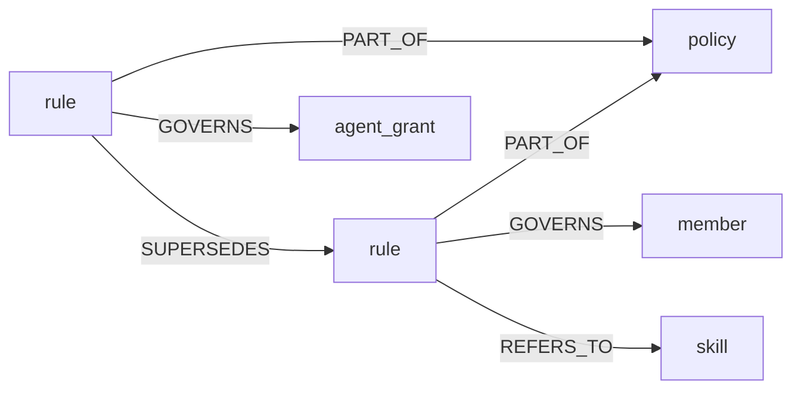
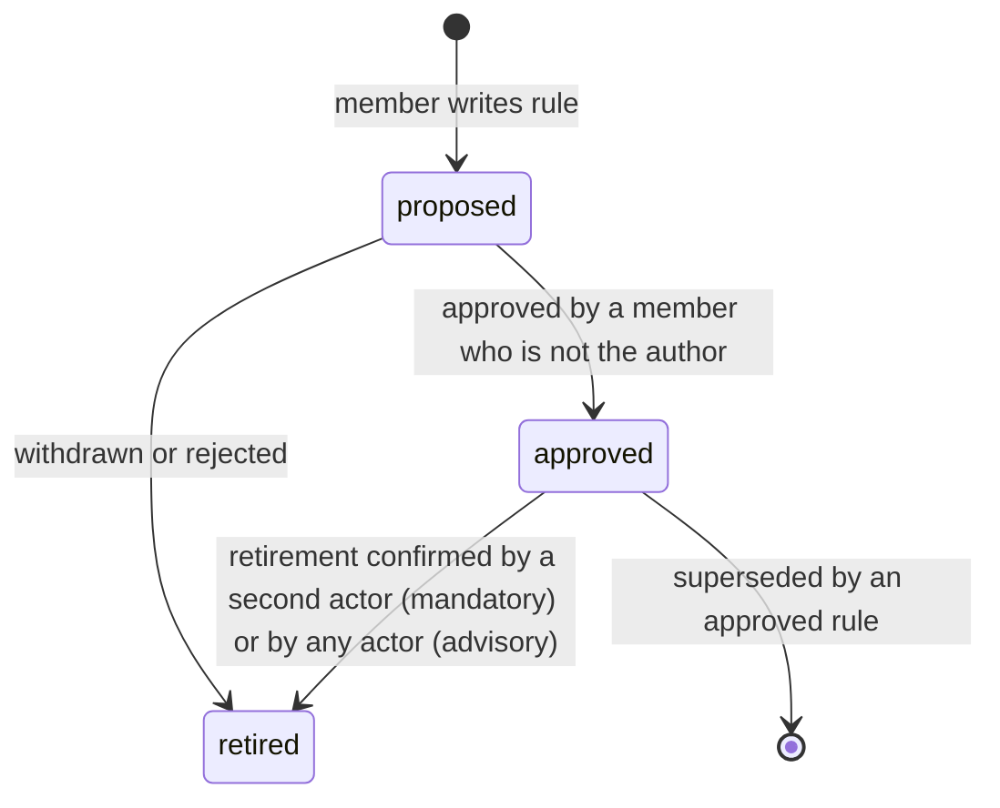

# Rules and Policies
## Scope
This document specifies the design of the core `rule` and `policy` entity types, the edges that scope and connect them, the server-side renderer that turns them into session text, the delivery contract for each supported harness, the verification and fail-closed behavior, and the migration from the legacy `standing_rule`, `agent_policy` and `instance_policy` shapes.

This document covers:
- The `rule` and `policy` schemas, the `member` scoping target, and the edges `PART_OF`, `GOVERNS`, `REFERS_TO` and `SUPERSEDES`
- Rule kinds (`mandatory`, `advisory`) and the closed predicate vocabulary
- Instance, member and agent scope
- Proposal and approval of rules
- The rules renderer: budgets, ordering, the index plus fetch-by-id pattern
- Per-harness delivery and the hook contract
- Delivery verification and fail-closed behavior
- Skill delivery alignment
- Migration and the transition window
- Security and privacy considerations
- The slice sequence that implements the design

This document does NOT cover:
- Implementation code. No code ships with this document. Each slice in [Slice sequence](#slice-sequence) is a separate issue with its own acceptance criteria.
- The general carrier matrix for how an instance reaches clients (tracked in #2494). This document specifies only what rules need from each carrier.
- Write attribution internals (see #2534 and #2537) and AAuth admission (see `docs/subsystems/agent_capabilities.md`).
- Personal preferences that belong to one person's own instance rather than to a shared graph.

Status: **proposed design**, 2026-09-30. Nothing described here as new is built. Section [Current state](#current-state-as-of-v0250) states what exists on `main` at v0.25.0.

## Purpose
Rules are the durable instructions an instance holds for the agents that use it. Three failures motivate this design.

1. **Rules live in several shapes with different mechanics.** `standing_rule` rows are injected at session start. Instance-wide data requirements live inline as prose and flags inside one `instance_policy` record with one container-wide enforcement switch. Downstream deployments store further rules under other type names (for example `agent_policy`) that the package does not read. A rule's bindingness (must the agent comply, or is it guidance) is not recorded per rule.
2. **Delivery is not verified.** A rule can be stored, looked up, and rendered while no model ever sees it. Issue #2187 (rules ride only a Neotoma-private field that clients drop), #2368 (a policy did not reach a connected session), #2429 (an identity gate skipped the lookup silently) and #2449 (a rule named on no handshake surface) are four instances. Each passed every server-side check.
3. **Scope is all or nothing.** On a shared graph every rule reaches every member's sessions. A member cannot hold rules for their own work, and a rule's approver cannot be required to differ from its author (#2535).

The design gives each rule its own record and kind, groups rules by edge, scopes rules by edge, evaluates machine-checkable requirements per rule, renders every delivery surface from one server-side renderer, and defines what a client must do to prove it received the mandatory set.

## Invariants
1. **One rule per record.** A record carries one rule and one `rule_kind`. A record never carries a list or prose block of several rules.
2. **Kind is per rule.** There is no container-wide enforcement switch. A `policy` never changes a member rule's kind.
3. **No precedence between rules.** Replacement is `SUPERSEDES`. Machine-checkable rules compose by conjunction, so a narrower scope can only tighten. No rule overrides, demotes or outranks another.
4. **Scope is an edge.** No `GOVERNS` edge means the whole instance. A rule whose scope edge cannot be resolved binds nobody and is never widened to the instance.
5. **Fail closed on the safety-bearing field.** A missing or unknown `rule_kind` reads as `mandatory`. An unreadable rule set is reported as unknown, never as empty. A mandatory rule is never dropped because of a type-name or field-name mismatch.
6. **Proposed does not bind.** A `proposed` rule is never enforced, its kind has no effect, and its text is not placed in another session's instructions.
7. **One renderer.** Every delivery surface (MCP instructions, hook output, generated files, tool responses) is produced by the server-side renderer. Clients do not compose rule text.
8. **A rule reaches only the sessions it governs.** Delivery scope is derived from the authenticated principal on the server, never from a client-supplied parameter.
9. **Determinism.** The same rule set, principal and profile produce byte-identical output and the same digest.
10. **Provenance.** Authorship and approval are recorded by the server from authenticated attribution, not by client-supplied fields.

## Definitions
- **Rule**: one atomic normative instruction held as one `rule` record. Its `rule_kind` is `mandatory` or `advisory`.
- **Mandatory rule**: a rule an agent must follow. A mandatory rule that carries a predicate is also enforced by the server at write time.
- **Advisory rule**: a rule an agent should follow. Violations are reported but not refused.
- **Policy**: a named grouping of rule records, expressed by `PART_OF` edges from rules to a `policy` record. A policy has no precedence power and no enforcement mode.
- **Predicate**: an optional, server-evaluable condition on a rule, drawn from a closed vocabulary ([Predicate model](#predicate-model)).
- **Scope**: whom a rule governs: the whole instance (no edge), one member (`GOVERNS` a `member`), or one agent (`GOVERNS` an agent identity).
- **Member**: an authenticated person on a shared graph, represented by a `member` entity that carries no personal data ([Member entity](#member-entity)).
- **Renderer**: the server component that turns the rules in scope for a principal into text for a delivery profile.
- **Profile**: a named delivery surface with a character budget and format (for example `mcp-instructions`, `session-start-hook`).
- **Digest**: a short hash over the ordered mandatory rule ids and versions in scope for a principal. It identifies exactly which mandatory set a client received.
- **Receipt**: the server's record that a render with a given digest was served to a principal, and optionally that the client confirmed placing it in context.
- **Preamble tier**: mandatory rules whose `applies_when` is `always`. They are rendered first and in full.

## Current state (as of v0.25.0)
Verified against `origin/main` at the v0.25.0 release merge on 2026-09-30.

### How rules are stored today
| Shape | Where it lives | Notes |
|---|---|---|
| `standing_rule` | Core schema in `src/services/schema_definitions.ts`. Fields `title`, `rule_text`, `scope`, `priority`, `enabled`. Identity is `title` with `name_collision_policy: merge`. | The design note `docs/developer/rule_neotoma_sync.md` (2026-06, proposed) describes a wider field set (`instruction`, `content`, `rule`, `domain`, `status`, `summary`) on some instances. |
| `instance_policy` | Core schema in the same file, read by `src/services/instance_policy.ts`. Fields `purpose`, `in_scope_entity_types`, `out_of_scope_entity_types`, `sensitivity_rules[]` (prose), `require_lawful_basis`, `require_provenance`, `max_sensitivity_class`, `enforcement` (`advisory` or `enforced`). | One record per instance. Inline prose rules share one enforcement mode. |
| Other rule-bearing types | Not declared by the package. Deployments store instruction-bearing rows under their own type names, for example `agent_policy`. | The package does not read them. An open change (#2366, with #2054) would inject them. |
| Rule files | Repository files under agent-instruction directories. | `docs/developer/rule_neotoma_sync.md` proposes mirroring them from `standing_rule` and states that no new `rule` type should be created. This design supersedes that position ([Relationship to existing work](#relationship-to-existing-work)). |

### How rules are delivered today
| Surface | Carries | Where it lives |
|---|---|---|
| `serverInfo._neotoma.standing_rules` in the `initialize` result | Structured list of enabled `standing_rule` rows for the resolved user, plus a `standing_rules_unavailable` flag when the lookup failed | `buildAuthenticatedInitializeResponse` in `src/server.ts`, reading `getActiveStandingRulesResult` in `src/services/standing_rules.ts` |
| `instructions` in the `initialize` result | Base MCP instructions, then the instance policy section, then an instance-skills section | `composeClientInstructions` in `src/mcp_instruction_doc.ts`, `renderInstancePolicyInstructions` in `src/services/instance_policy.ts` |
| `describe_instance_policy` MCP tool and REST route | The instance policy in its structured legacy shape | `src/services/instance_policy.ts` |
| `server/discover` (MCP 2026-07-28 stateless path) | Base instructions and instance policy section only. No per-user data by design (#2508). | `buildDiscoverResult` in `src/server.ts` |
| Write-time enforcement | `evaluateStorePolicy` and `assertStorePolicyAllows` run before writes on the structured store, `correct`, and MCP structured store paths when `enforcement` is `enforced`. An unreadable policy refuses the write (`ERR_STORE_POLICY_UNAVAILABLE`). | `src/services/instance_policy.ts`; raw file storage is a documented gap |
| First-party harness packages | `claude-code-plugin`, `codex-hooks`, `cursor-hooks`, `opencode-plugin` and `claude-agent-sdk-adapter` capture conversations and inject retrieval context. None references standing rules or the instance policy. | `packages/*` |

Findings that shape the design:
- Standing rules are not rendered into the `instructions` prose on `main`. An open change (#2531) renders them there. Clients that ignore `serverInfo._neotoma` receive no rules (#2187).
- The identity gate on the initialize-time lookup was fixed in v0.23.1 (#2438). Delivery is still unverified end to end (#2453).
- The instance policy applies to every write on the instance regardless of the writing member. There is no member or agent scope for rules.
- No first-party hook package delivers rules. Delivery to harnesses that can run hooks currently depends on downstream tooling.
- `GOVERNS` is not a built-in relationship type. `PART_OF`, `REFERS_TO` and `SUPERSEDES` are.

## Data model

### Entity types


### `rule` (`category: agent_runtime`)
| Field | Type | Required | Meaning |
|---|---|---|---|
| `rule_key` | string | yes | Stable slug, unique on the instance. Identity field. Pattern `^[a-z0-9][a-z0-9-]{2,79}$`. `name_collision_policy: reject`, so a write can never merge into another rule's record. |
| `title` | string | yes | The one line an index renders. At most 160 characters. |
| `rule_text` | string | yes, unless `predicate` is set | The imperative text a reader applies. When a predicate is set and `rule_text` is empty, the renderer generates the sentence from the predicate. |
| `rule_kind` | enum `mandatory` \| `advisory` | yes on write | A missing or unknown stored value reads as `mandatory`. |
| `status` | enum `proposed` \| `approved` \| `provisional` \| `retired` | yes | `proposed` binds nothing. `approved` and `provisional` are in force. `provisional` requires `effective_until` and reads as `retired` after it. |
| `applies_when` | string | no, default `always` | The condition under which the rule matters. `always` places a mandatory rule in the preamble tier. Any other value is free text used for the index line. |
| `domain` | string | no | The subject the rule is about. Never an agent or member identifier. |
| `rationale` | string | no | Why the rule exists. Rendered only on fetch by id. |
| `priority` | number | no, default 0 | Ordering within a tier. Higher renders first. Ties break by `rule_key` ascending. |
| `effective_from`, `effective_until` | date | no | Window in which the rule is in force. Outside the window it reads as `retired`. |
| `predicate` | object | no | A server-evaluable condition ([Predicate model](#predicate-model)). |
| `schema_version` | string | no | Schema version. |

Server-stamped fields. Clients cannot write these. The server derives them from authenticated attribution (`provenance.authenticated_actor_id`, see #2534):
| Field | Meaning |
|---|---|
| `authored_by_actor` | Attribution id of the actor who first wrote the record. |
| `approved_by_actor`, `approved_at` | Attribution id and time of the approving actor. |
| `retirement_proposed_by_actor` | Attribution id of the actor who first proposed retiring an approved mandatory rule. |
| `migrated_from` | Entity id of the legacy record a migration replaced, when applicable. |

Reducer configuration: `last_write` for every field. Material fields (`rule_text`, `rule_kind`, `predicate`, `applies_when`, effective dates, and status) are additionally guarded by the approval flow ([Proposal and approval](#proposal-and-approval)).

`rule` is added to the protected entity types (`src/services/protected_entity_types.ts`) so that an agent identity cannot write it unless a grant capability names it, the same guard `agent_grant` has.

### `policy` (`category: agent_runtime`)
A policy is a named grouping and nothing else.
| Field | Type | Required | Meaning |
|---|---|---|---|
| `policy_key` | string | yes | Stable slug. Identity field, `name_collision_policy: reject`. |
| `title` | string | yes | Heading the renderer uses. |
| `description` | string | no | What the grouping is for. |
| `purpose` | string | no | Instance-wide statement of what the instance is for. Rendered under the heading. This is a setting, not a rule, and binds nothing. |
| `status` | enum `active` \| `retired` | yes | A retired policy is not rendered. Its rules remain in force through any other policy they belong to, or as ungrouped rules. |

A policy carries no `enforcement`, `precedence`, `priority` or `rule_text` field. Instance settings that are not rules and not groupings, such as whether anonymous writes are admitted, are server configuration and are not stored on any record.

Retiring a policy never retires its member rules. Deleting or retiring a grouping must not silently remove a mandatory rule from delivery.

### `member` entity
Edges connect entities, and a member is not an entity today. The design adds a minimal core `member` type.
| Field | Type | Meaning |
|---|---|---|
| `member_key` | string | Identity field. The member's `authenticated_actor_id` (the random per-instance id #2534 mints). |
| `status` | enum `active` \| `removed` | Set to `removed` when a member is removed or erased. |

A `member` record carries no name, address, or other personal data. Only someone with database access can map `member_key` back to a person, exactly as with attribution ids today. The server creates the `member` record when it first mints an attribution id. Clients cannot create or edit `member` records.

Alternative considered: storing the attribution id directly in a `governs_member` field on the rule. That removes the entity, but it contradicts the edge model (scope is an edge), makes member rules invisible to graph traversal, and gives a rule a second scoping mechanism. Rejected.

### Edges
| Edge | Direction | Meaning | Notes |
|---|---|---|---|
| `PART_OF` | rule to policy | The rule is a member of the grouping. | A rule may belong to several policies. A rule with no `PART_OF` edge renders under an "Ungrouped" heading. Built in. |
| `GOVERNS` | rule to member, or rule to agent identity | The rule binds that member's sessions, or that agent. | New built-in relationship type. No edge means instance-wide. Several `GOVERNS` edges mean the rule binds the union of their targets. |
| `REFERS_TO` | rule to skill | "Use this skill." The renderer names the skill in the rule's output and lists it in the skills section. | Also rule to rule, for cross-reference, and rule to task or issue, for a rule tied to a condition instead of a date. Built in. |
| `SUPERSEDES` | new rule to old rule | The new rule replaces the old one. Once the new rule is `approved`, the old rule is not rendered or evaluated. | Built in. Also used by the migration ([Migration](#migration)). |

A skill never joins a policy directly. A policy serves the skills its member rules name.

`GOVERNS` targets are validated at write. A `GOVERNS` edge to a target that is not a `member` or an `agent_grant` is refused. A rule whose only `GOVERNS` targets are removed, deleted or unresolvable binds nobody. It is reported in the rules health output and is never treated as instance-wide.

## Scopes
| Scope | Expressed as | Delivered to | Notes |
|---|---|---|---|
| Instance | No `GOVERNS` edge | Every session on the instance | The default. |
| Member | `GOVERNS` a `member` | Only sessions whose authenticated principal is that member | Delivered on shared graphs only. On an instance with isolated per-user graphs the graph itself is the member scope, and member edges are unnecessary. |
| Agent | `GOVERNS` an agent identity | Only sessions whose verified agent identity resolves to that `agent_grant` | Agent sessions with no admitted grant receive no agent-scoped rules. |

Scope rules:
- **Tightening only.** A member or agent rule adds requirements. It cannot remove or relax an instance rule. Predicate rules compose by conjunction ([Predicate model](#predicate-model)). Prose rules cannot be machine-compared, so a scoped prose rule that contradicts an instance rule is a review matter, caught at approval, and the instance rule still binds.
- **Resolution is server-side.** The principal comes from the authenticated session. No render, fetch, or verification call accepts a member or agent identifier from the client, except an operator-only diagnostic tool ([Security and privacy](#security-and-privacy)).
- **Unknown principal fails closed toward less delivery, not less enforcement.** If the member cannot be identified, the session receives instance rules only, plus a notice that member rules could not be resolved. Instance predicate rules still apply to its writes. Another member's rules are never delivered as a fallback.
- **Personal preferences** stay on the person's own instance. Member scope is for rules that govern a member's work on a shared graph.

This scoping is the implementation of #2535.

## Predicate model
A predicate makes a rule machine-checkable at write time. The vocabulary is closed. It maps one-to-one onto the checks the instance policy performs today, so evaluation reuses the existing evaluator.

Form:
```json
{ "op": "max_sensitivity_class", "args": { "class": "internal" } }
```

| `op` | `args` | Checks | Denial reason code |
|---|---|---|---|
| `require_provenance` | none | Entities of types declared `person_data` carry attribution and consent metadata. | `provenance_required` |
| `require_lawful_basis` | none | Entities of types declared `person_data` carry a lawful-basis tag. | `pii_gate_missing_basis` |
| `max_sensitivity_class` | `class`: `public` \| `internal` \| `sensitive` \| `restricted` | No non-blank field is classified above `class` by the schema. | `field_sensitivity_exceeded` |
| `entity_type_allow` | `types`: array of entity type names | Only the listed types may be stored. | `entity_type_denied` |
| `entity_type_deny` | `types`: array of entity type names | The listed types may not be stored. | `entity_type_denied` |

Semantics:
- **Applicability.** A predicate applies to the same write paths `evaluateStorePolicy` covers today: structured store, `correct`, and the MCP structured store path. Raw file storage remains a documented gap and is not changed by this design.
- **Composition.** All approved predicate rules in scope for the writing principal must hold. Allow lists intersect, deny lists union, thresholds take the lowest class. A member or agent predicate rule can therefore only tighten.
- **Kind decides the outcome.** A violation of a `mandatory` predicate rule refuses the whole batch before any row is written and returns `ERR_STORE_POLICY_DENIED` with the `rule_key` and reason code per denied entity. A violation of an `advisory` predicate rule admits the write and adds a `policy_warnings` entry (rule key, reason code, hint) to the write response.
- **Only `approved` and `provisional` rules are evaluated.** A `proposed` predicate rule is never evaluated.
- **Fail closed.** An unreadable rule set refuses the write with `ERR_STORE_POLICY_UNAVAILABLE`, as today. A mandatory rule with an unknown `op` or malformed `args` refuses covered writes with `ERR_RULE_PREDICATE_UNSUPPORTED` naming the rule. An advisory rule with an unknown `op` is skipped and reported in rules health.
- **Text is derived from the predicate.** The renderer generates the rule's sentence from the predicate, so the prose an agent reads and the check the server runs cannot diverge. A `rule_text` on a predicate rule is rendered as additional context.
- **Extension.** A new `op` is a schema version bump and a server release. There is no expression language, no scripting, and no client-supplied evaluator.

A rule without a predicate is prose. The server cannot enforce it. A mandatory prose rule is enforced only by delivery and verification ([Delivery verification and fail-closed behavior](#delivery-verification-and-fail-closed-behavior)). The documentation and the rules health output say so plainly.

Example: an instance that may hold only internal data and no health records.
```json
[
  { "rule_key": "max-internal-sensitivity", "rule_kind": "mandatory", "status": "approved",
    "title": "Do not store fields above internal sensitivity",
    "predicate": { "op": "max_sensitivity_class", "args": { "class": "internal" } } },
  { "rule_key": "no-health-records", "rule_kind": "mandatory", "status": "approved",
    "title": "Health records are out of scope",
    "predicate": { "op": "entity_type_deny", "args": { "types": ["health_record"] } } }
]
```

## Proposal and approval
Any member may propose a rule. A mandatory rule becomes active only when a partner other than its author approves it.

### Lifecycle


### Rules of the flow
1. **Authorship is server-stamped.** The first observation on a `rule` record fixes `authored_by_actor`. Later corrections by other actors do not change it.
2. **A member's write is a proposal.** A write by a non-approver, or any write that sets `status` to `approved` without a distinct approver, is stored as `proposed`.
3. **Approval requires a different attributed member.** The approving write must carry an attribution id that differs from `authored_by_actor`. The server compares the two ids and refuses an approval where they are equal or where either is missing.
4. **Approver population.** Any member with an attributable identity on a shared instance may approve, except the author. This is the operator ruling of 2026-09-29 ("any partner but the author"). There is no separate partner role in v1.
5. **Until per-member identity is live on an instance, the instance operator gives every approval.** The server treats a write with no attribution id as an operator write, and records it as such. This depends on write attribution (#2534) and on binding legacy MCP sessions to the presented credential (#2537, item 5).
6. **Single-member instances.** On an instance with one attributable member or without a shared graph, no second actor exists. The owner's direct write of `approved` is admitted. The server records that the approval was a self-approval on a single-member instance.
7. **Editing an approved rule is a supersession.** A correction that changes a material field (`rule_text`, `rule_kind`, `predicate`, `applies_when`, effective dates, edges) of an `approved` rule is refused. The change is written as a new `proposed` rule with a `SUPERSEDES` edge to the approved one. The old rule stays in force until the new rule is approved. Non-material fields (`title`, `rationale`, `domain`, `priority`) may be corrected in place.
8. **Retiring a mandatory rule is a loosening.** It takes the same two-party path. The first actor's retirement sets `retirement_proposed_by_actor` and the rule stays `approved`. A different actor's confirmation sets `status: retired`. Retiring an advisory rule needs one actor.
9. **Agents do not approve.** An agent identity may propose a rule when its grant names the `rule` type. No grant capability lets an agent approve or confirm a retirement in v1.
10. **Proposed rules are visible for review, not as instructions.** A `proposed` rule appears in the renderer output only as a labelled count and titles under a "Proposed, not in force" heading. Its text is served only by fetch-by-id to members who may approve it. This limits the prompt-injection surface: a member cannot place instruction text into other members' sessions by proposing it.
11. **Migration approvals.** Rules created by the migration ([Migration](#migration)) carry the instance operator's authority and are written `approved` with `migrated_from` set, because they were already in force.

Where this is enforced: `rule` is a protected entity type. The guard runs at the structured store entry points and at the observation and correction insertion sites, as `assertCanWriteProtected` does for `agent_grant`, so an alternative write path cannot skip it.

## Delivery renderer
The renderer is a server component. It has one entry point and several transports.

### Inputs and outputs
- **Input.** The authenticated principal (member, agent identity, or both), a profile, and optionally a set of rule ids or a prior digest.
- **Output.** A rendered text block, a structured list of the rules it contains with their delivery level, the digest, and a receipt reference.

Transports:
| Transport | Use |
|---|---|
| `get_rules` MCP tool and matching REST route | Any MCP client. Parameters: `profile`, optional `rule_ids`, optional `since_digest`, `format` (`markdown` or `json`). |
| `neotoma rules render` CLI command | Hooks and installers that prefer to call a local command. Same renderer, same output. |
| `initialize` result | The `mcp-instructions` profile output is placed at the front of `instructions`, ahead of the base block, and the structured list is mirrored to `serverInfo._neotoma.rules`. The existing `standing_rules` key is kept during the transition window. |
| Generated file | The `file` profile output for harnesses that read a local instruction file and run no hooks. |

Every transport calls the same function. A transport that composes rule text itself is a defect. New transports add a profile, not a second renderer.

### Selection and ordering
The renderer selects the rules in force for the principal: status `approved` or `provisional`, inside the effective window, not superseded by an approved rule, and in scope for the principal. It then orders them deterministically:

1. **Preamble tier:** mandatory rules with `applies_when` `always`, in full. Sorted by `priority` descending, then `rule_key`.
2. **Mandatory conditional tier:** the remaining mandatory rules, in full when the budget allows, otherwise as index lines.
3. **Advisory tier:** advisory rules as one-line index entries.
4. **Proposed notice:** a count and titles of proposed rules the principal may review.
5. **Skills section:** skills named by rules in scope, then other instance skills ([Skill delivery](#skill-delivery)).

Rules are grouped under their policy headings, mandatory first within each heading. A rule that belongs to several policies renders once, marked with the other policies it also belongs to. The preamble tier is rendered ahead of all headings, each line tagged with its policy key, so that budget priority (by tier) is independent of grouping.

### Budget rules
Each profile declares a character budget. When the output would exceed it, the renderer degrades in this order and never truncates mid-rule:
1. Omit advisory index lines, lowest priority first, then whole advisory headings. The trailing notice names how many were omitted and how to fetch them.
2. Render mandatory conditional rules as index lines (title, `applies_when`, id) instead of full text.
3. If the preamble tier alone exceeds the budget, keep every mandatory rule as an index line and set `budget_insufficient: true` in the structured output and in the text. The block then instructs the reader to fetch the mandatory set by id before acting.

**A mandatory rule is never omitted.** At minimum it appears as an index line. If even index lines cannot fit, the profile is unsuitable for that instance, the output says so, and the client treats the surface as not delivering the mandatory set ([Delivery verification and fail-closed behavior](#delivery-verification-and-fail-closed-behavior)).

### Index plus fetch-by-id
Long rules are delivered as an index line plus the identifier. `get_rules` with `rule_ids` returns full text, rationale, referenced skills and the rule's kind. A fetch of an id outside the principal's scope returns the same response as an id that does not exist.

### Profiles
Profiles are configuration, not code. Budgets below are starting values from downstream measurements dated 2026-09 and must be re-measured per harness release ([Harness delivery](#harness-delivery-and-the-hook-contract)).
| Profile | Surface | Starting budget (characters) | Content |
|---|---|---|---|
| `mcp-instructions` | Front of MCP `instructions` | 2,000 | Banner with digest and counts, preamble tier if it fits, otherwise a pointer to `get_rules`. Operators may raise it. |
| `session-start-hook` | Hook output at session start, resume, clear and compaction | 9,000 | Full render. |
| `prompt-delta-hook` | Hook output at each prompt | 9,000 | Only rules added or changed since the last delivered digest. Each delivered rule id is recorded only when its line was rendered, so an overflowed rule is retried, never marked delivered. |
| `pre-tool-injection` | Hook output before a tool call | 4,000 | Full text of the rules a client selects by id for that action. Selection stays client-side in v1 ([Non-goals](#non-goals)). |
| `file` | Generated local instruction file | Unbounded | Full render with the digest in the header. |
| `connector-pointer` | Instructions of a client that cannot run hooks and truncates instructions | 600 | Banner, digest, count, and the `get_rules` call. |

### Format
The block is delimited so a reader can tell it from the base instructions:
```
[RULES v1 digest=3fa9c1d2e07b mandatory=4 advisory=9 proposed=1 scope=instance+member]
...
[/RULES]
```
The renderer escapes delimiter sequences inside rule text, strips control characters, and enforces a per-field length cap, so a rule body cannot close the block, forge a section, or inject a fake header.

A failed lookup renders a block stating that the rules are UNKNOWN for this session, that the reader must not proceed as if none apply, and how to retry. This preserves the `standing_rules_unavailable` behavior and moves it into the prose channel clients read.

## Harness delivery and the hook contract
The design has one renderer and one contract. Harnesses differ only in which carriers exist.

### Carrier capabilities
Each row is a statement about what the harness can do, with its evidence status. "Measured" means a downstream project observed it in a real session on the stated date. "Documented" means the harness documentation states it. "Unverified" means neither, and the cell is read as not available until measured.
| Harness | Session-start injection | Per-prompt injection | Pre-tool refusal | Compaction re-injection | Instructions field | Highest fail-closed level |
|---|---|---|---|---|---|---|
| Claude Code | Hook (`SessionStart`), measured; output cap near 10,000 characters, measured 2026-09 | Hook (`UserPromptSubmit`), measured | Hook (`PreToolUse`, exit status refuses), measured | Hook (`SessionStart` with a compact matcher), measured | Shared client budget, reported near 2,048 characters across all connected servers, 2026-09, unverified here | L1 |
| Codex CLI | Hook (`SessionStart`, `SubagentStart`), measured against one CLI version in 2026-09; a human trust step is required | Hook (`UserPromptSubmit`), measured | Hook (`PreToolUse`), measured for shell calls only | Unverified | Unverified | L1 for shell calls |
| Cursor | Hook (`sessionStart` with additional context), documented in the package README | `beforeSubmitPrompt` drops additional context; `postToolUse` can inject | Unverified | Unverified | Shared client budget, unverified | L0 until a refusing hook is measured |
| OpenCode | Plugin event, documented | Unverified | Unverified | Plugin compaction hook adds context, documented | Unverified | L0 |
| Agent SDK adapters | Callback hooks, documented | `UserPromptSubmit` callback, documented | Callback hooks, unverified for refusal | `PreCompact` callback, documented | Not applicable | L1 if refusal is verified |
| Claude Desktop, ChatGPT and other connector clients | None | None | None | None | Instructions field only, capped and possibly truncated | L2 only |
| Harnesses with a local instruction file and no hooks | Generated file read at start | Not applicable | None | Re-read on compaction, unverified | Not applicable | L0 (file) with L2 for Neotoma writes |

Levels are defined in [Delivery verification and fail-closed behavior](#delivery-verification-and-fail-closed-behavior).

Evidence status is inherited from the cited downstream measurements and the harness documentation. The authors of this design did not re-measure any harness. Slice N8 replaces each cell with a dated conformance result, and budgets and limits in this table are starting values until then.

Existing first-party packages capture conversations only. `packages/codex-hooks` configures the older `history` command keys. Delivering rules to Codex requires moving to the hook events measured above. This is part of the hook slice ([Slice sequence](#slice-sequence)).

### Hook contract
A rules hook is a thin client. It does not select, order, filter, budget, sanitize or compose rule text. It performs five duties:
1. **Identify the surface.** It requests the profile matching the hook event (`session-start-hook`, `prompt-delta-hook`, `pre-tool-injection`).
2. **Call the renderer.** Through `neotoma rules render` or the REST route, using credentials the harness already holds. It sends the session id and the last delivered digest so the server can return a delta and record a receipt.
3. **Place the output.** It prints the rendered block to the channel the harness places in model context, unmodified. It never prints a credential and never logs rule text.
4. **Confirm placement.** After printing, it calls `acknowledge_rules` with the digest. This marks the receipt `placed`.
5. **Fail loudly.** When the renderer is unreachable, unauthorized, or returns `budget_insufficient`, the hook prints the UNKNOWN block from the renderer's fallback text (embedded in the hook package and generated from the same source) and, where the harness supports refusal, denies side-effecting tool calls until a render succeeds ([Delivery verification and fail-closed behavior](#delivery-verification-and-fail-closed-behavior)).

Rules for hook packages:
- Fail-open for the harness process: a hook error never crashes a session, and always produces the UNKNOWN block.
- No rule text is stored in the package. The only embedded text is the fallback notice.
- The hook records no rule bodies in logs.
- Delivered ids are recorded only for rules whose lines were rendered.
- Installers state the harness-specific trust step (for example, a human must approve new Codex hooks) and never bypass it.

### Instructions field
The `mcp-instructions` profile is the only guaranteed-arrival surface for connector clients, and it is the least reliable one. Its budget is small, clients may truncate it silently, and the 2026-07-28 stateless protocol era has no per-session handshake (#2508). The design therefore treats it as a pointer and a banner, not as the delivery of the rule text. Delivery of text to connector clients depends on the model calling `get_rules`, and the guarantee for those clients is server-side ([Level L2](#level-l2-server-write-gate)).

### Stateless protocol era
`server/discover` carries no per-user data. In that era the instance-wide banner rides discovery, member and agent rules ride the authenticated `get_rules` call, and receipts are keyed to the principal and digest instead of a session id.

## Delivery verification and fail-closed behavior
A mandatory rule must reach the session, or the session must fail closed. Three levels apply, and each harness uses the highest it supports.

### Levels
| Level | Mechanism | Guarantee |
|---|---|---|
| L0 | Notice only. The block states rules are unknown and to act restricted. | None beyond text the model may ignore. |
| L1 | Hook refusal. A pre-tool hook denies side-effecting tool calls until a render succeeded for this session. | The harness cannot act on the world without the hook having attempted delivery. |
| L2 | Server write gate. Writes to the instance are refused until the principal holds a current receipt. | Neotoma writes are never made by a principal that has not been served the mandatory set. |

L2 covers Neotoma writes only. Actions outside Neotoma cannot be gated by the server. The design states this limit instead of implying broader coverage.

### Digest
The digest is the first 12 hexadecimal characters of SHA-256 over the canonical serialization of the ordered list of `(rule_key, observation_id, rule_kind)` for the mandatory rules in scope for the principal. It is computed over the caller-visible set only. Two principals with different mandatory sets have different digests, and a digest reveals nothing about rules outside the caller's scope.

### Receipts
A receipt holds `(principal, agent identity, digest, profile, issued_at, state)`. State is `rendered` when the server served the render and `placed` when the client called `acknowledge_rules`. Receipts live in a dedicated table, like `member_attribution_ids`, not in the graph, so reads do not write graph observations.

### Level L2: server write gate
When the instance setting `require_rules_receipt` is enabled:
- A write from a principal without a current receipt for its digest is refused with `ERR_RULES_NOT_ACKNOWLEDGED`. The refusal body contains the mandatory index and the `get_rules` call, so the refusal delivers the rules.
- A hook profile must reach `placed`. A model-fetched profile (a connector client that calls `get_rules`) needs `rendered`.
- When the mandatory set changes, the previous digest stays acceptable for a grace window (default 300 seconds, configurable, 0 disables) so a rule edit does not fail sessions mid-turn.
- An operator break-glass setting disables the gate. Its use is logged.
- The setting is server configuration, not a rule, and not a container-wide enforcement mode for rules. It gates write admission on delivery, the same class of setting as admission of anonymous writes.

Receipts prove that the server served a digest and that a client asserted placement. They do not prove the model read or followed the rules. Conformance testing covers the remaining gap ([Conformance testing](#conformance-testing)).

### Unknown, not absent
Any lookup failure, unresolved principal, unresolvable `GOVERNS` target, or unsupported mandatory predicate is reported as unknown or as a refusal. None is rendered as "no rules". The rules health output lists every rule that is in force but cannot be delivered or evaluated.

### Conformance testing
Each supported harness has a conformance test that proves delivery with a canary. The test stores a synthetic mandatory rule whose text contains a random nonce and an instruction to reproduce the nonce in the first reply. It starts a real session in the harness, asks a fixed question, and passes only when the nonce appears in the reply.
- Harnesses that run headless (Claude Code print mode, Codex non-interactive mode, the Agent SDK) run the test automatically in the eval harness (#2453).
- Connector clients run a scripted manual checklist whose evidence (session transcript excerpt, date, client version) is recorded in the repository. A manual result older than the client's last release is stale.
- Each test also covers the negative cases: renderer unreachable (the UNKNOWN block appears), principal unresolved (only instance rules appear, no member rule text), and a second principal's rules (never appear).
- A test must fail when the delivery path is reverted. The slice records the reverted-red run.

## Skill delivery
Skills are `skill` entities retrieved on demand. No client invokes an instance skill automatically, and connector clients cannot read skill files. A skill reaches a session only when a rule, a prompt or the user names it.
- **A rule names its skills.** A `REFERS_TO` edge from a rule to a skill causes the renderer to add "Use skill `<name>`" to the rule's line, with the fetch call (`retrieve_entity_by_identifier` with `entity_type` `skill` and the skill name).
- **One budget.** The instance-skills section is produced by the same renderer under the same profile budget. Skills named by rules in scope come first. Other instance skills follow, subject to the existing count and byte caps (25 skills, 4,000 bytes).
- **A policy serves the skills its rules name.** It does not link skills directly.
- **Descriptions only.** The renderer serves skill names and descriptions, never bodies. Bodies are fetched on demand, as today.
- **Stateless era.** The MCP Skills extension is a candidate channel for skills in the stateless era (#2508). This design does not depend on it. `REFERS_TO` naming works on any carrier.
- **Scope.** A skill named only by a member-scoped rule is listed only in that member's output.

## Migration
The migration retypes live rows from the legacy shapes to `rule`, `policy` and `member`, without dropping any mandatory rule at any point.

### Mapping
| Source | Target | Rule |
|---|---|---|
| `standing_rule` | `rule` | `rule_key` derived deterministically from the legacy entity id. Body from `rule_text`, else `instruction`, else `content`, else `rule`. `rule_kind: mandatory` (no kind existed, so the restrictive value applies). `status` from `enabled`: `true` or absent to `approved`, `false` to `retired`. `priority` carried. |
| `standing_rule.scope` | `applies_when` and edges | `global`, absent, or an instance label: no edge, `applies_when: always`. Any other value names a context: no edge, `applies_when` set to the value, so the rule is still delivered. Neither value becomes a member or agent scope. |
| Other legacy rule type (for example `agent_policy`) | `rule` | Same mapping. `index_line` becomes `title`. `active` becomes `approved`. A legacy `rule_kind` is carried when present, otherwise `mandatory`. |
| Legacy `scope: agent` or `agent_sub` | `GOVERNS` edge | Migrated only when the target agent identity resolves. A legacy row that names an agent but cannot be resolved to an edge is written `proposed` with a report entry. An edge-less `rule` binds the whole instance, so widening an agent-scoped rule to everyone is never done. |
| `instance_policy` flags (`require_provenance`, `require_lawful_basis`, `max_sensitivity_class`, type lists) | One `rule` each with a `predicate` | `rule_kind` is `mandatory` when the legacy `enforcement` was `enforced`, `advisory` otherwise. This preserves today's behavior exactly. |
| `instance_policy.sensitivity_rules[]` (prose) | One `rule` each | Same kind mapping as above. Each is reviewed by a member after migration; kind changes then go through the normal approval flow. |
| `instance_policy` | `policy` | One `policy` record. `purpose` is carried. Every rule created from it is `PART_OF` it. |
| `instance_policy.enforcement` | Each rule's own kind | No container-wide switch remains. |
| Instance admission settings | Server configuration | Not stored on any record. |

Every migrated rule carries `migrated_from` and is written `approved`, with a `SUPERSEDES` edge from the new record to the legacy record. The legacy record is not deleted.

### Migration command
`neotoma rules migrate` is idempotent, resumable and batched, and supports `--dry-run`. It:
1. Reads legacy rows through the shared type-name resolver ([Transition window](#transition-window)).
2. Runs a pre-check that flags rows whose text may contain personal data, for review before migration (#2370).
3. Writes new records deterministically, so a re-run creates no duplicates.
4. Reads each written record back and asserts the specific fields written: `rule_key`, `rule_kind`, `status`, the body text, and the edges. A 2xx response is not evidence.
5. Compares the before and after digests of the mandatory set (computed over the mapped content) and stops on any difference.
6. Emits a report: counts by source type, rows left `proposed` with the reason, unresolved agent rows, and rows skipped.

### Transition window
The window is the period in which both the legacy type names and `rule` are read.
- **Shared resolver.** One function returns the set of type names that carry rules (`rule`, `standing_rule`, and the configured legacy names). Every reader calls it: the renderer, the write evaluator, `describe_instance_policy`, the CLI, the eval harness, and the first-party hook packages. A reader that hard-codes a type name is a defect.
- **Dual-read.** The renderer reads all names in the set, maps each row through the mapping above, and removes a legacy row when an approved `rule` supersedes it. It never drops a legacy row because a superseding record is missing, unreadable or not yet approved.
- **No mandatory rule dropped on a mismatch.** A legacy row whose type, field name, or value is not recognized is delivered as a `mandatory` index line and listed in rules health. It is not skipped.
- **Legacy writes.** Writes to legacy rule types remain accepted with a deprecation warning in the response. The migration command picks them up on re-run.
- **Structured mirror.** `serverInfo._neotoma.standing_rules` is kept alongside the new `rules` key during the window.
- **`describe_instance_policy`.** It keeps returning the legacy shape, derived from the `policy` and predicate rules, for the duration of the window.
- **Exit conditions.** All of the following hold: no legacy rule row lacks an approved superseding `rule`; no legacy-type write has been received for two consecutive releases; every first-party reader uses the shared resolver; the dual-name conformance test passes. Then the legacy schemas are marked deprecated and made read-only through the protected-type guard. They are not removed.
- **Required test.** For each legacy type name, a `mandatory` rule stored under that name is delivered to a session, and is still delivered after the migration writes its `rule` record, and is still delivered when the `rule` record is unreadable. This test must fail when the legacy adapter is removed.

### Downstream deployments
Instances that store rules under type names the package does not declare adopt the same resolver by configuring their legacy type names. The migration command applies the same mapping to them. Downstream tooling that selects rules by type name moves to the renderer as a client (see [Slice sequence](#slice-sequence), N6).

## Security and privacy

### Member-scoped delivery
- **Server-derived principal.** The renderer resolves the member from the authenticated session. It accepts no member or agent parameter on `get_rules`, `acknowledge_rules` or the REST routes.
- **No existence oracle.** A fetch for an id outside the caller's scope is indistinguishable from a fetch for an unknown id. Counts and titles in the index cover only in-scope rules. The digest is computed over the in-scope set.
- **No leakage through failure.** When the member cannot be identified, the output contains instance rules and a notice that member rules could not be resolved. It never falls back to another member's rules, to "all member rules", or to a shared default member.
- **Guest and service identities.** A guest or scoped token that resolves to a shared graph principal never receives member-scoped rules and is excluded from member resolution (#2371).
- **Operator diagnostic.** A tool that explains which rules a named principal would receive is available to the instance operator only. It is not reachable by guests, agents or other members, and every call is logged.
- **Erasure.** Removing a member's attribution mapping (#2537, item 2) severs the id to person link. Records that carry the id remain. Member-scoped rules of a removed member bind nobody and appear in rules health for cleanup.

### Rule text as an attack surface
- Rule text is placed in model context. Write access to a delivered rule is the ability to instruct every session in its scope, so approval integrity is a security control, not a workflow nicety.
- Proposed text is not injected into other sessions ([Proposal and approval](#proposal-and-approval), rule 10).
- The renderer neutralizes delimiter sequences and control characters ([Format](#format)).
- Agent identities cannot approve and need an explicit grant capability to propose.
- Credentials never appear in rendered output, hook output or logs.

### Personal data in rules
Rules are delivered to every session in scope and are stored in plain text on the instance. Rule text must not contain personal data, credentials or client-identifying details. The migration pre-check and the rules health output flag rows that look like they do. Rule text is subject to the same retention and erasure obligations as other stored data.

### Refusal messages
`ERR_RULES_NOT_ACKNOWLEDGED` carries the caller's own mandatory index only. It carries nothing about rules outside the caller's scope.

## Slice sequence
Each slice is a separate public issue with acceptance criteria and a test requirement. Slices reference this document.
| Slice | Issue | Title | Depends on |
|---|---|---|---|
| N1 | #2557 | Core `rule` and `policy` types, schemas, `GOVERNS` relationship | none |
| N2 | #2558 | Server rules renderer with a budgeted index, `get_rules`, and the shared dual-read resolver | N1 |
| N3 | #2559 | Migration command and the transition window | N1, N2 |
| N4 | #2560 | Per-rule predicate enforcement | N1 |
| N5 | #2535 | Member and agent scope via `GOVERNS`, including the `member` type | N1, N2, #2534 |
| N6 | #2561 | Harness hook packages as thin clients of the renderer | N2 |
| N7 | #2562 | Proposal and approval flow | N1, #2534, #2537 (item 5) |
| N8 | #2563 | Delivery verification, receipts and per-harness conformance | N2, N6 |
| N9 | #2564 | Skill delivery alignment | N2 |

The suggested split for N2 and N3 is adjusted: the dual-read resolver ships in N2, because N2 is the first change that replaces a reader, and shipping N2 without dual-read would stop delivering legacy rows. N3 owns the writer, the window policy and the exit gate.

Recommended order: N1, then N2 and N4 in parallel, then N3, N5, N7 and N6, then N8 and N9. Rules health output ships with N2.

Interim work. #2531 renders standing rules into the instructions prose and is a valid interim. It does not need to wait for this design. N2 replaces its renderer function with the shared one and keeps its tests (rule body within the first bytes of `instructions`, failure notice, prepend order) as regression tests. #2366 (with #2054) widens injection to further type names. N2's resolver subsumes it.

## Non-goals
- A machine-checkable trigger for point-of-use injection. `applies_when` stays prose. A `trigger` field with a closed vocabulary (tool name, path glob, entity type written) is a possible follow-up, separate from `predicate`, because a predicate is evaluated by the server and a trigger is matched by the client.
- Rule precedence, priority overrides across scopes, or a rules expression language.
- Server enforcement of prose rules.
- Gating actions outside Neotoma.
- A partner or role model beyond "authenticated member" in v1.
- Removing the legacy schemas.
- Raw file storage enforcement (existing documented gap).

## Relationship to existing work
| Item | Relationship |
|---|---|
| #2187 | Rules reaching only a client-ignored field. N2 and N8 close it in full: prose channel, structured mirror, and verification. |
| #2368 | Instance policy not reaching a session. Its diagnosis found the identity gate (#2429), fixed in v0.23.1. This design adds verification so a recurrence is visible. |
| #2429 | Identity gate skipped the lookup silently. The rules health output and the unknown-not-absent rule cover the class. |
| #2449 | A rule named on no surface. Covered by N2 tests: every in-scope rule appears at least as an index line. |
| #2531 | Interim prose delivery. Keep. Superseded by N2. |
| #2054, #2366 | Inject a legacy rule type at session start. Subsumed by the N2 resolver. |
| #2370, #2371 | Legal conditions: PII audit before injection widens, guest token handling on initialize. N3 runs the audit as a pre-check. N5 excludes guest identities. |
| #2508 | Stateless era carries no per-user data at discovery. Sections [Stateless protocol era](#stateless-protocol-era) and [Skill delivery](#skill-delivery). |
| #2534, #2537 | Attribution ids and follow-ups. Authorship, approval and member identity depend on them. |
| #2535 | Member-scoped delivery. N5 is its implementation. |
| #2453 | Eval harness scenario for instruction delivery. N8 supplies the scenarios. |
| #2494 | Carrier architecture doc. It owns the general matrix. This document owns what rules need from it. |
| #2152 | `_neotoma` is an undeclared response surface. N2 declares the `rules` key in the contract. |
| `docs/developer/rule_neotoma_sync.md` | Proposes syncing rule files into `standing_rule` and states that no new `rule` type should be created. N1 amends it: the sync target becomes `rule`. |
| `docs/developer/mcp/instructions.md` | Its `[STANDING RULES]` section describes `serverInfo._neotoma` as the source. N2 rewrites it. |

## Open design questions
Each has a recommendation. None blocks N1.
1. **Default for the server write gate.** Should `require_rules_receipt` default to on when an instance holds at least one mandatory rule, or stay opt-in? Recommendation: opt-in until N8 conformance passes for the supported harnesses, then default on for instances with mandatory rules, with the break-glass setting documented.
2. **Approver population.** Is every attributable member an approver, or is a role needed? Recommendation: every attributable member in v1, matching the ruling, and revisit if instances with unequal members appear.
3. **Self-approval on single-member instances.** Recommendation: admit and record, as specified.
4. **Conflict detection for prose rules.** The design refuses conflicts only where they are mechanical (predicates compose, identity collisions are rejected). Prose conflicts are caught at approval. Recommendation: accept, and add a reviewer checklist item in the approval tool output.
5. **Body field name.** The design uses `rule_text` (the current `standing_rule` field, and the key in the delivered structured mirror). A downstream design names the same field `rule`. Recommendation: `rule_text`, with the legacy names accepted by the resolver.

## Testing requirements
Each slice carries its own tests. Cross-cutting requirements:
- **Revert to red.** For each fix, the tests fail when the mechanism is reverted, and the PR records the failing output.
- **Effect tests.** Delivery tests drive a real `initialize` and a real `get_rules` call and assert on what an instructions-only consumer sees, including the rule body within the first 4,000 characters.
- **Scope isolation.** Two members with distinct member rules: neither sees the other's text, title, count or digest contribution, across `initialize`, `get_rules`, fetch-by-id, error bodies and the CLI.
- **Fail closed.** Unresolved principal, unreadable rule set, unsupported mandatory predicate, unresolvable `GOVERNS` target, and a legacy row with an unrecognized type or field all produce the specified unknown or refusal outcome and never an empty success.
- **Determinism.** The same inputs produce byte-identical output and digest.
- **Budget.** A corpus larger than each profile budget never truncates mid-rule and never omits a mandatory rule.
- **Approval.** An approval by the author is refused. An approval without attribution is admitted only as an operator write. An edit of a material field on an approved rule is refused and requires supersession.
- **Migration.** Dual-name delivery, idempotent re-run, read-back assertions, digest equality, and the no-widening case for agent-scoped legacy rows.
- **Hook packages.** A hook prints no credential, logs no rule text, and prints the UNKNOWN block when the renderer is unreachable.

## Agent Instructions

### When to Load This Document
Load this document when changing rule or policy schemas, the rules renderer, `initialize` instruction composition, instance policy enforcement, harness hook packages, or the migration from `standing_rule` and `instance_policy`.

### Required Co-Loaded Documents
- `docs/NEOTOMA_MANIFEST.md`
- `docs/subsystems/relationships.md`
- `docs/subsystems/schema_registry.md`
- `docs/subsystems/agent_attribution_integration.md`
- `docs/developer/mcp/instructions.md`

### Constraints Agents Must Enforce
1. One rule per record. No lists of rules in one record.
2. Kind is per rule. No container-wide enforcement switch.
3. No precedence between rules. Replacement is `SUPERSEDES`.
4. A missing or unknown `rule_kind` reads as `mandatory`.
5. Scope is an edge. An unresolvable scope edge binds nobody and is never widened to the instance.
6. Every delivery surface calls the renderer. No transport composes rule text.
7. Delivery scope is derived from the authenticated principal on the server.
8. A mandatory rule is never omitted, dropped for a type or field name mismatch, or reported as absent when the lookup failed.
9. A `proposed` rule is never enforced and its text is never placed in another session's instructions.
10. Read back any write that matters, and assert the field written.

### Forbidden Patterns
- Reading a hard-coded legacy type name outside the shared resolver
- A client-supplied member or agent identifier on any delivery route
- Rule text containing personal data, credentials or client-identifying details
- Logging rule bodies or printing credentials in hook output
- Treating a receipt as proof that a model followed a rule
- Em dashes, en dashes, and conversational transitions in documentation

### Validation Checklist
- [ ] Renderer output is deterministic and byte-identical across transports for the same profile
- [ ] Mandatory rules appear at least as index lines at every budget
- [ ] Two-member isolation test passes on every delivery surface
- [ ] Dual-name delivery test fails when the legacy adapter is removed
- [ ] Approval by the author is refused
- [ ] Conformance canary passes for each supported harness, or its manual evidence is current
