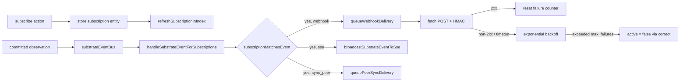

# Subscriptions

Substrate event subscriptions deliver write-path notifications to external consumers via webhook (`POST` with HMAC signature) or Server-Sent Events (long-lived `GET /events/stream?subscription_id=<id>`). Subscriptions are first-class `subscription` entities so their config, history, and provenance live in the same SQLite + reducer model as any other Neotoma record.

## Scope

This document covers:

- The `subscription` entity schema (filters, delivery, circuit breaker).
- The matcher (`subscriptionMatchesEvent`) and the bridge that fans events out (`subscription_bridge.ts`).
- Webhook delivery (signing, retries, rate limit, allow-list).
- SSE hub (ring buffer, `Last-Event-ID` resume).
- The action surface (`subscribe`, `unsubscribe`, `list_subscriptions`, `get_subscription_status`).
- Loop prevention for cross-instance peer sync (`sync_peer_id`).

It does NOT cover:

- Substrate event semantics or determinism (see [`substrate_events.md`](substrate_events.md)).
- Cross-instance replication via `/sync/webhook` (see [`peer_sync.md`](peer_sync.md)).
- The Inspector subscription UI (`/inspector/peers` and related routes).

## Purpose

Many agent and integration workloads need to react to write-path events without polling. Subscriptions provide a typed, filterable, idempotent fan-out so external systems can:

- Trigger workflow steps when a new `task` or `issue` lands.
- Mirror selected entity types into a peer Neotoma instance.
- Stream a live activity feed to the Inspector or third-party dashboards.

All deliveries are bounded: subscriptions enforce per-user limits, webhook endpoints have a circuit breaker that auto-deactivates after consecutive failures, and the SSE buffer is capped per process.

## Invariants

1. **Subscriptions are entities.** Each subscription is a row in the `subscription` entity type (canonical_name_field: `subscription_id`). Updates flow through `correct` so history is preserved.
2. **Filters are required.** A subscription with no `entity_types`, `entity_ids`, or `event_types` is rejected — there is no firehose mode.
3. **Per-user cap.** `NEOTOMA_MAX_SUBSCRIPTIONS_PER_USER` (default 50) bounds active subscriptions per user.
4. **HTTPS in production.** Webhook URLs MUST be HTTPS unless the host is `localhost` / `127.0.0.1`. The check is performed by `isWebhookUrlAllowed` and gates both initial registration and queued delivery.
5. **HMAC signing.** Every webhook POST carries `X-Neotoma-Signature-256: sha256=<hex>` over the canonicalized JSON body, computed from the per-subscription `webhook_secret`. Stable JSON serialization is provided by `stableStringify`.
6. **Loop prevention.** Subscriptions whose `sync_peer_id` matches an event's `source_peer_id` are skipped, so peer-sync replication does not retransmit observations back to their origin.
7. **No write-path coupling.** The bridge runs inside a substrate event listener; exceptions are logged and never propagated to the writer.

## Schema

`src/services/subscriptions/seed_schema.ts` registers the global `subscription` schema. Fields:

- `subscription_id` (string, required, canonical) — UUID assigned at create.
- `watch_entity_types`, `watch_entity_ids`, `watch_event_types` — array filters; at least one must be non-empty.
- `delivery_method` (string, required) — `webhook` or `sse`.
- `webhook_url`, `webhook_secret` — required when `delivery_method = "webhook"`.
- `active` (boolean, required) — toggled to `false` by the circuit breaker after `max_failures` consecutive errors.
- `created_at` (date), `last_delivered_at` (date) — provenance.
- `consecutive_failures` (number), `max_failures` (number, default 10).
- `sync_peer_id` (string) — opt-in loop prevention; skip events stamped with this peer id.

Reducer policies: `last_write` for scalar mutables; `merge_array` for filters; `last_write` for `created_at`. Schema versions track the file (`1.0` at initial release).

## Lifecycle

The bridge is wired once at server startup by `installSubscriptionBridge`. The in-memory subscription index is rebuilt from SQLite at boot (`rebuildSubscriptionIndex`) and refreshed whenever a `subscription` entity changes.

## Components

- `subscription_actions.ts` — `subscribeUser`, `unsubscribeUser`, `listSubscriptionsForUser`. Validates filters, enforces the per-user cap, mints `subscription_id` and (for webhooks) `webhook_secret`.
- `subscription_bridge.ts` — substrate event listener. On every event:
  1. Pushes into the SSE ring buffer (`pushSubstrateEventToRing`).
  2. Broadcasts to matching SSE clients.
  3. Iterates the in-memory index and queues matching webhook or peer-sync deliveries.
  4. When the event itself is a `subscription` entity change, refreshes the index instead of fanning out.
- `subscription_index.ts` — in-memory map of `subscription_id` to `SubscriptionRecord`, kept in sync with SQLite via `refreshSubscriptionInIndex`.
- `subscription_types.ts` — `parseSubscriptionSnapshot` (snapshot → record) and `subscriptionMatchesEvent` (record + event → boolean).
- `sse_hub.ts` — ring buffer (capacity `NEOTOMA_SSE_EVENT_BUFFER`, default 1000, max 10000), `registerSseClient`, `broadcastSubstrateEventToSse`. Each broadcast writes `id:`, `event:`, `data:` lines so SSE clients can resume with `Last-Event-ID`.
- `webhook_delivery.ts` — fetch POST with 10s timeout, HMAC signing, exponential backoff (`[1s, 5s, 30s, 5m]`), per-subscription rate limit, circuit breaker via `correct` on the subscription entity.
- `install_subscription_bridge.ts` — server boot hook that registers the bridge listener and rebuilds the index.

## Webhook delivery contract

- Method: `POST` to `webhook_url`.
- Headers: `Content-Type: application/json`, `X-Neotoma-Signature-256: sha256=<hex>`, `User-Agent: neotoma-webhook/<version>`.
- Body: canonical JSON of the `SubstrateEvent` payload via `stableStringify` (sorted keys, deterministic). Receivers can recompute the signature with the shared `webhook_secret`.
- Retries: HTTP non-2xx and timeouts trigger `[1s, 5s, 30s, 5m]` retries, after which the failure increments `consecutive_failures` via a `correct` write. Reaching `max_failures` flips `active = false`.
- Allow-list: `https://*` always; `http://localhost` / `http://127.0.0.1` only outside production. Other `http://` URLs are refused at registration and at delivery.

## SSE delivery contract

- Endpoint: `GET /events/stream?subscription_id=<id>` (auth required; subscription must be owned by the caller). This is the canonical path (registered in `src/actions.ts` and exposed in `openapi.yaml`); the legacy `GET /subscriptions/sse` shorthand was dropped before v0.12.0 — update any older clients.
- Frame format: `id: <ring_id>\nevent: <event_type>\ndata: <json>\n\n`.
- Resume: clients should send `Last-Event-ID: <ring_id>` so the hub replays buffered events newer than that id (subject to the ring cap).
- Buffer eviction: when the ring exceeds `NEOTOMA_SSE_EVENT_BUFFER`, the oldest entries are dropped; reconnects past that watermark resume from the live tail.

## Loop prevention with peer sync

When a subscription is configured with `sync_peer_id = "<peer_id>"`, the bridge:

- Skips events whose `source_peer_id` equals `sync_peer_id` (those came from the peer; sending them back would loop).
- Routes matching webhook deliveries through `queuePeerSyncDelivery` (`src/services/sync/sync_webhook_outbound.ts`) instead of the generic webhook queue, so the outbound payload uses the peer-sync envelope and signing rules. See [`peer_sync.md`](peer_sync.md).

## Operations

Environment variables:

- `NEOTOMA_MAX_SUBSCRIPTIONS_PER_USER` — soft cap; default 50.
- `NEOTOMA_SSE_EVENT_BUFFER` — ring capacity; clamped 100–10000, default 1000.
- `NEOTOMA_ENV` / `NODE_ENV` — switches the production allow-list for webhook URLs.
- `NEOTOMA_DEBUG_SUBSTRATE_EVENTS` — debug logging on the underlying bus.

Operator playbook:

- Use `neotoma entities list --type subscription` to audit live subscriptions.
- An auto-deactivated subscription stays in the table with `active = false`; reactivate by issuing a `correct` (or `subscribe` again with the same filters).
- Forced rotation of a `webhook_secret` requires `unsubscribe` + `subscribe`.

## Testing

- `tests/subscriptions/` — unit + integration tests for the matcher, bridge, webhook delivery, SSE hub.
- `tests/unit/subscription_types.test.ts` — `subscriptionMatchesEvent` truth table including `sync_peer_id` skip.
- `tests/integration/agentic_eval_matrix.test.ts` exercises the bus indirectly via harness scenarios.

## Related

- [`substrate_events.md`](substrate_events.md) — the upstream event source.
- [`peer_sync.md`](peer_sync.md) — cross-instance replication that piggy-backs on subscriptions when `sync_peer_id` is set.
- [`agent_attribution_integration.md`](agent_attribution_integration.md) — `agent_thumbprint` propagation into events.
- [`docs/specs/MCP_SPEC.md`](../specs/MCP_SPEC.md) — `subscribe` / `unsubscribe` / `list_subscriptions` / `get_subscription_status` action contracts.
