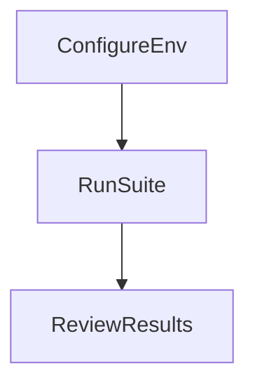

# Automated test catalog
## Scope
This document catalogs all automated test files in the repository and explains how to run each suite. It does not define test quality rules, fixture standards, or route coverage rules.

## Purpose
Provide a complete, file level inventory of automated tests and a single entry point for running each suite.

## Scope
This document covers:
- Test suites and how they map to directories
- A complete list of test files by suite
- Commands and requirements for running tests

This document does not cover:
- Test quality rules
- Fixture standards
- Route coverage policy
- Writing new tests

## Invariants
1. Every automated test file in the repo must appear in this catalog.
2. Test files must remain in their current suite directories unless the suite definition changes.
3. This catalog must be updated when tests are added, removed, or moved.

## Definitions
- **Unit tests**: Fast, deterministic tests of pure functions.
- **Service tests**: Tests of service layer logic that can use stubs but do not require a live database.
- **Integration tests**: Tests that use real database operations and cross service workflows.
- **Contract tests**: Tests that validate external or internal contracts and mappings.
- **CLI tests**: Tests for command line behavior and configuration parsing.
- **Frontend unit tests**: React and browser logic tests executed by Vitest with jsdom.
- **E2E tests**: Playwright tests that automate the UI.

## Data models or schemas
None.

## Default (local) vs optional test modes

- **Default (`npm test`)**: Runs **unit, service, and integration tests against the local SQLite DB**. Vitest setup uses a test DB under `.vitest/` (no remote DB required). Some integration and service tests that are not yet compatible with the local adapter are excluded from the default run; use remote mode to run them. Excludes: `data/imports/**`, React/frontend tests (unless frontend mode), tests for missing/broken modules, Playwright, and the integration/service files listed in "What is skipped" below.
- **Remote mode**: Sets `RUN_REMOTE_TESTS=1`, runs migrations in setup, and runs the same suites against remote DB when configured. Run: `RUN_REMOTE_TESTS=1 npm test`.
- **Frontend mode (`npm run test:frontend`)**: Sets `RUN_FRONTEND_TESTS=1` and runs only React/frontend tests in `frontend/src`. Use when you need to run or debug React component and frontend unit tests (jsdom). Run: `RUN_FRONTEND_TESTS=1 npm test -- frontend/src` or `npm run test:frontend`.

## Qualitative description: default run (npm test) vs skipped

This section describes, in plain language, what the default `npm test` run executes and what it leaves out.

### What runs (included in default)

- **Backend unit and service logic.** Record-type normalization, CSV summary and Lucide icon helpers, crypto and key derivation, property keys and sanitization, action schemas, entity resolution, field canonicalization and validation, capability registry, interpretation and observation identity, encryption service, MCP OAuth and local auth, schema icon service, raw storage, schema registry incremental, auto-enhancement, observation reducer converters, deletion service, and similar modules. These run against the **local SQLite test DB** (`.vitest/neotoma.db`) when remote DB is not enabled.
- **Integration tests (subset).** Dashboard stats, v0.2.0 ingestion, GDPR soft-delete and encryption, and other integration tests that work with the local SQLite adapter run by default. MCP OAuth flow integration tests are skipped when using the local backend (they require remote auth).
- **CLI and contract tests.** CLI smoke tests (auth status, entities list) and config parsing; contract tests that assert OpenAPI operation IDs are covered by mappings and that the OpenAPI schema is valid.
- **Fixture and repo-level tests.** Fixture replay (e.g. replay_graph), SQLite adapter behavior, and any other tests that run with the local backend.

Overall, the default run uses the **local SQLite DB** under `.vitest/`: no remote DB or migrations required, no jsdom, and no Playwright. You get full backend coverage including integration tests without remote DB.

### What is skipped (excluded or opt-in)

- **Integration/service tests excluded when running local.** The following run only with `RUN_REMOTE_TESTS=1` until the local SQLite adapter is fully compatible: entity_queries, field_converters (integration), gdpr_deletion, llm_extraction, mcp_actions_matrix, mcp_auto_enhancement, mcp_auto_schema_creation, mcp_entity_creation, mcp_resources, mcp_schema_actions, mcp_store_parquet, mcp_store_unstructured, observation_ingestion, relationship_snapshots, schema_recommendation_integration; auto_enhancement_converter_detection, auto_enhancement_processor (service).
- **MCP OAuth flow integration tests.** Skipped in local backend mode because they require remote auth. They run when `RUN_REMOTE_TESTS=1` with remote DB configured.
- **React and frontend tests (`frontend/src/**/*.test.ts`, `frontend/src/**/*.test.tsx`).** Component and UI logic tests that use jsdom. Skipped in the default run to avoid ESM/worker issues; run with `RUN_FRONTEND_TESTS=1` or `npm run test:frontend`. SchemaDetail.test.tsx is always excluded due to a known jsdom/worker error.
- **Tests for missing or broken modules.** Payload identity, payload schema, and schema recommendation test files are excluded because the modules they import are not implemented or fail to load. Summary service tests are present but marked `it.skip` because the summary module does not exist yet.
- **Agent MCP instruction behavior tests (`tests/agent/mcp_instruction_behavior.test.ts`).** The whole suite is conditionally skipped unless `AGENT_TEST_ENABLED=true`. These tests drive an external agent (e.g. Claude or Cursor CLI) and are opt-in for environment and cost reasons.
- **Data/imports and Playwright.** Tests under `data/imports/**` and all Playwright E2E tests are never part of the default Vitest run; run them explicitly when needed.

### Summary

- **Included:** Unit, service, and integration tests run against the local SQLite DB (`.vitest/`); CLI and contract checks; fixture and adapter tests. No remote DB or browser required for default run.
- **Skipped:** MCP OAuth flow integration tests (when using local backend); frontend tests (unless frontend mode); tests for missing/broken modules; agent-driven tests (unless enabled); data/imports and E2E.

## Flows and sequences
### Test execution flow
1. Configure environment variables for the suite.
2. Run the suite command.
3. Review results and artifacts.



## Automated test suites
### Vitest unit tests
**Directory:** `tests/unit/`  
**Runner:** `vitest`  
**Command:** `npm test -- tests/unit`  
**Requirements:** Basic `.env`, see `docs/testing/test_environment_configuration.md`.

Files:
- `tests/unit/bigint_serialization.test.ts`
- `tests/unit/observation_reducer_converters.test.ts`
- `tests/unit/parquet_reader.test.ts`
- `tests/unit/relationship_reducer.test.ts`
- `tests/unit/schema_inference.test.ts`

### Vitest service tests
**Directory:** `tests/services/` and `src/services/__tests__/`  
**Runner:** `vitest`  
**Command:** `npm test -- tests/services` or `npm test -- src/services/__tests__`  
**Requirements:** Basic `.env`, see `docs/testing/test_environment_configuration.md`.

Files:
- `tests/services/auto_enhancement_converter_detection.test.ts`
- `tests/services/auto_enhancement_processor.test.ts`
- `tests/services/capability_registry.test.ts`
- `tests/services/converter_detection_unit.test.ts`
- `tests/services/encryption_service.test.ts`
- `tests/services/entity_resolution.test.ts`
- `tests/services/field_canonicalization.test.ts`
- `tests/services/field_converters.test.ts`
- `tests/services/field_validation.test.ts`
- `tests/services/finances_field_mapping.test.ts`
- `tests/services/interpretation.test.ts`
- `tests/services/mcp_auth.test.ts`
- `tests/services/observation_identity.test.ts`
- `tests/services/payload_identity.test.ts`
- `tests/services/payload_schema.test.ts`
- `tests/services/raw_storage.test.ts`
- `tests/services/record_comparison.test.ts`
- `tests/services/schema_recommendation.test.ts`
- `tests/services/schema_registry_incremental.test.ts`
- `tests/services/search.test.ts`
- `tests/services/summary.test.ts`
- `src/services/__tests__/deletion.test.ts` — Soft deletion service tests
- `src/services/__tests__/local_auth.test.ts`
- `src/services/__tests__/mcp_oauth.test.ts`
- `src/services/__tests__/oauth_state.test.ts`
- `src/services/__tests__/schema_icon_service.test.ts`

### Vitest integration tests
**Directory:** `tests/integration/`  
**Runner:** `vitest`  
**Commands:** `npm run test:integration` (integration only).  
**Requirements:** Database configured and migrations applied.  
**Note:** Excluded by default from `npm test`; use `RUN_REMOTE_TESTS=1` to include.

Files:
- `tests/integration/dashboard_stats.test.ts`
- `tests/integration/cli_to_mcp_entities.test.ts`
- `tests/integration/cli_to_mcp_relationships.test.ts`
- `tests/integration/cli_to_mcp_schemas.test.ts`
- `tests/integration/cli_to_mcp_stats_snapshots.test.ts`
- `tests/integration/cli_to_mcp_store.test.ts`
- `tests/integration/entity_queries.test.ts`
- `tests/integration/event_generation.test.ts`
- `tests/integration/fixture_mcp_store_replay.test.ts`
- `tests/integration/field_converters.test.ts`
- `tests/integration/gdpr_deletion.test.ts` — GDPR deletion workflows (soft + hard deletion)
- `tests/integration/llm_extraction.test.ts`
- `tests/integration/mcp_actions_matrix.test.ts`
- `tests/integration/mcp_auto_enhancement.test.ts`
- `tests/integration/mcp_auto_schema_creation.test.ts`
- `tests/integration/mcp_correction_variations.test.ts`
- `tests/integration/mcp_entity_creation.test.ts`
- `tests/integration/mcp_entity_variations.test.ts`
- `tests/integration/mcp_graph_variations.test.ts`
- `tests/integration/mcp_npm_check_update.test.ts`
- `tests/integration/mcp_oauth_flow.test.ts`
- `tests/integration/mcp_query_variations.test.ts`
- `tests/integration/mcp_relationship_variations.test.ts`
- `tests/integration/mcp_resources.test.ts`
- `tests/integration/mcp_resource_variations.test.ts`
- `tests/integration/mcp_schema_actions.test.ts`
- `tests/integration/mcp_schema_variations.test.ts`
- `tests/integration/mcp_store_parquet.test.ts`
- `tests/integration/mcp_store_unstructured.test.ts`
- `tests/integration/mcp_store_variations.test.ts`
- `tests/integration/observation_ingestion.test.ts`
- `tests/integration/payload_compiler.test.ts`
- `tests/integration/payload/payload_submission.test.ts`
- `tests/integration/public_key_registry.test.ts`
- `tests/integration/relationship_snapshots.test.ts`
- `tests/integration/relationships_service.test.ts`
- `tests/integration/schema_recommendation_integration.test.ts`
- `tests/integration/v0.2.0_ingestion.test.ts`

### Vitest release integration tests
**Directory:** `tests/integration/release/v0.1.0/`  
**Runner:** `vitest`  
**Command:** `npm test -- tests/integration/release/v0.1.0`  
**Requirements:** Same as integration tests, see `docs/testing/test_environment_configuration.md`.

Files:
- `tests/integration/release/v0.1.0/it_001_file_upload_extraction_query.test.ts`
- `tests/integration/release/v0.1.0/it_002_entity_resolution.test.ts`
- `tests/integration/release/v0.1.0/it_003_timeline_events.test.ts`
- `tests/integration/release/v0.1.0/it_004_graph_integrity.test.ts`
- `tests/integration/release/v0.1.0/it_005_determinism.test.ts`
- `tests/integration/release/v0.1.0/it_006_mcp_actions.test.ts`
- `tests/integration/release/v0.1.0/it_007_event_sourcing.test.ts`
- `tests/integration/release/v0.1.0/it_008_observation_architecture.test.ts`
- `tests/integration/release/v0.1.0/it_009_multi_source_entity_resolution.test.ts`
- `tests/integration/release/v0.1.0/it_010_reducer_determinism.test.ts`
- `tests/integration/release/v0.1.0/it_011_relationship_types.test.ts`
- `tests/integration/release/v0.1.0/it_edge_cases.test.ts`
- `tests/integration/release/v0.1.0/it_error_cases.test.ts`
- `tests/integration/release/v0.1.0/it_validation_schemas.test.ts`

### Vitest CLI tests
**Directory:** `tests/cli/`  
**Runner:** `vitest`  
**Command:** `npm test -- tests/cli`  
**Requirements:** Basic `.env`, see `docs/testing/test_environment_configuration.md`.  
**Coverage review:** See `docs/testing/cli_command_coverage_review.md` for command-to-test mapping and coverage status.

Files:
- `tests/cli/cli_admin_commands.test.ts`
- `tests/cli/cli_api_commands.test.ts`
- `tests/cli/cli_auth_commands.test.ts`
- `tests/cli/cli_command_coverage_guard.test.ts`
- `tests/cli/cli_correction_commands.test.ts`
- `tests/cli/cli_direct_invocation_parity.test.ts`
- `tests/cli/cli_entity_commands.test.ts`
- `tests/cli/cli_entity_subcommands.test.ts`
- `tests/cli/cli_infra_commands.test.ts`
- `tests/cli/cli_mcp_commands.test.ts`
- `tests/cli/cli_observation_commands.test.ts`
- `tests/cli/cli_query_commands.test.ts`
- `tests/cli/cli_relationship_commands.test.ts`
- `tests/cli/cli_schema_commands.test.ts`
- `tests/cli/cli_smoke.test.ts`
- `tests/cli/cli_source_commands.test.ts`
- `tests/cli/cli_stats_commands.test.ts`
- `tests/cli/cli_store_commands.test.ts`
- `tests/cli/cli_timeline_commands.test.ts`
- `tests/cli/config.test.ts`
- `tests/cli/test_command_detection.test.ts`
- `tests/cli/test_debug_tty.test.ts`

### Vitest contract tests
**Directory:** `tests/contract/`  
**Runner:** `vitest`  
**Command:** `npm test -- tests/contract`  
**Requirements:** Basic `.env`, see `docs/testing/test_environment_configuration.md`.

Files:
- `tests/contract/contract_mapping.test.ts`

### Frontend Vitest tests
**Directory:** `frontend/src/`  
**Runner:** `vitest` (jsdom)  
**Command:** `npm run test:frontend` or `RUN_FRONTEND_TESTS=1 npm test -- frontend/src`  
**Note:** Excluded by default from `npm test`; use `RUN_FRONTEND_TESTS=1` or `npm run test:frontend` to run React/frontend tests.  
**Requirements:** None beyond base repo setup.

Files:
- `frontend/src/components/ChatPanel.test.tsx`
- `frontend/src/components/RecordDetailsPanel.test.tsx`
- `frontend/src/components/RecordsTable.test.tsx`
- `frontend/src/components/SchemaDetail.test.tsx`
- `frontend/src/lib/api.test.ts`
- `frontend/src/store/records.test.ts`
- `frontend/src/utils/csv.test.ts`
- `frontend/src/utils/entityDisplay.test.ts`
- `frontend/src/utils/file_processing.test.ts`
- `frontend/src/utils/record_search.test.ts`
- `frontend/src/utils/schemaIcons.test.ts`

### Playwright E2E tests
**Directory:** `playwright/tests/`  
**Runner:** `@playwright/test`  
**Command:** `npm run test:e2e`  
**Requirements:** Frontend running and database configured.

Files:
- `playwright/tests/auto-enhancement.spec.ts`
- `playwright/tests/chat-panel.spec.ts`
- `playwright/tests/correction-workflow.spec.ts`
- `playwright/tests/dashboard-stats.spec.ts`
- `playwright/tests/design-system.spec.ts`
- `playwright/tests/entity-detail.spec.ts`
- `playwright/tests/entity-explorer.spec.ts`
- `playwright/tests/entity-list.spec.ts`
- `playwright/tests/error-handling.spec.ts`
- `playwright/tests/floating-settings-button.spec.ts`
- `playwright/tests/graph-integrity.spec.ts`
- `playwright/tests/ingestion-pipeline.spec.ts`
- `playwright/tests/integration.spec.ts`
- `playwright/tests/interpretations.spec.ts`
- `playwright/tests/json-viewer.spec.ts`
- `playwright/tests/mcp-configuration.spec.ts`
- `playwright/tests/mcp-relationships.spec.ts`
- `playwright/tests/mcp-store-retrieve.spec.ts`
- `playwright/tests/mcp-timeline.spec.ts`
- `playwright/tests/mcp-ui-consistency.spec.ts`
- `playwright/tests/not-found.spec.ts`
- `playwright/tests/oauth-flow.spec.ts`
- `playwright/tests/observations.spec.ts`
- `playwright/tests/record-details.spec.ts`
- `playwright/tests/records-lifecycle.spec.ts`
- `playwright/tests/records-table-columns.spec.ts`
- `playwright/tests/relationship-detail.spec.ts`
- `playwright/tests/relationships-list.spec.ts`
- `playwright/tests/rls-isolation.spec.ts`
- `playwright/tests/schema-detail.spec.ts`
- `playwright/tests/schemas-list.spec.ts`
- `playwright/tests/search-flow.spec.ts`
- `playwright/tests/settings-keys.spec.ts`
- `playwright/tests/source-detail.spec.ts`
- `playwright/tests/sources-list.spec.ts`
- `playwright/tests/storage-schema.spec.ts`
- `playwright/tests/timeline-navigation.spec.ts`
- `playwright/tests/upload-flow.spec.ts`

## Examples
### Run all tests
```bash
npm test
```

### Run integration tests only
```bash
npm run test:integration
```

### Run Playwright E2E tests
```bash
npm run test:e2e
```

## Testing requirements
1. Validate `.env` using `docs/testing/test_environment_configuration.md`.
2. Apply quality rules from `docs/testing/integration_test_quality_rules.mdc`.
3. Apply enforcement rules from `docs/testing/test_quality_enforcement_rules.mdc`.
4. For routes and E2E coverage, see `docs/testing/full_route_coverage_rules.md`.

## Agent Instructions
### When to Load This Document
Load when adding, removing, or moving automated test files.

### Required Co-Loaded Documents
- `docs/NEOTOMA_MANIFEST.md`
- `docs/conventions/documentation_standards.md`
- `docs/conventions/writing_style_guide.md`
- `docs/testing/testing_standard.md`

### Constraints Agents Must Enforce
1. Every automated test file appears in the catalog.
2. Suite definitions match directory structure.
3. Run commands are accurate and reference `package.json`.
4. No em dashes or en dashes in documentation.

### Forbidden Patterns
- Missing test files in the catalog
- Suite listings that do not match directory structure
- Commands that are not present in `package.json`

### Validation Checklist
- [ ] All test files are listed in the correct suite section
- [ ] Commands match `package.json`
- [ ] Requirements link to `docs/testing/test_environment_configuration.md`
- [ ] Examples are deterministic and complete
- [ ] Writing style guide rules applied
