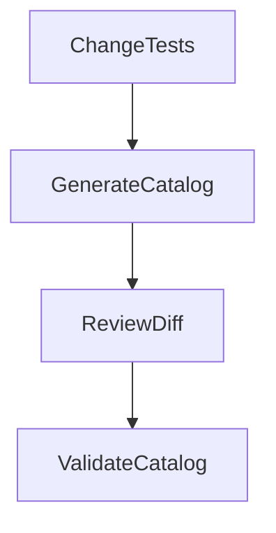

# Automated test catalog
## Scope
This document summarizes repo-wide automated test coverage and inventories every automated test file in the repository. It does not define test-writing standards, fixture rules, or route coverage policy.

## Purpose
Provide one canonical markdown source for what automated tests exist, how the major suites are run, and which validation commands keep the catalog current.

## Scope
This document covers:
- Repo-wide automated test inventory
- High-level suite and runner breakdowns
- Primary local and CI validation commands
- Catalog maintenance workflow

This document does not cover:
- Test quality policy
- Fixture design standards
- Feature-specific testing strategy
- Historical audit narratives

## Invariants
1. Every automated test file in the repo must appear in this catalog.
2. This catalog is generated from the repository tree, not maintained by hand.
3. When test files, suite directories, or validation lanes change, the catalog must be regenerated in the same change.
4. Policy changes belong in `docs/testing/testing_standard.md`; inventory changes belong here.

## Definitions
- **Automated test file**: A repo test source matched by this catalog's scanner (`tests/**`, `src/**`, `frontend/src/**`, `playwright/tests/**`).
- **Catalog generator**: `scripts/generate-automated-test-catalog.ts`, the only source allowed to rewrite this file.
- **Catalog validator**: `npm run validate:test-catalog`, which fails when this file drifts from the repo tree.

## Data models or schemas
None.

## Flows or sequences
1. Change or add tests.
2. Run `npm run generate:test-catalog`.
3. Review the generated markdown diff.
4. Run `npm run validate:test-catalog`.

```mermaid
flowchart TD
    ChangeTests[ChangeTests] --> GenerateCatalog[GenerateCatalog]
    GenerateCatalog --> ReviewDiff[ReviewDiff]
    ReviewDiff --> ValidateCatalog[ValidateCatalog]
```

## Examples
- Add `tests/integration/new_feature.test.ts` -> regenerate the catalog so the new file appears under the integration suite.
- Rename `tests/cli/old_name.test.ts` -> regenerate the catalog so the old path disappears and the new path appears.
- Add a new CI lane for tests -> update this document's command summary and run the validator.

## Testing requirements
- `npm run generate:test-catalog` must be run when automated test inventory changes.
- `npm run validate:test-catalog` must pass before merge.
- CI runs `npm run validate:test-catalog` in the baseline lane.

## Maintenance
- Canonical policy doc: `docs/testing/testing_standard.md`.
- Historical audit doc: `docs/testing/test_coverage_audit_summary.md`.
- Do not hand-edit suite inventory entries in this file. Update the generator or the repository tree, then regenerate.

## Repo-wide summary
- Total automated test files: **360**
- Backend and repo Vitest files: **327**
- Frontend Vitest files: **9**
- Playwright spec files: **24**

### Suite counts
| Suite | Files |
|---|---:|
| Vitest unit tests | 84 |
| Vitest service tests | 33 |
| Source-adjacent tests | 39 |
| Vitest integration tests | 97 |
| Vitest CLI tests | 55 |
| Vitest contract tests | 10 |
| Vitest security tests | 1 |
| Vitest subscription tests | 3 |
| Vitest agent tests | 1 |
| Vitest fixture tests | 1 |
| Vitest helper tests | 1 |
| Vitest shared-environment tests | 1 |
| Frontend Vitest tests | 9 |
| Playwright E2E tests | 22 |
| Playwright Inspector E2E tests | 2 |
| Tests Scripts | 1 |

## Primary validation commands
- `npm test`
- `npm run test:frontend`
- `npm run test:remote:critical`
- `npm run test:agent-mcp`
- `npm run validate:coverage`
- `npm run validate:test-catalog`
- `npm run validate:doc-deps`

## CI lanes
- Baseline CI runs `type-check`, `lint`, `lint:site-copy`, `npm test`, `validate:coverage`, `validate:test-catalog`, and `validate:doc-deps`.
- Frontend CI runs `npm run test:frontend`.
- Site/export CI runs route, locale, and export validation tasks.
- Remote integration nightly runs `npm run test:remote:critical` when enabled.

## Automated test suites
### Vitest unit tests
**Directory:** `tests/unit/`
**Runner:** `vitest`
**Command:** `npm test -- tests/unit`
**Requirements:** Basic `.env` if required by the module under test.
**Files (84):**
- `tests/unit/aauth_admission.test.ts`
- `tests/unit/aauth_attestation_apple_se.test.ts`
- `tests/unit/aauth_attestation_revocation.test.ts`
- `tests/unit/aauth_attestation_tpm2.test.ts`
- `tests/unit/aauth_attestation_trust_config.test.ts`
- `tests/unit/aauth_attestation_verifier.test.ts`
- `tests/unit/aauth_attestation_webauthn_packed.test.ts`
- `tests/unit/aauth_authority_normalization.test.ts`
- `tests/unit/aauth_operator_allowlist.test.ts`
- `tests/unit/aauth_tpm_structures.test.ts`
- `tests/unit/aauth_verify_middleware.test.ts`
- `tests/unit/action_schemas_observation_source.test.ts`
- `tests/unit/action_schemas_validation.test.ts`
- `tests/unit/agent_capabilities.test.ts`
- `tests/unit/agent_grants_service.test.ts`
- `tests/unit/agent_identity.test.ts`
- `tests/unit/agents_grants_import.test.ts`
- `tests/unit/attribution_diagnostics.test.ts`
- `tests/unit/attribution_policy.test.ts`
- `tests/unit/bigint_serialization.test.ts`
- `tests/unit/cli_aauth_tbs_attestation.test.ts`
- `tests/unit/cli_aauth_tpm2_attestation.test.ts`
- `tests/unit/cli_aauth_yubikey_attestation.test.ts`
- `tests/unit/client_diagnose.test.ts`
- `tests/unit/client_helpers.test.ts`
- `tests/unit/client_turn_report.test.ts`
- `tests/unit/compliance_scorecard.test.ts`
- `tests/unit/config_data_dir_resolution.test.ts`
- `tests/unit/cursor_hooks_context.test.ts`
- `tests/unit/cursor_hooks_external_data.test.ts`
- `tests/unit/cursor_hooks_small_model.test.ts`
- `tests/unit/docs_sidebar_nav.test.ts`
- `tests/unit/drift_comparison.test.ts`
- `tests/unit/duplicate_detection.test.ts`
- `tests/unit/encrypt_response_middleware.test.ts`
- `tests/unit/external_actor_badge.test.ts`
- `tests/unit/external_actor_builder.test.ts`
- `tests/unit/external_actor_promoter.test.ts`
- `tests/unit/external_actor_provenance.test.ts`
- `tests/unit/features/FU-2026-Q3-aauth-inspector-attestation-viz/agent_badge_tier_icon.test.ts`
- `tests/unit/github_issue_thread.test.ts`
- `tests/unit/github_mirror_guidance.test.ts`
- `tests/unit/github_pages_asset_paths.test.ts`
- `tests/unit/github_webhook.test.ts`
- `tests/unit/hook_feedback_accumulator.test.ts`
- `tests/unit/html_to_markdown.test.ts`
- `tests/unit/i18n_routing.test.ts`
- `tests/unit/inspector_admin_unlock_url.test.ts`
- `tests/unit/keepalive_timeout.test.ts`
- `tests/unit/markdown_mirror_paths.test.ts`
- `tests/unit/mcp_dev_shim.test.ts`
- `tests/unit/mcp_instruction_doc.test.ts`
- `tests/unit/mcp_instructions_fallback_invariants.test.ts`
- `tests/unit/mcp_proxy.test.ts`
- `tests/unit/mcp_resource_uri.test.ts`
- `tests/unit/mcp_server_card.test.ts`
- `tests/unit/neotoma_entity_id.test.ts`
- `tests/unit/observation_reducer_converters.test.ts`
- `tests/unit/observation_reducer_observation_source.test.ts`
- `tests/unit/observation_reducer_projection.test.ts`
- `tests/unit/observation_reducer_provenance.test.ts`
- `tests/unit/opencode_plugin.test.ts`
- `tests/unit/parquet_reader.test.ts`
- `tests/unit/protected_entity_types.test.ts`
- `tests/unit/relationship_batch_schemas.test.ts`
- `tests/unit/relationship_reducer.test.ts`
- `tests/unit/request_context.test.ts`
- `tests/unit/root_landing_harness_snippets.test.ts`
- `tests/unit/root_landing_site_nav_drift.test.ts`
- `tests/unit/safe_request_log_format.test.ts`
- `tests/unit/sandbox_pack_registry.test.ts`
- `tests/unit/sandbox_reset.test.ts`
- `tests/unit/schema_agent_instructions.test.ts`
- `tests/unit/schema_inference.test.ts`
- `tests/unit/schema_projection_lag.test.ts`
- `tests/unit/security_hardening.test.ts`
- `tests/unit/seo_metadata.test.ts`
- `tests/unit/session_info.test.ts`
- `tests/unit/site_page_markdown.test.ts`
- `tests/unit/spa_path.test.ts`
- `tests/unit/subscription_types.test.ts`
- `tests/unit/substrate_event_bus.test.ts`
- `tests/unit/timeline_events.test.ts`
- `tests/unit/unknown_fields_guard.test.ts`

### Vitest service tests
**Directory:** `tests/services/`
**Runner:** `vitest`
**Command:** `npm test -- tests/services`
**Requirements:** Basic `.env` if required by the module under test.
**Files (33):**
- `tests/services/auto_enhancement_converter_detection.test.ts`
- `tests/services/auto_enhancement_processor.test.ts`
- `tests/services/capability_registry.test.ts`
- `tests/services/converter_detection_unit.test.ts`
- `tests/services/encryption_service.test.ts`
- `tests/services/entity_resolution.test.ts`
- `tests/services/entity_submission_github_handler.test.ts`
- `tests/services/entity_submission_validation.test.ts`
- `tests/services/entity_type_equivalence.test.ts`
- `tests/services/entity_type_guard.test.ts`
- `tests/services/field_canonicalization.test.ts`
- `tests/services/field_converters.test.ts`
- `tests/services/field_validation.test.ts`
- `tests/services/file_text_extraction.test.ts`
- `tests/services/finances_field_mapping.test.ts`
- `tests/services/flat_packed_detection.test.ts`
- `tests/services/interpretation.test.ts`
- `tests/services/mcp_auth.test.ts`
- `tests/services/observation_identity.test.ts`
- `tests/services/payload_identity.test.ts`
- `tests/services/payload_schema.test.ts`
- `tests/services/peer_sync_batch.test.ts`
- `tests/services/raw_fragments_isolation.test.ts`
- `tests/services/raw_storage.test.ts`
- `tests/services/schema_definitions_agent_runtime.test.ts`
- `tests/services/schema_definitions.test.ts`
- `tests/services/schema_recommendation.test.ts`
- `tests/services/schema_reference_linking.test.ts`
- `tests/services/schema_registry_incremental.test.ts`
- `tests/services/summary.test.ts`
- `tests/services/sync_issues_from_github.test.ts`
- `tests/services/sync_webhook_inbound.test.ts`
- `tests/services/sync_webhook_outbound.test.ts`

### Source-adjacent tests
**Directory:** `src/**/__tests__/` and `src/**/*.test.ts(x)`
**Runner:** `vitest`
**Command:** `npm test -- src`
**Requirements:** Basic `.env` if required by the module under test.
**Files (39):**
- `src/cli/parse_cli_corrected_value.test.ts`
- `src/crypto/crypto.test.ts`
- `src/record_types.test.ts`
- `src/release_notes_enrichment.test.ts`
- `src/repositories/sqlite/__tests__/local_db_adapter.test.ts`
- `src/semver_compat.test.ts`
- `src/services/__tests__/csv_chunking.test.ts`
- `src/services/__tests__/deletion.test.ts`
- `src/services/__tests__/entity_semantic_search.test.ts`
- `src/services/__tests__/local_auth.test.ts`
- `src/services/__tests__/local_entity_embedding.test.ts`
- `src/services/__tests__/mcp_oauth.test.ts`
- `src/services/__tests__/oauth_key_gate.test.ts`
- `src/services/__tests__/oauth_state.test.ts`
- `src/services/__tests__/schema_icon_service.test.ts`
- `src/services/__tests__/tunnel_oauth.test.ts`
- `src/services/access_policy.test.ts`
- `src/services/batch_correction.test.ts`
- `src/services/canonical_markdown.test.ts`
- `src/services/canonical_mirror_git.test.ts`
- `src/services/canonical_mirror.test.ts`
- `src/services/guest_access_token.test.ts`
- `src/services/issues/issue_operations.test.ts`
- `src/services/issues/neotoma_client.test.ts`
- `src/services/issues/redaction_guard.test.ts`
- `src/services/issues/seed_schema.test.ts`
- `src/services/memory_export.test.ts`
- `src/services/plans/capture_harness_plan.test.ts`
- `src/services/plans/seed_schema.test.ts`
- `src/services/sync/peer_health.test.ts`
- `src/shared/action_schemas.test.ts`
- `src/utils/__tests__/csv_summary.test.ts`
- `src/utils/__tests__/lucide_icons.test.ts`
- `src/utils/chat.test.ts`
- `src/utils/csv.test.ts`
- `src/utils/local_http_port_file.test.ts`
- `src/utils/property_keys.test.ts`
- `src/utils/property_sanitizer.test.ts`
- `src/version_check.test.ts`

### Vitest integration tests
**Directory:** `tests/integration/`
**Runner:** `vitest`
**Command:** `npm run test:integration` or `npx vitest run tests/integration`
**Requirements:** Database configured; remote-dependent subsets additionally need `RUN_REMOTE_TESTS=1`.
**Files (97):**
- `tests/integration/aauth_attribution_stamping.test.ts`
- `tests/integration/aauth_resource_metadata.test.ts`
- `tests/integration/aauth_revocation_e2e.test.ts`
- `tests/integration/aauth_sandbox_attribution_partition.test.ts`
- `tests/integration/aauth_sandbox_write_admission.test.ts`
- `tests/integration/aauth_tier_resolution.test.ts`
- `tests/integration/aauth_tpm2_e2e.test.ts`
- `tests/integration/aauth_webauthn_packed_e2e.test.ts`
- `tests/integration/agent_capabilities_store.test.ts`
- `tests/integration/agentic_eval_matrix.test.ts`
- `tests/integration/agents_directory_api.test.ts`
- `tests/integration/anonymous_write_policy.test.ts`
- `tests/integration/attribution_parity.test.ts`
- `tests/integration/cli_init_bootstrap.test.ts`
- `tests/integration/cli_to_mcp_entities.test.ts`
- `tests/integration/cli_to_mcp_relationships.test.ts`
- `tests/integration/cli_to_mcp_schemas.test.ts`
- `tests/integration/cli_to_mcp_stats_snapshots.test.ts`
- `tests/integration/cli_to_mcp_store.test.ts`
- `tests/integration/conversation_turn_accrual.test.ts`
- `tests/integration/cross_instance_issues.test.ts`
- `tests/integration/cursor_hook_stop_backfill.test.ts`
- `tests/integration/dashboard_stats.test.ts`
- `tests/integration/entity_identifier_handler.test.ts`
- `tests/integration/entity_queries.test.ts`
- `tests/integration/events_stream.test.ts`
- `tests/integration/field_converters.test.ts`
- `tests/integration/fixture_mcp_store_replay.test.ts`
- `tests/integration/gdpr_deletion.test.ts`
- `tests/integration/guest_invalid_bearer_routes.test.ts`
- `tests/integration/guest_token_isolation.test.ts`
- `tests/integration/guest_write_rate_limit.test.ts`
- `tests/integration/hook_failure_hint.test.ts`
- `tests/integration/idempotency_key_content_mismatch.test.ts`
- `tests/integration/inspector_bundled_mount.test.ts`
- `tests/integration/interpretation_store.test.ts`
- `tests/integration/issue_207_list_timeline_events_unknown_type.test.ts`
- `tests/integration/issue_37_event_schema_projection.test.ts`
- `tests/integration/lexical_search.test.ts`
- `tests/integration/live_issues_tooling.test.ts`
- `tests/integration/mcp_actions_matrix.test.ts`
- `tests/integration/mcp_auto_enhancement.test.ts`
- `tests/integration/mcp_auto_schema_creation.test.ts`
- `tests/integration/mcp_correction_variations.test.ts`
- `tests/integration/mcp_entity_creation.test.ts`
- `tests/integration/mcp_entity_variations.test.ts`
- `tests/integration/mcp_get_entity_type_counts.test.ts`
- `tests/integration/mcp_graph_variations.test.ts`
- `tests/integration/mcp_invalid_bearer_auth.test.ts`
- `tests/integration/mcp_npm_check_update.test.ts`
- `tests/integration/mcp_oauth_token_endpoint.test.ts`
- `tests/integration/mcp_query_variations.test.ts`
- `tests/integration/mcp_relationship_variations.test.ts`
- `tests/integration/mcp_resource_variations.test.ts`
- `tests/integration/mcp_resources.test.ts`
- `tests/integration/mcp_retrieval_reliability.test.ts`
- `tests/integration/mcp_schema_actions.test.ts`
- `tests/integration/mcp_schema_variations.test.ts`
- `tests/integration/mcp_stdio_attribution.test.ts`
- `tests/integration/mcp_store_canonical_name_unknown_fields.test.ts`
- `tests/integration/mcp_store_parquet.test.ts`
- `tests/integration/mcp_store_unstructured.test.ts`
- `tests/integration/mcp_store_variations.test.ts`
- `tests/integration/mcp_target_id_identity_conflict.test.ts`
- `tests/integration/nonjson_csv_store_behavior.test.ts`
- `tests/integration/nonjson_fixtures_mcp_replay.test.ts`
- `tests/integration/observation_ingestion.test.ts`
- `tests/integration/observation_source_round_trip.test.ts`
- `tests/integration/payload_compiler.test.ts`
- `tests/integration/payload/payload_submission.test.ts`
- `tests/integration/peer_sync.test.ts`
- `tests/integration/process_issues_skill.test.ts`
- `tests/integration/public_key_registry.test.ts`
- `tests/integration/record_activity_attribution.test.ts`
- `tests/integration/relationship_agent_attribution_api.test.ts`
- `tests/integration/relationship_snapshots.test.ts`
- `tests/integration/retrieval_transport_reliability.test.ts`
- `tests/integration/root_landing.test.ts`
- `tests/integration/sandbox_mode.test.ts`
- `tests/integration/sandbox_report.test.ts`
- `tests/integration/schema_recommendation_integration.test.ts`
- `tests/integration/session_introspection.test.ts`
- `tests/integration/store_builtin_identity_opt_out_schemas.test.ts`
- `tests/integration/store_conversation_message_role_conflict.test.ts`
- `tests/integration/store_exercise_log_device_schema.test.ts`
- `tests/integration/store_explicit_canonical_name.test.ts`
- `tests/integration/store_external_link_schema.test.ts`
- `tests/integration/store_registered_schema_alias_precedence.test.ts`
- `tests/integration/store_resolution_attributes_hint.test.ts`
- `tests/integration/store_unknown_fields_list.test.ts`
- `tests/integration/submit_issue_advisory_alias.test.ts`
- `tests/integration/subscription_list.test.ts`
- `tests/integration/subscription_unsubscribe.test.ts`
- `tests/integration/sync_webhook_inbound.test.ts`
- `tests/integration/tunnel_auth.test.ts`
- `tests/integration/tunnel_discovery.test.ts`
- `tests/integration/v0.2.0_ingestion.test.ts`

### Vitest CLI tests
**Directory:** `tests/cli/`
**Runner:** `vitest`
**Command:** `npm test -- tests/cli`
**Requirements:** Basic `.env`; some tests provision temp config homes automatically.
**Files (55):**
- `tests/cli/api_client_offline_fallback.test.ts`
- `tests/cli/backup_verify.test.ts`
- `tests/cli/cli_access_commands.test.ts`
- `tests/cli/cli_admin_commands.test.ts`
- `tests/cli/cli_api_commands.test.ts`
- `tests/cli/cli_api_start_prod_advisory.test.ts`
- `tests/cli/cli_api_start_watch_flag.test.ts`
- `tests/cli/cli_auth_commands.test.ts`
- `tests/cli/cli_command_coverage_guard.test.ts`
- `tests/cli/cli_correction_commands.test.ts`
- `tests/cli/cli_direct_invocation_parity.test.ts`
- `tests/cli/cli_doctor_setup.test.ts`
- `tests/cli/cli_edit_commands.test.ts`
- `tests/cli/cli_entity_commands.test.ts`
- `tests/cli/cli_entity_subcommands.test.ts`
- `tests/cli/cli_infra_commands.test.ts`
- `tests/cli/cli_ingest_remote_upload.test.ts`
- `tests/cli/cli_init_commands.test.ts`
- `tests/cli/cli_init_env_targeting.test.ts`
- `tests/cli/cli_init_interactive.test.ts`
- `tests/cli/cli_issues_commands.test.ts`
- `tests/cli/cli_mcp_commands.test.ts`
- `tests/cli/cli_memory_export.test.ts`
- `tests/cli/cli_mirror.test.ts`
- `tests/cli/cli_observation_commands.test.ts`
- `tests/cli/cli_onboarding_commands.test.ts`
- `tests/cli/cli_query_commands.test.ts`
- `tests/cli/cli_recent_ingest.test.ts`
- `tests/cli/cli_recovery_hint.test.ts`
- `tests/cli/cli_relationship_commands.test.ts`
- `tests/cli/cli_schema_commands.test.ts`
- `tests/cli/cli_session_startup_ux.test.ts`
- `tests/cli/cli_smoke.test.ts`
- `tests/cli/cli_source_commands.test.ts`
- `tests/cli/cli_stats_commands.test.ts`
- `tests/cli/cli_store_commands.test.ts`
- `tests/cli/cli_store_file_vs_entities_parity.test.ts`
- `tests/cli/cli_timeline_commands.test.ts`
- `tests/cli/cli_user_id_propagation.test.ts`
- `tests/cli/config_api_discovery.test.ts`
- `tests/cli/config.test.ts`
- `tests/cli/cursor_hooks_global.test.ts`
- `tests/cli/db_migrate_encryption.test.ts`
- `tests/cli/db_repair_schema_lag.test.ts`
- `tests/cli/discover_to_parse_roundtrip.test.ts`
- `tests/cli/discovery_harness.test.ts`
- `tests/cli/extract_user_cli_args.test.ts`
- `tests/cli/issues_message.test.ts`
- `tests/cli/peers.test.ts`
- `tests/cli/processes_command.test.ts`
- `tests/cli/run_neotoma_mcp_launchers_bash_syntax.test.ts`
- `tests/cli/schemas_describe.test.ts`
- `tests/cli/test_command_detection.test.ts`
- `tests/cli/test_debug_tty.test.ts`
- `tests/cli/transcript_parser.test.ts`

### Vitest contract tests
**Directory:** `tests/contract/`
**Runner:** `vitest`
**Command:** `npm test -- tests/contract`
**Requirements:** Generated contract artifacts present when the suite expects them.
**Files (10):**
- `tests/contract/contract_mapping.test.ts`
- `tests/contract/contract_mcp_cli_parity.test.ts`
- `tests/contract/ironclaw_integration.test.ts`
- `tests/contract/legacy_payloads/replay.test.ts`
- `tests/contract/mcp_stdio_output_safety.test.ts`
- `tests/contract/openapi_schema.test.ts`
- `tests/contract/openclaw_plugin.test.ts`
- `tests/contract/package_contents.test.ts`
- `tests/contract/package_scripts.test.ts`
- `tests/contract/vite_config.test.ts`

### Vitest security tests
**Directory:** `tests/security/`
**Runner:** `vitest`
**Command:** `npx vitest run tests/security`
**Requirements:** Use alongside the dedicated security validation scripts when changing auth or route protection.
**Files (1):**
- `tests/security/auth_topology_matrix.test.ts`

### Vitest subscription tests
**Directory:** `tests/subscriptions/`
**Runner:** `vitest`
**Command:** `npx vitest run tests/subscriptions`
**Requirements:** Basic `.env`; some tests start an in-process HTTP server.
**Files (3):**
- `tests/subscriptions/guest_write_rate_limit_routing.test.ts`
- `tests/subscriptions/subscription_guest_auth.test.ts`
- `tests/subscriptions/subscription_loop_prevention.test.ts`

### Vitest agent tests
**Directory:** `tests/agent/`
**Runner:** `vitest`
**Command:** `npm run test:agent-mcp`
**Requirements:** Agent/provider-specific environment may be required for non-skipped cases.
**Files (1):**
- `tests/agent/mcp_instruction_behavior.test.ts`

### Vitest fixture tests
**Directory:** `tests/fixtures/`
**Runner:** `vitest`
**Command:** `npx vitest run tests/fixtures`
**Requirements:** Fixture files present in the repo checkout.
**Files (1):**
- `tests/fixtures/replay_graph.test.ts`

### Vitest helper tests
**Directory:** `tests/helpers/`
**Runner:** `vitest`
**Command:** `npx vitest run tests/helpers`
**Requirements:** Helper-specific fixtures present in the repo checkout.
**Files (1):**
- `tests/helpers/redact_for_test_report.test.ts`

### Vitest shared-environment tests
**Directory:** `tests/shared/`
**Runner:** `vitest`
**Command:** `npx vitest run tests/shared`
**Requirements:** Basic `.env`.
**Files (1):**
- `tests/shared/local_transport_env.test.ts`

### Frontend Vitest tests
**Directory:** `frontend/src/`
**Runner:** `vitest` with `jsdom`
**Command:** `npm run test:frontend`
**Requirements:** Run with `RUN_FRONTEND_TESTS=1` or the dedicated script.
**Files (9):**
- `frontend/src/bridge/websocket.test.ts`
- `frontend/src/lib/idempotency.test.ts`
- `frontend/src/site/mdx_site_registry.test.ts`
- `frontend/src/site/repo_meta_client.test.ts`
- `frontend/src/site/site_data.test.ts`
- `frontend/src/utils/csv.test.ts`
- `frontend/src/utils/entity_display.test.ts`
- `frontend/src/utils/schema_icons.test.ts`
- `frontend/src/utils/vite_chunk_recovery.test.ts`

### Playwright E2E tests
**Directory:** `playwright/tests/`
**Runner:** `playwright`
**Command:** `npm run test:e2e`
**Requirements:** Playwright browsers installed; mock or real API configured per suite.
**Files (22):**
- `playwright/tests/auto-enhancement.spec.ts`
- `playwright/tests/design-system.spec.ts`
- `playwright/tests/entity-detail.spec.ts`
- `playwright/tests/entity-list.spec.ts`
- `playwright/tests/floating-settings-button.spec.ts`
- `playwright/tests/graph-integrity.spec.ts`
- `playwright/tests/interpretations.spec.ts`
- `playwright/tests/mcp-configuration.spec.ts`
- `playwright/tests/mcp-relationships.spec.ts`
- `playwright/tests/mcp-store-retrieve.spec.ts`
- `playwright/tests/not-found.spec.ts`
- `playwright/tests/oauth-flow.spec.ts`
- `playwright/tests/observations.spec.ts`
- `playwright/tests/relationship-detail.spec.ts`
- `playwright/tests/relationships-list.spec.ts`
- `playwright/tests/schema-detail.spec.ts`
- `playwright/tests/schemas-list.spec.ts`
- `playwright/tests/search-flow.spec.ts`
- `playwright/tests/site-page.spec.ts`
- `playwright/tests/source-detail.spec.ts`
- `playwright/tests/sources-list.spec.ts`
- `playwright/tests/upload-flow.spec.ts`

### Playwright Inspector E2E tests
**Directory:** `playwright/tests/inspector/`
**Runner:** `playwright`
**Command:** `npm run test:e2e:inspector`
**Requirements:** Inspector bundle built before execution.
**Files (2):**
- `playwright/tests/inspector/inspector-entity-detail.spec.ts`
- `playwright/tests/inspector/inspector-issues.spec.ts`

### Tests Scripts
**Directory:** `tests/scripts/`
**Runner:** `vitest`
**Command:** `npx vitest run tests/scripts`
**Requirements:** Basic `.env` if required by the module under test.
**Files (1):**
- `tests/scripts/launchd_cli_sync_tooling.test.ts`

## Agent instructions
### When to load this document
Load this document when adding, removing, moving, or renaming automated tests, or when changing test commands or CI lanes.

### Required co-loaded documents
- `docs/testing/testing_standard.md`
- `docs/conventions/documentation_standards.md`

### Constraints agents must enforce
1. Regenerate this document when automated test inventory changes.
2. Validate this document before completing test-related changes.
3. Keep policy changes in `testing_standard.md`, not in the generated inventory sections here.

### Validation checklist
- [ ] Test inventory regenerated after test-file changes
- [ ] `npm run validate:test-catalog` passed
- [ ] Related policy docs updated if commands or CI lanes changed
