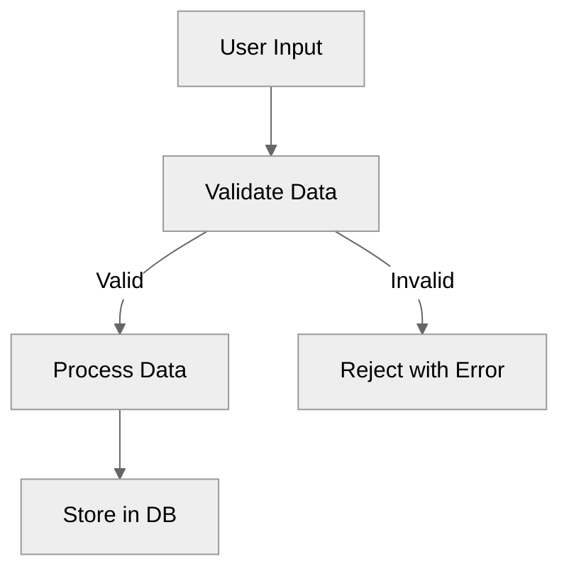
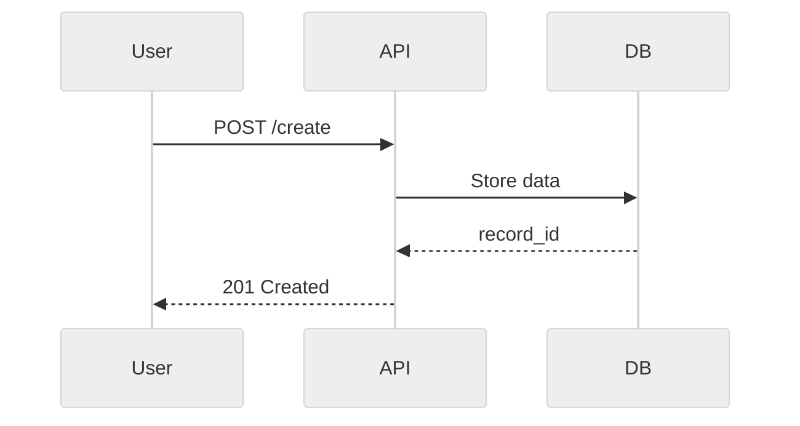
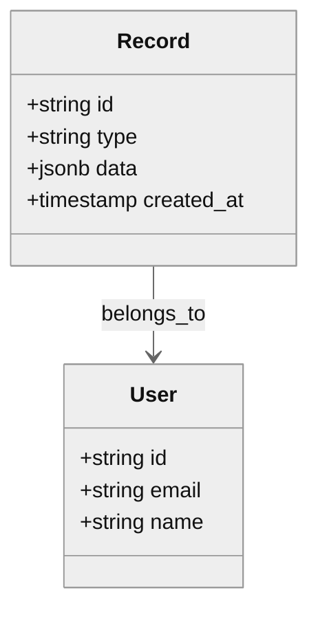
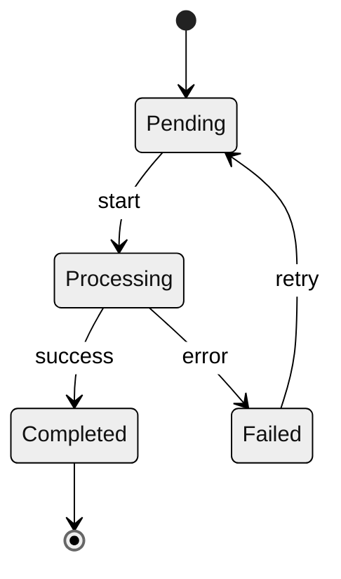

# Documentation Standards and Conventions

## Purpose

This document defines shared conventions, formatting rules, and structural patterns used across all project documentation. Every documentation file in this repository MUST follow these standards to ensure consistency, maintainability, and agent-readability.

---

## 1. Foundational Context

Every documentation file is governed by project-specific root documents (configurable):

1. **Project manifest** - Unified architectural and product context
2. **Generation guide** - Required documentation artifacts and sections

**Related Conventions:**

- **Code conventions** - Code style, naming, and patterns

All documentation MUST:

- Remain consistent with these sources
- Never contradict architectural principles
- Follow project-specific architectural patterns

---

## 2. Documentation Principles (Configurable)

Projects can define their own documentation doctrine or principles.

**Example template:**

```
[Project Name] Documentation Principles:

Core values:
- Clarity: Documentation must be clear and unambiguous
- Completeness: Examples must be complete and runnable
- Maintainability: Documentation must stay in sync with code
- Discoverability: Easy to find relevant documentation
- [Add project-specific principles]
```

---

## 3. Required Document Structure

### 3.1 File Header

Every documentation file MUST begin with:

```markdown
# [Document Title]

_([Brief descriptor: e.g., "Architecture Definition"])_

---

## Purpose

[One paragraph describing the document's role and scope]

## Scope

[Explicit statement of what this document covers and what it does NOT cover]
```

### 3.2 Core Sections

Documentation files MUST include these sections where applicable:

1. **Purpose** - Why this document exists
2. **Scope** - What is/isn't covered
3. **Invariants** - Non-negotiable MUST/MUST NOT rules (optional, project-specific)
4. **Definitions** - Canonical terms and their meanings
5. **Data Models** or **Schemas** (for subsystem docs)
6. **Flows** or **Sequences** (for process docs)
7. **Diagrams** - Visual representations
8. **Examples** - Complete, working examples
9. **Testing Requirements** - How to test this domain
10. **Agent Instructions** - How agents must read and apply this file (optional, configurable)

### 3.3 Closing Section (Optional, Configurable)

Projects can optionally require an **Agent Instructions** section:

```markdown
---

## Agent Instructions

### When to Load This Document
[Specific triggers: e.g., "Load when modifying pipeline code"]

### Required Co-Loaded Documents
- [Project manifest] (always)
- [Additional context-specific docs]

### Constraints Agents Must Enforce
1. [Specific constraint 1]
2. [Specific constraint 2]
...

### Forbidden Patterns

- [Anti-pattern 1]
- [Anti-pattern 2]
  ...

### Validation Checklist

- [ ] Change respects architectural principles
- [ ] Tests cover all new paths
- [ ] Documentation updated to reflect changes
```

---

## 4. Document Decomposition and Format Standards

### 4.1 Decomposition Principles

When creating planning or specification documents:

1. **Decompose by Topic**: Large documents should be decomposed into topic-specific documents:

   - **Overview/coordination documents** (`{topic}_plan.md`): High-level summaries, coordination framework, references
   - **Detailed topic documents** (`{topic}_{subtopic}_plan.md`): Comprehensive details for specific topics
   - Example: `feature_plan.md` (overview) → `frontend_plan.md`, `backend_plan.md`, `database_plan.md`

2. **Use Markdown for Human-Readable Content**:

   - All detailed documentation should be in Markdown format
   - Markdown provides better readability, version control diff clarity, and collaboration
   - Use Markdown for: specifications, plans, reports, logs, detailed documentation

3. **Use YAML Only When Required**:

   - YAML files should be used ONLY when:
     - Required for workflow automation
     - Structured metadata/summaries needed for programmatic access
     - Machine-readable format is essential for tooling
   - YAML files should contain: metadata, summaries, success criteria, timelines
   - YAML files should NOT contain: detailed descriptions, comprehensive content, lengthy text

4. **Eliminate Redundancy**:

   - Each piece of information should exist in only one place
   - YAML files reference detailed markdown plans via `detailed_plan` fields
   - Markdown overview documents provide coordination and cross-references
   - Detailed markdown documents contain comprehensive content without duplication

5. **Cross-Reference Documents**:

   - All documents should include a "Related Documents" section
   - Overview documents should list all related detailed documents
   - Detailed documents should reference back to overview documents
   - Use consistent cross-reference format: `` `filename.md` ``

6. **File Naming Conventions** (Configurable):
   - Overview: `{topic}_plan.md` or `{topic}_overview.md`
   - Detailed topics: `{topic}_{subtopic}.md`
   - YAML summaries: `{topic}_metadata.yaml` or `{topic}_config.yaml`
   - Logs/tracking: `{topic}_log.md` or `{topic}_history.md`

---

## 5. Language and Phrasing Conventions

### 5.1 MUST/MUST NOT Language

Use RFC 2119 terminology consistently:

- **MUST** / **REQUIRED** / **SHALL** - Absolute requirement
- **MUST NOT** / **SHALL NOT** - Absolute prohibition
- **SHOULD** / **RECOMMENDED** - Strong recommendation (exceptions allowed)
- **SHOULD NOT** / **NOT RECOMMENDED** - Strong discouragement
- **MAY** / **OPTIONAL** - Truly optional

### 5.2 Directive Tone

Documentation uses clear, directive language:

- ✅ "The system MUST validate input before storage."
- ❌ "The system should probably validate input."

### 5.3 Forbidden Language

NEVER use:

- Vague qualifiers: "maybe", "perhaps", "possibly"
- Marketing language: "powerful", "seamless", "revolutionary"
- Uncertain phrasing: "it might work if...", "this could be..."

### 5.4 Writing Style: Avoid AI-Generated Patterns

NEVER use AI-specific writing patterns that make documentation sound machine-generated:

**Prohibited:**

- Em dashes (—) - Use commas, periods, or colons instead
- En dashes (–) - Use hyphens (-) or "to" for ranges
- Excessive parenthetical asides (common in AI writing)
- Overly complex sentence structures
- Redundant qualifiers ("very", "quite", "rather", "somewhat")
- Conversational transitions ("Now, let's...", "So, you might...", "Interestingly...")
- Soft questions ("Would you like to...?", "Have you considered...?")
- Motivational language ("Get started!", "Try it now!", "You're all set!")

**Preferred:**

- ✅ Use commas: "The system processes files, validates them, and stores records."
- ✅ Use periods: "The system processes files. It then validates them."
- ✅ Use colons: "The system performs three steps: processing, validation, and storage."
- ✅ Direct statements: "The system processes files."
- ✅ Simple, declarative sentences
- ✅ One idea per sentence
- ✅ Active voice: "The system validates input" (not "Input is validated by the system")

**Examples:**

❌ "The application transforms user data-connecting profiles, documents, and settings-into a unified interface that enables seamless workflows."

✅ "The application transforms user data into a unified interface. It connects profiles, documents, and settings. This enables seamless workflows."

❌ "Would you like to create a record? Simply use the `create_record` action!"

✅ "Use the `create_record` action to create a record."

### 5.5 Punctuation Rules

- Use standard hyphens (-) for compound words and ranges: "file-based", "v1.0.0-v2.0.0"
- Use commas for lists and appositives: "files, records, and documents"
- Use periods to end sentences
- Use colons to introduce lists or explanations
- Use semicolons sparingly, only to connect closely related independent clauses
- Avoid dashes (em or en) entirely

---

## 6. Diagram Standards

### 6.1 General Rules

All diagrams MUST:

- Use consistent node naming (camelCase or snake_case within a diagram)
- Include a title or caption below the diagram
- Use deterministic ordering of nodes and edges
- Be versionable (no auto-generated IDs)

### 6.2 Mermaid Diagram Types

**Flowchart (TD/LR)** - For sequential processes:



**Sequence Diagram** - For request/response flows:



**Class Diagram** - For data models:



**State Diagram** - For state machines:



### 6.3 Node and Edge Styling

Use consistent styles:

- **Processes/Actions**: Rectangles `[Process Name]`
- **Decisions**: Diamonds `{Decision?}`
- **Data/State**: Rounded rectangles `(Data Item)`
- **External Systems**: Double rectangles `[[External API]]`
- **Terminal States**: Circle edges `((Terminal))`

---

## 7. Example Formatting Standards

### 7.1 Complete Examples Only

All code examples MUST be:

- Complete (not pseudo-code or partial snippets)
- Valid (parseable JSON/YAML/TypeScript/etc.)
- Annotated (comments explaining non-obvious aspects)

### 7.2 Example Structure

**JSON Examples:**

```json
{
  "record_id": "rec_01H8X9Y2Z3A4B5C6D7E8F9G0",
  "type": "document",
  "data": {
    "title": "Example Document",
    "content": "Sample content here",
    "created_at": "2024-01-15T00:00:00Z"
  },
  "metadata": {
    "source": "user_upload",
    "version": "1.0.0"
  }
}
```

**YAML Examples:**

```yaml
# Configuration Example
app_name: "example_app"
version: "1.0.0"
settings:
  - name: "max_upload_size"
    value: 10485760  # 10MB
  - name: "allowed_formats"
    value: ["pdf", "docx", "txt"]
```

**Code Examples:**

```typescript
// User ID generation
export function generateUserId(
  email: string,
  timestamp: string
): string {
  const normalized = email.toLowerCase().trim();
  const hash = sha256(`${normalized}:${timestamp}`);
  return `usr_${hash.substring(0, 24)}`;
}
```

---

## 8. Cross-Referencing Standards

### 8.1 Internal Links

Use relative paths for internal documentation links:

```markdown
See [`docs/architecture/overview.md`](../architecture/overview.md) for details.
```

**File Extension Standardization:**

- **MUST use lowercase `.md` extension** (not `.MD` or `.Markdown`)
- All markdown files MUST be named with `.md` extension
- All internal links MUST use lowercase `.md` extension
- **Rationale:** Case-sensitivity issues on some systems (Linux, CI/CD) can break links

### 8.2 Foundation Links

Always reference foundational docs when restating core principles:

```markdown
As defined in the project manifest, the system MUST validate all inputs.
```

### 8.3 Section Anchors

Use explicit anchors for subsections:

```markdown
## 3. Data Models {#data-models}

Reference this section: [Data Models](#data-models)
```

---

## 9. Tables and Matrices

### 9.1 Table Format

Use consistent table formatting with clear headers:

| Component | Status    | Notes                |
| --------- | --------- | -------------------- |
| API       | Complete  | All endpoints ready  |
| UI        | In Progress | 80% complete         |
| Database  | Complete  | Schema finalized     |

### 9.2 Decision Matrices

For complex decision logic, use matrices:

| Condition          | Type     | Action        |
| ------------------ | -------- | ------------- |
| Has `email` field  | User     | Validate email |
| Has `id` field only | Anonymous | Create guest session |
| No recognized fields | Invalid  | Reject with error |

---

## 10. Versioning and Evolution

### 10.1 Document Versioning (Optional, Configurable)

Each documentation file SHOULD include a version indicator in frontmatter:

```markdown
---
version: 1.0.0
last_updated: 2024-01-15
status: canonical
---
```

### 10.2 Additive Changes Only

Documentation changes SHOULD be additive:

- ✅ Add new sections
- ✅ Clarify existing content
- ✅ Add examples
- ❌ Remove required sections (without deprecation)
- ❌ Contradict existing principles (without migration guide)
- ❌ Weaken MUST requirements (without discussion)

### 10.3 Breaking Changes

If a breaking change is required:

1. Document the change in a migration guide
2. Update all dependent documentation
3. Create a PR with full impact analysis
4. Get explicit approval before merging

---

## 11. Testing Documentation

### 11.1 Testable Assertions

Documentation SHOULD include testable assertions:

```markdown
### Testable Requirement

The API MUST return a 400 error when the `email` field is missing.

**Test:** Send POST request without `email` field. Verify response is 400 with error message.
```

### 11.2 Test Coverage Mapping

Link documentation sections to test files:

```markdown
### Coverage

This section is tested by:

- `src/services/user.test.ts` (unit)
- `tests/e2e/user-creation.test.ts` (E2E)
```

---

## 12. Privacy and Security Content

### 12.1 PII Handling in Examples

Examples MUST NOT contain real PII:

- ✅ Use: `user@example.com`, `John Doe`, `123-45-6789`
- ❌ Use: Real email addresses, names, or SSNs

### 12.2 Security-Sensitive Information

Documentation MUST NOT include:

- API keys or secrets
- Production URLs or credentials
- Real user data
- Internal system architecture details that expose vulnerabilities

---

## 13. Accessibility in Documentation

### 13.1 Alt Text for Diagrams

Provide text descriptions for all diagrams:

````markdown
```mermaid
[diagram code]
```

_Figure 1: Data pipeline showing input → validation → processing → storage flow._
````

### 13.2 Heading Hierarchy

Use proper heading hierarchy (no skipped levels):

- ✅ H1 → H2 → H3
- ❌ H1 → H3 (skipped H2)

---

## 14. Configuration

Configure documentation standards via `foundation-config.yaml`:

```yaml
documentation:
  required_sections:
    - "Purpose"
    - "Scope"
    - "Agent Instructions"  # Optional, can be disabled
  structure:
    manifest_path: "docs/manifest.md"  # or null
    architecture_path: "docs/architecture/"
  validation:
    check_dependencies: true
    check_links: true
    enforce_agent_instructions: false  # Optional
  writing_style:
    avoid_ai_patterns: true
    require_rfc_2119: true  # MUST/MUST NOT language
    max_sentence_length: null  # or number for enforcement
```

---

## Agent Instructions

### When to Load This Document

Load this document whenever:

- Creating new documentation files
- Modifying existing documentation
- Reviewing documentation for consistency
- Generating specifications or plans

### Required Co-Loaded Documents

- Project manifest (project-specific)
- Architectural guidelines (project-specific)

### Constraints Agents Must Enforce

1. All documentation follows the structure defined in Section 3
2. All diagrams follow standards in Section 6
3. All examples are complete and valid (Section 7)
4. MUST/MUST NOT language is used correctly (Section 5)
5. Agent Instructions section is present if required by project
6. No PII or secrets in examples (Section 12)
7. No AI-generated writing patterns (em dashes, conversational transitions)

### Forbidden Patterns

- Partial or pseudo-code examples
- Vague or marketing language
- Skipped heading levels
- Missing required sections (per project config)
- Contradictions with foundational documents
- Em dashes (—) or en dashes (–)
- AI-generated writing patterns (em dashes, excessive parentheticals, conversational transitions)
- Soft questions or motivational language

### Validation Checklist

- [ ] Document includes all required sections (per project config)
- [ ] Diagrams use consistent styling
- [ ] Examples are complete and valid
- [ ] MUST/MUST NOT language used correctly
- [ ] Agent Instructions section present if required
- [ ] Cross-references use correct relative paths
- [ ] No PII or secrets in examples
- [ ] Consistent with project manifest
- [ ] No em dashes (—) or en dashes (–) used (use commas, periods, or colons instead)
- [ ] No AI-generated writing patterns (conversational transitions, soft questions, motivational language)
- [ ] Simple, declarative sentences with active voice

